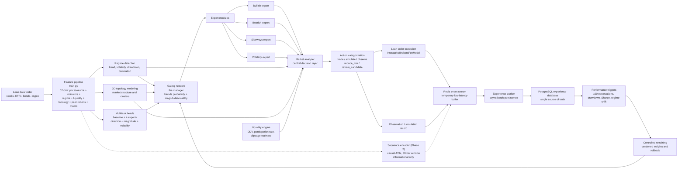
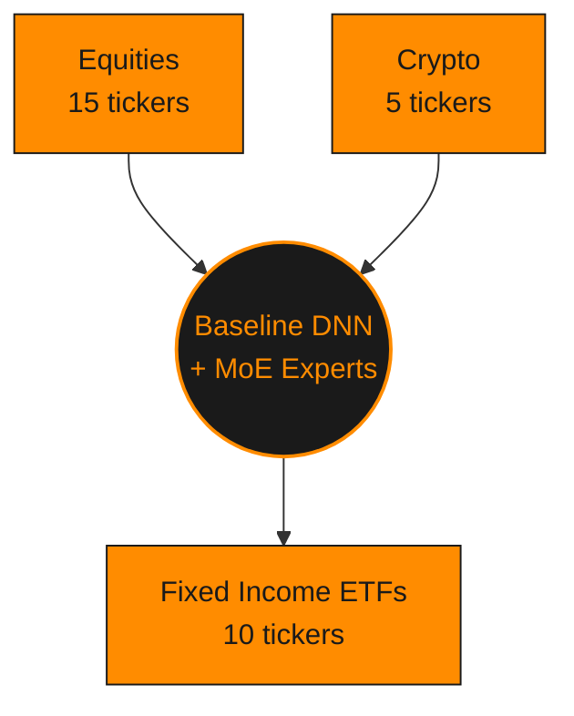

<p align="center">
  
</p>

<h1 align="center">Aether Quant</h1>

<p align="center">
  <strong>Aether Quant's flagship trading model — a dynamic, self-adapting algorithmic trading system built on QuantConnect Lean and PyTorch, engineered to prove that dynamic models belong in dynamic markets.</strong>
</p>

<p align="center">
  
  
  <!-- AQ:TEST_BADGE_START --><!-- AQ:TEST_BADGE_END -->
  
  
</p>

<p align="center">
  
  
  
  
  
  
  
  
  
  
</p>

Aether Quant is not a single static strategy — it's a **dynamic system**: a
Mixture-of-Experts ensemble (bullish/bearish/sideways/volatility specialists)
routed by a learned gating network, a market-regime detector, a 3D market
topology layer that combines a deterministic correlation embedding with a
learned probabilistic overlay, a liquidity/market-impact engine that adjusts
position sizing to real trading conditions, a cross-sectional ranking signal
that sizes each position by its predicted relative strength against the rest
of the trading universe, a **unified multi-asset-class layer** that trades
equities, crypto, bonds, futures, and options through one coherent portfolio
— real yield-curve/duration features for bonds, margin-aware sizing for
futures, Black-Scholes-greeks-based sizing for options, and shared
cross-asset macro signals (yield curve shape, futures term structure,
options sentiment) feeding every asset's prediction, not just its own — and
a controlled retraining loop that lets the model itself evolve as markets do
— all wired together and validated
end-to-end inside QuantConnect's Lean engine. The thesis this project exists
to test is simple to state and hard to prove: **markets are non-stationary,
so a trading model should be too.** Every subsystem here exists to make the
model adapt — to regime shifts, to changing correlation structure, to
liquidity conditions — rather than to fit one historical window and hope it
generalizes.

## Known Limitations

Bonds are fully real today — no IB key needed. Futures and options are
fully wired end-to-end (chain parsing, greeks/IV, sizing, order placement,
position-close/exposure tracking, offline derivatives-macro training
features) but remain **data-empty until an Interactive Brokers key is
connected** (`phase_v2.ib.enabled` — see `aq ib status`/`aq assets
status`). Remaining, still-open items:

- **Nothing in this repo has been run against a real Lean backtest yet** — verified only via unit tests and Lean's own type stubs, not a real Lean runtime. Run one before trusting any of this in paper trading (see "run it yourself" below); in particular: **real limit orders** (`phase_v2.limit_orders`, off by default) rest on unverified Lean API naming assumptions (PascalCase method/enum casing, `OrderStatus.Filled`, `on_order_event` dispatch — see `execution/README.md`'s "Real limit orders" section for the full prioritized list), and the **2-leg vertical options spread** (`phase_v2.options_risk.spread_strategy: "vertical"`, `development/Problems.md` #38 — single-leg remains the default; straddles/strangles/iron condors/butterflies are still not implemented at all) has the largest verification list of any feature this session — zero prior combo-order usage in this codebase before this pass (see `risk/README.md`'s verification list).
- **IB is unverified end-to-end** — futures margin uses a static reference file rather than live IB margin, and the IB connection itself has never been tested against a real Gateway (`aq ib status`/`aq assets status` report readiness only, not a live-tested connection).
- **`main.py::_build_model_input()`'s own feature-build cost (~15 `self.*` state reads) is still unmeasured** — `aq profile` now covers regime/topology/liquidity/gating/analyzer and the pure indicator primitives it calls (`--regime`/`--topology`/`--liquidity`/`--gating`/`--analyzer`/`--indicators`), but not the bound method itself; found in the process that `build_market_topology()`'s per-bar cost is comparable to or larger than the entire per-symbol inference total across the whole universe (see `development/Problems.md` #36).
- **Inference tail latency (p99 routinely 3-5x the p50) is investigated but not fixed** — `aq profile --bucket-report`/`--no-gc` (`development/Problems.md` #37) ruled out a warmup effect and found real, reproduced evidence that GC pauses materially drive worst-case (max) latency specifically. `gc.freeze()` after model load is a documented candidate fix, deliberately not implemented — it needs real-backtest validation of its interaction with Lean's own GC boundary that this pass doesn't have.

## Table of Contents

- [Known Limitations](#known-limitations)
- [Download](#download)
- [Getting Started](#getting-started)
- [Requirements](#requirements)
- [Architecture](#architecture)
- [Universe Size](#universe-size)
- [Project Structure](#project-structure)
- [Module Documentation](#module-documentation)
- [Development Documentation](#development-documentation)
- [Backtest Results](#backtest-results)
- [Test Suite](#test-suite)
- [CLI Reference](#cli-reference)
  - [`aq train`](#aq-train)
  - [`aq test`](#aq-test)
  - [`aq backtest`](#aq-backtest)
  - [`aq profile`](#aq-profile)
  - [`aq report`](#aq-report)
  - [`aq api`](#aq-api)
  - [`aq webui`](#aq-webui)
  - [`aq docker`](#aq-docker)
  - [`aq config`](#aq-config)
  - [`aq lean`](#aq-lean)
  - [`aq retrain`](#aq-retrain)
  - [`aq trade-lock`](#aq-trade-lock)
  - [`aq fetch`](#aq-fetch)
  - [`aq ib`](#aq-ib)
  - [`aq assets`](#aq-assets)
  - [`aq status`](#aq-status)
- [Release Process](#release-process)
- [Runbook](#runbook)
- [Roadmap](#roadmap)
- [Contributing](#contributing)

---

## Download

If you just want to use Aether Quant rather than develop on it, no local
`pip install -e .` or source checkout is needed — the CLI and backend are
published as ready-to-use releases:

```powershell
pip install aether-quant
docker pull ghcr.io/leon1706-lol/aether-quant:latest
```

`aq --help` is then available immediately (see [CLI Reference](#cli-reference)
below). `aq` checks PyPI at most once every 24h (short timeout, never
blocking) for a newer version and prints a one-line notice if one's
available — disable with `AQ_SKIP_UPDATE_CHECK=1`.

The Docker image is the same one `docker-compose.yml`'s `aether-quant`
service pulls by default (override with the `AETHER_QUANT_IMAGE` env var,
e.g. to use a locally built image instead).

## Getting Started

For local development (this repo cloned, a virtual environment active):

1. Install dependencies:

   ```powershell
   pip install -r requirements/requirements.txt
   pip install -r requirements/requirements-dev.txt   # local dev extras
   ```

2. Refresh the data inventory only:

   ```powershell
   python train.py --init-only
   ```

3. Build the dataset and train the model:

   ```powershell
   python train.py
   ```

   Or build dataset artifacts only, without training:

   ```powershell
   python train.py --dataset-only
   ```

4. Start the webui locally (two processes):

   ```powershell
   uvicorn monitoring.api_server:app --port 8001 --reload
   ```

   ```powershell
   cd webui
   npm install
   npm run dev
   ```

   Then open `http://localhost:3002`.

5. Run a real backtest and refresh this README's [Backtest Results](#backtest-results):

   ```powershell
   pip install -e .   # registers the `aq` command from source
   aq backtest
   ```
   First run downloads the pinned QuantConnect Lean engine Docker image once (~40GB+, budget time/bandwidth for it) — see [`aq backtest`](#aq-backtest) below for why it's pinned rather than always re-checking `latest`.

## Requirements

- **Python ≥ 3.10** for the training pipeline, `main.py`'s Lean algorithm, the FastAPI monitoring server, and the `aq` CLI.
- **QuantConnect Lean CLI** (`pip install lean`) for running backtests and paper/live trading.
- **Docker & Docker Compose** for the local infrastructure (Redis, PostgreSQL, and the background workers — experience persistence, performance triggers, controlled retraining, Telegram alerts).
- **Node.js** (for the `webui/` React/Vite dashboard).

This repo splits its Python dependencies across several `requirements*.txt`
files (full training stack vs. minimal per-Docker-image installs vs. local
dev extras) rather than one monolithic file. See
**[`requirements/README.md`](requirements/README.md)** for the exact
`pip install` command for every variant and which Dockerfile consumes each one.

## Architecture

Aether Quant runs a daily-bar decision pipeline entirely inside Lean's
`on_data()` callback: features flow through regime detection and 3D topology
modeling, both feed a gating network that routes across four specialized
experts, the central market analyzer combines all of that with the liquidity
engine's sizing input into one categorical action per asset per bar, and
every decision is persisted through a Redis → PostgreSQL experience pipeline
that a controlled retraining loop reads from to evolve the model over time.

#### System Flow



Dashed edges mark the Phase 2 sequence encoder's **informational-only**
path — it's computed every bar and reaches the experience log, but never
the gating network, market analyzer, or position sizing (see
`inference/README.md`'s Phase 2 section).

#### Tech Stack

```mermaid
flowchart TB
    A["Infrastructure"] --> A1["Docker Compose<br/>(Redis, Postgres, aether-quant app)"]
    A --> A2["Lean CLI<br/>(backtest + paper trading)"]
    A --> A3["30-day observation phase before live mode"]
    B["Development"] --> B1["VS Code + Claude Code"]
    B --> B2["GitHub"]
    C["Data and storage"] --> C1["Lean data folder for training/backtesting"]
    C --> C2["Redis temporary event stream"]
    C --> C3["PostgreSQL permanent experience database"]
    D["AI and modeling"] --> D1["PyTorch"]
    D --> D2["scikit-learn"]
    D --> D3["NumPy / Pandas"]
    D --> D4["MoE experts and gating network"]
    D --> D5["Multitask heads (direction/magnitude/<br/>volatility) + causal-TCN sequence encoder"]
    E["Monitoring and UI"] --> E1["React/Vite webui — Tracing dashboard (port 3002 dev / 8001 Docker)"]
    E --> E2["FastAPI JSON API (port 8000)"]
    E --> E3["Telegram alerts (V2-19)<br/>notifications/telegram_worker.py"]
```



These two diagrams are the high-level summary. For the full system —
every per-phase "contract" (Observation Mode, Performance Triggers,
Controlled Retraining, 3D Topology, Liquidity Engine, Paper/Live Deployment,
and more), the module map, and an honest analysis of what would need to
change for this to become a genuinely low-latency/HFT system — see
**[`development/v2_architecture.md`](development/v2_architecture.md)**.

**The baseline model can now predict more than direction.** An optional
multi-task model (`train.py::AetherNetMultiTask`, trained by
`train_multitask.py`) predicts next-day direction, return magnitude and
volatility jointly from one shared trunk — the direction-only baseline and
experts are unchanged and still ship independently. All 4 experts also
have their own optional multitask heads (`train.py::_train_expert_multitask()`),
so `moe/gating.py` blends per-expert magnitude/volatility with a
baseline-scale anchor the same weighted-average way it already blends
direction. `main.py` threads the resulting `predicted_return_magnitude`/
`predicted_volatility` through the market analyzer (informational only,
never changes routing) and, opt-in via
`phase_v2.dynamic_risk.use_predicted_volatility`, into position sizing —
replacing the backward-looking `rolling_volatility_20d` average with an
actual forward-looking forecast for that one calculation.

**Regime, liquidity and topology are now genuine model input features,
not just downstream consumers of its output.** Model input dimensionality
grew from 30 to 48: regime one-hot/confidence/trend/risk score, an
asset-intrinsic liquidity spread/dollar-volume estimate, and cross-asset
topology correlation/risk state are all computed offline
(`train.py::add_regime_features()`/`add_liquidity_features()`/
`build_topology_features_by_date()`) and at runtime
(`main.py::_build_model_input()`, reordered so regime is computed
*before* the model runs) with verified train/runtime parity.

**Multi-horizon direction, cross-sectional ranking, correlated-peer
returns and technical indicators (model input 48 → 59).** A root-cause
investigation found every model — baseline, all 4 experts, the multitask
heads, the sequence encoder — sitting at backtest MCC 0.02-0.07 (noise) on
next-day binary direction, and traced (and fixed) real data bugs
confounding those numbers: an unadjusted-split bug in `train.py`'s own
Lean-zip reader (Lean's live/backtest engine was never affected — see
`development/Problems.md` #24) and a data-feed volume-unit discontinuity
that blew up the sequence model's RMSE 31x (#23). Beyond the fixes,
`AetherNetMultiTaskHorizons`/`AetherNetSequenceMultiTaskHorizons` (new
sibling classes to the originals — experts/baseline/gating stay
1d-direction-only by design) add 4 heads: `direction_5d`/`direction_20d`
(longer-horizon direction) and `rank_5d`/`rank_20d` (per-date
cross-sectional percentile rank of forward return — the most learnable
target this investigation found, maps directly onto a long/short
portfolio, evaluated via rank-IC, `train.py::compute_rank_ic()`, not MCC).
11 new scaled input features: 4 correlated-peer lagged-return features
(`topology/market_topology.py`'s `top_peers`/`top_peer_returns`, a genuine
new information channel from correlation data the model previously only
saw as a compressed scalar) and 7 technical indicators (`features/`
package — RSI, ATR%, Bollinger %B, volume z-score, MACD histogram,
distance-from-52-week-high, cross-sectional momentum rank), all computed
identically offline and at runtime by construction (shared pure
functions, not hand-matched duplicated formulas). All new signals are
visible on `/neural-network` and in `*_training_metrics.json`; see
`development/Changelog.md`'s "Frontier-model edge investigation" entry
for the full build and the real rank-IC results.

**`rank_20d` now sizes positions (opt-in).** A follow-up pass wired the
one Phase-4 signal with a statistically significant full-series result —
`rank_20d`, sequence model mean IC `0.073`/t-stat `4.40` — into an actual
trading decision: `risk/position_sizing.py::rank_sizing_multiplier()`
adds a fourth, bounded, direction-preserving factor to the sizing chain,
scaling an already-approved trade UP toward `max_rank_multiplier` (default
`1.25`) when the model predicts this asset near the top of the universe's
20-day forward-return ranking, and DOWN toward `min_rank_multiplier`
(default `0.75`) near the bottom — never flipping direction, same
convention as the existing `topology_sizing_multiplier()`. **Off by
default** (`phase_v2.dynamic_risk.rank_sizing_enabled: false`): the
signal's non-overlapping-date subsample (28 independent 20-day windows)
was not yet independently significant on its own (t-stat `1.20`), so it
ships wired end-to-end but not promoted to on-by-default until validated
on more out-of-sample data. `direction_5d`/`direction_20d`/`rank_5d`
remain informational-only. See `risk/README.md`'s "Cross-sectional
rank_20d → position sizing" section.

**A causal-TCN sequence encoder (Phase 2) now exists alongside the
flat-MLP trunk**, replacing the "zero temporal structure" limitation the
original root-cause investigation flagged — `train.py::AetherNetSequenceMultiTask`,
trained by `train_sequence.py`, over a rolling 30-bar window of
already-computed model inputs. Informational only this pass
(`main.py::_run_sequence_model()` — not yet wired into any trading
decision); see `inference/README.md`'s Phase 2 section for the new
`_conv1d_causal`/`_multihead_attention`/`_softmax`/`_layernorm_axis`
interpreter primitives (each independently verified against real PyTorch
modules).

See `inference/README.md`, `moe/README.md`, `risk/README.md`,
`regime/README.md`, `liquidity/README.md` and `topology/README.md` for
the full contracts, and `development/Changelog.md`'s "Multi-task
prediction" and "Phase 1 remainder + Phase 2" entries for the complete
writeup.

## Universe Size

The trading universe currently spans **30 assets** — 15 stocks/broad-market
ETFs, 10 fixed-income (bond) ETFs, and 5 crypto pairs — defined in
`config.json`'s `phase1.universe.assets` and shared across training,
validation, and backtesting (`phase1.universe.common_window`: `2014-12-01`
to `2021-03-31`). The bond ETF sleeve (Phase 1 of the 5/10 -> 9/10 roadmap,
see [`development/Changelog.md`](development/Changelog.md)) was added
specifically as a new, genuinely different information channel — not more
of the same equity cross-section — and deliberately spans the duration
curve (short/intermediate/long/aggregate) and credit spectrum
(Treasury/investment-grade/high-yield/municipal/emerging-market) so the
yield-curve-slope and credit-spread macro proxies computed from it
(`features/macro_features.py`) are meaningful. Bond ETFs are registered
with `security_type: "equity"` (they trade through Lean's ordinary equity
subscription path, like every other ETF already in the universe, e.g.
SPY/QQQ/IWM/EEM — not a new Lean security type).

| Ticker | Type | Role |
|---|---|---|
| AAPL | Equity | Trading |
| SPY | Equity | Trading |
| QQQ | Equity | Trading |
| IWM | Equity | Trading |
| EEM | Equity | Trading |
| BAC | Equity | Trading |
| IBM | Equity | Trading |
| AIG | Equity | Trading |
| BNO | Equity | Trading |
| FB | Equity | Trading |
| GOOG | Equity | Trading |
| GOOGL | Equity | Trading |
| USO | Equity | Trading |
| WM | Equity | Trading |
| AAA | Equity | Observation-only (thin history) |
| SHY | Equity (Fixed Income ETF) | Trading — short-duration Treasury (1-3y) |
| IEF | Equity (Fixed Income ETF) | Trading — intermediate-duration Treasury (7-10y) |
| TLT | Equity (Fixed Income ETF) | Trading — long-duration Treasury (20y+) |
| AGG | Equity (Fixed Income ETF) | Trading — broad aggregate bond benchmark |
| LQD | Equity (Fixed Income ETF) | Trading — investment-grade corporate |
| HYG | Equity (Fixed Income ETF) | Trading — high-yield corporate |
| TIP | Equity (Fixed Income ETF) | Trading — inflation-protected (TIPS) |
| MBB | Equity (Fixed Income ETF) | Trading — mortgage-backed |
| EMB | Equity (Fixed Income ETF) | Trading — emerging-market sovereign debt |
| MUB | Equity (Fixed Income ETF) | Trading — municipal |
| BTCUSD | Crypto | Trading |
| ETHUSD | Crypto | Observation-only (thin history) |
| LTCUSD | Crypto | Trading |
| XRPUSD | Crypto | Observation-only (thin history) |
| ADAUSD | Crypto | Observation-only (thin history) |

"Observation-only" assets (Phase 9's `asset_quality` gate) are still fed
through the full model/expert/topology pipeline every bar and visible on
the dashboard, but are never sized into real positions — their real
history is too short relative to the training window to be trusted for
trading decisions (see [`development/Changelog.md`](development/Changelog.md)
for the exact row-count thresholds). This is re-evaluated automatically
every time `train.py` rebuilds the dataset, so an asset can move between
these two roles as more history accumulates.

Asset classes sit on opposite sides of the hub (equities/crypto feed in
from above, fixed income from below) rather than a single top row — ticker
detail is in the table above, this is the group-level view:



## Project Structure

```text
aether-quant/
├── .github/                     # CI workflows (tests, webui build, release)
├── development/                 # Architecture docs, changelog, problems log, backtest chart
├── data/                        # Local Lean data folder (equities, crypto)
├── data_pipeline/                # Lean-data contract + Yahoo Finance historical backfill
├── analyzer/                    # Central market analyzer (final per-asset decision layer)
├── moe/                         # Mixture-of-Experts gating network
├── experts/                     # Bullish / bearish / sideways / volatility expert models
├── features/                    # Shared feature-computation functions (train.py + main.py parity)
├── portfolio/                   # Stage-2 cross-sectional long/short book construction + options sizing
├── regime/                      # Market regime detection
├── topology/                    # 3D market topology (deterministic SMACOF + learned overlay)
├── liquidity/                   # Liquidity / market-impact engine
├── risk/                        # Dynamic position sizing, leverage, drawdown controls
├── execution/                   # Order gating, paper/live broker readiness, config caching
├── inference/                   # Vectorized neural-network forward-pass interpreter
├── cpp_inference_ext/           # Optional C++/pybind11 accelerator (builds the "cpp_inference" module)
├── experience/                  # Redis -> PostgreSQL observation/decision history pipeline
├── performance/                 # Performance trigger system (drawdown, Sharpe, regime-shift, ...)
├── retraining/                  # Controlled retraining: plan/train/validate/backtest/promote
├── monitoring/                  # FastAPI JSON API serving runtime state to the webui
├── notifications/               # Telegram alerting worker
├── visualization/               # Shared runtime-state JSON/CSV exports
├── webui/                       # React/Vite dashboard (Overview, Risk, Topology, Neural Network, Tracing)
├── ml/                          # Model weights, datasets, versioned retraining candidates
├── storage/                     # Reserved for future persistent artifact storage
├── scripts/                     # Standalone dev tooling (e.g. profile_inference.py)
├── requirements/                # All requirements*.txt variants
├── tests/                       # Full pytest suite (828 tests)
├── backtests/                   # Lean backtest run outputs (gitignored)
├── Aether-quant-Obsidian-Vault/ # Auto-generated code-graph / architecture vault
├── main.py                      # Lean algorithm: inference, signal engine, risk controls
├── train.py                     # Training pipeline: dataset build, model training, validation
├── train_topology.py            # Offline trainer for the learned topology overlay
├── train_gating.py              # Offline trainer for the learned gating blend
├── train_multitask.py           # Offline trainer for the joint direction+magnitude+volatility model
├── train_sequence.py            # Offline trainer for the Phase 2 causal-TCN sequence encoder
├── generate_backtest_report.py  # Regenerates this README's Backtest Results section
├── aq_cli.py                    # `aq` convenience CLI
├── config.json                  # Runtime configuration (phase1 / phase_v2 blocks)
├── lean.json                    # Lean engine + brokerage configuration
├── docker-compose.yml           # Local infrastructure (Lean, Redis, PostgreSQL, workers)
└── pyproject.toml               # Package metadata, `aq` entry point, pytest config
```

## Module Documentation

Every package below has its own README with the full detail on what it owns
and how it's wired in — this table is the index.

| Module | What it owns | Docs |
|---|---|---|
| `analyzer/` | Central market analyzer — the final per-asset action categorization layer | [README](analyzer/README.md) |
| `backtests/` | Strategy validation output (active model + per-candidate reports), gitignored | [README](backtests/README.md) |
| `data/` | Local Lean data-folder format documentation | [README](data/README.md) |
| `data_pipeline/` | Lean-data contract + Yahoo Finance historical backfill | [README](data_pipeline/README.md) |
| `execution/` | Order gating, paper/live broker readiness, config-read caching | [README](execution/README.md) |
| `experience/` | Observation/decision history — Redis buffer + PostgreSQL persistence | [README](experience/README.md) |
| `experts/` | Bullish, bearish, sideways, and volatility expert models | [README](experts/README.md) |
| `features/` | Shared feature-computation functions, called from both `train.py` and `main.py` for train/inference parity | [README](features/README.md) |
| `inference/` | Vectorized forward-pass interpreter for the exported neural networks | [README](inference/README.md) |
| `cpp_inference_ext/` | Optional C++/pybind11 accelerator (builds the `cpp_inference` module, never a hard dependency) — a separate top-level folder name from the module it builds, deliberately, to avoid a namespace-package collision with the installed package | [README](cpp_inference_ext/README.md) |
| `liquidity/` | Liquidity and market-impact engine | [README](liquidity/README.md) |
| `ml/` | Model & dataset artifacts, including versioned retraining candidates | [README](ml/README.md) |
| `moe/` | Mixture-of-Experts gating network | [README](moe/README.md) |
| `monitoring/` | FastAPI JSON API serving runtime state to the webui | [README](monitoring/README.md) |
| `notifications/` | Telegram alerting worker | [README](notifications/README.md) |
| `performance/` | Performance trigger system (14 trigger functions) | [README](performance/README.md) |
| `portfolio/` | Stage-2 cross-sectional long/short book construction + Black-Scholes options sizing | [README](portfolio/README.md) |
| `regime/` | Market regime detection | [README](regime/README.md) |
| `requirements/` | All `requirements*.txt` variants and what consumes each | [README](requirements/README.md) |
| `retraining/` | Controlled retraining — plan/train/validate/backtest/commit/promote/rollback | [README](retraining/README.md) |
| `risk/` | Dynamic position sizing, leverage caps, drawdown-aware sizing | [README](risk/README.md) |
| `scripts/` | Standalone dev tooling (e.g. the inference-hot-path profiler) | [README](scripts/README.md) |
| `storage/` | Reserved placeholder for future persistent artifact storage | [README](storage/README.md) |
| `tests/` | Pytest suite conventions (<!-- AQ:TEST_COUNT_START -->1325<!-- AQ:TEST_COUNT_END --> tests) | [README](tests/README.md) |
| `topology/` | 3D market topology — deterministic SMACOF embedding + learned overlay | [README](topology/README.md) |
| `visualization/` | Shared runtime-state JSON/CSV exports | [README](visualization/README.md) |
| `webui/` | React/Vite dashboard (Overview, Risk, Topology, Neural Network, Tracing) | [README](webui/README.md) |
| `Aether-quant-Obsidian-Vault/` | Auto-generated Obsidian vault mirroring the repo's architecture/code graph | [README](Aether-quant-Obsidian-Vault/README.md) |

## Development Documentation

| Document | Contents |
|---|---|
| [`development/README.md`](development/README.md) | Index of this folder |
| [`development/v2_architecture.md`](development/v2_architecture.md) | The full V2 system architecture: process-flow and tech-stack diagrams, the module map, per-phase "contract" sections, and the HFT-readiness analysis |
| [`development/infrastructure.md`](development/infrastructure.md) | Docker Compose runbook — start commands for every service, SQL inspection snippets, port reference |
| [`development/Changelog.md`](development/Changelog.md) | Detailed, append-only, per-phase build history — what was built, when, and why |
| [`development/Problems.md`](development/Problems.md) | Append-only audit log of bugs and infrastructure issues, each with a severity rating and fixed/open status |

## Backtest Results

<!-- AQ:BACKTEST_START -->


| Metric | Value |
|---|---|
| Backtest window | 2019-01-01 to 2021-04-02 |
| Sharpe Ratio | 0.757 |
| Net Profit | 20.364% |
| Compounding Annual Return | 8.581% |
| Drawdown | 12.700% |
| Total Orders | 14 |
| Win Rate | 0% |
| Last updated | 2026-07-16 20:18 UTC (auto-generated by `aq backtest`) |
<!-- AQ:BACKTEST_END -->

<details>
<summary><strong>Full Lean statistics</strong> (Sharpe, Sortino, Alpha/Beta, fees, capacity, and everything else Lean reports)</summary>

<!-- AQ:BACKTEST_FULL_STATS_START -->
| Metric | Value |
|---|---|
| Total Orders | 14 |
| Average Win | 0% |
| Average Loss | 0% |
| Compounding Annual Return | 8.581% |
| Drawdown | 12.700% |
| Expectancy | 0 |
| Start Equity | 100000.00 |
| End Equity | 120364.24 |
| Net Profit | 20.364% |
| Sharpe Ratio | 0.757 |
| Sortino Ratio | 0.644 |
| Probabilistic Sharpe Ratio | 32.150% |
| Loss Rate | 0% |
| Win Rate | 0% |
| Profit-Loss Ratio | 0 |
| Alpha | 0.006 |
| Beta | 0.22 |
| Annual Standard Deviation | 0.059 |
| Annual Variance | 0.004 |
| Information Ratio | -0.801 |
| Tracking Error | 0.163 |
| Treynor Ratio | 0.205 |
| Total Fees | $14.00 |
| Estimated Strategy Capacity | $64000000.00 |
| Lowest Capacity Asset | MUB VW1A4C2VJMN9 |
| Portfolio Turnover | 0.11% |
| Drawdown Recovery | 160 |
<!-- AQ:BACKTEST_FULL_STATS_END -->

</details>

This section is regenerated automatically every time you run `aq backtest`
(see [`generate_backtest_report.py`](generate_backtest_report.py)) — it
always reflects your most recent successful Lean backtest, reading directly
from Lean's own result JSON (strategy equity curve, its native SPY benchmark
series, and the full statistics block), so it never goes stale as long as
you keep backtesting. Both the chart image and every statistic above are
overwritten on each run — there is no manual step and nothing here can go
stale relative to your last `aq backtest`.

**What this backtest does *not* prove:** a bare `lean backtest .` run
exercises the full inference stack (baseline model, all 4 experts, MoE
gating, regime, topology, liquidity) every bar, but it does **not**
exercise the controlled retraining loop — the "learning while trading"
half of this system's thesis. That loop is a decoupled, asynchronous
pipeline (`main.py` → Redis → experience-worker → Postgres →
performance-trigger-worker → retraining-worker), and a bare backtest run
outside the Docker Compose network can't even reach Redis — events are
dropped with a warning, so nothing reaches Postgres, no performance
trigger can fire, and no retraining ever runs (see
`development/infrastructure.md`). Exercising retraining for real requires
the full Compose stack up (`docker compose up -d redis postgres
experience-worker performance-trigger-worker retraining-worker`) with the
backtest run inside that network, plus an actual trigger condition being
met during the run.

**If `phase_v2.backtest.bypass_safety_gates` is `true`:** this backtest
also does not represent live/paper-deployable behavior. That flag (default
`false`) disables the sticky total-drawdown lock and the regime detector's
drawdown-driven `risk_off` override — both real, designed safety behavior
in live/paper mode — purely to generate enough trade volume for
statistically meaningful backtest metrics (see `development/Problems.md`
#18). A backtest run with this flag set shows the underlying model's
signal quality across more market conditions, not what this system would
have actually done if deployed — in live/paper mode, both gates would have
genuinely halted trading exactly as designed.

## Test Suite

<!-- AQ:TEST_COUNT_START -->1325<!-- AQ:TEST_COUNT_END --> tests, one file per source module, run via:

```powershell
aq test
```

which — like the backtest chart above — automatically keeps the badge at
the top of this README in sync with the real pass count every time you run
it. See [`tests/README.md`](tests/README.md) for the suite's conventions.

## CLI Reference

The easiest way to get the `aq` command is straight from PyPI (see
[Download](#download) above) — no source checkout needed:

```powershell
pip install aether-quant
```

For local development (this repo cloned, a virtual environment active),
`pip install -e .` registers the same `aq` command directly from source
instead, without waiting on a PyPI release:

```powershell
pip install -e .
```

Either way, `aq --help` gives the full command list. Every command except
`aq trade-lock` and `aq fetch` is a thin `subprocess` wrapper around a
command already documented elsewhere in this README:

#### `aq train`
```text
aq train [--dataset-only|--init-only|--experts-only|--gating-only|--multitask-only|--sequence-only|--walk-forward] [--step-days N] [--mode rolling|expanding]
```
Runs `train.py`: builds the dataset and trains the baseline + expert
models. `--gating-only` trains just the learned gating blend
(`train_gating.py`) and installs it straight into active `ml/`,
mirroring what `--experts-only` already does for the expert models — see
`moe/README.md`. `--multitask-only` does the same for the joint
direction+magnitude+volatility model (`train_multitask.py`) — see
`inference/README.md`/`risk/README.md`. `--sequence-only` does the same
for the Phase 2 causal-TCN sequence encoder (`train_sequence.py`) — see
`inference/README.md`. `--walk-forward` (Phase 4 of the 5/10 -> 9/10
roadmap) wraps `python train.py --walk-forward`, running the dataset-build
+ training pipeline once per rolling/expanding window instead of once on
the fixed `phase1.windows` — diagnostic only, never touches active `ml/`
(each window writes to `ml/versions/<run-id>/window_<i>/`, same as
`--candidate`); `--step-days`/`--mode` override
`phase_v2.retraining.walk_forward`'s `step_days`/`mode` defaults — see
`retraining/README.md`'s "Walk-forward retraining is a separate, scheduled
mechanism" section.

#### `aq test`
```text
aq test [--lean|--full] [--parallel] [--cli] [--risk] [--portfolio] [--features]
        [--data-pipeline] [--webui] [--ml] [--retraining] [--notifications]
        [--storage] [--live]
```
Runs the pytest suite and refreshes this README's test badge (only on a
full, unfiltered default run — a subsystem-filtered run's pass count is a
subset, never written into the badge). By default, excludes
`tests/test_lean_backtest_ml_coverage.py`'s real `lean backtest .`
integration test (over an hour wall-clock) — its own `skipif` only checks
whether the Lean CLI is *installed*, which it is in this repo's `.venv`, so
without this exclusion it silently ran on every `aq test`. Pass
`--lean`/`--full` to include it when you deliberately want full-system
coverage. `--parallel` runs via `pytest-xdist` (`-n auto`) — off by
default, since multiple workers each importing PyTorch is a real OOM risk
on memory-constrained machines. Any combination of the subsystem flags
(`--cli`, `--risk`, `--portfolio`, `--features`, `--data-pipeline`,
`--webui`, `--ml`, `--retraining`, `--notifications`, `--storage`,
`--live`) restricts the run to just those subsystems' test files instead
of the whole tree — run `aq test --help` for the exact file mapping.

#### `aq backtest`
```text
aq backtest [--image quantconnect/lean:<tag>]
```
Runs `lean backtest .` and refreshes this README's [Backtest Results](#backtest-results) section. Always passes an explicit `--image` to Lean CLI, pinned by default to a specific, verified QuantConnect engine build (`aq_cli.py::PINNED_LEAN_ENGINE_IMAGE`) rather than letting `lean backtest .` silently resolve the mutable `:latest` tag — `:latest` gets re-pushed by QuantConnect periodically, so without a pin, every clone of this repo (including yours, the first time) re-checks and re-pulls whatever changed on **every single run**, even against an already-fully-cached local image. **First run downloads the pinned engine image once (~40GB+)** — after that, repeat runs reuse the exact same cached image and download nothing further, since the pin never silently changes. Pass `--image` yourself to deliberately try a newer engine build.

#### `aq profile`
```text
aq profile [--iterations N] [--sort cumulative] [--batched]
aq profile [--iterations N] [--sort cumulative] [--regime] [--topology] [--learned-topology] [--liquidity] [--gating] [--analyzer] [--indicators]
```
Default (no `--<subsystem>` flags): profiles `main.py`'s per-bar
inference hot path (`inference/exported_model.py`) against real exported
model weights (never synthetic ones) with a synthetic-but-correctly-
shaped input workload — a real `lean backtest .` run takes over an hour,
so this is how the hot path gets profiled repeatably in seconds/minutes
instead. Reports both a `pstats` breakdown and independent wall-clock
tail-latency percentiles (p50/p95/p99/max) to
`scripts/profile_inference_output.txt` and stdout. `--batched` uses the
batched expert-inference path (with its precomputed weight/stack caches)
instead of a per-expert loop — the real, optimized production path. See
`development/Problems.md` for what this found and fixed (weight-array/
stack caching, `_conv1d_causal` vectorization, expert-loop batching — a
combined -89.2% reduction in profiled cost).

Any `--<subsystem>` flag instead profiles `main.py`'s per-bar subsystems
that inference profiling never covered — `regime`
(`regime/market_regime.py`), `topology`/`learned-topology`
(`topology/market_topology.py`/`topology/learned_topology.py`),
`liquidity` (`liquidity/market_liquidity.py`), `gating` (`moe/gating.py`),
`analyzer` (`analyzer/market_analyzer.py`), and `indicators` (the 7 pure
functions in `features/technical_indicators.py`, each reported
independently so a dominant one doesn't get averaged away) — wraps
`scripts/profile_subsystems.py`, writing to
`scripts/profile_subsystems_output.txt`. Combinable (`aq profile --regime
--gating`). Uses its own, much lower default iteration count (200, not
10000) — `build_market_topology()` alone costs ~500-600ms per call at
this project's real ~30-symbol universe, so 10,000 iterations of it would
take over an hour; `--iterations` overrides this. `--batched` combined
with any `--<subsystem>` flag is rejected (exit 1) — batching has no
meaning for these pure functions.

`main.py::_build_model_input()` itself (feature engineering) is
deliberately NOT profiled — it's a bound method reading ~15 pieces of
`self.*` state, not cleanly synthesizable the way the other subsystems
were; `--indicators` profiles its underlying pure primitives instead, a
documented partial-coverage choice. See `development/Problems.md` for
what this pass found — most notably that `build_market_topology()`'s
per-bar cost is comparable to or larger than the *entire* per-bar
inference total across the whole symbol universe, previously invisible.

#### `aq report`
```text
aq report <backtest-folder> <result-id>
```
Generates Lean's own HTML backtest report (trade blotter, standard Lean
charts) at `backtests/<backtest-folder>/report.html`.

#### `aq api`
```text
aq api
```
Starts the FastAPI monitoring server on `:8001`.

#### `aq webui`
```text
aq webui
```
Starts the webui dev server (`npm run dev`).

#### `aq docker`
```text
aq docker up [--lean|--all]
aq docker build
```
`up` starts local infrastructure (default: Redis + PostgreSQL only).
`build` rebuilds the `aether-quant` app image.

#### `aq config`
```text
aq config [get <dotted.key>|set <dotted.key> <value>|keys [<dotted.prefix>]]
```
Reads or edits `config.json` directly, no manual file editing needed.
Bare `aq config` pretty-prints the whole file; `aq config keys
[<dotted.prefix>]` lists every leaf key path (handy for finding the right
key in a deeply nested file); `aq config get <dotted.key>` prints one
value (scalar, or a whole nested section as JSON); `aq config set
<dotted.key> <value>` writes it — the value is parsed as JSON first (so
`true`/`123`/`0.5`/`["a","b"]` become their real types automatically),
falling back to a plain string otherwise. Every `set` backs up the
previous file to `config.json.bak` first and prints old → new so a
mistake is immediately visible; changing a value's type (e.g. bool →
string) prints a warning but still writes it, since this command
intentionally gives full access to every key, not just a safe subset.

#### `aq lean`
```text
aq lean [get <dotted.key>|set <dotted.key> <value>|keys [<dotted.prefix>]]
```
The exact same `get`/`set`/`keys` tool as `aq config`, just pointed at
`lean.json` (the QuantConnect Lean CLI's own config file — broker
credentials, environments, data providers) instead. `aq lean set
ib-trading-mode live`, `aq lean keys environments.live-paper`, etc.

#### `aq retrain`
```text
aq retrain <plan|train|validate|backtest|commit|promote|rollback|status> [...]
```
Dispatches to `python -m retraining.orchestrator <stage> ...` for a
single manual pipeline stage.

#### `aq trade-lock`
```text
aq trade-lock --on|--off|--auto|--status
```
Manually overrides `main.py`'s sticky total-drawdown trade lock (see
`development/v2_architecture.md`'s Manual Trade-Lock Override Contract).
`--off` deliberately clears an otherwise-permanent lock; `--auto` returns
to fully automatic behavior.

#### `aq fetch`
```text
aq fetch <crypto|stock> --ticker <TICKER> --start <YYYY-MM-DD> --end <YYYY-MM-DD> [--apply]
aq fetch futures --ticker <TICKER> --start <YYYY-MM-DD> --end <YYYY-MM-DD> --expiry <YYYY-MM-DD> [--contract-month <YYYYMM>] [--family-ticker <ROOT>] [--apply]
aq fetch options --ticker <TICKER> --start <YYYY-MM-DD> --end <YYYY-MM-DD> --expiry <YYYY-MM-DD> --strike <STRIKE> --right <call|put> [--family-ticker <ROOT>] [--apply]
```
`crypto`/`stock` fetch historical OHLCV from Yahoo Finance for a ticker
that isn't in `config.json` yet, formats it into Lean's zip/CSV
convention, and writes it to the right spot under `data/`
(`data/crypto/coinbase/daily/<ticker>_trade.zip` or
`data/equity/usa/daily/<ticker>.zip`). `futures`/`options` do the same but
source historical bars from Interactive Brokers instead — see `aq ib
status` below; both fail with a clean error (no traceback) if IB isn't
configured. On `--apply`, it also appends a new asset block to
`config.json`'s `phase1.universe.assets[]` — no manual editing needed. Dry
run by default (no `--apply`): reports what would happen, writes nothing.
Never runs `train.py` itself — once applied, run `python train.py
--dataset-only` (then `python train.py` when ready) yourself to actually
train on the new ticker.

`--contract-month` (futures only, e.g. `202603`) fetches a specific dated
contract instead of the default continuous contract — needed to build a
real historical term structure (fetch e.g. an `ES_FRONT` and `ES_NEXT`
ticker, same root, different `--contract-month`). `--family-ticker`
(futures/options) tags the asset with its root symbol (e.g. `"ES"`,
`"SPY"`) so `train.py`'s offline derivatives-macro features can group
same-family contracts together for term-structure/put-call/IV-skew
computation — see `data_pipeline/README.md` for the full acquisition
workflow (IB's historical API is per-contract and rate-limited, so
building a real training-time derivatives dataset is a manual, repeated
`aq fetch futures`/`aq fetch options` process, not a single bulk fetch).

#### `aq ib`
```text
aq ib status
```
Reports Interactive Brokers readiness as one of three states: **disabled**
(`phase_v2.ib.enabled` is `false` in `config.json` — the default; the rest
of the system, equities/crypto/bonds, is fully unaffected either way),
**enabled but credentials missing** (`phase_v2.ib.enabled` is `true` but
`lean.json`'s `ib-account`/`ib-user-name` are empty — set them with `aq
lean set ib-account <ACCOUNT>` / `aq lean set ib-user-name <USERNAME>`),
or **reachable** (a live connect/disconnect round-trip against your
running TWS/IB Gateway succeeded). IB credentials live entirely in
`lean.json` — the same fields Lean's own native live/paper
`InteractiveBrokersBrokerage` already uses (`environments.live-interactive`)
— `phase_v2.ib` in `config.json` only adds a master on/off switch plus the
local Gateway socket connection settings (`host`/`port`/`client_id`) used
by the separate, offline `aq fetch futures`/`aq fetch options` historical
backfill path (`data_pipeline/ib_backfill.py`). See
`risk/README.md`/`data_pipeline/README.md` for why these are two
deliberately distinct integrations: Lean's backtest engine never talks to
IB regardless of `lean.json`'s contents (it only ever reads local data
files), so historical futures/options bars still need this separate,
offline data-prep step before any backtest can use them.

#### `aq assets`
```text
aq assets status
```
One command reporting full multi-asset-class readiness at a glance: IB
status (same three states as `aq ib status`), whether
`phase_v2.futures_risk.enabled`/`phase_v2.options_risk.enabled` are on,
how many futures contract margin specs are loaded, how much of the local
FRED yield-curve cache is populated (series count + most recent date),
and how many futures/options assets are actually configured in
`config.json`'s universe. Read-only reporting — toggling any of these
asset classes on or off is done with the existing generic
`aq config set phase_v2.{ib,futures_risk,options_risk}.enabled true|false`
(no separate enable/disable subcommand needed).

#### `aq status`
```text
aq status
```
Shows `git status`.

## Release Process

A release is exactly one manual step — deliberately no automatic release on
every push to `main`, only on an explicitly pushed version tag
(`.github/workflows/release.yml`, triggered on `push: tags: ["v*.*.*"]`):

```powershell
git tag v0.1.0
git push origin v0.1.0
```

This then automatically runs (no manual version bump anywhere in the repo —
`pyproject.toml` reads the version straight from the tag via
`setuptools-scm`):

1. The test suite (`pytest`) — a failure blocks the release entirely.
2. PyPI publishing via Trusted Publishing (OIDC) — no PyPI token is stored as a GitHub secret.
3. Docker image build and push to `ghcr.io/leon1706-lol/aether-quant`, tagged with the version number and `:latest`.

**One-time manual setup, before the first tag is ever pushed** (can't be
done from here):

- Create a "Trusted Publisher" on pypi.org for this project (pointing at `leon1706-lol/Aether-quant` + the `release.yml` workflow file).
- After the very first tag push: check the **Packages** tab of this repo to see whether the new `aether-quant` package is private, and switch it to public if needed so `docker pull` works for everyone.

## Runbook

Everyday local commands.

Activate the virtual environment:

```powershell
.\.venv\Scripts\Activate.ps1
```

Rebuild training artifacts:

```powershell
python train.py
```

Rebuild only the dataset/scaler/manifest:

```powershell
python train.py --dataset-only
```

Run the tests:

```powershell
pytest tests/
```

Recommended full workflow:

```powershell
python train.py
pytest tests/
aq backtest
aq report <backtest-folder> <result-id>
git status
```

Start a Lean backtest from the project folder:

```powershell
lean backtest .
```

Find a finished backtest:

```powershell
Get-ChildItem .\backtests\<backtest-folder>\*-summary.json
```

Generate the official Lean HTML report:

```powershell
lean report --backtest-results .\backtests\<backtest-folder>\<result-id>.json --report-destination .\backtests\<backtest-folder>\report.html --overwrite
```

Start the webui locally (API server and frontend, two terminals):

```powershell
uvicorn monitoring.api_server:app --port 8001 --reload
```

```powershell
cd webui
npm run dev
```

Then:

```text
http://localhost:3002          (Overview)
http://localhost:3002/risk     (Risk)
```

Check git status before a commit:

```powershell
git status
```

## Roadmap

V1's universe/data-window/target/feature details, and detailed phase
results (Phase 2 through Phase 10, Phase V2-1 through Phase V2-15,
Visualization Unification), live in
[`development/Changelog.md`](development/Changelog.md) to keep this README short.

### V3 — 🔜 Incoming Soon

`development/v2_architecture.md`'s own "Why This Is Not HFT, And What It
Would Take" analysis is the honest starting point for what V3 needs to
close — not marketing aspiration, but a concrete gap list the system's own
architecture docs already identify:

- **Tick/L1-L2 market data pipeline** — replacing the daily Lean zip files with a genuinely higher-frequency data source and storage layer.
- **A shorter-horizon model** — a new model operating at sub-second/tick granularity with a much shorter prediction horizon, not a retrained version of today's daily classifier.
- **Limit-order/queue-position-aware execution** — **delivered**, config-gated (`phase_v2.limit_orders`, default off): real `LimitOrder()` support for every asset class, replacing today's `SetHoldings`/`MarketOrder` market fills. Partial-fill/queue-position modeling beyond Lean's own `OrderTicket` semantics remains out of scope. See `execution/README.md`'s "Real limit orders" section — including a real fill-simulator (delivered alongside the slippage half of this item, same section's "Real fill slippage") and an explicit, unresolved-until-a-real-backtest list of Lean API naming assumptions this feature depends on.
- **A low-latency, event-driven runtime** — replacing the daily-bar `on_data()` callback and the 30s+ polling background workers with something closer to a real-time event loop.
- **Real broker/exchange connectivity beyond paper trading** — building on the credential/readiness groundwork V2-21/V2-22 already laid.
- **Continuous / online retraining** — moving beyond today's offline, cooldown-gated batch retraining pipeline.
- Further out: multi-timeframe ensembles and reinforcement-learning-based position sizing/execution.

**Expanded asset universe — delivered.** Bonds, futures, and options now
trade and are observed alongside equities/crypto, with real duration-aware
bond features, a margin-based futures risk model, Black-Scholes options
greeks/IV, real order placement (including for options, against the
specific resolved contract), and Interactive Brokers as the futures/options
data source (toggleable via `aq config set phase_v2.ib.enabled`/`aq ib
status` — the whole system works fully with IB disabled). See `aq fetch
futures`/`aq fetch options` above and `risk/README.md`,
`portfolio/README.md`, `features/README.md` for the full design. See
[Known Limitations](#known-limitations) above for what's still deliberately
out of scope (automatic multi-leg spread selection) or unverified (no
completed backtest or live IB Gateway test yet), and
`development/Problems.md` #29 for the full non-goals list.

## Contributing

1. Fork the repository
2. Create a feature branch: `git checkout -b feature/my-feature`
3. Commit your changes following the existing module structure (see [`development/Changelog.md`](development/Changelog.md) for this project's development history)
4. Open a Pull Request

---

<p align="center">
  Built by <strong>Leon Schwarzkopf</strong> — <a href="mailto:leonschwarzkopf08@gmail.com">leonschwarzkopf08@gmail.com</a>
</p>

---

<div align="center">
  <sub>Aether Quant</sub>
</div>
