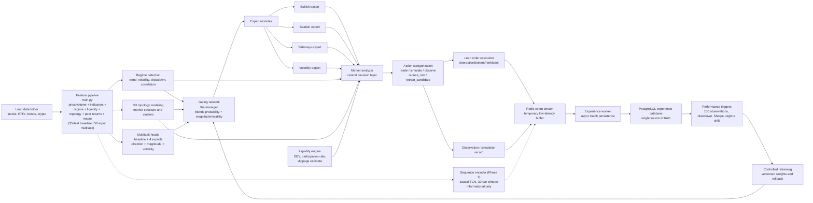
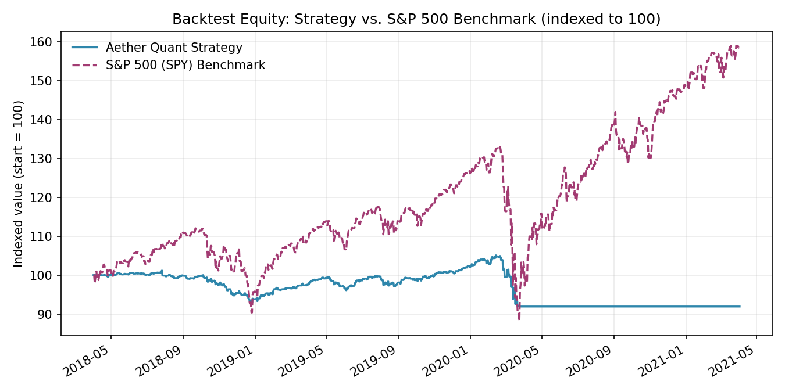

<p align="center">
  
</p>

<h1 align="center">Aether Quant</h1>

<p align="center">
  <strong>Aether Quant's flagship trading model: a dynamic, self-adapting algorithmic trading system built on QuantConnect Lean and PyTorch, engineered to prove that dynamic models belong in dynamic markets.</strong>
</p>

<p align="center">
  
  
  <!-- AQ:TEST_BADGE_START --><!-- AQ:TEST_BADGE_END -->
  
  
</p>

<p align="center">
  
  
  
  
  
  
  
  
  
  
  
</p>

Aether Quant is not a single static strategy. It's a **dynamic system**.
At its core, an ensemble of neural models predicts, for every asset every
day, a multi-horizon view of the market: **direction** at 1, 5 and 20 days,
expected **return magnitude** and **volatility**, and the signal it actually
trades on: each asset's **cross-sectional rank** (its predicted relative
strength against the rest of the universe), which drives a market-neutral
**long/short book**. Those predictions come from a **Mixture-of-Experts**
ensemble (bullish/bearish/sideways/volatility specialists) routed by a
learned gating network, alongside a **causal-TCN sequence encoder** that
adds temporal structure the flat-MLP trunk can't see. All of it reads one
feature pipeline that folds in a **market-regime detector**, a **3D market
topology** layer (a deterministic correlation embedding with a learned
probabilistic overlay), and a **liquidity/market-impact engine** that
adjusts sizing to real trading conditions. A **unified multi-asset-class
layer** trades equities, crypto, bonds, futures, and options through one
coherent portfolio, with real yield-curve/duration features for bonds,
margin-aware sizing for futures, Black-Scholes-greeks-based sizing for
options, and shared cross-asset macro signals (yield curve shape, futures
term structure, options sentiment) feeding every asset's prediction, not
just its own. And a **controlled retraining loop** lets the model itself
evolve as markets do, all wired together and validated end-to-end inside
QuantConnect's Lean engine. The thesis this project exists to test is simple
to state and hard to prove: **markets are non-stationary, so a trading model
should be too.** Every subsystem here exists to make the model adapt to
regime shifts, changing correlation structure, and liquidity conditions,
rather than fit one historical window and hope it generalizes.

## Quickstart

```powershell
pip install aether-quant     # published CLI + backend
aq --help                    # explore commands

# ...or from a clone, to train and backtest end-to-end:
pip install -e . && python train.py && aq backtest
```

`aq backtest` needs Docker Desktop and the Lean CLI running; see
[Getting Started](#getting-started) and [Requirements](#requirements) for the
full setup.

## Current Status

**V3 complete. V4 initialised with V4.1, the visualisation update.**
Multi-asset-class trading (equities, crypto, bonds, futures, options),
the full ML stack, and the retraining loop are all built, tested
(<!-- AQ:TEST_COUNT_START -->1515<!-- AQ:TEST_COUNT_END -->
tests) and wired end-to-end inside Lean.

- **V4.1 (visualisation), shipped:** the first V4 work item — a new
  **Operations** tab splitting the operational/health panels off an
  overloaded Overview (V4-W1), a reflowed **Tracing** layout giving the
  asset table room to grow (V4-W2), and a **genuinely 3D market topology**
  embedding, opt-in via `phase_v2.topology.embedding_dimensions: 3`
  (V4-W3). Also brought the project's first frontend test suite (Vitest)
  and fixed a pre-existing bug where every webui tab except `/` 404'd on
  a direct load in the Docker/production serving path
  (`development/Problems.md` #55).

- **Backtest:** the latest held-out run (2019-01-01 to 2021-03-31) is
  **profitable**, Sharpe **0.40**, Net **+10.4%**, max drawdown 4.0% (see
  [Backtest Results](#backtest-results)). This is a real flip from the
  pre-rank-pivot −0.59 Sharpe.
- **Two honest caveats on that number:** it ran with
  `bypass_safety_gates` on (not live-representative), and the `rank_20d`
  signal's *non-overlapping*-window significance still hasn't cleared the
  project's own t-stat ≥ 2.0 bar. Encouraging, not yet settled.
- **Not paper/live-deployable yet**: Interactive Brokers has never been
  tested against a real Gateway (see [Known Limitations](#known-limitations)).
- **Next:** the rest of V4 (walk-forward validation, model fine-tuning,
  more asset classes, IB testing), see [Roadmap](#roadmap).

## Known Limitations

Bonds are fully real today, no IB key needed. Futures and options are
fully wired end-to-end (chain parsing, greeks/IV, sizing, order placement,
position-close/exposure tracking, offline derivatives-macro training
features) but remain **data-empty until an Interactive Brokers key is
connected** (`phase_v2.ib.enabled`, see `aq ib status`/`aq assets
status`). Remaining, still-open items:

- **IB is unverified end-to-end**: futures margin uses a static reference file rather than live IB margin, and the connection itself has never been tested against a real Gateway. Vertical spreads (#38) are unverified for the same reason, no option/future asset exists in the universe yet, and adding a real one goes through the IB-backed `aq fetch options --apply` path.

## Table of Contents

- [Quickstart](#quickstart)
- [Current Status](#current-status)
- [Known Limitations](#known-limitations)
- [Download](#download)
- [Getting Started](#getting-started)
- [Requirements](#requirements)
- [Architecture](#architecture)
- [Universe Size](#universe-size)
- [Project Structure](#project-structure)
- [Module Documentation](#module-documentation)
- [Development Documentation](#development-documentation)
- [Backtest Results](#backtest-results)
- [Test Suite](#test-suite)
- [CLI Reference](#cli-reference)
  - [`aq train`](#aq-train)
  - [`aq test`](#aq-test)
  - [`aq backtest`](#aq-backtest)
  - [`aq profile`](#aq-profile)
  - [`aq report`](#aq-report)
  - [`aq api`](#aq-api)
  - [`aq webui`](#aq-webui)
  - [`aq docker`](#aq-docker)
  - [`aq config`](#aq-config)
  - [`aq lean`](#aq-lean)
  - [`aq retrain`](#aq-retrain)
  - [`aq trade-lock`](#aq-trade-lock)
  - [`aq fetch`](#aq-fetch)
  - [`aq ib`](#aq-ib)
  - [`aq assets`](#aq-assets)
  - [`aq status`](#aq-status)
- [Release Process](#release-process)
- [Runbook](#runbook)
- [Roadmap](#roadmap)
- [Contributing](#contributing)

---

## Download

If you just want to use Aether Quant rather than develop on it, no local
`pip install -e .` or source checkout is needed: the CLI and backend are
published as ready-to-use releases:

```powershell
pip install aether-quant
docker pull ghcr.io/leon1706-lol/aether-quant:latest
```

`aq --help` is then available immediately (see [CLI Reference](#cli-reference)
below). `aq` checks PyPI at most once every 24h (short timeout, never
blocking) for a newer version and prints a one-line notice if one's
available (disable with `AQ_SKIP_UPDATE_CHECK=1`).

The Docker image is the same one `docker-compose.yml`'s `engine` service
(and every worker service, which all share this one build,
`aether-quant-engine`) pulls by default (override with the
`AETHER_QUANT_IMAGE` env var, e.g. to use a locally built image instead).
This is the single consolidated image (app + every worker, includes the
full ML stack), so expect a larger download than a minimal API-only image.

## Getting Started

For local development (this repo cloned, a virtual environment active):

1. Install dependencies:

   ```powershell
   pip install -r requirements/requirements.txt
   pip install -r requirements/requirements-dev.txt   # local dev extras
   ```

2. Refresh the data inventory only:

   ```powershell
   python train.py --init-only
   ```

3. Build the dataset and train the model:

   ```powershell
   python train.py
   ```

   Or build dataset artifacts only, without training:

   ```powershell
   python train.py --dataset-only
   ```

4. Start the webui locally (two processes):

   ```powershell
   uvicorn monitoring.api_server:app --port 8001 --reload
   ```

   ```powershell
   cd webui
   npm install
   npm run dev
   ```

   Then open `http://localhost:3002`.

5. Run a real backtest and refresh this README's [Backtest Results](#backtest-results):

   ```powershell
   pip install -e .   # registers the `aq` command from source
   aq backtest
   ```
   First run downloads the pinned QuantConnect Lean engine Docker image once (~40GB+, budget time/bandwidth for it), see [`aq backtest`](#aq-backtest) below for why it's pinned rather than always re-checking `latest`.

## Requirements

- **Python ≥ 3.10** for the training pipeline, `main.py`'s Lean algorithm, the FastAPI monitoring server, and the `aq` CLI.
- **QuantConnect Lean CLI** (`pip install lean`) for running backtests and paper/live trading.
- **Docker & Docker Compose** for the local infrastructure (Redis, PostgreSQL, and the background workers, experience persistence, performance triggers, controlled retraining, Telegram alerts).
- **Node.js** (for the `webui/` React/Vite dashboard).

This repo splits its Python dependencies across several `requirements*.txt`
files (full training stack vs. minimal per-Docker-image installs vs. local
dev extras) rather than one monolithic file. See
**[`requirements/README.md`](requirements/README.md)** for the exact
`pip install` command for every variant and which Dockerfile consumes each one.

## Architecture

Aether Quant runs a daily-bar decision pipeline entirely inside Lean's
`on_data()` callback: features flow through regime detection and 3D topology
modeling, both feed a gating network that routes across four specialized
experts, the central market analyzer combines all of that with the liquidity
engine's sizing input into one categorical action per asset per bar, and
every decision is persisted through a Redis → PostgreSQL experience pipeline
that a controlled retraining loop reads from to evolve the model over time.

#### System Flow



Dashed edges mark the Phase 2 sequence encoder's **informational-only**
path, it's computed every bar and reaches the experience log, but never
the gating network, market analyzer, or position sizing (see
`inference/README.md`'s Phase 2 section).

#### Tech Stack

```mermaid
flowchart TB
    A["Infrastructure"] --> A1["Docker Compose<br/>(Redis, Postgres, aether-quant app)"]
    A --> A2["Lean CLI<br/>(backtest + paper trading, local only)"]
    A --> A3["30-day observation phase before live mode"]
    A --> A4["GitHub Codespaces<br/>(cloud training compute, optional)"]
    B["Development"] --> B1["VS Code + Claude Code"]
    B --> B2["GitHub"]
    C["Data and storage"] --> C1["Lean data folder for training/backtesting"]
    C --> C2["Redis temporary event stream"]
    C --> C3["PostgreSQL permanent experience database"]
    D["AI and modeling"] --> D1["PyTorch"]
    D --> D2["scikit-learn"]
    D --> D3["NumPy / Pandas"]
    D --> D4["MoE experts and gating network"]
    D --> D5["Multitask heads (direction/magnitude/<br/>volatility) + causal-TCN sequence encoder"]
    E["Monitoring and UI"] --> E1["React/Vite webui, Tracing dashboard (port 3002 dev / 8001 Docker)"]
    E --> E2["FastAPI JSON API (port 8000)"]
    E --> E3["Telegram alerts (V2-19)<br/>notifications/telegram_worker.py"]
```



These two diagrams are the high-level summary. For the full system,
every per-phase "contract" (Observation Mode, Performance Triggers,
Controlled Retraining, 3D Topology, Liquidity Engine, Paper/Live Deployment,
and more), the module map, and an honest analysis of what would need to
change for this to become a genuinely low-latency/HFT system, see
**[`development/v2_architecture.md`](development/v2_architecture.md)**.

#### The model stack

Three model families are trained and shipped, all reading the same
train/runtime-parity feature pipeline (shared pure functions, never
hand-matched formulas, `features/`, `main.py::_build_model_input()`):

- **Baseline + 4 experts** (`train.py::AetherNet*`), a 35-feature
  direction model plus bullish/bearish/sideways/volatility specialists,
  routed by the learned gating network (`moe/gating.py`). Each also carries
  optional multitask heads for return magnitude and volatility.
- **Multitask model** (`AetherNetMultiTaskHorizons`, `train_multitask.py`),
  a 52-input shared trunk with multiple heads: next-day direction,
  `direction_5d`/`direction_20d`, and `rank_5d`/`rank_20d` (per-date
  cross-sectional percentile rank of forward return, evaluated via rank-IC,
  `train.py::compute_rank_ic()`). `rank_20d` is the one signal with genuine
  cross-sectional skill and is what the trading path now runs on.
- **Sequence encoder** (`AetherNetSequenceMultiTaskHorizons`,
  `train_sequence.py`), a causal-TCN over a rolling 30-bar window of the
  same 52 inputs, adding temporal structure the flat-MLP trunk can't see.

The 52 model inputs are not just price/volume: regime state (one-hot /
confidence / trend / risk), an asset-intrinsic liquidity spread/dollar-volume
estimate, cross-asset topology correlation/risk, 4 correlated-peer
lagged-return channels, and 7 technical indicators (RSI, ATR%, Bollinger %B,
volume z-score, MACD histogram, distance-from-52-week-high, cross-sectional
momentum rank) are all computed as first-class features, computed offline
and at runtime by the same code, with verified parity.

`rank_20d` drives the long/short book and per-position sizing
(`risk/position_sizing.py::rank_sizing_multiplier()`, bounded and
direction-preserving); the multitask magnitude/volatility heads feed
position sizing opt-in via `phase_v2.dynamic_risk.use_predicted_volatility`.
All signals are visible on the `/neural-network` webui tab and in
`ml/*_training_metrics.json`.

See `inference/README.md`, `moe/README.md`, `risk/README.md`,
`regime/README.md`, `liquidity/README.md` and `topology/README.md` for the
full per-subsystem contracts, and `development/Changelog.md` for how this
stack was built, phase by phase.

## Universe Size

The trading universe currently spans **74 assets**: 40 stocks/broad-market
ETFs, 22 fixed-income (bond) ETFs, and 12 crypto pairs (54% equity / 30% bond
/ 12% crypto by count), defined in `config.json`'s `phase1.universe.assets`
and shared across training, validation, and backtesting (common window
`2014-12-01` to `2021-03-31`). Of these, tradeable names carry real positions
while "observation-only" names (thin history) are fed through the full model
pipeline but never sized.

See **[`development/asset_universe.md`](development/asset_universe.md)** for
the full ticker list, the trading-vs-observation split, the bond-ETF
duration/credit coverage, and the group-level diagram.

## Project Structure

The repository is a set of single-responsibility Python packages (one concern
per folder, each with its own README), a few top-level entry-point scripts
(`main.py` for the Lean algorithm, `train*.py` for the offline trainers,
`aq_cli.py` for the CLI), and the runtime config (`config.json` / `lean.json`).

See **[`development/project_structure.md`](development/project_structure.md)**
for the full annotated directory tree, and the
[Module Documentation](#module-documentation) table below for a per-package
index with links to each package's own README.

## Module Documentation

Every package below has its own README with the full detail on what it owns
and how it's wired in, this table is the index.

| Module | What it owns | Docs |
|---|---|---|
| `analyzer/` | Central market analyzer, the final per-asset action categorization layer | [README](analyzer/README.md) |
| `audit/` | Tamper-evident hash-chained audit log (credential loads, live-mode transitions, order path), Redis + PostgreSQL | [README](audit/README.md) |
| `backtests/` | Strategy validation output (active model + per-candidate reports), gitignored | [README](backtests/README.md) |
| `data/` | Local Lean data-folder format documentation | [README](data/README.md) |
| `data_pipeline/` | Lean-data contract + Yahoo Finance historical backfill | [README](data_pipeline/README.md) |
| `execution/` | Order gating, paper/live broker readiness, config-read caching | [README](execution/README.md) |
| `experience/` | Observation/decision history, Redis buffer + PostgreSQL persistence | [README](experience/README.md) |
| `experts/` | Bullish, bearish, sideways, and volatility expert models | [README](experts/README.md) |
| `features/` | Shared feature-computation functions, called from both `train.py` and `main.py` for train/inference parity | [README](features/README.md) |
| `inference/` | Vectorized forward-pass interpreter for the exported neural networks | [README](inference/README.md) |
| `cpp_inference_ext/` | Optional C++/pybind11 accelerator (builds the `cpp_inference` module, never a hard dependency), a separate top-level folder name from the module it builds, deliberately, to avoid a namespace-package collision with the installed package | [README](cpp_inference_ext/README.md) |
| `liquidity/` | Liquidity and market-impact engine | [README](liquidity/README.md) |
| `ml/` | Model & dataset artifacts, including versioned retraining candidates | [README](ml/README.md) |
| `moe/` | Mixture-of-Experts gating network | [README](moe/README.md) |
| `monitoring/` | FastAPI JSON API serving runtime state to the webui | [README](monitoring/README.md) |
| `notifications/` | Telegram alerting worker | [README](notifications/README.md) |
| `performance/` | Performance trigger system (14 trigger functions) | [README](performance/README.md) |
| `portfolio/` | Stage-2 cross-sectional long/short book construction + Black-Scholes options sizing | [README](portfolio/README.md) |
| `regime/` | Market regime detection | [README](regime/README.md) |
| `requirements/` | All `requirements*.txt` variants and what consumes each | [README](requirements/README.md) |
| `retraining/` | Controlled retraining, plan/train/validate/backtest/commit/promote/rollback | [README](retraining/README.md) |
| `risk/` | Dynamic position sizing, leverage caps, drawdown-aware sizing | [README](risk/README.md) |
| `scripts/` | Standalone dev tooling (e.g. the inference-hot-path profiler) | [README](scripts/README.md) |
| `storage/` | Reserved placeholder for future persistent artifact storage | [README](storage/README.md) |
| `tests/` | Pytest suite conventions (<!-- AQ:TEST_COUNT_START -->1515<!-- AQ:TEST_COUNT_END --> tests) | [README](tests/README.md) |
| `topology/` | 3D market topology, deterministic SMACOF embedding + learned overlay | [README](topology/README.md) |
| `visualization/` | Shared runtime-state JSON/CSV exports | [README](visualization/README.md) |
| `webui/` | React/Vite dashboard (Overview, Operations, Risk, Topology, Neural Network, Tracing) | [README](webui/README.md) |
| `Aether-quant-Obsidian-Vault/` | Auto-generated Obsidian vault mirroring the repo's architecture/code graph | [README](Aether-quant-Obsidian-Vault/README.md) |

## Development Documentation

| Document | Contents |
|---|---|
| [`development/README.md`](development/README.md) | Index of this folder |
| [`development/asset_universe.md`](development/asset_universe.md) | The full 74-asset universe: ticker list, trading-vs-observation split, bond-ETF coverage, group diagram |
| [`development/project_structure.md`](development/project_structure.md) | The full annotated directory tree of the repository |
| [`development/v2_architecture.md`](development/v2_architecture.md) | The full V2 system architecture: process-flow and tech-stack diagrams, the module map, per-phase "contract" sections, and the HFT-readiness analysis |
| [`development/infrastructure.md`](development/infrastructure.md) | Docker Compose runbook, start commands for every service, SQL inspection snippets, port reference |
| [`development/Changelog.md`](development/Changelog.md) | Detailed, append-only, per-phase build history, what was built, when, and why |
| [`development/Problems.md`](development/Problems.md) | Append-only audit log of bugs and infrastructure issues, each with a severity rating and fixed/open status |

## Backtest Results

<!-- AQ:BACKTEST_START -->


| Metric | Value |
|---|---|
| Backtest window | 2019-01-01 to 2021-04-02 |
| Sharpe Ratio | 0.403 |
| Net Profit | 10.438% |
| Compounding Annual Return | 4.508% |
| Drawdown | 4.000% |
| Total Orders | 2082 |
| Win Rate | 58% |
| Last updated | 2026-07-20 16:52 UTC (auto-generated by `aq backtest`) |
<!-- AQ:BACKTEST_END -->

<details>
<summary><strong>Full Lean statistics</strong> (Sharpe, Sortino, Alpha/Beta, fees, capacity, and everything else Lean reports)</summary>

<!-- AQ:BACKTEST_FULL_STATS_START -->
| Metric | Value |
|---|---|
| Total Orders | 2082 |
| Average Win | 0.09% |
| Average Loss | -0.09% |
| Compounding Annual Return | 4.508% |
| Drawdown | 4.000% |
| Expectancy | 0.154 |
| Start Equity | 100000.00 |
| End Equity | 110437.80 |
| Net Profit | 10.438% |
| Sharpe Ratio | 0.403 |
| Sortino Ratio | 0.398 |
| Probabilistic Sharpe Ratio | 13.809% |
| Loss Rate | 42% |
| Win Rate | 58% |
| Profit-Loss Ratio | 1.00 |
| Alpha | -0.003 |
| Beta | 0.113 |
| Annual Standard Deviation | 0.041 |
| Annual Variance | 0.002 |
| Information Ratio | -0.871 |
| Tracking Error | 0.183 |
| Treynor Ratio | 0.145 |
| Total Fees | $1620.21 |
| Estimated Strategy Capacity | $40000000.00 |
| Lowest Capacity Asset | BNO UN3IMQ2JU1YD |
| Portfolio Turnover | 7.51% |
| Drawdown Recovery | 150 |
<!-- AQ:BACKTEST_FULL_STATS_END -->

</details>

Regenerated on every `aq backtest` run
([`generate_backtest_report.py`](generate_backtest_report.py)) directly from
Lean's own result JSON, chart, headline table, and full stats all
overwritten, never hand-edited, so nothing here goes stale relative to your
last backtest.

**Read these numbers with three caveats:**

- **`bypass_safety_gates` is currently `true`.** This run had the sticky drawdown lock and the regime `risk_off` override disabled, to generate enough trade volume for meaningful stats (`development/Problems.md` #18), so it shows raw signal quality, *not* live/paper-deployable behavior. Set it back to `false` and re-run for the safety-gated number.
- **The signal isn't independently significant yet.** `rank_20d`'s full-series IC is strong (multitask `0.172`/t=`7.55`), but its *non-overlapping*-window t-stat (multitask `1.40`, sequence `0.43`) hasn't cleared the project's own ≥ 2.0 bar. The positive Sharpe is real but not yet settled (`development/Problems.md` #52/#54).
- **Retraining isn't exercised.** A bare `lean backtest .` runs the full inference stack every bar but can't reach Redis, so the "learning while trading" loop (`main.py` → Redis → Postgres → triggers → retraining) never fires. That needs the full Compose stack up, see `development/infrastructure.md`.

## Test Suite

<!-- AQ:TEST_COUNT_START -->1515<!-- AQ:TEST_COUNT_END --> tests, one file per source module, run via:

```powershell
aq test
```

which, like the backtest chart above, automatically keeps the badge at
the top of this README in sync with the real pass count every time you run
it. See [`tests/README.md`](tests/README.md) for the suite's conventions.

## CLI Reference

The easiest way to get the `aq` command is straight from PyPI (see
[Download](#download) above), no source checkout needed:

```powershell
pip install aether-quant
```

For local development (this repo cloned, a virtual environment active),
`pip install -e .` registers the same `aq` command directly from source
instead, without waiting on a PyPI release:

```powershell
pip install -e .
```

Either way, `aq --help` gives the full command list. Every command except
`aq trade-lock` and `aq fetch` is a thin `subprocess` wrapper around a
command already documented elsewhere in this README:

#### `aq train`
```text
aq train [--dataset-only|--init-only|--experts-only|--gating-only|--multitask-only|--sequence-only|--walk-forward] [--step-days N] [--mode rolling|expanding]
```
**Builds the dataset and trains the models** (`train.py`). With no flags,
trains everything (baseline + experts + gating + multitask + sequence) and
installs it into the active `ml/` folder.

Scope flags (each trains just one piece, installs straight into `ml/`):
- `--dataset-only` / `--init-only`: (re)build the dataset / refresh the data inventory, no training.
- `--experts-only`: the 4 expert models (see `moe/README.md`).
- `--gating-only`: the learned gating blend (`train_gating.py`, `moe/README.md`).
- `--multitask-only`: the joint direction/magnitude/volatility + rank model (`train_multitask.py`, `risk/README.md`).
- `--sequence-only`: the causal-TCN sequence encoder (`train_sequence.py`, `inference/README.md`).

Walk-forward (diagnostic, **never** touches active `ml/`):
- `--walk-forward`: runs the whole pipeline once per rolling/expanding window instead of on the fixed `phase1.windows`; each window writes to `ml/versions/<run-id>/window_<i>/`.
- `--step-days N` / `--mode rolling|expanding`: override `phase_v2.retraining.walk_forward`'s defaults. See `retraining/README.md`.

#### `aq test`
```text
aq test [--lean|--full] [--parallel] [--cli] [--risk] [--portfolio] [--features]
        [--data-pipeline] [--webui] [--ml] [--retraining] [--notifications]
        [--storage] [--live]
```
**Runs the pytest suite** and refreshes this README's test badge (only on a
full, unfiltered run, a filtered run's count is a subset, never written to
the badge).

- `--lean` / `--full`: also run the real `lean backtest .` integration test (`tests/test_lean_backtest_ml_coverage.py`, over an hour). Excluded by default since its own `skipif` only checks whether Lean is *installed* (it always is here), so it would otherwise run every time.
- `--parallel`: run via `pytest-xdist` (`-n auto`). Off by default: multiple workers each importing PyTorch is a real OOM risk on low-memory machines.
- Subsystem filters, `--cli`, `--risk`, `--portfolio`, `--features`, `--data-pipeline`, `--webui`, `--ml`, `--retraining`, `--notifications`, `--storage`, `--live` restrict the run to just those test files (combinable). `aq test --help` lists the exact file mapping.

#### `aq backtest`
```text
aq backtest [--image quantconnect/lean:<tag>]
```
**Runs `lean backtest .`** and refreshes this README's [Backtest Results](#backtest-results) section from the real Lean output. Requires Docker Desktop running.

- **First run downloads the pinned Lean engine image once (~40GB+)**; every run after reuses the cache and downloads nothing.
- `--image quantconnect/lean:<tag>`: use a different engine build. By default the image is pinned (`aq_cli.py::PINNED_LEAN_ENGINE_IMAGE`) rather than the mutable `:latest`, so a routine re-push by QuantConnect can't silently trigger a full re-pull on every run.

#### `aq profile`
```text
aq profile [--iterations N] [--sort cumulative] [--batched]
aq profile [--iterations N] [--sort cumulative] [--regime] [--topology] [--learned-topology] [--liquidity] [--gating] [--analyzer] [--indicators]
```
**Profiles the per-bar hot path** without needing a real backtest (which
takes over an hour), reports a `pstats` breakdown plus wall-clock
tail-latency percentiles (p50/p95/p99/max).

- **Default (no subsystem flag)**: profiles the inference path (`inference/exported_model.py`) against real exported weights, writing to `scripts/profile_inference_output.txt`. Add `--batched` to profile the optimized production path (precomputed weight/stack caches) instead of a per-expert loop.
- **Subsystem flags**: `--regime`, `--topology`, `--learned-topology`, `--liquidity`, `--gating`, `--analyzer`, `--indicators` profile the per-bar subsystems inference profiling never covered (combinable, e.g. `--regime --gating`). Writes to `scripts/profile_subsystems_output.txt`.
- `--iterations N`: default 10000 for inference, 200 for subsystems (`build_market_topology()` alone costs ~500-600ms/call, so 10k iterations would take over an hour). `--batched` with a subsystem flag is rejected, batching is meaningless for those pure functions.

Why this exists: it found `build_market_topology()`'s per-bar cost rivaling
the *entire* inference step, and drove a combined −89.2% reduction (weight
caching, `_conv1d_causal` vectorization, expert-loop batching). See
`development/Problems.md` #36. `_build_model_input()` itself isn't directly
profiled (it reads `self.*` state, not cleanly synthesizable); `--indicators`
covers its pure primitives instead.

#### `aq report`
```text
aq report <backtest-folder> <result-id>
```
Generates Lean's own HTML backtest report (trade blotter, standard Lean
charts) at `backtests/<backtest-folder>/report.html`.

#### `aq api`
```text
aq api
```
Starts the FastAPI monitoring server on `:8001`.

#### `aq webui`
```text
aq webui
```
Starts the webui dev server (`npm run dev`).

#### `aq docker`
```text
aq docker up [--lean|--all]
aq docker build
```
`up` starts local infrastructure (default: Redis + PostgreSQL only).
`build` rebuilds the `aether-quant` app image.

#### `aq config`
```text
aq config [get <dotted.key>|set <dotted.key> <value>|keys [<dotted.prefix>]]
```
**Reads or edits `config.json` by dotted key path**, no manual file editing.

- `aq config` (bare): pretty-print the whole file.
- `aq config keys [<prefix>]`: list every leaf key path (find the right key in a deeply nested file).
- `aq config get <key>`: print one value (a scalar, or a whole nested section as JSON).
- `aq config set <key> <value>`: write it. The value is parsed as JSON first (`true`/`123`/`0.5`/`["a","b"]` become real types), falling back to a string. Every `set` backs up to `config.json.bak` and prints old → new; a type change (e.g. bool → string) warns but still writes, since this gives full access to every key.

#### `aq lean`
```text
aq lean [get <dotted.key>|set <dotted.key> <value>|keys [<dotted.prefix>]]
```
The exact same `get`/`set`/`keys` tool as `aq config`, just pointed at
`lean.json` (the QuantConnect Lean CLI's own config file, broker
credentials, environments, data providers) instead. `aq lean set
ib-trading-mode live`, `aq lean keys environments.live-paper`, etc.

#### `aq retrain`
```text
aq retrain <plan|train|validate|backtest|commit|promote|rollback|status> [...]
```
Dispatches to `python -m retraining.orchestrator <stage> ...` for a
single manual pipeline stage.

#### `aq trade-lock`
```text
aq trade-lock --on|--off|--auto|--status
```
Manually overrides `main.py`'s sticky total-drawdown trade lock (see
`development/v2_architecture.md`'s Manual Trade-Lock Override Contract).
`--off` deliberately clears an otherwise-permanent lock; `--auto` returns
to fully automatic behavior.

#### `aq fetch`
```text
aq fetch <crypto|stock> --ticker <TICKER> --start <YYYY-MM-DD> --end <YYYY-MM-DD> [--apply]
aq fetch futures --ticker <TICKER> --start <YYYY-MM-DD> --end <YYYY-MM-DD> --expiry <YYYY-MM-DD> [--contract-month <YYYYMM>] [--family-ticker <ROOT>] [--apply]
aq fetch options --ticker <TICKER> --start <YYYY-MM-DD> --end <YYYY-MM-DD> --expiry <YYYY-MM-DD> --strike <STRIKE> --right <call|put> [--family-ticker <ROOT>] [--apply]
```
**Backfills historical data for a new ticker** and (with `--apply`) registers
it in `config.json`'s `phase1.universe.assets[]`, no manual editing.

- `crypto` / `stock`: fetch OHLCV from Yahoo Finance, written into Lean's zip/CSV layout (`data/crypto/coinbase/daily/<ticker>_trade.zip` or `data/equity/usa/daily/<ticker>.zip`).
- `futures` / `options`: same, but source bars from Interactive Brokers (needs IB configured, see `aq ib status`; fails cleanly if not).
- **Dry run by default**: without `--apply` it reports the plan and writes nothing. Never runs `train.py`: after `--apply`, run `python train.py --dataset-only` (then `python train.py`) yourself.

Derivatives-only flags:
- `--contract-month <YYYYMM>` (futures): fetch a specific dated contract instead of the continuous one, to build a real term structure (e.g. `ES_FRONT`/`ES_NEXT`, same root, different month).
- `--family-ticker <ROOT>` (futures/options): tag the asset with its root (e.g. `"ES"`, `"SPY"`) so `train.py`'s derivatives-macro features can group same-family contracts for term-structure/put-call/IV-skew. IB's historical API is per-contract and rate-limited, so building a training set is a repeated manual process, see `data_pipeline/README.md`.

#### `aq ib`
```text
aq ib status
```
**Reports Interactive Brokers readiness** as one of three states:
- **disabled**: `phase_v2.ib.enabled` is `false` (the default; equities/crypto/bonds are unaffected either way).
- **enabled but credentials missing**: `phase_v2.ib.enabled` is `true` but `lean.json`'s `ib-account`/`ib-user-name` are empty (set with `aq lean set ib-account <ACCOUNT>` / `aq lean set ib-user-name <USERNAME>`).
- **reachable**: a live connect/disconnect round-trip against your running TWS/IB Gateway succeeded.

Credentials live entirely in `lean.json` (the same fields Lean's native
`InteractiveBrokersBrokerage` uses); `phase_v2.ib` in `config.json` only adds
the on/off switch plus the Gateway socket settings (`host`/`port`/`client_id`)
for the offline `aq fetch futures`/`aq fetch options` backfill path. These are
two distinct integrations on purpose: Lean's backtest engine never talks to IB
(it only reads local data files), so historical futures/options bars must be
backfilled separately before any backtest can use them, see
`data_pipeline/README.md`.

#### `aq assets`
```text
aq assets status
```
**Full multi-asset-class readiness at a glance** (read-only), reports:
- IB status (same three states as `aq ib status`).
- Whether `phase_v2.futures_risk.enabled` / `phase_v2.options_risk.enabled` are on.
- How many futures contract margin specs are loaded.
- FRED yield-curve cache coverage (series count + most recent date).
- How many futures/options assets are configured in the universe.

Toggle any of these with the generic `aq config set
phase_v2.{ib,futures_risk,options_risk}.enabled true|false`, there's no
separate enable/disable subcommand.

#### `aq status`
```text
aq status
```
Shows `git status`.

## Release Process

A release is exactly one manual step, deliberately no automatic release on
every push to `main`, only on an explicitly pushed version tag
(`.github/workflows/release.yml`, triggered on `push: tags: ["v*.*.*"]`):

```powershell
git tag v0.1.0
git push origin v0.1.0
```

This then automatically runs (no manual version bump anywhere in the repo,
`pyproject.toml` reads the version straight from the tag via
`setuptools-scm`):

1. The test suite (`pytest`), a failure blocks the release entirely.
2. PyPI publishing via Trusted Publishing (OIDC), no PyPI token is stored as a GitHub secret.
3. Docker image build and push to `ghcr.io/leon1706-lol/aether-quant`, tagged with the version number and `:latest`.

**One-time manual setup, before the first tag is ever pushed** (can't be
done from here):

- Create a "Trusted Publisher" on pypi.org for this project (pointing at `leon1706-lol/Aether-quant` + the `release.yml` workflow file).
- After the very first tag push: check the **Packages** tab of this repo to see whether the new `aether-quant` package is private, and switch it to public if needed so `docker pull` works for everyone.

## Runbook

Everyday local commands (assumes the [Getting Started](#getting-started) setup
is done and the venv is active: `.\.venv\Scripts\Activate.ps1`).

```powershell
# Rebuild model artifacts
python train.py                 # full dataset build + train
python train.py --dataset-only  # dataset/scaler/manifest only

# Recommended pre-commit workflow
pytest tests/
aq backtest                     # runs `lean backtest .`, refreshes Backtest Results
aq report <backtest-folder> <result-id>   # official Lean HTML report
git status

# Inspect a finished backtest
Get-ChildItem .\backtests\<backtest-folder>\*-summary.json

# Webui (two terminals) -> http://localhost:3002 (Overview) / /risk
uvicorn monitoring.api_server:app --port 8001 --reload
cd webui; npm run dev
```

**Train in the cloud (GitHub Codespaces)** instead, useful on a
memory-constrained machine where a full retrain can take hours of wall-clock
time while barely using any CPU (see `development/Problems.md` #50/#52):

```powershell
gh codespace create --repo <owner>/Aether-quant --branch main --machine basicLinux32gb
gh codespace ssh -c <codespace-name>
# inside the Codespace:
cd Aether-quant && python train.py
# back on your local machine:
gh codespace cp -e "remote:Aether-quant/ml/*.json" ./ml/ -c <codespace-name>
gh codespace stop -c <codespace-name>
```

Model artifacts are gitignored and `gh codespace cp` moves them over SSH, so
nothing trained this way touches the public repo. Lean/Docker backtests can't
run in a Codespace (see `development/infrastructure.md`'s "Cloud Training via
GitHub Codespaces" section for why); those stay local.

## Roadmap

All finished phases and changes can be found in
[`development/Changelog.md`](development/Changelog.md), kept separate to keep this README short.

### V4, 🔜 Next Up

**Optimization**
- More latency passes, continue the profiling/optimization work beyond `build_market_topology()` and the inference hot path.
- Model fine-tuning, a critical 1-10 review of the retrained model's actual performance (development/Problems.md #52/#54), and a concrete plan to close the gap to a 10/10 signal (clearing the non-overlapping significance bar, not just the full-series one).

**Training**
- Walk-forward training, Stage 6 of the rank-pivot roadmap (`phase_v2.retraining.walk_forward`, `aq train --walk-forward`), still deferred after this session's single-window retrain.

**Assets**
- More complex option strategies, straddles, strangles, iron condors, butterflies, and general multi-leg spreads beyond today's 2-leg verticals (#38), using the rest of what `QuantConnect.Securities.Option.OptionStrategies` already offers.
- Forex/FX as a tradable asset class, plus any other major asset classes still missing.
- Single-bond trading (individual bonds, not just bond ETFs), today's fixed-income sleeve is entirely ETF-based (see the Universe Size section above).

**Functionality**
- Allow adding to an existing position, today, if the model already holds SPY and the signal says to buy more SPY, it should be able to scale the position up rather than being blocked just because a position already exists.

**Webui** — ✅ **V4.1, the visualisation update — shipped**, see `development/Changelog.md`
- ~~Consider moving some of the Overview tab's content into its own, larger tab for better organization.~~ Done (V4-W1): the operational/health panels moved to a new **Operations** tab, leaving Overview with the trading-side view.
- ~~Tracing tab: move the backtest equity curve under "Runtime Metrics Snapshot" and the observation-mode equity curve under "Backtest Equity Curve", so interactive tabs sit on the left and asset performance (which grows with more assets) has room to grow on the right.~~ Done (V4-W2).
- ~~Make the webui topology genuinely 3D instead of 2D.~~ Done (V4-W3), opt-in via `phase_v2.topology.embedding_dimensions: 3` (default `2` keeps existing coordinates byte-identical). Note the function to extend was `topology/market_topology.py`'s `_stress_majorize_2d()`, not `learned_topology.py`'s — now renamed `_stress_majorize()` since it is dimension-agnostic.

**Tests / production readiness**
- Real IB API key insertion and testing, the one blocker behind #29/#38's unverified items and the README's Known Limitations.

**Computing**
- Beyond GitHub Codespaces (#53): Oracle Cloud Always Free + Remote-SSH as a more powerful, persistent free compute option.

### V5, Later (HFT)

`development/v2_architecture.md`'s own "Why This Is Not HFT, And What It
Would Take" analysis is the honest starting point here, not marketing
aspiration, but a concrete six-point gap list the system's own architecture
docs already identify (daily bars everywhere, no tick/L1-L2 data, no
slippage/latency-aware execution, offline batch retraining, polling
infrastructure, no colocated broker connectivity). Its own conclusion is
blunt: closing these gaps is **"closer to a second, parallel trading system
than an incremental change."** Bolting HFT onto V4's daily-bar architecture
isn't realistic; it would need to be built alongside it, not on top of it.

If pursued, sequence it as its own workstream, in this order:
1. **Tick/L1-L2 market data pipeline**: a new storage layer entirely, replacing the daily Lean zip files.
2. **A genuinely new short-horizon model**: using minute/second-resolution data for faster trades (not milliseconds), not a retrained version of today's daily classifier.
3. **Execution/latency infrastructure**: slippage/latency-aware, queue-position-aware execution and a low-latency event-driven runtime, replacing the daily-bar `on_data()` callback and the 30s+ polling background workers.
4. Further out: real broker/exchange connectivity beyond paper trading, continuous/online retraining, multi-timeframe ensembles, and reinforcement-learning-based position sizing/execution.

## Contributing

1. Fork the repository
2. Create a feature branch: `git checkout -b feature/my-feature`
3. Commit your changes following the existing module structure (see [`development/Changelog.md`](development/Changelog.md) for this project's development history)
4. Open a Pull Request

---

<p align="center">
  Built by <strong>Leon Schwarzkopf</strong>, <a href="mailto:leonschwarzkopf08@gmail.com">leonschwarzkopf08@gmail.com</a>
</p>

---

<div align="center">
  <sub>Aether Quant</sub>
</div>
