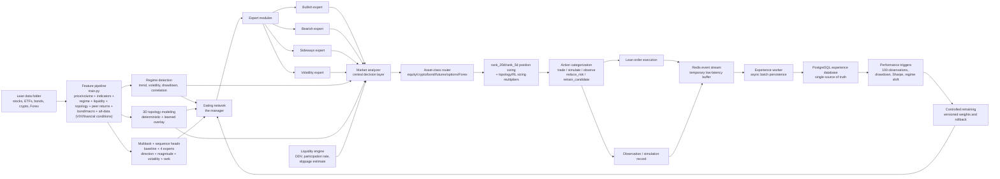
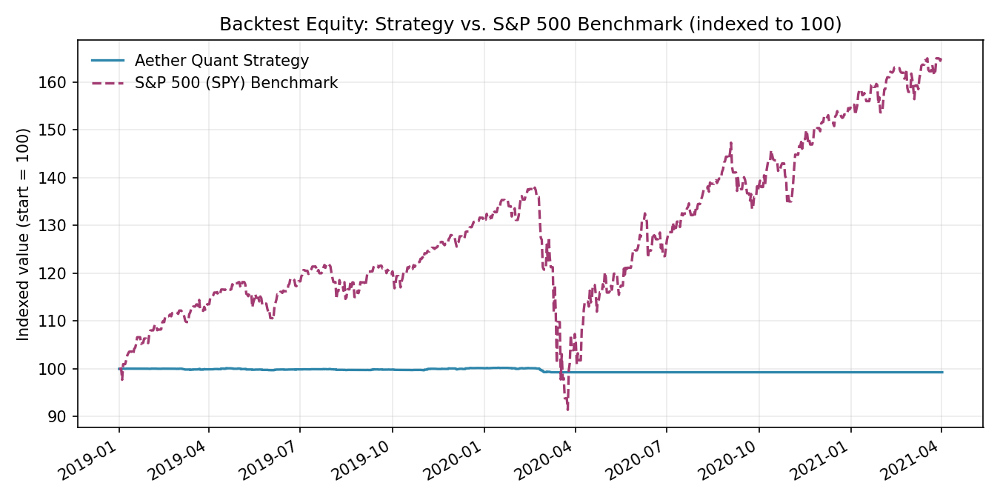

<p align="center">
  
</p>

<h1 align="center">Aether Quant</h1>

<p align="center">
  <strong>Aether Quant's flagship trading model: a dynamic, self-adapting algorithmic trading system built on QuantConnect Lean and PyTorch, engineered to prove that dynamic models belong in dynamic markets.</strong>
</p>

<p align="center">
  
  
  <!-- AQ:TEST_BADGE_START --><!-- AQ:TEST_BADGE_END -->
  
  
</p>

<p align="center">
  
  
  
  
  
  
  
  
  
  
  
</p>

Aether Quant is not a single static strategy. It's a **dynamic system**.
At its core, an ensemble of neural models predicts, for every asset every
day, a multi-horizon view of the market: **direction** at 1, 5 and 20 days,
expected **return magnitude** and **volatility**, and the signal it actually
trades on: each asset's **cross-sectional rank** (its predicted relative
strength against the rest of the universe), which drives a market-neutral
**long/short book**. Those predictions come from a **Mixture-of-Experts**
ensemble (bullish/bearish/sideways/volatility specialists) routed by a
learned gating network, alongside a **causal-TCN sequence encoder** that
adds temporal structure the flat-MLP trunk can't see. All of it reads one
feature pipeline that folds in a **market-regime detector**, a **3D market
topology** layer (a deterministic correlation embedding with a learned
probabilistic overlay), and a **liquidity/market-impact engine** that
adjusts sizing to real trading conditions. A **unified multi-asset-class
layer** trades equities, crypto, bonds, futures, options, and Forex through
one coherent portfolio, with real yield-curve/duration features for bonds,
margin-aware sizing for futures, Black-Scholes-greeks-based sizing for
options, and shared cross-asset macro signals (yield curve shape, futures
term structure, options sentiment, options-implied volatility/financial
conditions) feeding every asset's prediction, not
just its own. And a **controlled retraining loop** lets the model itself
evolve as markets do, all wired together and validated end-to-end inside
QuantConnect's Lean engine. The thesis this project exists to test is simple
to state and hard to prove: **markets are non-stationary, so a trading model
should be too.** Every subsystem here exists to make the model adapt to
regime shifts, changing correlation structure, and liquidity conditions.

## Quickstart

```powershell
pip install aether-quant     # published CLI + backend
aq --help                    # explore commands

# ...or from a clone, to train and backtest end-to-end:
pip install -e . && python train.py && aq backtest
```

`aq backtest` needs Docker Desktop and the Lean CLI running; see
[Getting Started](#getting-started) and [Requirements](#requirements) for the
full setup.

## Current Status

**V4 complete. V5.1 complete.** V4 built the full multi-asset-class
architecture (equities, crypto, bonds, futures, options, Forex), the ML
stack, and the retraining loop. V5.1 rebuilt the trading model and
execution path to actually pay for its own costs and to survive running
unattended: the model now trains directly against cross-sectional rank
(not a proxy MSE loss), targets are residualized against market/sector/size
so they measure real skill instead of beta, every trade decision runs
through an explicit expected-cost gate, the book is dollar- and
sector-neutral with hysteresis, walk-forward validation spans six regimes
including COVID, and an automated kill switch, position reconciliation,
and rollback mechanism now sit in front of live trading. Everything below
is built, tested (<!-- AQ:TEST_COUNT_START -->2373<!-- AQ:TEST_COUNT_END -->
tests) and wired end-to-end inside Lean.

- **Backtest:** the numbers in [Backtest Results](#backtest-results) below
  predate V5.1 and don't yet reflect the new model, cost gate, or
  neutral book — a fresh backtest against the V5.1 pipeline hasn't been
  run yet (see [Roadmap](#roadmap)).
- **Signal quality:** the new cross-sectional ranking objective lifted
  `rank_5d`'s non-overlapping t-stat to 6+ across every seed and objective
  tried, easily its strongest result to date. `rank_20d` improved but still
  falls just short of this project's own promotion bar; `residual_rank_20d`
  (the new market/sector/size-neutral head) isn't promotable yet either.
  The offline rank-book simulator shows a genuinely positive, balanced
  net Sharpe after costs across all six walk-forward windows.
- **Not paper/live-deployable yet**: Interactive Brokers has never been
  tested against a real Gateway (see [Known Limitations](#known-limitations)),
  and the new kill-switch/reconciliation machinery, while fully unit-tested,
  hasn't run against a live broker connection either.
- **Next:** the Lean backtest that validates the V5.1 pipeline end-to-end,
  then IB testing — see [Roadmap](#roadmap).

## Known Limitations

Bonds are fully real today, no IB key needed. Futures and options are
fully wired end-to-end (chain parsing, greeks/IV, sizing, order placement,
position-close/exposure tracking, offline derivatives-macro training
features) but remain **data-empty until an Interactive Brokers key is
connected** (`phase_v2.ib.enabled`, see `aq ib status`/`aq assets
status`). Remaining, still-open items:

- **IB is unverified end-to-end**: futures margin uses a static reference file by default; an opt-in live (Lean/IB-calibrated) margin source exists (`phase_v2.futures_risk.margin_source`, see `development/Problems.md` #67) but, like the connection itself, has never been tested against a real Gateway. All 43 option structures (#38, #59) are unverified for the same reason, no option/future asset exists in the universe yet, and adding a real one goes through the IB-backed `aq fetch options --apply` path.
- **Production-safety machinery is unit- and backtest-verified, not field-tested**: the kill switch, position reconciliation, and auto-rollback (`aq kill-switch`, see [CLI Reference](#cli-reference)) are fully covered by unit tests and have now run for real inside a completed Lean backtest (kill switch stayed untripped through its warmup window, reconciliation reported zero false breaches) — but nothing has yet run them against a real, continuously-running broker/Postgres deployment over live/paper hours. That's the same gap IB testing itself needs to close.

## Table of Contents

- [Quickstart](#quickstart)
- [Current Status](#current-status)
- [Known Limitations](#known-limitations)
- [Download](#download)
- [Getting Started](#getting-started)
- [Requirements](#requirements)
- [Architecture](#architecture)
- [Universe Size](#universe-size)
- [Project Structure](#project-structure)
- [Module Documentation](#module-documentation)
- [Development Documentation](#development-documentation)
- [Backtest Results](#backtest-results)
  - [Lean Backtest](#lean-backtest)
  - [Offline Evaluation](#offline-evaluation)
  - [Walk-Forward Training/Testing](#walk-forward-trainingtesting)
  - [Other Metrics](#other-metrics)
  - [Disclaimer](#disclaimer)
- [Test Suite](#test-suite)
- [CLI Reference](#cli-reference)
  - [`aq train`](#aq-train)
  - [`aq test`](#aq-test)
  - [`aq backtest`](#aq-backtest)
  - [`aq profile`](#aq-profile)
  - [`aq report`](#aq-report)
  - [`aq api`](#aq-api)
  - [`aq webui`](#aq-webui)
  - [`aq docker`](#aq-docker)
  - [`aq config`](#aq-config)
  - [`aq lean`](#aq-lean)
  - [`aq retrain`](#aq-retrain)
  - [`aq paper-readiness`](#aq-paper-readiness)
  - [`aq trade-lock`](#aq-trade-lock)
  - [`aq kill-switch`](#aq-kill-switch)
  - [`aq evaluate`](#aq-evaluate)
  - [`aq fetch`](#aq-fetch)
  - [`aq backfill`](#aq-backfill)
  - [`aq ib`](#aq-ib)
  - [`aq assets`](#aq-assets)
  - [`aq render-lean-config`](#aq-render-lean-config)
  - [`aq secrets-check`](#aq-secrets-check)
  - [`aq audit-log`](#aq-audit-log)
  - [`aq status`](#aq-status)
- [Release Process](#release-process)
- [Runbook](#runbook)
- [Roadmap](#roadmap)
- [Contributing](#contributing)

---

## Download

If you just want to use Aether Quant rather than develop on it, no local
`pip install -e .` or source checkout is needed: the CLI and backend are
published as ready-to-use releases:

```powershell
pip install aether-quant
docker pull ghcr.io/leon1706-lol/aether-quant:latest
```

`aq --help` is then available immediately (see [CLI Reference](#cli-reference)
below). `aq` checks PyPI at most once every 24h (short timeout, never
blocking) for a newer version and prints a one-line notice if one's
available (disable with `AQ_SKIP_UPDATE_CHECK=1`).

The Docker image is the same one `docker-compose.yml`'s `engine` service
(and every worker service, which all share this one build,
`aether-quant-engine`) pulls by default (override with the
`AETHER_QUANT_IMAGE` env var, e.g. to use a locally built image instead).
This is the single consolidated image (app + every worker, includes the
full ML stack), so expect a larger download than a minimal API-only image.

## Getting Started

For local development (this repo cloned, a virtual environment active):

1. Install dependencies:

   ```powershell
   pip install -r requirements/requirements.txt
   pip install -r requirements/requirements-dev.txt   # local dev extras
   ```

2. Refresh the data inventory only:

   ```powershell
   python train.py --init-only
   ```

3. Build the dataset and train the model:

   ```powershell
   python train.py
   ```

   Or build dataset artifacts only, without training:

   ```powershell
   python train.py --dataset-only
   ```

4. Start the webui locally (two processes):

   ```powershell
   uvicorn monitoring.api_server:app --port 8001 --reload
   ```

   ```powershell
   cd webui
   npm install
   npm run dev
   ```

   Then open `http://localhost:3002`.

5. Run a real backtest and refresh this README's [Backtest Results](#backtest-results):

   ```powershell
   pip install -e .   # registers the `aq` command from source
   aq backtest
   ```
   First run downloads the pinned QuantConnect Lean engine Docker image once (~40GB+) and builds the small local `aether-quant-lean:17900` layer; budget time and bandwidth for it. Later runs reuse both images.

## Requirements

- **Python ≥ 3.10** for the training pipeline, `main.py`'s Lean algorithm, the FastAPI monitoring server, and the `aq` CLI.
- **QuantConnect Lean CLI** (`pip install lean`) for running backtests and paper/live trading.
- **Docker & Docker Compose** for the local infrastructure (Redis, PostgreSQL, and the background workers, experience persistence, performance triggers, controlled retraining, Telegram alerts).
- **Node.js** (for the `webui/` React/Vite dashboard).
- **GitHub CLI (`gh`)** — optional, only needed to reproduce model training via a GitHub Codespace (this project's own convention for offloading training off a resource-constrained dev machine; see `development/Problems.md` #71).

This repo splits its Python dependencies across several `requirements*.txt`
files (full training stack vs. minimal per-Docker-image installs vs. local
dev extras) rather than one monolithic file. See
**[`requirements/README.md`](requirements/README.md)** for the exact
`pip install` command for every variant and which Dockerfile consumes each one.

## Architecture

Aether Quant runs a daily-bar decision pipeline entirely inside Lean's
`on_data()` callback: features (including bond/macro and options-implied
alt-data) flow through regime detection and 3D topology modeling (a
deterministic embedding plus a learned overlay), both feed a gating
network that routes across four specialized experts, an asset-class
router sizes the decision across equities/crypto/bonds/futures/options/
Forex, and every decision is persisted through a Redis → PostgreSQL
experience pipeline that a controlled retraining loop reads from to
evolve the model over time.

#### System Flow


```mermaid
flowchart LR
    A["Lean data folder<br/>stocks, ETFs, bonds, crypto, Forex"] --> B["Feature pipeline<br/>train.py<br/>price/volume + indicators +<br/>regime + liquidity + topology + peer returns +<br/>bond/macro + alt-data (VIX/financial conditions)"]
    B --> C["Regime detection<br/>trend, volatility, drawdown, correlation"]
    B --> D["3D topology modeling<br/>deterministic + learned overlay"]
    B --> V["Multitask + sequence heads<br/>baseline + 4 experts<br/>direction + magnitude + volatility + rank"]
    C --> E["Gating network<br/>the manager"]
    D --> E
    V --> E
    E --> F["Expert modules"]
    F --> G["Bullish expert"]
    F --> H["Bearish expert"]
    F --> I["Sideways expert"]
    F --> J["Volatility expert"]
    G --> K["Market analyzer<br/>central decision layer"]
    H --> K
    I --> K
    J --> K
    C --> K
    D --> K
    L["Liquidity engine<br/>DDV, participation rate,<br/>slippage estimate"] --> K
    K --> AC["Asset-class router<br/>equity/crypto/bond/futures/options/Forex"]
    AC --> RK["rank_20d/rank_5d position sizing<br/>+ topology/RL sizing multipliers"]
    RK --> M["Action categorization<br/>trade / simulate / observe<br/>reduce_risk / retrain_candidate"]
    M --> N["Lean order execution"]
    M --> O["Observation / simulation record"]
    N --> P["Redis event stream<br/>temporary low-latency buffer"]
    O --> P
    P --> Q["Experience worker<br/>async batch persistence"]
    Q --> R["PostgreSQL experience database<br/>single source of truth"]
    R --> S["Performance triggers<br/>100 observations, drawdown, Sharpe, regime shift"]
    S --> T["Controlled retraining<br/>versioned weights and rollback"]
    T --> E
```

#### Tech Stack


```mermaid
flowchart TB
    A["Infrastructure"] --> A1["Docker Compose<br/>(Redis, Postgres, aether-quant app)"]
    A --> A2["Lean CLI<br/>(backtest + paper trading, local only)"]
    A --> A3["30-day observation phase before live mode"]
    A --> A4["GitHub Codespaces<br/>(cloud training compute)"]
    B["Development"] --> B1["VS Code + Claude Code"]
    B --> B2["GitHub"]
    C["Data and storage"] --> C1["Lean data folder for training/backtesting"]
    C --> C2["Redis temporary event stream"]
    C --> C3["PostgreSQL permanent experience database"]
    D["AI and modeling"] --> D1["PyTorch"]
    D --> D2["scikit-learn"]
    D --> D3["NumPy / Pandas"]
    D --> D4["MoE experts and gating network"]
    D --> D5["Multitask heads (direction/magnitude/<br/>volatility/rank) + causal-TCN sequence encoder"]
    E["Monitoring and UI"] --> E1["React/Vite webui, Tracing dashboard (port 3002 dev / 8001 Docker)"]
    E --> E2["FastAPI JSON API (port 8000)"]
    E --> E3["Telegram alerts<br/>notifications/telegram_worker.py"]
```

These two diagrams are the high-level summary. For the full system —
every subsystem contract, the module map, the multi-asset-class and
signal-promotion-gate design, and an honest analysis of what would need
to change for this to become a genuinely low-latency/HFT system — see
**[`development/architecture.md`](development/architecture.md)**.

#### The model stack

Three model families are trained and shipped, all reading the same
train/runtime-parity feature pipeline (shared pure functions, never
hand-matched formulas, `features/`, `main.py::_build_model_input()`):

- **Baseline + 4 experts** (`train.py::AetherNet*`) — a direction model
  plus bullish/bearish/sideways/volatility specialists, routed by the
  learned gating network (`moe/gating.py`). Each also carries optional
  multitask heads for return magnitude and volatility.
- **Multitask model** (`AetherNetMultiTaskHorizons`, `train_multitask.py`)
  — a shared trunk with multiple heads: next-day direction,
  `direction_5d`/`direction_20d`, and the cross-sectional rank heads
  (`rank_5d`/`rank_20d`, plus market/sector/size-**residualized** variants
  that measure real skill rather than beta). `rank_20d` is the primary
  trading signal.
- **Sequence encoder** (`AetherNetSequenceMultiTaskHorizons`,
  `train_sequence.py`) — a causal-TCN over a rolling 30-bar window of the
  same inputs, adding temporal structure the flat-MLP trunk can't see;
  its `rank_5d` head is the strongest signal in this project's history.

Both trainers are trained directly against a differentiable ranking
objective (soft-Spearman/ListNet over whole-date cross-sectional batches),
not an MSE proxy — the model now optimizes for the thing it actually
trades on.

**66 model inputs** — not just price/volume: regime state (one-hot /
confidence / trend / risk), liquidity spread/dollar-volume, cross-asset
topology correlation/risk, correlated-peer lagged returns, 7 technical
indicators, real bond yield-curve/credit-spread features, alt-data
(options-implied volatility, financial-conditions change), and per-asset
macro **sensitivity betas** (rolling regression of each asset's return
against ΔVIX/Δreal-rate/Δcredit/Δdollar, so macro actually varies
cross-sectionally instead of shifting every asset equally) — all computed
offline and at runtime by the same code, with verified parity.

The rank heads drive a dollar- and sector-neutral long/short book
(`portfolio/book_neutrality.py`) with per-position sizing
(`risk/position_sizing.py`, bounded and direction-preserving) that's
scaled down when a trade's expected edge doesn't clear its expected
round-trip cost (`execution/cost_model.py`). An automated kill switch,
position reconciliation against the broker's actual holdings, and an
opt-in auto-rollback sit in front of all of it (`risk/kill_switch.py`,
`execution/reconciliation.py`, `retraining/auto_rollback.py`). All of it
is visible on the `/neural-network`, `/evaluation`, and `/operations`
webui tabs and in `ml/*_training_metrics.json`.

See `inference/README.md`, `moe/README.md`, `risk/README.md`,
`regime/README.md`, `liquidity/README.md` and `topology/README.md` for
the full per-subsystem contracts, and `development/architecture.md` for
how it all fits together.

## Universe Size

The trading universe currently spans **104 assets**: 55 stocks/broad-market
ETFs, 22 fixed-income (bond) ETFs, 12 crypto pairs, and 15 forex/FX pairs
(53% equity / 21% bond / 12% crypto / 14% forex by count), defined in
`config.json`'s `phase1.universe.assets` and shared across training,
validation, and backtesting (common window `2014-12-01` to `2021-03-31`).
Of these, tradeable names carry real positions while "observation-only"
names (thin history) are fed through the full model pipeline but never
sized. The 15 forex pairs (V4.10, fetched via `aq fetch forex`) all cover
the full common window with real Yahoo Finance history, unlike the 7
newly-added crypto pairs — expected to land "Trading" for the same reason,
though this hasn't been run through `train.py`'s actual asset-quality
classifier yet (left for a manual `python train.py --dataset-only` run,
same division of labor as this project's other deferred training steps).

See **[`development/asset_universe.md`](development/asset_universe.md)** for
the full ticker list, the trading-vs-observation split, the bond-ETF
duration/credit coverage, and the group-level diagram.

## Project Structure

The repository is a set of single-responsibility Python packages (one concern
per folder, each with its own README), a few top-level entry-point scripts
(`main.py` for the Lean algorithm, `train*.py` for the offline trainers,
`aq_cli.py` for the CLI), and the runtime config (`config.json` / `lean.json`).

See **[`development/project_structure.md`](development/project_structure.md)**
for the full annotated directory tree, and the
[Module Documentation](#module-documentation) table below for a per-package
index with links to each package's own README.

## Module Documentation

Every package below has its own README with the full detail on what it owns
and how it's wired in, this table is the index.

| Module | What it owns | Docs |
|---|---|---|
| `analyzer/` | Central market analyzer, the final per-asset action categorization layer | [README](analyzer/README.md) |
| `audit/` | Tamper-evident hash-chained audit log (credential loads, live-mode transitions, order path), Redis + PostgreSQL | [README](audit/README.md) |
| `backtests/` | Strategy validation output (active model + per-candidate reports), gitignored | [README](backtests/README.md) |
| `data/` | Local Lean data-folder format documentation | [README](data/README.md) |
| `data_pipeline/` | Lean-data contract + Yahoo Finance historical backfill | [README](data_pipeline/README.md) |
| `evaluation/` | Offline, cost-aware rank-book simulation (net Sharpe, turnover, capacity, cost stress) — the torch-free offline mirror of the live decision path | [README](evaluation/README.md) |
| `execution/` | Order gating, paper/live broker readiness, config-read caching, expected-net-edge cost model | [README](execution/README.md) |
| `experience/` | Observation/decision history, Redis buffer + PostgreSQL persistence | [README](experience/README.md) |
| `experts/` | Bullish, bearish, sideways, and volatility expert models | [README](experts/README.md) |
| `features/` | Shared feature-computation functions, called from both `train.py` and `main.py` for train/inference parity | [README](features/README.md) |
| `inference/` | Vectorized forward-pass interpreter for the exported neural networks | [README](inference/README.md) |
| `cpp_inference_ext/` | Optional C++/pybind11 accelerator (builds the `cpp_inference` module, never a hard dependency), a separate top-level folder name from the module it builds, deliberately, to avoid a namespace-package collision with the installed package | [README](cpp_inference_ext/README.md) |
| `liquidity/` | Liquidity and market-impact engine | [README](liquidity/README.md) |
| `ml/` | Model & dataset artifacts, including versioned retraining candidates | [README](ml/README.md) |
| `moe/` | Mixture-of-Experts gating network | [README](moe/README.md) |
| `monitoring/` | FastAPI JSON API serving runtime state to the webui | [README](monitoring/README.md) |
| `notifications/` | Telegram alerting worker | [README](notifications/README.md) |
| `performance/` | Performance trigger system (14 trigger functions) | [README](performance/README.md) |
| `portfolio/` | Stage-2 cross-sectional long/short book construction + Black-Scholes options sizing | [README](portfolio/README.md) |
| `regime/` | Market regime detection | [README](regime/README.md) |
| `requirements/` | All `requirements*.txt` variants and what consumes each | [README](requirements/README.md) |
| `retraining/` | Controlled retraining, plan/train/validate/backtest/commit/promote/rollback | [README](retraining/README.md) |
| `risk/` | Dynamic position sizing, leverage caps, drawdown-aware sizing | [README](risk/README.md) |
| `scripts/` | Standalone dev tooling (e.g. the inference-hot-path profiler) | [README](scripts/README.md) |
| `storage/` | Reserved placeholder for future persistent artifact storage | [README](storage/README.md) |
| `tests/` | Pytest suite conventions (<!-- AQ:TEST_COUNT_START -->2373<!-- AQ:TEST_COUNT_END --> tests) | [README](tests/README.md) |
| `topology/` | 3D market topology, deterministic SMACOF embedding + learned overlay | [README](topology/README.md) |
| `visualization/` | Shared runtime-state JSON/CSV exports | [README](visualization/README.md) |
| `webui/` | React/Vite dashboard (Overview, Operations, Risk, Options & Strategy, Topology, Neural Network, Tracing) | [README](webui/README.md) |
| `Aether-quant-Obsidian-Vault/` | Auto-generated Obsidian vault mirroring the repo's architecture/code graph | [README](Aether-quant-Obsidian-Vault/README.md) |

## Development Documentation

| Document | Contents |
|---|---|
| [`development/README.md`](development/README.md) | Index of this folder |
| [`development/asset_universe.md`](development/asset_universe.md) | The full 104-asset universe: ticker list, trading-vs-observation split, bond-ETF coverage, group diagram |
| [`development/project_structure.md`](development/project_structure.md) | The full annotated directory tree of the repository |
| [`development/architecture.md`](development/architecture.md) | The full system architecture: process-flow and tech-stack diagrams, the module map, per-subsystem "contract" sections, the multi-asset-class/ranking design, and the HFT-readiness analysis |
| [`development/infrastructure.md`](development/infrastructure.md) | Docker Compose runbook, start commands for every service, SQL inspection snippets, port reference |
| [`development/Changelog.md`](development/Changelog.md) | Detailed, append-only, per-phase build history, what was built, when, and why |
| [`development/Problems.md`](development/Problems.md) | Append-only audit log of bugs and infrastructure issues, each with a severity rating and fixed/open status |

## Backtest Results

### Lean Backtest

<!-- AQ:BACKTEST_START -->


| Metric | Value |
|---|---|
| Backtest window | 2019-01-01 to 2021-04-02 |
| Sharpe Ratio | -1.034 |
| Net Profit | -1.603% |
| Compounding Annual Return | -0.715% |
| Drawdown | 5.100% |
| Total Orders | 230 |
| Win Rate | 39% |
| Last updated | 2026-08-14 19:03 UTC (auto-generated by `aq backtest`) |
<!-- AQ:BACKTEST_END -->

<details>
<summary><strong>Full Lean statistics</strong> (Sharpe, Sortino, Alpha/Beta, fees, capacity, and everything else Lean reports)</summary>

<!-- AQ:BACKTEST_FULL_STATS_START -->
| Metric | Value |
|---|---|
| Total Orders | 230 |
| Average Win | 0.06% |
| Average Loss | -0.08% |
| Compounding Annual Return | -0.715% |
| Drawdown | 5.100% |
| Expectancy | -0.299 |
| Start Equity | 100000.00 |
| End Equity | 98396.76 |
| Net Profit | -1.603% |
| Sharpe Ratio | -1.034 |
| Sortino Ratio | -0.948 |
| Probabilistic Sharpe Ratio | 0.009% |
| Loss Rate | 61% |
| Win Rate | 39% |
| Profit-Loss Ratio | 0.79 |
| Alpha | -0.031 |
| Beta | 0.063 |
| Annual Standard Deviation | 0.02 |
| Annual Variance | 0 |
| Information Ratio | -1.028 |
| Tracking Error | 0.19 |
| Treynor Ratio | -0.32 |
| Total Fees | $335.00 |
| Estimated Strategy Capacity | $250000000.00 |
| Lowest Capacity Asset | BNO UN3IMQ2JU1YD |
| Portfolio Turnover | 0.60% |
| Drawdown Recovery | 28 |
<!-- AQ:BACKTEST_FULL_STATS_END -->

</details>

Regenerated on every `aq backtest` run
([`generate_backtest_report.py`](generate_backtest_report.py)) directly from
Lean's own result JSON, chart, headline table, and full stats all
overwritten, never hand-edited, so nothing here goes stale relative to your
last backtest.

### Offline Evaluation

Rank-book simulation (`aq evaluate --all`) net of costs, run over the full
backtest split against the currently active `ml/` models — the same
inference path and book-construction logic `main.py` uses live, not a
separately re-derived approximation. Two models feed the live ensemble
(`multitask`, `sequence`); both are shown side by side.

<!-- AQ:EVAL_START -->
| Metric | Multitask | Sequence |
|---|---|---|
| Gross Sharpe | 1.709 | 1.039 |
| Net Sharpe | 1.681 | 0.997 |
| Net total return | 10.61% | 9.68% |
| Max drawdown | -2.63% | -6.01% |
| Annualized turnover | 1.32 | 3.03 |
| Cost drag (bps/yr) | 7.9 | 18.2 |
| Capacity (USD) | 4,396,756 | 3,901,573 |

_Backtest split, full history. Last updated 2026-08-16 21:12 UTC (auto-generated by `aq evaluate --all`)._
<!-- AQ:EVAL_END -->

<details>
<summary><strong>Full offline evaluation statistics</strong> (rank book detail, capacity sweep by book breadth, cost stress test at 1x/2x/3x)</summary>

<!-- AQ:EVAL_FULL_STATS_START -->
**Multitask model**

| Metric | Value |
|---|---|
| gross_sharpe | 1.7091656727193105 |
| net_sharpe | 1.6805366401698374 |
| gross_total_return | 0.10806403794373853 |
| net_total_return | 0.10610463795202896 |
| net_max_drawdown | -0.026348856087680117 |
| annualized_turnover | 1.3163321186881831 |
| cost_drag_annual_bps | 7.8979927121291 |
| num_rebalances | 57 |
| num_dates_used | 565 |
| mean_names_long | 6.0 |
| mean_names_short | 6.0 |


Capacity: $4,396,756 (binding: BNO)

| top_n | Net Sharpe |
|---|---|
| 3 | 1.4791 |
| 6 | 1.6805 |
| 10 | 1.3894 |
| 15 | 1.7372 |


| Cost multiplier | Gross Sharpe | Net Sharpe | Cost drag (bps/yr) |
|---|---|---|---|
| 1.0x | 1.7092 | 1.6805 | 7.9 |
| 2.0x | 1.7092 | 1.6518 | 15.8 |
| 3.0x | 1.7092 | 1.6229 | 23.7 |

**Sequence model**

| Metric | Value |
|---|---|
| gross_sharpe | 1.0394716272052569 |
| net_sharpe | 0.9967165310570855 |
| gross_total_return | 0.10125475448372612 |
| net_total_return | 0.09677581003746671 |
| net_max_drawdown | -0.06005969882208184 |
| annualized_turnover | 3.030861810755615 |
| cost_drag_annual_bps | 18.1851708645337 |
| num_rebalances | 57 |
| num_dates_used | 565 |
| mean_names_long | 6.0 |
| mean_names_short | 6.0 |


Capacity: $3,901,573 (binding: BWX)

| top_n | Net Sharpe |
|---|---|
| 3 | 0.6791 |
| 6 | 0.9967 |
| 10 | 1.3030 |
| 15 | 1.1981 |


| Cost multiplier | Gross Sharpe | Net Sharpe | Cost drag (bps/yr) |
|---|---|---|---|
| 1.0x | 1.0395 | 0.9967 | 18.2 |
| 2.0x | 1.0395 | 0.9538 | 36.4 |
| 3.0x | 1.0395 | 0.9108 | 54.6 |
<!-- AQ:EVAL_FULL_STATS_END -->

</details>

Regenerated on every `aq evaluate` run
([`generate_evaluation_report.py`](generate_evaluation_report.py)) from
`ml/evaluation/*.json`.

### Walk-Forward Training/Testing

Out-of-sample stability check: the full training pipeline (dataset build →
baseline/experts → multitask → sequence → net-performance simulation) run
independently on several expanding/rolling historical windows, so each
window's "backtest" split is data the model closest to it never trained
on — the closest thing this project has to genuine walk-forward validation,
distinct from the single final model shown above.

<!-- AQ:WALKFORWARD_START -->
| Metric | Mean | 95% CI | Stable? |
|---|---|---|---|
| backtest_mcc | 0.0221 | [0.0082, 0.0342] | yes |
| rank_5d_ic | 0.0693 | [0.0494, 0.0862] | yes |
| rank_20d_ic | 0.0849 | [0.0404, 0.1173] | yes |
| residual_rank_20d_ic | 0.0112 | [-0.0131, 0.0318] | yes |
| net_sharpe (per-window) | 0.654 | — | 5/6 windows positive |

6 expanding/rolling windows, run `walk-forward-a9cd8cfb-24f0-4963-b80b-8ee299df2613`. Last updated 2026-08-16 21:12 UTC (auto-generated by `aq train --walk-forward`).
<!-- AQ:WALKFORWARD_END -->

<details>
<summary><strong>Full walk-forward statistics</strong> (per-window breakdown)</summary>

<!-- AQ:WALKFORWARD_FULL_STATS_START -->
| Window | Backtest period | Model | Backtest MCC | Gross Sharpe | Net Sharpe | Net return | Max DD | Turnover |
|---|---|---|---|---|---|---|---|---|
| 0 | 2018-11-30 → 2019-11-29 | sequence | -0.0056 | 1.706 | 1.603 | 2.98% | -2.27% | 3.46x |
| 1 | 2019-02-28 → 2020-02-27 | sequence | 0.0040 | 0.073 | 0.029 | 0.03% | -1.46% | 0.92x |
| 2 | 2019-05-29 → 2020-05-27 | sequence | 0.0300 | 0.545 | 0.468 | 2.25% | -4.92% | 6.47x |
| 3 | 2019-08-27 → 2020-08-25 | sequence | 0.0262 | 0.905 | 0.875 | 2.63% | -2.68% | 1.44x |
| 4 | 2019-11-25 → 2020-11-23 | multitask | 0.0402 | -0.220 | -0.261 | -1.15% | -5.16% | 2.73x |
| 5 | 2020-02-23 → 2021-02-21 | multitask | 0.0376 | 1.251 | 1.212 | 6.59% | -4.39% | 3.44x |
<!-- AQ:WALKFORWARD_FULL_STATS_END -->

</details>

Regenerated on every `aq evaluate` run once a walk-forward summary exists on
disk ([`generate_evaluation_report.py`](generate_evaluation_report.py)) from
the newest `ml/versions/walk-forward-*/walk_forward_summary.json`.

### Other Metrics

Cross-checks between the real Lean backtest above and the offline tools —
the single most important comparison on this page, since offline numbers
have repeatedly run far more optimistic than real ones
(see [`development/Problems.md`](development/Problems.md) #90-#98).

<!-- AQ:OTHER_METRICS_START -->
**Sharpe: real Lean backtest vs. offline estimates** — offline numbers are consistently more optimistic than the real backtest; treat the gap itself as the headline number, not either side alone.

| Source | Sharpe |
|---|---|
| Real Lean backtest (2019-01-01 to 2021-04-02) | -1.034 |
| Offline evaluation — sequence model (full backtest split) | 0.997 |
| Offline evaluation — multitask model (full backtest split) | 1.681 |
| Walk-forward mean (out-of-sample, per-window) | 0.654 |
| Gap: sequence offline − real Lean | +2.031 |
| Gap: walk-forward − real Lean | +1.688 |

**Book-history reconciliation** (real Lean selections vs. a fresh offline re-derivation of the same dates)

| Metric | Value |
|---|---|
| Dates reconciled | 11 |
| Exact matches | 0 |
| Mean overlap fraction | 49.13% |
| Mean raw-score delta | 0.0338 |
| Replay mode | replay_hysteresis |

Book-member decision outcomes (132 total, real Lean run):

| Action | Count | Share |
|---|---|---|
| reduce_risk | 94 | 71.2% |
| simulate | 28 | 21.2% |
| trade | 10 | 7.6% |

**Kill-switch: real trips vs. offline replay estimate**

| Source | Trips | Locked days |
|---|---|---|
| Real Lean backtest (2019-01-01 to 2021-04-02) | _not measurable from a standalone backtest (see Disclaimer)_ | — |
| Offline replay (approximation, see Disclaimer) | 78 | 73.5% |

_Last updated 2026-08-16 21:12 UTC (auto-generated by `aq evaluate`)._
<!-- AQ:OTHER_METRICS_END -->

Regenerated on every `aq evaluate` run
([`generate_evaluation_report.py`](generate_evaluation_report.py)) from
whatever combination of the above has actually been run.

### Disclaimer

- **Offline numbers are not a live-performance forecast.** This project has
  repeatedly seen offline Sharpe run 2-6+ points more optimistic than the
  matching real Lean backtest (Problems.md #90-#95) — read every number
  above as a relative signal (better/worse than last time), not an absolute
  prediction.
- **The Lean backtest is the only ground truth on this page.** Everything
  else (offline evaluation, walk-forward, reconciliation, kill-switch
  replay) is a deliberately approximate offline reconstruction, built
  because a real Lean run is expensive to iterate on, not because it's
  equally trustworthy.
- **Walk-forward windows train on less data than the final model.** Each
  window sees only the history up to its own cutoff, so its numbers are
  structurally more conservative than the single final model's — that's
  the point (a stability check), not a bug.
- **The kill-switch replay is a known over-estimate.** It models only the
  cheapest-to-reconstruct triggers and no bypass flags, so its trip count
  and locked-day fraction should be read as a pessimistic upper bound, not
  a prediction.
- **The real kill-switch trip count is not measurable from a standalone
  backtest.** The trip-audit event is pushed only to a Redis Stream
  (`audit/redis_queue.py`), never to the Lean text log, and fails silently
  with no Redis reachable — a prior version of this page showed "0 real
  trips" as if that were a genuine finding; it wasn't (that was always the
  value regardless of how many trips actually occurred), and has been
  corrected.
- **Book-history reconciliation needs a real backtest log to run against**
  (`phase_v2.diagnostics.book_history.enabled`) and compares offline's
  from-scratch re-derivation against live's actual (path-dependent,
  hysteresis-carrying) selections — a low overlap fraction does not by
  itself mean either side is "wrong," only that they diverged.
- **Capacity estimates are theoretical**, derived from a participation-rate
  cap against historical volume, not validated against any real fill data
  at that size.

## Test Suite

<!-- AQ:TEST_COUNT_START -->2373<!-- AQ:TEST_COUNT_END --> tests, one file per source module, run via:

```powershell
aq test
```

which, like the backtest chart above, automatically keeps the badge at
the top of this README in sync with the real pass count every time you run
it. See [`tests/README.md`](tests/README.md) for the suite's conventions.

## CLI Reference

The easiest way to get the `aq` command is straight from PyPI (see
[Download](#download) above), no source checkout needed:

```powershell
pip install aether-quant
```

For local development (this repo cloned, a virtual environment active),
`pip install -e .` registers the same `aq` command directly from source
instead, without waiting on a PyPI release:

```powershell
pip install -e .
```

Either way, `aq --help` gives the full command list. Every command except
`aq trade-lock` and `aq fetch` is a thin `subprocess` wrapper around a
command already documented elsewhere in this README:

#### `aq train`
```text
aq train [--dataset-only|--init-only|--experts-only|--gating-only|--multitask-only|--sequence-only|--topology-only|--walk-forward] [--step-days N] [--mode rolling|expanding] [--seed N] [--ranking-objective mse|soft_spearman|listnet]
```
**Builds the dataset and trains the models** (`train.py`). With no flags,
trains everything (baseline + experts + gating + multitask + sequence) and
installs it into the active `ml/` folder.

Scope flags (each trains just one piece, installs straight into `ml/`):
- `--dataset-only` / `--init-only`: (re)build the dataset / refresh the data inventory, no training.
- `--experts-only`: the 4 expert models (see `moe/README.md`).
- `--gating-only`: the learned gating blend (`train_gating.py`, `moe/README.md`).
- `--multitask-only`: the joint direction/magnitude/volatility + rank model (`train_multitask.py`, `risk/README.md`).
- `--sequence-only`: the causal-TCN sequence encoder (`train_sequence.py`, `inference/README.md`).
- `--topology-only`: the learned topology overlay (`train_topology.py`, `topology/README.md`). Different data source from every other flag here — fits over realized trading outcomes pulled from Postgres, needs `phase_v2.topology_learning.training.min_training_events` (default 500) accumulated events, and correctly no-ops ("skipped, active `ml/` left unchanged") rather than training on too little data.

Walk-forward (diagnostic, **never** touches active `ml/`):
- `--walk-forward`: runs the whole pipeline once per rolling/expanding window instead of on the fixed `phase1.windows`; each window writes to `ml/versions/<run-id>/window_<i>/`. Trains multitask/sequence per window too by default (`phase_v2.retraining.walk_forward.train_multitask`/`train_sequence`, both `true`) — `--include-multitask`/`--include-sequence` only matter if you've turned either off in `config.json` and want it back on for one run; `--metrics` picks which dotted metric paths get tracked across windows.
- `--step-days N` / `--mode rolling|expanding`: override `phase_v2.retraining.walk_forward`'s defaults. See `retraining/README.md`.
- `--seed N` / `--ranking-objective mse|soft_spearman|listnet`: one-run overrides for `--multitask-only`/`--sequence-only`, for seed-ensembling or A/B-testing the ranking loss without editing `config.json` (default: `soft_spearman`, confirmed to beat MSE in a controlled comparison).

#### `aq test`
```text
aq test [--lean|--full] [--parallel] [--cli] [--risk] [--portfolio] [--features]
        [--data-pipeline] [--webui] [--ml] [--retraining] [--notifications]
        [--storage] [--live] [--audit] [--evaluation]
```
**Runs the pytest suite** and refreshes this README's test badge (only on a
full, unfiltered run, a filtered run's count is a subset, never written to
the badge).

- `--lean` / `--full`: also run the real `lean backtest .` integration test (`tests/test_lean_backtest_ml_coverage.py`, over an hour). Excluded by default since its own `skipif` only checks whether Lean is *installed* (it always is here), so it would otherwise run every time.
- `--parallel`: run via `pytest-xdist` (`-n auto`). Off by default: multiple workers each importing PyTorch is a real OOM risk on low-memory machines.
- Subsystem filters, `--cli`, `--risk`, `--portfolio`, `--features`, `--data-pipeline`, `--webui`, `--ml`, `--retraining`, `--notifications`, `--storage`, `--live`, `--audit`, `--evaluation` restrict the run to just those test files (combinable). `aq test --help` lists the exact file mapping.

#### `aq backtest`
```text
aq backtest [--image IMAGE]
```
**Runs `lean backtest .`** and refreshes this README's [Backtest Results](#backtest-results) section from the real Lean output. Requires Docker Desktop running.

- **Default:** `aq` builds `aether-quant-lean:17900` once from the pinned `quantconnect/lean:17900` base and installs the Redis runtime dependency inside that image. This avoids Lean CLI's Windows temporary-`requirements.txt` bind mount.
- `--image IMAGE`: deliberately use another engine image. The default is the local project image, not the mutable `:latest` tag.

#### `aq profile`
```text
aq profile [--iterations N] [--sort cumulative] [--batched] [--symbols-per-bar N] [--parallel] [--pool-workers N] [--no-gc] [--bucket-report]
aq profile [--iterations N] [--sort cumulative] [--regime] [--topology] [--topology-cached] [--learned-topology] [--liquidity] [--gating] [--analyzer] [--indicators] [--options]
```
**Profiles the per-bar hot path** without needing a real backtest (which
takes over an hour), reports a `pstats` breakdown plus wall-clock
tail-latency percentiles (p50/p95/p99/max).

- **Default (no subsystem flag)**: profiles the inference path (`inference/exported_model.py`) against real exported weights, writing to `scripts/profile_inference_output.txt`. Add `--batched` to profile the optimized production path (precomputed weight/stack caches, plus the sequence-encoder symbol-batching comparison, V4.9) instead of a per-expert loop. `--symbols-per-bar N` (default 74) controls the batching group size for both `--batched`'s sequence comparison and `--parallel` below. `--parallel` (V4.9) runs a real `ProcessPoolExecutor` benchmark of `inference/parallel_inference.py`'s `run_symbol_inference()` against a sequential baseline, answering that module's own never-measured IPC/pickling break-even question (`--pool-workers N`, default 4).
- **Subsystem flags**: `--regime`, `--topology`, `--learned-topology`, `--liquidity`, `--gating`, `--analyzer`, `--indicators`, `--options` (V4.9 — `risk/asset_class_router.py::route_multi_leg_option_sizing()` end-to-end) profile the per-bar subsystems inference profiling never covered (combinable, e.g. `--regime --gating`). Writes to `scripts/profile_subsystems_output.txt`. `--topology-cached` profiles `build_market_topology()`'s correlation-stability embedding cache (`phase_v2.topology.cache_enabled`, Problems.md #36) specifically — needs slowly-drifting synthetic data, since `--topology`'s independent-per-iteration random returns can never show the cache's benefit.
- `--iterations N`: default 10000 for inference, 200 for subsystems (`build_market_topology()` alone costs ~500-600ms/call, so 10k iterations would take over an hour). `--batched`/`--parallel` with a subsystem flag is rejected — batching/pooling is meaningless for those pure functions.

Why this exists: it found `build_market_topology()`'s per-bar cost rivaling
the *entire* inference step, and drove a combined −89.2% reduction (weight
caching, `_conv1d_causal` vectorization, expert-loop batching). See
`development/Problems.md` #36. `_build_model_input()` itself isn't directly
profiled (it reads `self.*` state, not cleanly synthesizable); `--indicators`
covers its pure primitives instead.

#### `aq report`
```text
aq report <backtest-folder> <result-id>
```
Generates Lean's own HTML backtest report (trade blotter, standard Lean
charts) at `backtests/<backtest-folder>/report.html`.

#### `aq api`
```text
aq api
```
Starts the FastAPI monitoring server on `:8001`.

#### `aq webui`
```text
aq webui
```
Starts the webui dev server (`npm run dev`).

#### `aq docker`
```text
aq docker up [--lean|--all]
aq docker build
```
`up` starts local infrastructure (default: Redis + PostgreSQL only).
`build` rebuilds the `aether-quant` app image.

#### `aq config`
```text
aq config [get <dotted.key>|set <dotted.key> <value>|keys [<dotted.prefix>]]
```
**Reads or edits `config.json` by dotted key path**, no manual file editing.

- `aq config` (bare): pretty-print the whole file.
- `aq config keys [<prefix>]`: list every leaf key path (find the right key in a deeply nested file).
- `aq config get <key>`: print one value (a scalar, or a whole nested section as JSON).
- `aq config set <key> <value>`: write it. The value is parsed as JSON first (`true`/`123`/`0.5`/`["a","b"]` become real types), falling back to a string. Every `set` backs up to `config.json.bak` and prints old → new; a type change (e.g. bool → string) warns but still writes, since this gives full access to every key.
- `aq config preset --list|--show <name>|--apply <name> [--dry-run]`: applies a whole named bundle of dotted keys at once (`moderate`/`aggressive`, e.g. book size, liquidity thresholds, minimum net edge) — validates every key resolves before writing anything, so a partial config never lands. `aq evaluate --preset <name>` overlays the same bundle in memory only, for a free offline A/B before committing to one.

#### `aq lean`
```text
aq lean [get <dotted.key>|set <dotted.key> <value>|keys [<dotted.prefix>]]
```
The exact same `get`/`set`/`keys` tool as `aq config`, just pointed at
`lean.json` (the QuantConnect Lean CLI's own config file, broker
credentials, environments, data providers) instead. `aq lean set
ib-trading-mode live`, `aq lean keys environments.live-paper`, etc.

#### `aq retrain`
```text
aq retrain <plan|train|train_topology|train_gating|train_multitask|train_sequence|train_strategy_selector|validate|backtest|commit|promote|rollback|auto-rollback|status> [...]
```
**Dispatches to `python -m retraining.orchestrator <stage> ...`** for a
single manual pipeline stage, independent of the continuous worker.

Stages (each usable standalone, in the order the worker itself runs them):
- `plan`: decides whether a retraining cycle should even start — highest-priority eligible trigger, minimum observations, cooldown, daily cap.
- `train`: trains a new candidate model in isolation, never touching the active `ml/` files.
- `train_topology` / `train_gating` / `train_multitask` / `train_sequence` / `train_strategy_selector`: granular single-model variants of `train`, useful for retrying just one failed stage without re-running the whole pipeline.
- `validate`: candidate-vs-active comparison (drawdown, Sharpe, validation-loss stability, overfitting gap, plus the ranking-quality/net-performance gates — see `development/architecture.md`'s Cost-Aware Cross-Sectional Ranking Contract).
- `backtest`: a 3-way active/candidate/buy-and-hold comparison, plus an optional real Lean backtest if `lean` is on `PATH`.
- `commit`: hashes and pushes the candidate's artifacts to Aether-Vault.
- `promote`: makes a validated, committed candidate the active model, with rollback always available.
- `rollback --to-version-id <id>`: manually restores a previous version as active.
- `auto-rollback --status`: **read-only diagnostic**, not a mutation — reports whether the currently active model would be rolled back right now (and why/why not) without acting. The real enforcement runs inside the retraining worker's own poll loop, opt-in via `phase_v2.retraining.auto_rollback.enabled` (`false` by default — an automatic weight swap is the single most consequential action this system can take).
- `status`: prints the current retraining status view (same content as `visualization/grafana/retraining_status.json`).

#### `aq paper-readiness`
```text
aq paper-readiness
```
**Wraps `python -m execution.paper_readiness_report`** — a human-triggered
gate to run before switching `phase_v2.runtime.mode` to `"paper"`. Checks
broker config presence (`evaluate_paper_broker_config()`) and observation-mode
health (`evaluate_observation_readiness()` — minimum observation count,
`simulated_sharpe`/`simulated_max_drawdown` floors, no dominant
`rejected_by_reason`); writes `visualization/grafana/paper_readiness_report.json`,
also served at `/api/grafana/paper-readiness` and in `/api/state`.

#### `aq trade-lock`
```text
aq trade-lock --on|--off|--auto|--status
```
**Manually overrides `main.py`'s sticky total-drawdown trade lock** (see
`development/architecture.md`'s Manual Trade-Lock Override Contract).

- `--on`: force trading paused.
- `--off`: force trading resumed — deliberately clears an otherwise-permanent lock.
- `--auto`: return to fully automatic behavior.
- `--status`: print the current override state.

#### `aq kill-switch`
```text
aq kill-switch --arm|--disarm|--auto|--status
aq kill-switch --history [--limit N]
```
**Inspects and overrides the automated production kill switch**
(`risk/kill_switch.py`) — the same override-file convention as
`aq trade-lock` above, so the two switches can never disagree. A trip
feeds `main.py`'s existing trade lock; it never creates a second one.

- `--arm`: force kill-switch evaluation on, even if `phase_v2.risk.kill_switch.enabled` is `false`.
- `--disarm`: force kill-switch evaluation off, even if `enabled` is `true`.
- `--auto`: defer entirely to `phase_v2.risk.kill_switch.enabled`.
- `--status`: print the current override state.
- `--history [--limit N]`: list past trips from the tamper-evident audit log (default 50 rows; needs `AETHER_POSTGRES_DSN`, same requirement as `aq audit-log` below).

#### `aq evaluate`
```text
aq evaluate --rank-book [--model sequence|multitask] [--head rank_20d] [--split backtest]
aq evaluate --capacity | --stress | --calibrate-edge | --ablation [--variants a,b,c] | --all
aq evaluate --calibrate-book-spread [--book-spread-percentile P]
aq evaluate --calibrate-confidence-threshold [--confidence-threshold-percentile P]
aq evaluate --reconcile-book-history [--book-history-path PATH] [--replay-hysteresis]
aq evaluate --replay-kill-switch
aq evaluate --simulate-limit-fills [--limit-fill-offset-sweep 0.5,1.0,2.0]
aq evaluate --walk-forward-summary [--run-id <id>]
aq evaluate [--preset aggressive|moderate] [--json]
```
**Runs the offline, cost-aware rank-book simulator** (`evaluation/`) — the
torch-free mirror of the live decision path, so net Sharpe, turnover,
capacity, and cost sensitivity can be measured without spending a Lean
backtest.

- `--rank-book [--model sequence|multitask] [--head rank_20d] [--split backtest]`: simulate the constructed long/short book against realized returns for one model/head/dataset split — net/gross Sharpe, turnover, cost drag.
- `--capacity`: sweep top-N breadth and estimate the participation-capped capacity ceiling.
- `--stress`: re-run the simulation at 1x/2x/3x the configured cost.
- `--calibrate-edge`: print an `edge_bps_per_rank_unit` calibrated from this split's realized rank-vs-return relationship — the one input `phase_v2.costs`'s net-edge gate needs before it can do anything (ships `enabled: false`/uncalibrated until this is run).
- `--ablation [--variants a,b,c]`: isolate the contribution of neutrality, hysteresis, and the cost model by re-running the simulation with each turned off in turn (mechanisms with no offline equivalent, like gating or topology sizing, report an explicit "not measurable this way" result rather than a fabricated number). Not included in `--all`.
- `--calibrate-book-spread [--book-spread-percentile P]`: print a `min_rank_confidence_spread` calibrated from this split's real per-date raw-score dispersion (default percentile 0.10) — the same "percentile of a real, achieved distribution" discipline as `--calibrate-edge`. Not included in `--all`.
- `--calibrate-confidence-threshold [--confidence-threshold-percentile P]`: print a `min_confidence_to_trade` (and, when book-selection data is available, a separate book-selected threshold) calibrated from this split's real confidence-vs-forward-return relationship. Not included in `--all`.
- `--reconcile-book-history [--book-history-path PATH] [--replay-hysteresis]`: compare a real Lean backtest's logged book selections (`phase_v2.diagnostics.book_history`) against a fresh offline re-derivation — ground truth for diagnosing live-vs-offline divergence. `--replay-hysteresis` walks forward carrying held allocations the way `main.py`'s live book does, instead of reconciling each date independently. Not included in `--all`.
- `--replay-kill-switch`: (V5.2.8) day-by-day OFFLINE replay of the kill-switch + sticky trade-lock state machine against the rank book's own return series — an explicitly approximate estimate of how much of a run would have been locked out, without spending a real Lean backtest. See `development/Problems.md` #94 for the caveats. Not included in `--all`.
- `--simulate-limit-fills [--limit-fill-offset-sweep 0.5,1.0,2.0]`: (V5.3.1) offline counterfactual estimate of how often a real limit order would fill vs. time out, using the dataset's own high/low bars and `phase_v2.limit_orders`' pricing/timeout config. See `development/Problems.md` #34/#96 for the caveats. Not included in `--all`.
- `--all`: run `--rank-book`, `--capacity`, `--stress` and `--calibrate-edge` together.
- `--walk-forward-summary [--run-id <id>]`: print an already-written `ml/versions/walk-forward-*/walk_forward_summary.json` (default: the most recent run) — never runs training itself, run `aq train --walk-forward` first.
- `--preset aggressive|moderate`: overlay a named config preset (`phase_v2.presets`) in memory only, never writes `config.json`, for a free A/B comparison — see `aq config preset` above.
- `--json`: print the full report as JSON instead of a summary.

#### `aq fetch`
```text
aq fetch <crypto|stock> --ticker <TICKER> --start <YYYY-MM-DD> --end <YYYY-MM-DD> [--apply]
aq fetch futures --ticker <TICKER> --start <YYYY-MM-DD> --end <YYYY-MM-DD> --expiry <YYYY-MM-DD> [--contract-month <YYYYMM>] [--family-ticker <ROOT>] [--apply]
aq fetch options --ticker <TICKER> --start <YYYY-MM-DD> --end <YYYY-MM-DD> --expiry <YYYY-MM-DD> --strike <STRIKE> --right <call|put> [--family-ticker <ROOT>] [--apply]
```
**Backfills historical data for a new ticker** and (with `--apply`) registers
it in `config.json`'s `phase1.universe.assets[]`, no manual editing.

- `crypto` / `stock`: fetch OHLCV from Yahoo Finance, written into Lean's zip/CSV layout (`data/crypto/coinbase/daily/<ticker>_trade.zip` or `data/equity/usa/daily/<ticker>.zip`).
- `futures` / `options`: same, but source bars from Interactive Brokers (needs IB configured, see `aq ib status`; fails cleanly if not).
- **Dry run by default**: without `--apply` it reports the plan and writes nothing. Never runs `train.py`: after `--apply`, run `python train.py --dataset-only` (then `python train.py`) yourself.

Derivatives-only flags:
- `--contract-month <YYYYMM>` (futures): fetch a specific dated contract instead of the continuous one, to build a real term structure (e.g. `ES_FRONT`/`ES_NEXT`, same root, different month).
- `--family-ticker <ROOT>` (futures/options): tag the asset with its root (e.g. `"ES"`, `"SPY"`) so `train.py`'s derivatives-macro features can group same-family contracts for term-structure/put-call/IV-skew. IB's historical API is per-contract and rate-limited, so building a training set is a repeated manual process, see `data_pipeline/README.md`.

#### `aq backfill`
```text
aq backfill <dividends|fred|yfinance> [--apply] [--tickers <TICKER> ...] [--series <SERIES> ...]
```
**Bulk-refreshes a whole data source across the entire configured universe**
(Phase 4.8) — the opposite scope from `aq fetch` above, which is single-ticker/
ad-hoc. Thin dispatcher to `python -m data_pipeline.<target>_backfill`; each
target already has its own working `--apply`/`--tickers`/`--series` flags,
passed through verbatim:
- `dividends`: refreshes `data/reference/dividend_schedule/*.json` (real
  ex-dividend history + a cadence-projected next ex-div date) via `yfinance` —
  feeds the early-assignment-risk detector (`phase_v2.options_risk.assignment_risk_detector`).
- `fred`: refreshes `data/reference/fred_series/*.csv` (Treasury yield curve /
  credit spread series) — feeds `features/bond_features.py`'s real yield-curve
  signals.
- `yfinance`: refreshes thin local Lean zips (e.g. crypto tickers with sparse
  history) via Yahoo Finance.

**Dry run by default**, same convention as `aq fetch`: add `--apply` to
actually write the cache/zip files. Never touches `config.json`.

#### `aq ib`
```text
aq ib status
```
**Reports Interactive Brokers readiness** as one of three states:
- **disabled**: `phase_v2.ib.enabled` is `false` (the default; equities/crypto/bonds are unaffected either way).
- **enabled but credentials missing**: `phase_v2.ib.enabled` is `true` but `lean.json`'s `ib-account`/`ib-user-name` are empty (set with `aq lean set ib-account <ACCOUNT>` / `aq lean set ib-user-name <USERNAME>`).
- **reachable**: a live connect/disconnect round-trip against your running TWS/IB Gateway succeeded.

Credentials live entirely in `lean.json` (the same fields Lean's native
`InteractiveBrokersBrokerage` uses); `phase_v2.ib` in `config.json` only adds
the on/off switch plus the Gateway socket settings (`host`/`port`/`client_id`)
for the offline `aq fetch futures`/`aq fetch options` backfill path. These are
two distinct integrations on purpose: Lean's backtest engine never talks to IB
(it only reads local data files), so historical futures/options bars must be
backfilled separately before any backtest can use them, see
`data_pipeline/README.md`.

#### `aq assets`
```text
aq assets status
```
**Full multi-asset-class readiness at a glance** (read-only), reports:
- IB status (same three states as `aq ib status`).
- Whether `phase_v2.futures_risk.enabled` / `phase_v2.options_risk.enabled` are on.
- How many futures contract margin specs are loaded.
- FRED yield-curve cache coverage (series count + most recent date).
- How many futures/options assets are configured in the universe.

Toggle any of these with the generic `aq config set
phase_v2.{ib,futures_risk,options_risk}.enabled true|false`, there's no
separate enable/disable subcommand.

#### `aq render-lean-config`
```text
aq render-lean-config [--base lean.json] [--out lean.live.json] [--env-file .env.live]
```
**Renders the gitignored, secret-bearing `lean.live.json` from `.env.live`'s
`AETHER_*` environment variables**, leaving the tracked `lean.json` template
all-empty (`execution/lean_config_render.py`). Live/paper deploys pass Lean's
own `--lean-config lean.live.json` to use the rendered file instead. Prints
only the field *names* that were filled, never the secret values. Also emits
a `credential_load` event to the tamper-evident audit log (see `aq
audit-log` below) — a short-lived, one-shot `AuditQueue` push that never
blocks or fails this command on a Redis hiccup.

#### `aq secrets-check`
```text
aq secrets-check
```
**Fails (non-zero exit) if a secret is about to be committed** — either a
populated secret field in the tracked `lean.json` (should be empty; secrets
belong in the gitignored `lean.live.json` above) or a real `.env` file that's
somehow tracked by git. Pure detection logic lives in
`execution/secret_scan.py`. Backs `.githooks/pre-commit` — this is what
actually stops a secret from landing in a commit, not just a suggestion.

#### `aq audit-log`
```text
aq audit-log [--event-type order_placement|credential_load|live_mode_transition] [--since YYYY-MM-DD] [--limit N] [--verify]
```
**Queries the tamper-evident audit log** (order placement, credential loads,
live-mode transitions — `development/Problems.md` #42) — a separate,
compliance-focused hash-chained event log from the trading `experience/`
event stream. Requires `AETHER_POSTGRES_DSN` (same var every other
Postgres-backed `aq` command uses), and the `audit-worker` docker-compose
service must have drained at least one batch from Redis into Postgres
(`python -m audit.postgres_worker`) for anything to show up.

- Default (no flags): prints the most recent entries (`--limit`, default
  100), optionally filtered by `--event-type` and/or `--since`.
- `--verify`: walks the whole hash chain instead and reports the first
  broken link, if any — the actual tamper-detection check, not just a log
  viewer. An empty table is trivially valid.

#### `aq status`
```text
aq status
```
Shows `git status`.

## Release Process

A release is exactly one manual step, deliberately no automatic release on
every push to `main`, only on an explicitly pushed version tag
(`.github/workflows/release.yml`, triggered on `push: tags: ["v*.*.*"]`):

```powershell
git tag v0.1.0
git push origin v0.1.0
```

This then automatically runs (no manual version bump anywhere in the repo,
`pyproject.toml` reads the version straight from the tag via
`setuptools-scm`):

1. The test suite (`pytest`), a failure blocks the release entirely.
2. PyPI publishing via Trusted Publishing (OIDC), no PyPI token is stored as a GitHub secret.
3. Docker image build and push to `ghcr.io/leon1706-lol/aether-quant`, tagged with the version number and `:latest`.

**One-time manual setup, before the first tag is ever pushed** (can't be
done from here):

- Create a "Trusted Publisher" on pypi.org for this project (pointing at `leon1706-lol/Aether-quant` + the `release.yml` workflow file).
- After the very first tag push: check the **Packages** tab of this repo to see whether the new `aether-quant` package is private, and switch it to public if needed so `docker pull` works for everyone.

## Runbook

Everyday local commands (assumes the [Getting Started](#getting-started) setup
is done and the venv is active: `.\.venv\Scripts\Activate.ps1`).

```powershell
# Rebuild model artifacts
python train.py                 # full dataset build + train
python train.py --dataset-only  # dataset/scaler/manifest only

# Recommended pre-commit workflow
pytest tests/
aq backtest                     # runs `lean backtest .`, refreshes Backtest Results
aq report <backtest-folder> <result-id>   # official Lean HTML report
git status

# Inspect a finished backtest
Get-ChildItem .\backtests\<backtest-folder>\*-summary.json

# Webui (two terminals) -> http://localhost:3002 (Overview) / /risk
uvicorn monitoring.api_server:app --port 8001 --reload
cd webui; npm run dev
```

**Train in the cloud (GitHub Codespaces)** instead, useful on a
memory-constrained machine where a full retrain can take hours of wall-clock
time while barely using any CPU (see `development/Problems.md` #50/#52):

```powershell
gh codespace create --repo <owner>/Aether-quant --branch main --machine basicLinux32gb
gh codespace ssh -c <codespace-name>
# inside the Codespace:
cd Aether-quant && python train.py
# back on your local machine:
gh codespace ssh -c <codespace-name> -- "cd Aether-quant && tar czf /tmp/aether-quant-ml.tgz ml"
gh codespace cp -c <codespace-name> remote:/tmp/aether-quant-ml.tgz .\aether-quant-ml.tgz
tar -xzf .\aether-quant-ml.tgz
gh codespace stop -c <codespace-name>
```

Before training, first sync any local uncommitted source/data changes to the
Codespace; afterward verify the whole extracted `ml/` artifact tree (not just
JSON summaries) before stopping it. Model artifacts are gitignored and the
SSH copy keeps them out of the public repo. Lean/Docker backtests can't run in
a Codespace (see `development/infrastructure.md`'s "Cloud Training via GitHub
Codespaces" section for why); those stay local.

## Roadmap

All finished work and changes can be found in
[`development/Changelog.md`](development/Changelog.md), kept separate to keep this README short.


### Next, open

- **Interactive Brokers end-to-end verification** — the one blocker behind the README's Known Limitations; written and mock-tested, unverifiable without a key.
- **Computing beyond GitHub Codespaces** (#53): Oracle Cloud Always Free + Remote-SSH as a more powerful, persistent free compute option.

### Later (HFT)

`development/architecture.md`'s own "Why This Is Not HFT, And What It
Would Take" analysis is the honest starting point here, not marketing
aspiration, but a concrete six-point gap list the system's own architecture
docs already identify (daily bars everywhere, no tick/L1-L2 data, no
slippage/latency-aware execution, offline batch retraining, polling
infrastructure, no colocated broker connectivity). Its own conclusion is
blunt: closing these gaps is **"closer to a second, parallel trading system
than an incremental change."** Bolting HFT onto today's daily-bar
architecture isn't realistic; it would need to be built alongside it, not
on top of it.

If pursued, sequence it as its own workstream, in this order:
1. **Tick/L1-L2 market data pipeline**: a new storage layer entirely, replacing the daily Lean zip files.
2. **A genuinely new short-horizon model**: using minute/second-resolution data for faster trades (not milliseconds), not a retrained version of today's daily classifier.
3. **Execution/latency infrastructure**: slippage/latency-aware, queue-position-aware execution and a low-latency event-driven runtime, replacing the daily-bar `on_data()` callback and the 30s+ polling background workers.
4. Further out: real broker/exchange connectivity beyond paper trading, continuous/online retraining, multi-timeframe ensembles, and reinforcement-learning-based position sizing/execution.

## Contributing

1. Fork the repository
2. Create a feature branch: `git checkout -b feature/my-feature`
3. Commit your changes following the existing module structure (see [`development/Changelog.md`](development/Changelog.md) for this project's development history)
4. Open a Pull Request

---

<p align="center">
  Built by <strong>Leon Schwarzkopf</strong>, <a href="mailto:leonschwarzkopf08@gmail.com">leonschwarzkopf08@gmail.com</a>
</p>

---

<div align="center">
  <sub>Aether Quant</sub>
</div>
