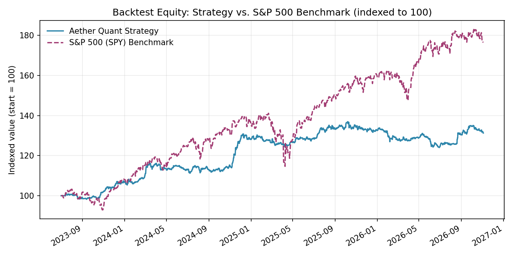
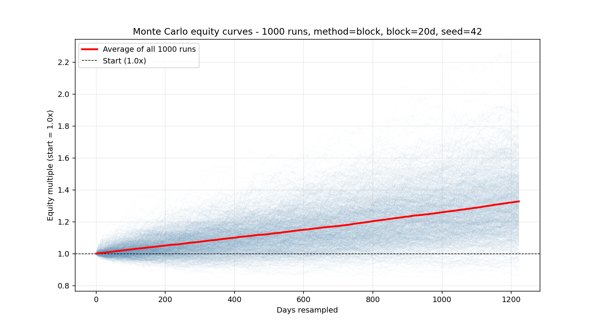

<p align="center">
  
</p>

<h1 align="center">Aether Quant</h1>

<p align="center">
  <strong>A self-adapting algorithmic trading system on QuantConnect Lean and PyTorch, and an open toolkit for building, testing and proving your own algorithms.</strong>
</p>

<p align="center">
  
  <a href="LICENSE"></a>
  <a href="LICENSE"></a>
  
  
  
</p>

<p align="center">
  <a href="https://github.com/leon1706-lol/Aether-quant/actions/workflows/ci.yml"></a>
  <a href="https://github.com/leon1706-lol/Aether-quant/actions/workflows/codeql.yml"></a>
  <a href="https://leon1706-lol.github.io/Aether-quant/coverage/"></a>
  <a href="https://scorecard.dev/viewer/?uri=github.com/leon1706-lol/Aether-quant"></a>
  <a href="https://www.bestpractices.dev/projects/16720"></a>
  <a href="https://leon1706-lol.github.io/Aether-quant/"></a>
  
  
</p>

<p align="center">
  
  
  
  
  
  
  
  
</p>

Aether Quant is not a single static strategy. It's a **dynamic system**. At its core, an ensemble of neural models predicts, for every asset every day, a multi-horizon view of the market: **direction** at 1, 5 and 20 days, expected **return magnitude** and **volatility**, and each asset's **cross-sectional rank**. Predictions come from a **Mixture-of-Experts** ensemble (bullish/bearish/sideways/volatility specialists) routed by a learned gating network, plus a **causal-TCN sequence encoder**, all reading one feature pipeline that folds in a **market-regime detector**, a **3D market topology** layer and a **liquidity/market-impact engine**. A **unified multi-asset-class layer** routes equities, crypto, bonds, futures, options and forex through one portfolio, behind a kill switch, position reconciliation and a hash-chained audit log, while a **controlled retraining loop** and a **research cycle** let generations of models share capital and hand it over as evidence arrives. Everything is wired together and validated end to end inside QuantConnect's Lean engine. The thesis this project exists to test: **markets are non-stationary, so a trading model should be too.**

Proving that thesis is only half the purpose. Aether Quant is also meant to help build the next algorithm, whoever writes it. The [`aether_quant` library](#the-aether_quant-library) and the [`aq` CLI](#cli-reference) work on any signal, not just this project's, and offer the same tools it judges itself by: position sizing, book construction, order gates, a cost-aware simulator, pre-registered research with counted trials and once-only holdouts, overfitting tests, Lean-exact statistics, and generations that hand over gradually. The safety-critical functions behind them are proved in Lean 4 and tested against those proofs. Documentation, tutorials and the API reference: [https://leon1706-lol.github.io/Aether-quant/](https://leon1706-lol.github.io/Aether-quant/).

The book trading today is two parts, on paper only: a long-only crypto trend sleeve (70%) and a multi-asset model book (30%) over equities, bond ETFs, crypto and forex. It is labelled *reinstated, not verified*: no pre-registered test has found a verified edge for either, and the model book was installed by the owner's rule, inside a 10% volatility and 15% drawdown ceiling, not because it passed one.

<!-- AQ:STATUS_START -->
| Lean Sharpe | Net profit | Max drawdown | Sharpe without T-bill carry | Alpha t | Deflated Sharpe |
|---|---|---|---|---|---|
| 0.57 | 31.249% | 9.40% | 0.66 | -0.19 | 1.54% |

_Lean run `2026-11-16_16-25-28`, 2023-07-01 to 2026-11-02, computed 2026-11-20 11:27 UTC. Details: [Backtest Statistics](#backtest-statistics)._
<!-- AQ:STATUS_END -->

## Quickstart

```bash
pip install aether-quant        # numpy and pandas only: no torch, no Lean, no Docker
aq hello                        # downloads 11 coins (keyless), runs the shipped rule with costs, prints the report
aq models install example-crypto-mlp && aq models score example-crypto-mlp   # an example model from the release, scored with numpy
aq init my-signal && cd my-signal && aq pipeline run   # your own signal: data, evaluate, gate, report
```

Retraining the model stack fits a 4 GB machine: `aq cycle retrain --host local --procedure stack --memory-profile low` ([Train on a small machine](docs/getting-started/train-small-machine.md)).

`aq hello --offline` uses the sample shipped in the wheel. The [tutorials](notebooks/README.md) cover signal evaluation, book construction and overfitting tests, and each opens in Colab. The [docs](https://leon1706-lol.github.io/Aether-quant/) hold the guide and the API reference. The dashboard runs with demo data in one command: `docker run --rm -p 8080:8000 ghcr.io/leon1706-lol/aether-quant-dashboard:latest`.

## Known Limitations

- **No demonstrated edge.** The book is mostly crypto exposure, and almost all of its result came before mid-2025. The model book's 12 optimizers and 6 signal mixes (R-BOOK1, R-MIX1) all scored a negative Sharpe in 2021-04 to 2023-06 and none survived, and the model's rank IC is under 0.07 in every class. See [Alpha by Period](#alpha-by-period).
- **Nothing has survived selection.** None of the project's <!--fact:research.trials-->258<!--/fact--> pre-registered trials survived, so the holdouts stay unread. See [Research Record](#research-record).
- **Hindsight in the universe.** The 11 coins are today's survivors. The same rule scored Sharpe -0.06 on coins no rule had read (#301). EOS, which Coinbase delisted, left the book on 2026-11-07 (#311).
- **Paper only, and no broker yet.** Interactive Brokers cannot fill this sleeve, and the crypto venue (Coinbase assumed) needs an API key (#192). See RUNBOOK "When the keys arrive".
- **IB is unverified end to end.** Connection, live futures margin and all <!--fact:options.structures-->43<!--/fact--> option structures have only met Lean's samples, never a real Gateway. Futures and options stay data-empty until a key is connected (`aq ib status`).
- **Not ready for live capital, measured.** `aq live-readiness` scores 21 conditions and reads NOT READY: no 60-session forward record, no paper period, no broker. See [`docs/live/paper-to-live.md`](docs/live/paper-to-live.md).
- **Safety is field-tested without a broker only.** In Lean's paper brokerage on a fake feed, `main.py` passes the field test (#351, `scripts/lean_smoke/field_test.py`). Its orders fill, injected drift breaches reconciliation, and an injected shock trips the kill switch and flattens the book. It survives Redis and then Postgres being stopped, restarts cleanly, runs two accounts apart, and its audit chain verifies on a real Postgres. The kill switch, reconciliation and auto-rollback have still never run against a real broker over paper hours (#228, #338, #192).

## Table of Contents

- [Quickstart](#quickstart)
- [Known Limitations](#known-limitations)
- [The `aether_quant` Library](#the-aether_quant-library)
- [Download](#download)
- [Getting Started](#getting-started)
- [Requirements](#requirements)
- [Architecture](#architecture)
- [Universe Size](#universe-size)
- [Project Structure](#project-structure)
- [Documentation Site](#documentation-site)
- [Module Documentation](#module-documentation)
- [Development Documentation](#development-documentation)
- [Open Source Files](#open-source-files)
- [Backtest Statistics](#backtest-statistics)
  - [Overview](#overview)
  - [Benchmarks](#benchmarks)
  - [Alpha by Period](#alpha-by-period)
  - [General Characteristics](#general-characteristics)
  - [Performance](#performance)
  - [Runs and Drawdowns](#runs-and-drawdowns)
  - [Implementation Shortfall](#implementation-shortfall)
  - [Return/Risk Efficiency](#returnrisk-efficiency)
  - [Attribution](#attribution)
  - [Robustness](#robustness): [Monte Carlo](#monte-carlo-simulation)
  - [Research Record](#research-record)
  - [Disclaimer](#disclaimer)
  - Retired model book: [Classification Scores](development/research_results.md#direction-heads), [Walk-Forward](development/research_results.md#walk-forward), [Lean vs Offline Books](development/research_results.md#lean-vs-offline), [Offline Evaluation](development/research_results.md#offline-evaluation), [As-Live Book](development/research_results.md#as-live-book), [Benchmarks](development/research_results.md#benchmarks), [Cross-Checks](development/research_results.md#cross-checks), [Research and Audit](development/research_results.md#rule-chains)
- [Test Suite](#test-suite)
- [CLI Reference](#cli-reference)
  - [`aq hello`](#aq-hello)
  - [`aq models`](#aq-models)
  - [`aq init`](#aq-init)
  - [`aq pipeline`](#aq-pipeline)
  - [`aq train`](#aq-train)
  - [`aq test`](#aq-test)
  - [`aq backtest`](#aq-backtest)
  - [`aq profile`](#aq-profile)
  - [`aq report`](#aq-report)
  - [`aq cycle`](#aq-cycle)
  - [`aq api`](#aq-api)
  - [`aq webui`](#aq-webui)
  - [`aq docker`](#aq-docker)
  - [`aq config`](#aq-config)
  - [`aq lean`](#aq-lean)
  - [`aq docs`](#aq-docs)
  - [`aq verify`](#aq-verify)
  - [`aq retrain`](#aq-retrain)
  - [`aq paper-readiness`](#aq-paper-readiness)
  - [`aq trade-lock`](#aq-trade-lock)
  - [`aq kill-switch`](#aq-kill-switch)
  - [`aq clean`](#aq-clean)
  - [`aq evaluate`](#aq-evaluate)
  - [`aq research`](#aq-research)
  - [`aq prove`](#aq-prove)
  - [`aq fetch`](#aq-fetch)
  - [`aq backfill`](#aq-backfill)
  - [`aq ib`](#aq-ib)
  - [`aq assets`](#aq-assets)
  - [`aq render-lean-config`](#aq-render-lean-config)
  - [`aq secrets`](#aq-secrets)
  - [`aq accounts`](#aq-accounts)
  - [`aq live`](#aq-live)
  - [`aq users`](#aq-users)
  - [`aq live-readiness`](#aq-live-readiness)
  - [`aq secrets-check`](#aq-secrets-check)
  - [`aq audit-log`](#aq-audit-log)
  - [`aq status`](#aq-status)
- [Release Process](#release-process)
- [Roadmap](#roadmap)

---

## The `aether_quant` Library

One importable package over the same pure functions the live algorithm and the research chain call: <!--fact:library.names-->1041<!--/fact--> public names across <!--fact:library.modules-->33<!--/fact--> modules.

```powershell
pip install "aether-quant[research]"    # the library is Apache-2.0; scipy, scikit-learn and friends come with [research]
# from a clone: pip install -e .[research]
```

Score your own signal, build a constrained book, gate an order and test for overfitting:

<!-- Executed by tests/test_readme_library_example.py -->
```python
import numpy as np
import pandas as pd

from aether_quant import execution, portfolio, research, risk

# Your signal: one score per ticker per date, next to the realised rank it should predict
rng = np.random.default_rng(0)
rows = []
for date in pd.date_range("2024-01-01", periods=120, freq="B").strftime("%Y-%m-%d"):
    future = rng.normal(size=30)
    ranks = pd.Series(future).rank(pct=True).to_numpy()
    for i in range(30):
        rows.append({"date": date, "ticker": f"T{i}", "split": "validation", "my_score": 0.3 * future[i] + rng.normal(),
                     "target_rank_5d": ranks[i], "target_rank_20d": ranks[i]})
frame = pd.DataFrame(rows)

# 1. The report this project judges its own models by: rank IC, HAC t, bootstrap interval
report = research.evaluate_signal(frame, score_column="my_score", splits=("validation",), bootstrap_draws=200)
h20 = report["splits"]["validation"]["h20"]
print(f"IC {h20['mean_ic']:.3f}, HAC t {h20['hac_t']:.1f}")

# 2. A market-neutral book: per-name and sector caps, dollar neutrality, gross cap
weights, _ = portfolio.apply_book_neutrality(
    {"AAA": 0.20, "BBB": 0.10, "CCC": -0.15, "DDD": -0.05},
    sector_by_symbol={"AAA": "tech", "BBB": "tech", "CCC": "energy", "DDD": "tech"},
    dollar_neutral=True, sector_neutral=True, gross_exposure_cap=0.5, max_weight_per_name=0.12, sector_max_net_weight=0.15,
)

# 3. Sizing never flips a trade or exceeds its cap; a tripped risk lock stops the order
sized = risk.build_dynamic_position_sizing(-0.3, 0.9, 0.02, 0.10)
allowed, reason = execution.resolve_order_permission("paper", True, True, False)
print(round(sized.target_weight, 4), allowed, reason)

# 4. How likely is the best of your variants just the luckiest? (daily returns, one column per variant)
trial_returns = rng.normal(0, 0.01, size=(400, 8))
print("PBO:", research.probability_of_backtest_overfitting(trial_returns, blocks=8)["pbo"])
```

How it works:

- **A facade, not a copy.** Every name is re-exported from the module `main.py` and the offline tools already use, so a library result and a live decision come from the same code.
- **Light to import.** No torch, Lean, Redis, Postgres or web stack. Optional extras load only when called.
- **Modules map to jobs:**
  - `signals`, `sizing`, `neutrality`, `costs`, `backtest`, `overfitting`: the research toolkit by task, with Kelly, volatility targeting, beta and factor neutrality, composable cost models, `backtest()`, the minimum track record and the haircut Sharpe.
  - `samples`, `hello`: the bundled sample and `aq hello` as a call.
  - `risk`, `portfolio`, `execution`: sizing, kill switch, book construction, HRP, order gates, cost model, reconciliation.
  - `features`, `training`, `data`: indicators, cross-sectional ranks, purged folds, data parsers.
  - `evaluation`, `research`: simulators, Monte Carlo, Lean-exact statistics, deflated Sharpe, PBO, factor spanning, leakage audits.
  - `cycle`: pre-registered rounds, generation shares, decay detection, retraining preflight.
  - `audit`, `formal`, `io`: the hash chain, Lean 4 proof cases, finite-safe JSON.
- **Stable surface.** The public names are pinned in `tests/data/aether_quant_api.json`, so a change is always deliberate. Every export is fully annotated and documented: the [API reference](https://leon1706-lol.github.io/Aether-quant/reference/).

Runnable tours: [`examples/aether_quant_quickstart.py`](examples/aether_quant_quickstart.py), [`examples/aether_quant_cycle.py`](examples/aether_quant_cycle.py). Full module list: [`aether_quant/README.md`](aether_quant/README.md).

## Download

| | Command | What |
|---|---|---|
| Library + `aq` | `pip install aether-quant` | numpy and pandas only (about 145 MB in a fresh venv) |
| Research | `pip install "aether-quant[research]"` | adds scipy, scikit-learn, statsmodels, pyarrow, httpx |
| Notebooks | `pip install "aether-quant[notebooks]"` | adds matplotlib and the Jupyter kernel |
| Dashboard | `docker run --rm -p 8080:8000 ghcr.io/leon1706-lol/aether-quant-dashboard:latest` | the web UI with demo data, no database |
| Whole system | `pip install "aether-quant[full]"`, `docker pull ghcr.io/leon1706-lol/aether-quant:latest` | Lean CLI, torch, Redis, Postgres clients, the engine image |

The 40 GB Lean engine image is only for real Lean backtests and deployments, never for research.

## Getting Started

From a clone, with a virtual environment active:

```powershell
pip install -r requirements/requirements.txt
pip install -r requirements/requirements-dev.txt
pip install -e .                # registers the `aq` command
aq --help
aq test                         # the suite, without Redis, Postgres or IB
aq evaluate --lean-report       # refresh the statistics from a finished run
aq cycle status                 # what is due today
```

- **Dashboard:** `aq webui --docker` (the demo image, port 8080), or for development `aq api` (port 8001), then `npm install` in `webui/` and `aq webui` (port 3002).
- **Live operations:** secrets (`aq secrets`), accounts (`aq accounts`, `aq live`), users (`aq users`) and the scorecard (`aq live-readiness`). See [`RUNBOOK.md`](RUNBOOK.md) and [`docs/live/`](docs/live/paper-to-live.md).
- **Training:** `aq train`, `aq cycle retrain`. See [`RUNBOOK.md`](RUNBOOK.md).

## Requirements

- **Python <!--fact:python.ci-->3.11<!--/fact-->**, which CI runs. Package metadata says <!--fact:python.requires-->>=3.10<!--/fact-->, and a first-party check (`vermin -t=3.10-`) in CI keeps the sources importable on 3.10 (#326).
- **For backtests:** Docker and the Lean CLI (`pip install lean`). The first run pulls the pinned engine image, <!--fact:lean.engine-->quantconnect/lean:17900<!--/fact-->, about 40 GB.
- **For the infrastructure:** Docker Compose (Redis, Postgres, workers). Everything degrades gracefully without it.
- **For the dashboard:** Node.js.
- **For retraining:** 4 GB of RAM with `--memory-profile low` (14 GB for the standard profile), or the training Codespace through the GitHub CLI (`gh`).

Dependency sets are listed in [`requirements/README.md`](requirements/README.md).

## Architecture

Every decision runs daily inside Lean's `on_data()`. A config flag picks what drives the book:

- **Target weights (shipped):** `phase_v2.target_weights` reads `ml/target_weights.csv`, the blend of the crypto sleeve and the model book, and an offline twin tracks it at a daily correlation above 0.99 (0.99999 on the pinned run).
- **Model book:** the installed models score all 103 assets and `portfolio/book_optimizer.py` sizes the book (inverse-volatility ranks, every 20 sessions, forex at a 6% name cap behind a loss guard). The offline engine decides its rows (`scripts/model_book_decide.py`). With `phase_v2.target_weights.source` set to `"model_book"`, `main.py` computes the same row inside Lean (default off).
- **Legacy gated book (selectable):** the ensemble's rank heads drive a dollar- and sector-neutral long/short book with `target_weights.enabled: false`. It has failed the pre-registered bar every time.


```mermaid
flowchart LR
    D["Lean data<br/>equities, bonds, crypto, forex"] --> F["Feature pipeline<br/>regime, liquidity, topology, macro"]
    F --> M["Models<br/>4 experts + gating,<br/>multitask, sequence"]
    M -. "model book" .-> B["Book construction<br/>neutrality, sizing, costs"]
    W["Target weights<br/>rule or blended generations"] -- "shipped" --> B
    B --> G["Safety gates<br/>kill switch, order gate,<br/>reconciliation"]
    G --> L["Lean orders"]
    L --> R["Redis, then PostgreSQL<br/>experience and audit log"]
    R --> T["Performance triggers"]
    T --> C["Controlled retraining<br/>validate, promote, roll back"]
    C --> M
    Q["Research cycle<br/>rounds, generations, decay"] --> W
    C --> Q
```

**Models** (one shared feature code path for training and runtime)

- **Baseline + 4 experts:** bullish, bearish, sideways and volatility specialists, routed by a learned gating network.
- **Multitask:** a shared trunk with direction, magnitude, volatility and rank heads, including residualised ranks that measure skill rather than beta.
- **Sequence:** a causal-TCN over a 30-bar window.
- **Ranking objective:** trained directly on soft-Spearman or ListNet over whole dates.

**Risk and execution**

- **Sizing:** bounded and direction-preserving, scaled down when expected edge does not clear round-trip cost.
- **Controls:** an automated kill switch, reconciliation against broker holdings, a drawdown lock and an opt-in auto-rollback.
- **Asset classes:** one router for equities, crypto, bonds, forex, futures and options.

**Live operations** (off until configured; [`docs/live/`](docs/live/paper-to-live.md))

- **Secrets:** each credential comes from a file, a Docker secret, the environment or the OS keyring, and never shows itself.
- **Accounts:** one Lean deployment each, with overrides that can only tighten the config (proved in Lean 4); the default account is the single-account system.
- **Users:** viewer, operator and admin tokens for the API and dashboard; locks are audited.
- **Readiness:** `aq live-readiness` measures every paper-to-live condition, and the broker-free field test exercises the safety paths in Lean.

**Research cycle** (`aq cycle`)

- **Rounds:** rules are hashed before any score, trials go in a ledger, and a holdout read happens once.
- **Generations:** up to four share a book, each one's share computed from its record and moving smoothly.
- **Admission:** a candidate must earn its share (R-ADMIT1); real money is always the owner's manual action.
- **Off by default:** `ml/generations/policy.json` has `enabled: false`, and nothing in Lean reads it.

**Stack:** Lean CLI, Docker Compose, Redis, PostgreSQL, PyTorch, NumPy/pandas, FastAPI, React/Vite, Telegram alerts, GitHub Actions, Codespaces. Full contracts: [`development/architecture.md`](development/architecture.md).

## Universe Size

<!--fact:universe.total-->103<!--/fact--> assets in `config.json`: <!--fact:universe.equity-->55<!--/fact--> equities and broad ETFs, <!--fact:universe.bond-->22<!--/fact--> bond ETFs, <!--fact:universe.crypto-->11<!--/fact--> crypto pairs, <!--fact:universe.forex-->15<!--/fact--> forex pairs. The shipped book trades the crypto pairs; the rest feed the models.

| Split | Dates |
|---|---|
| Training | <!--fact:windows.training-->2014-12-01 to 2021-12-31<!--/fact--> |
| Validation | <!--fact:windows.validation-->2022-01-01 to 2023-06-30<!--/fact--> |
| Backtest | <!--fact:windows.backtest-->2023-07-01 to 2025-06-30<!--/fact--> |
| Holdout | <!--fact:windows.holdout-->2025-07-01 to 2026-11-02<!--/fact--> |

Tickers and roles: [`development/asset_universe.md`](development/asset_universe.md).

## Project Structure

Single-responsibility Python packages, each with its own README, a few top-level entry points (`main.py` for the Lean algorithm, `train*.py` for the trainers, `aq_cli.py` for the CLI) and the runtime config (`config.json`, `lean.json`). The annotated tree is in [`development/project_structure.md`](development/project_structure.md).

## Documentation Site

The guide, the live-operations pages and the API reference are published at [https://leon1706-lol.github.io/Aether-quant/](https://leon1706-lol.github.io/Aether-quant/) after each green CI on `main`, together with the coverage reports. Preview it with `mkdocs serve`; see [`docs/`](docs/index.md). The table below is generated from `mkdocs.yml` by `aq docs sync`.

<!-- AQ:DOCS_SITE_START -->
| Section | Pages |
|---|---|
| Home | [Home](docs/index.md) |
| Getting started | [Install](docs/getting-started/install.md) · [Hello world](docs/getting-started/hello-world.md) · [The dashboard](docs/getting-started/dashboard.md) · [Train on a small machine](docs/getting-started/train-small-machine.md) |
| Tutorials | [Hello world](notebooks/00_hello_world.ipynb) · [Signal evaluation](notebooks/01_signal_evaluation.ipynb) · [Book construction](notebooks/02_book_construction.ipynb) · [Overfitting tests](notebooks/03_overfitting_tests.ipynb) · [Models](notebooks/04_models.ipynb) |
| Guide | [Signals](docs/guide/signals.md) · [Sizing](docs/guide/sizing.md) · [Neutrality](docs/guide/neutrality.md) · [Costs](docs/guide/costs.md) · [Backtesting](docs/guide/backtesting.md) · [Overfitting](docs/guide/overfitting.md) · [Research cycle](docs/guide/research-cycle.md) · [Models](docs/guide/models.md) · [Your own pipeline](docs/guide/your-own-pipeline.md) · [Safety](docs/guide/safety.md) |
| Live trading | [Paper to live](docs/live/paper-to-live.md) · [Secrets](docs/live/secrets.md) · [Accounts](docs/live/accounts.md) · [Users](docs/live/users.md) · [Field test](docs/live/field-test.md) |
| API reference | [Overview](docs/reference/index.md), one page per facade (33), generated by `scripts/build_docs.py` |
| About | [License](docs/about/license.md) · [Security](docs/about/security.md) · [Changelog](docs/about/changelog.md) |
<!-- AQ:DOCS_SITE_END -->

## Module Documentation

| Area | Module | What it owns |
|---|---|---|
| Library | [`aether_quant/`](aether_quant/README.md) | The importable facade over every subsystem |
| Library | [`formal/`](formal/README.md) | Lean 4 proofs of the safety-critical functions (`aq prove`) |
| Library | [`notebooks/`](notebooks/README.md) · [`docs/`](docs/index.md) | Colab tutorials, built from percent-format sources · the MkDocs site sources |
| Trading | [`risk/`](risk/README.md) | Position sizing, leverage, kill switch, asset-class routing |
| Trading | [`portfolio/`](portfolio/README.md) | Book construction, HRP, sleeves, target weights, options |
| Trading | [`execution/`](execution/README.md) | Order gate, cost model, reconciliation, paper readiness |
| Trading | [`analyzer/`](analyzer/README.md) | The final per-asset action layer |
| Models | [`features/`](features/README.md) | Feature functions shared by training and runtime |
| Models | [`inference/`](inference/README.md) · [`cpp_inference_ext/`](cpp_inference_ext/README.md) | The numpy forward pass · its optional C++ accelerator |
| Models | [`moe/`](moe/README.md) · [`experts/`](experts/README.md) | The gating network · the four expert models |
| Models | [`regime/`](regime/README.md) · [`topology/`](topology/README.md) · [`liquidity/`](liquidity/README.md) | Regime detection · market topology · market impact |
| Models | [`ml/`](ml/README.md) | Weights, datasets, candidates, generations |
| Research | [`evaluation/`](evaluation/README.md) | Simulators, audits, statistics, the research cycle |
| Research | [`retraining/`](retraining/README.md) · [`performance/`](performance/README.md) | Controlled retraining and rollback · performance triggers |
| Research | [`backtests/`](backtests/README.md) | Lean run output (gitignored) |
| Data | [`data/`](data/README.md) · [`data_pipeline/`](data_pipeline/README.md) | The Lean data layout · backfills and bar synthesis |
| Ops | [`experience/`](experience/README.md) · [`audit/`](audit/README.md) | Redis-to-Postgres decision history · the hash-chained audit log |
| Ops | [`monitoring/`](monitoring/README.md) · [`webui/`](webui/README.md) · [`visualization/`](visualization/README.md) | FastAPI · the React dashboard · runtime state exports |
| Ops | [`notifications/`](notifications/README.md) · [`storage/`](storage/README.md) | Telegram alerts · reserved for future persistent artifacts |
| Tooling | [`tests/`](tests/README.md) · [`scripts/`](scripts/README.md) · [`requirements/`](requirements/README.md) | The suite · dev and research scripts · dependency sets |
| Tooling | [`.devcontainer/`](.devcontainer/README.md) · [`.githooks/`](.githooks/README.md) | The training and Lean Codespace definitions · the opt-in git hooks |

## Development Documentation

| Document | Contents |
|---|---|
| [`development/README.md`](development/README.md) | What each development document is for |
| [`development/architecture.md`](development/architecture.md) | Subsystem contracts and the offline/live parity contract |
| [`development/infrastructure.md`](development/infrastructure.md) | Docker, ports, Codespaces, database inspection |
| [`development/verification.md`](development/verification.md) | Every way the project is verified, and when each is required (`aq verify`) |
| [`development/research_results.md`](development/research_results.md) | Generated results of the retired model book and past rule chains |
| [`development/project_structure.md`](development/project_structure.md) | The directory tree |
| [`development/asset_universe.md`](development/asset_universe.md) | The tickers |
| [`development/Changelog.md`](development/Changelog.md) | Build history |
| [`development/Problems.md`](development/Problems.md) | Bug log |
| [`development/backups/`](development/backups/README.md) | Full text from before each condensing pass |

## Open Source Files

| File | Purpose |
|---|---|
| [`LICENSE`](LICENSE) | The GNU AGPL-3.0, the license of the trading system. [`LICENSING.md`](LICENSING.md) maps the two licenses: the library (what the wheel and dashboard ship, the UI, notebooks, docs, proofs) is Apache-2.0 with [`NOTICE`](NOTICE), and [`REUSE.toml`](REUSE.toml) maps every path |
| [`CONTRIBUTING.md`](CONTRIBUTING.md) | Setup and conventions for people |
| [`AGENTS.md`](AGENTS.md) | Setup and conventions for AI agents |
| [`RUNBOOK.md`](RUNBOOK.md) | Everyday commands, incidents, the research cycle, what to do when keys arrive |
| [`REPRODUCIBILITY.md`](REPRODUCIBILITY.md) | How to reproduce every published number |
| [`SECURITY.md`](SECURITY.md) | Reporting a vulnerability |
| [`CODE_OF_CONDUCT.md`](CODE_OF_CONDUCT.md) | Community conduct |
| [`todo.md`](todo.md) | The owner's current objectives |

## Backtest Statistics

The shipped book's numbers from the real Lean engine. Every table is generated, never hand-edited: `aq backtest` or `aq evaluate --lean-report --backtest-dir backtests/<run>` refreshes them.

- **Portfolio** is the whole Lean run. **Strategy** is that run without its T-bill sweep, because idle-cash carry is not alpha.
- The current code reproduces the pinned run order for order. No newer run is needed until the book changes.
- Results of the retired model book live in [`development/research_results.md`](development/research_results.md).

### Overview

<!-- AQ:BACKTEST_START -->


| Metric | Value |
|---|---|
| Backtest window | 2023-07-01 to 2026-11-02 |
| Sharpe Ratio | 0.571 |
| Net Profit | 31.249% |
| Compounding Annual Return | 8.462% |
| Drawdown | 9.400% |
| Total Orders | 1445 |
| Win Rate | 51% |
| Last updated | 2026-11-17 10:09 UTC (auto-generated by `aq backtest`) |
<!-- AQ:BACKTEST_END -->

### Benchmarks

<!-- AQ:BTSTATS_BENCHMARKS_START -->
| Series | Total return | Annual return | Volatility | Sharpe | Max drawdown |
|---|---|---|---|---|---|
| **Portfolio** (with the T-bill sweep) | +31.65% | +8.62% | 7.29% | 1.17 | 9.40% |
| **Strategy** (without the sweep) | +16.29% | +4.64% | 7.30% | 0.66 | 11.43% |
| SPY | +76.55% | +18.64% | 14.91% | 1.22 | 18.76% |
| 60/40 SPY/AGG, rebalanced daily | +48.09% | +12.53% | 9.63% | 1.27 | 11.27% |
| Bitcoin, buy and hold | +157.01% | +32.83% | 46.20% | 0.84 | 53.06% |
| The book's 11 coins, equal weight | +156.78% | +32.79% | 65.28% | 0.76 | 57.09% |

_Run `2026-11-16_16-25-28` · computed 2026-11-20 11:27 UTC · same sessions to the last equity close, no risk-free rate_
<!-- AQ:BTSTATS_BENCHMARKS_END -->

### Alpha by Period

<!-- AQ:ALPHA_START -->
| Period | Dates | Sharpe | 95% interval | Alpha per year | Alpha t | Deflated Sharpe |
|---|---|---|---|---|---|---|
| Whole run | 2023-07-02 to 2026-11-04 | 0.66 | -0.54 to 1.86 | -0.45% | -0.19 | 1.54% |
| First half | 2023-07-02 to 2025-06-30 | 1.21 | -0.42 to 2.87 | -0.83% | -0.25 | 18.66% |
| Second half | 2025-07-01 to 2026-11-02 | -0.16 | -1.84 to 1.55 | +0.87% | 0.26 | 1.06% |
| Long run, same rule | 2019-01-02 to 2026-11-04 | 0.71 | -0.04 to 1.54 | -0.32% | -0.19 | 0.10% |

**Proof of alpha (R-ALPHA1): not demonstrated** (full-window alpha t < 2.0; deflated Sharpe < 0.95).

_With SPY and AGG read a session late, as the crypto series is, the full-window alpha t is -0.22 (#330). R-ALPHA1 reads the figure in the table._

_Run `2026-11-16_16-25-28` · computed 2026-11-20 11:27 UTC · alpha against SPY / AGG / BTCUSD with a Newey-West t · deflated over 258 ledger trials_
<!-- AQ:ALPHA_END -->

### General Characteristics

<!-- AQ:BTSTATS_GENERAL_START -->
| Metric | Portfolio | Strategy | Note |
|---|---|---|---|
| Time range | 2023-07-01 to 2026-11-02 |  |  |
| Years | 3.35 |  |  |
| Average AUM | $121,046 |  |  |
| Capacity (Lean estimate) | $520,000 |  | lowest-capacity asset AAA XHPVXIJUWS4L |
| Leverage, mean (gross exposure / NAV) | 1.05x | 0.18x |  |
| Leverage, max | 1.14x | 0.28x |  |
| Maximum dollar position | — | $6,804 | ETHUSD on 2026-08-21 |
| Ratio of longs (share of bets) | — | 64.60% |  |
| Longs : shorts (bets) | — | 188 : 103 |  |
| Frequency of bets (per year) | — | 86.9 |  |
| Average holding period (days, notional-weighted) | — | 52.1 |  |
| Annualized turnover (traded notional / AUM) | 2.90x | 2.39x |  |
| Correlation to underlying (SPY, daily) | 0.307 | 0.308 |  |
| Start equity | $100,000 |  |  |
| End equity | $131,249 |  |  |
| Total orders | 1,445 |  |  |
| Lean portfolio turnover (daily mean) | 0.810% |  |  |

_Run `2026-11-16_16-25-28` · computed 2026-11-20 11:27 UTC_
<!-- AQ:BTSTATS_GENERAL_END -->

### Performance

<!-- AQ:BTSTATS_PERFORMANCE_START -->
| Metric | Portfolio | Strategy |
|---|---|---|
| PnL | +$31,249 | +$16,451 |
| PnL from the T-bill sweep (carry) | +$14,798 |  |
| PnL from long positions (closed bets, net of fees) | — | +$18,122 |
| PnL from short positions (closed bets, net of fees) | — | -$1,336 |
| Annualized rate of return | +8.46% | +4.65% |
| Hit ratio (closed bets net of fees) | — | 44.16% |
| Average return from hits | — | +36.63% |
| Average return from misses | — | -16.15% |
| Time-weighted return (no external flows: the chained return) | +31.25% | +16.45% |
| Net profit (Lean) | 31.249% |  |
| Win rate / loss rate (Lean, all trades) | 51% / 49% |  |
| Average win / average loss (Lean) | 0.10% / -0.06% |  |
| Profit-loss ratio (Lean) | 1.72 |  |
| Expectancy (Lean) | 0.377 |  |
| Unrealized at the end (Lean) | +$11,548 |  |

_Run `2026-11-16_16-25-28` · computed 2026-11-20 11:27 UTC_
<!-- AQ:BTSTATS_PERFORMANCE_END -->

### Runs and Drawdowns

<!-- AQ:BTSTATS_RUNS_START -->
| Metric | Portfolio | Strategy |
|---|---|---|
| HHI of positive returns | 0.002 | 0.002 |
| HHI of negative returns | 0.002 | 0.002 |
| HHI of time between bets (bets per month) | — | 0.011 |
| 95-percentile drawdown | 4.72% | 6.58% |
| 95-percentile time under water (days) | 224.5 | 237.6 |
| Maximum drawdown | 9.40% | 12.55% |
| Longest time under water (days) | 393 | 393 |
| Drawdown episodes | 35 | 28 |
| Drawdown (Lean) | 9.400% |  |
| Drawdown recovery (Lean, days) | 241 |  |
| Maximum drawdown duration (Lean) | 209.04:00:00 |  |

_Run `2026-11-16_16-25-28` · computed 2026-11-20 11:27 UTC_
<!-- AQ:BTSTATS_RUNS_END -->

### Implementation Shortfall

<!-- AQ:BTSTATS_SHORTFALL_START -->
| Metric | Portfolio | Strategy |
|---|---|---|
| Traded notional | $1,174,824 | $968,550 |
| Broker fees | $6,912 | $6,826 |
| Broker fees per turnover (bps of traded notional) | 58.8 bps | 70.5 bps |
| Average slippage per turnover (bps vs the bar's open) | 7.5 bps | 8.9 bps |
| Dollar performance per turnover (bps) | 266.0 bps | 169.8 bps |
| Return on execution costs (net PnL / (fees + slippage)) | 4.01x | 2.14x |
| Total fees (Lean) | $6,912 |  |

_Run `2026-11-16_16-25-28` · computed 2026-11-20 11:27 UTC_
<!-- AQ:BTSTATS_SHORTFALL_END -->

### Return/Risk Efficiency

<!-- AQ:BTSTATS_EFFICIENCY_START -->
| Metric | Portfolio | Strategy | Note |
|---|---|---|---|
| Annualized Sharpe ratio (Lean: risk-free rate subtracted) | 0.571 |  |  |
| Annualized Sharpe ratio (no risk-free rate) | 1.182 | 0.659 |  |
| Information ratio vs SPY | -0.675 | -0.934 |  |
| Information ratio (Lean) | -0.773 |  |  |
| Probabilistic Sharpe ratio (P[true Sharpe > 0]) | 98.56% | 88.74% |  |
| Probabilistic Sharpe ratio (Lean, vs its benchmark) | 18.916% |  |  |
| Deflated Sharpe ratio | 23.21% | 4.53% | 215 registered trials, expected best Sharpe 1.58 |
| Sortino ratio (Lean) | 0.869 |  |  |
| Alpha / beta (Lean) | 0.018 / 0.15 |  |  |
| Annual standard deviation (Lean) | 0.071 |  |  |
| Annual variance (Lean) | 0.0050 |  |  |
| Tracking error (Lean) | 0.143 |  |  |
| Treynor ratio (Lean) | 0.272 |  |  |
| Sharpe, Lean formula (shipped rate file/365) | 0.571 |  |  |

_Run `2026-11-16_16-25-28` · computed 2026-11-20 11:27 UTC_
<!-- AQ:BTSTATS_EFFICIENCY_END -->

### Attribution

<!-- AQ:BTSTATS_ATTRIBUTION_START -->
| Class | Net PnL | Return on AUM (annual) | Volatility (annual) | Sharpe | Max drawdown (on AUM) | Risk share | Fees |
|---|---|---|---|---|---|---|---|
| bond | -$439 | -0.11% | 0.04% | -2.63 | 0.37% | 0.05% | $177 |
| cash_sweep | +$14,798 | +3.65% | 0.29% | 12.78 | 0.31% | 0.32% | $85 |
| crypto | +$17,415 | +4.30% | 7.09% | 0.69 | 12.84% | 99.28% | $6,510 |
| equity | -$475 | -0.12% | 0.16% | -0.70 | 0.51% | 0.36% | $139 |
| unattributed (Lean minus rebuilt) | -$49 | | | | | | |

_Run `2026-11-16_16-25-28` · computed 2026-11-20 11:27 UTC_
<!-- AQ:BTSTATS_ATTRIBUTION_END -->

### Robustness

#### Monte Carlo Simulation

<!-- AQ:MONTECARLO_START -->


| Metric | p5 | p50 | p95 |
|---|---|---|---|
| Final return | 2.708382% | 30.373177% | 70.664238% |
| Annualized Sharpe | 0.150314 | 1.160635 | 2.213691 |
| Max drawdown | 5.060089% | 8.029595% | 13.509692% |
| P(negative total return): **0.034** |||

_1000 block-bootstrapped histories (block 20 days, seed 42) of Lean run `2026-11-16_16-25-28`'s 1222 daily returns, 2023-07-01 to 2026-11-02. The run itself returned 31.25%; computed 2026-11-20 11:26 UTC (rendered 2026-11-20 15:21 UTC)._
<!-- AQ:MONTECARLO_END -->

<details>
<summary><strong>Full distribution</strong></summary>

<!-- AQ:MONTECARLO_FULL_STATS_START -->
Deeper distribution statistics across all Monte Carlo runs:

**Final total return (%)**

| p5 | p25 | p50 | p75 | p95 |
|---|---|---|---|---|
| 2.708382 | 18.329887 | 30.373177 | 44.287211 | 70.664238 |

**Annualized Sharpe**

| p5 | p25 | p50 | p75 | p95 |
|---|---|---|---|---|
| 0.150314 | 0.754331 | 1.160635 | 1.567745 | 2.213691 |

**Max drawdown (%)**

| p5 | p25 | p50 | p75 | p95 |
|---|---|---|---|---|
| 5.060089 | 6.500643 | 8.029595 | 10.084157 | 13.509692 |

- Best run total return: **123.2148%**
- Worst run total return: **-13.4437%**
- Probability of a negative total return: **0.034**
- Config: n_runs=1000, method=`block`, block_size=20d, seed=42 (pinned - the section only changes when underlying results change)

The red line in the chart above is the element-wise AVERAGE of all run equity curves; faint blue lines are the individual bootstrap histories.
<!-- AQ:MONTECARLO_FULL_STATS_END -->

</details>

### Research Record

Each search used rules written before any score. Details are in [`development/Problems.md`](development/Problems.md).

| Search | Trials | Survivors | Nearest result | Entry |
|---|---|---|---|---|
| Candidate pool, strict bar | 38 selection trials | 0; overfitting probability 0.53 ended verification | The installed sleeve, Lean Sharpe 0.63, by fallback rule R-LEAN19 | #279 |
| Round 1: fundamentals, insiders, short volume, funding, point-in-time retrain, wide crypto | 28 | 0 | The sleeve itself scored -0.06 on unread coins | #300, #301 |
| Round 2 | 8 | 0 | Sharpe 0.57 | #310 |
| Round 3: pooled books, composites, published signs, quarterly accruals | 10 | 0 | Sharpe 0.58, second half 0.29 | #315 |
| Round 4C: crypto risk, liquidity and trend filters, a boosted model | 14 | 0; overfitting probability 0.58 | Idiosyncratic volatility, Sharpe 0.62 (halves 0.39, 0.69) | #336 |
| Round 4E: EDGAR filings, seasonality, insiders, cash profitability, ETF trend, macro timing | 9, two voided by a runner defect | 0 | Cash profitability, Sharpe 0.39 | #336 |
| Round 4F: the two voided trials again | 2 | 0 | SPY on term and credit, Sharpe 0.75 on one name, failed the placebo | #336 |
| R-LOSS1: five training losses against the control, on the retrained stack | 6 | 0 | `ic_pearson`, mean class IC 0.035 against the control's 0.048 | #407 |
| R-BOOK2: the model book rebuilt on the strongest score (`ml_a2`), for the 70/30 flip | 9 | 0; overfitting probability 0.79 | Pooled ranks of `ml_a2`, Sharpe 0.74, second half 0.33 | #409 |

### Disclaimer

- **Only the Lean backtest counts as ground truth.** Offline numbers are estimates.
- **Capacity is theoretical.** It is a participation cap on historical volume, never tested against real fills at size.
- **A backtest is not a forecast.** The record since the data freeze is the real test: `aq cycle status`, [`forward/` on the `forward-ledger` branch](https://github.com/leon1706-lol/Aether-quant/tree/forward-ledger/forward).

## Test Suite

One test file per source module; the badge above counts them on CI's last green run of `main`. `aq test` runs them, and `aq test --coverage` measures every tracked module on a small PC. Conventions: [`tests/README.md`](tests/README.md).

## CLI Reference

`aq --help` lists <!--fact:aq.commands-->38<!--/fact--> commands, and `aq <command> --help` gives every flag. Dry run is the default wherever a command writes data or config.

#### `aq hello`
```text
aq hello [--offline] [--start YYYY-MM-DD] [--end YYYY-MM-DD] [--json FILE] [--html FILE] [--no-cache]
```
Start here: one command, no key, no Docker. It downloads daily bars for the shipped book's 11 coins from Coinbase's public candles, runs the shipped rule through a cost-aware backtest, and prints a report with BTC and equal-weight benchmarks and the overfitting checks (PSR, PBO, deflated and haircut Sharpe, minimum track record).

- **`--offline`:** the sample bundled in the wheel (<!--fact:sample.months-->2021-06 to 2026-10<!--/fact-->). Any failed download falls back to it too, with a notice.
- **`--json`, `--html`:** also write the report, or a self-contained page with the equity curve.
- **`--no-cache`:** download again instead of reading `~/.cache/aether-quant/candles`.
- **From Python:** `aether_quant.hello.run(offline=True)`.

#### `aq models`
```text
aq models list | install NAME [--version V] [--from ZIP] | info NAME | score NAME [--csv CLOSES] [--head rank_20d] [--out FILE]
```
Example models published with each GitHub release: small networks trained on the bundled sample only, installed into `~/.cache/aether-quant/models` after their sha256 is checked against the release manifest, and scored with the numpy forward pass (no torch). The project's own trading models are not published. `score` also takes any folder holding an exported model, such as your own retrain's `ml/versions/<id>/`. From Python: `aether_quant.models`.

#### `aq init`
```text
aq init DIRECTORY [--name NAME]
```
A new signal project: `my_signal.py` (your `score(closes)`), its tests (shape and no look-ahead), `pipeline.toml` with a gate you set before the first run, and a GitHub workflow that runs both on free runners every week. Refuses a folder that is not empty.

#### `aq pipeline`
```text
aq pipeline run [--config pipeline.toml] [--run-id ID | --resume] [--runs-dir runs]
aq pipeline status [--run-id ID]
```
Data, signal, an optional small model, evaluate (IC by horizon, half-life, the spread after costs), gate and report, each stage resumable, into `runs/<id>/`. `--resume` continues the newest stopped run with the pipeline file it started with. Without a file it runs the bundled sample with 20-session momentum. Exit 3 means a signal failed its gate.

#### `aq train`
```text
aq train [--dataset-only|--init-only|--experts-only|--candidate|--gating-only|--multitask-only|--sequence-only|--topology-only|--strategy-selector-only|--rl-sizing-only]
aq train --walk-forward [--step-days N] [--mode rolling|expanding] [--include-multitask] [--include-sequence] [--metrics M] [--resume-run-id ID]
aq train [--seed N] [--ranking-objective mse|soft_spearman|listnet|ic_pearson|ls_sharpe|class_balanced|cost_aware] [--memory-profile standard|low]
aq train --resume [RUN_ID]
aq train --list-runs
```
Builds the dataset and trains the models into `ml/`.

- **No flag:** trains everything.
- **`--*-only`:** one piece. `--topology-only` and `--strategy-selector-only` need outcome events in Postgres and skip cleanly without them. The four newer ranking objectives read each row's class and returns, so they need `--sequence-only`.
- **`--candidate`:** the baseline and experts into `ml/versions/candidate-<uuid>/`, never touching the active models.
- **`--walk-forward`:** one diagnostic run per window, never touches the active models.
- **`--memory-profile low`:** trains on a 4 GB machine, slower; every trainer the run calls gets it.
- **`--resume [RUN_ID]`:** every mode but `--init-only` records a folder `ml/cycle/train_<id>/` when it starts (its settings, its version ids, the walk-forward's id, its finished steps). `--resume` continues the newest stopped run, or `RUN_ID`, with those settings. Finished steps are skipped, a walk-forward continues at its next window, a window reuses its dataset and baseline when they were written completely, and the sequence trainer continues from its last epoch. `--list-runs` lists the `aq train` and `aq cycle retrain` runs with their finished steps.

#### `aq test`
```text
aq test [--ruff] [--parallel] [--lean|--full] [--coverage [--changed]]
aq test [--cli] [--risk] [--portfolio] [--features] [--data-pipeline] [--webui] [--ml] [--retraining] [--notifications] [--storage] [--live] [--audit] [--evaluation] [--formal] [--meta] [--scripts]
```
Runs pytest, then syncs the doc facts on a full run. The test badge is CI's.

- **`--ruff`:** lint first and fail fast.
- **`--coverage`:** each group in turn under coverage, then the combined report; every tracked module must reach 100%.
- **`--coverage --changed`:** the fast gate before a commit (the pre-commit hook runs it). It runs the tests that name each module changed since HEAD, new files included, and fails on any uncovered line in those modules; a fresh full `coverage-report/coverage.json` that already shows them covered passes at once.
- **`--parallel`:** xdist. Don't use it on a low-memory machine, because each worker imports torch.
- **`--lean`, `--full`:** add the real Lean integration test, over an hour.
- **Subsystem flags:** run only those test files; they combine.

#### `aq backtest`
```text
aq backtest [--image IMAGE]
```
Runs `lean backtest .` and refreshes [Backtest Statistics](#backtest-statistics). Needs Docker.

- **`--image`:** use another engine image instead of the pinned local build.

#### `aq profile`
```text
aq profile [--iterations N] [--sort cumulative] [--batched] [--symbols-per-bar N] [--parallel] [--pool-workers N] [--no-gc] [--bucket-report]
aq profile [--regime] [--topology] [--topology-cached] [--learned-topology] [--liquidity] [--gating] [--analyzer] [--indicators] [--options]
```
Profiles the per-bar hot path without a backtest: a `pstats` breakdown plus p50/p95/p99 latency.

- **No subsystem flag:** the inference path. `--batched` profiles the production path, `--parallel` benchmarks a process pool.
- **Subsystem flags:** those pure functions; they combine.

#### `aq report`
```text
aq report <backtest-folder> <result-id>
```
Writes Lean's own HTML report to `backtests/<backtest-folder>/report.html`.

#### `aq cycle`
```text
aq cycle status [--ledger-file F]
aq cycle research {rules|score|placebo|gate|pbo|freeze|hold|report} --round R [--draft D] [--only T...] [--draws N] [--force] [--trial T] [--digest H]
aq cycle daily [--ledger-file F] [--dry-run]
aq cycle decide --generation G --weights W --ledger-file F --session D
aq cycle retrain --host {local,codespace} [--procedure P] [--memory-profile {standard,low}] [--min-ram-gb GB] [--score-end D] [--smoke] [--dry-run] [--if-due] [--estimate]
aq cycle retrain --resume [RUN_ID]
aq cycle retrain --list-runs
aq cycle promote --generation G --to {shadow,ramping,active,fading,winding_down,retired,rejected} [--ledger-file F]
aq cycle schedule {show|install} [--platform {windows,linux}] [--host {local,codespace}] [--dry-run]
```
The research cycle: rounds, generations, decay and retraining.

- **`status`:** what is due today.
- **`retrain --host local`:** needs 14 GB of RAM, or 3.5 GB with `--memory-profile low` (the same models, slower); `--estimate` prints each profile's peak for your dataset, `--min-ram-gb` overrides a profile's minimum, and `--smoke` proves the plumbing anywhere.
- **`retrain --resume [RUN_ID]`:** continues a stopped retrain (the newest unfinished one, or `RUN_ID`) with its own settings. Its folder `ml/cycle/retrain_<id>/` holds `resume.json`, `state.json` and `walk_forward_run_id`: finished stages and walk-forward windows are skipped, a window's finished trainers are reused, and the sequence trainer continues from its last epoch. A Codespace run and its retries resume the same way on that machine. `k06` and `k07` keep each test year's scores in `years/`, so they continue at their next year. `--list-runs` lists every run with its finished stages.
- **`promote`:** follows R-ADMIT1 and never touches a broker setting.

#### `aq api`
```text
aq api
```
Starts the FastAPI monitoring server on port 8001.

#### `aq webui`
```text
aq webui
aq webui --docker [--build] [--image IMAGE] [--port 8080] [--data DIR]
```
Starts the dashboard dev server (port 3002, with `aq api` on 8001).

- **`--docker`:** runs the dashboard image instead: FastAPI, the built web UI and demo data from `aq hello`, no database and no engine. It is the published `aether-quant-dashboard` image, the one-line Docker command in [Getting Started](#getting-started).
- **`--build`:** builds the image from this checkout first (the Dockerfile's `dashboard` stage).
- **`--data`:** serves a real tree (its `visualization/` and `ml/`) read-only instead of the demo.

#### `aq docker`
```text
aq docker up [--lean|--all]
aq docker build
```
`up` starts Redis and PostgreSQL by default. `build` rebuilds the app image.

#### `aq config`
```text
aq config [get <key>|set <key> <value>|keys [<prefix>]]
aq config preset --list|--show <name>|--apply <name> [--dry-run]
```
Reads and edits `config.json` by dotted key. `set` parses JSON values and keeps a backup; `preset` applies a named bundle after validating every key.

#### `aq lean`
```text
aq lean [get <key>|set <key> <value>|keys [<prefix>]]
```
The same tool for `lean.json`.

#### `aq docs`
```text
aq docs sync [--check]
```
Refreshes every marked fact in the docs from its source (`docs_facts.py`), and the generated blocks it owns, such as the [Documentation Site](#documentation-site) table from `mkdocs.yml`. `--check` changes nothing and exits 1 on drift, which is how CI catches stale numbers.

#### `aq verify`
```text
aq verify [--list] [--quick] [--record FILE] [--write-doc]
```
Every way the project is verified, in one table ([`development/verification.md`](development/verification.md)): `--list` prints it, `--quick` runs what a 4 GB machine can (ruff, doc facts, the library gate, the sorry scan, secrets, the guard tests), `--record` also writes the results as JSON, and `--write-doc` regenerates the table in the doc.

#### `aq retrain`
```text
aq retrain <plan|train|train_topology|train_gating|train_multitask|train_sequence|train_strategy_selector|validate|backtest|commit|promote|rollback|auto-rollback|status> [...]
```
Runs one stage of the controlled retraining pipeline by hand.

- **`train`:** a candidate in isolation, never the active files.
- **`validate`, `backtest`:** candidate against active.
- **`promote`, `rollback --to-version-id <id>`:** switch the active model.
- **`auto-rollback --status`:** a read-only check of whether the active model would roll back.

#### `aq paper-readiness`
```text
aq paper-readiness
```
The check to run before switching to paper: broker config and observation-mode health.

#### `aq trade-lock`
```text
aq trade-lock --on|--off|--auto|--status [--account ID]
```
Overrides the sticky drawdown lock. `--off` deliberately clears it. `--account` writes a named account's override (`state/accounts/<id>/overrides.json`) instead of `config.json`.

#### `aq kill-switch`
```text
aq kill-switch --arm|--disarm|--auto|--status [--account ID]
aq kill-switch --history [--limit N]
```
Overrides the kill switch through the same file as the trade lock, so the two can't disagree. `--history` reads past trips from the audit log (needs `AETHER_POSTGRES_DSN`).

#### `aq clean`
```text
aq clean ml [--keep-versions N] [--keep-backups N] [--strip-walk-forward-datasets] [--apply] [--json]
```
Lists what can be removed from `ml/`. Active models are never listed, and nothing is deleted without `--apply`.

#### `aq evaluate`
```text
aq evaluate <flag> [--backtest-dir backtests/<run>] [--json] [--account ID]
```
Offline evaluation and audits. Every Lean-reading flag uses `--backtest-dir`, else the README pin, else the newest finished run. Each writes `ml/evaluation/<name>.json`. `--account` evaluates on one account's tightened limits, through the same `apply_risk_overrides` `main.py` runs.

**A finished Lean run**

| Flag | What it does |
|---|---|
| `--lean-report` | Runs every tool below that a run supports, then refreshes the README |
| `--backtest-stats` | The tables in [Backtest Statistics](#backtest-statistics) |
| `--alpha-proof [--data-dir DIR]` | Alpha, Sharpe interval and deflated Sharpe per period |
| `--lean-monte-carlo` | Block bootstrap of the run's daily returns |
| `--lean-stats [--interest-rate-file F] [--trading-days N]` | Lean's Sharpe, Sortino and PSR, replicated exactly |
| `--audit-backtest [--period START..END] [--book-run-index N] [--max-open-sessions N]` | Order-level audit; run it after every backtest |
| `--audit-fills` | Fills against the data's open: cost or price gap |
| `--attribute-lean [--book-history-file PATH]` | P&L per asset class and component |
| `--classification-parity` | Logged probabilities against the offline head |
| `--paper-check [--reference-dir R] [--start D] [--end D]` | A paper run against a reference run's bands |
| `--forward-ledger [--ledger-branch B] [--ledger-file F]` | Verifies the forward record's hash chain and judges each rule |

**The offline book** (the retired rank book)

| Flag | What it does |
|---|---|
| `--rank-book [--model M] [--head H] [--split S]` | Net and gross Sharpe, turnover, cost drag |
| `--as-live` | The same book through the live path's decision functions |
| `--all` | `--rank-book`, `--capacity`, `--stress`, `--calibrate-edge`, `--benchmarks`, `--monte-carlo`, `--classification` |
| `--capacity` · `--stress` | Participation-capped capacity · 1x, 2x, 3x costs |
| `--benchmarks` | Naive and public baselines on the same split |
| `--monte-carlo [--mc-runs N] [--mc-block-size B] [--mc-seed S] [--mc-method block\|iid]` | Bootstrap of the book's returns |
| `--classification` | Direction-head accuracy, F1, log-loss |
| `--ablation [--variants a,b,c]` | Each mechanism switched off in turn |
| `--factor-exposure` | Loadings on SPY and momentum, residual Sharpe |
| `--preset NAME` | A config preset in memory only |
| `--walk-forward-summary [--run-id ID]` | Print a finished walk-forward run |

**Research and audits**

| Flag | What it does |
|---|---|
| `--pbo [--trial-returns PATH]` | Probability of backtest overfitting |
| `--factor-spanning --signal CSV` | What a signal adds over plain factors |
| `--ic-by-class` · `--audit-gates` | Within- and between-class IC · the rolling-IC gate's vetoes |
| `--audit-leakage` · `--overfit-report` | Label and feature leakage · IC kept out of sample |
| `--audit-features [--permutation]` · `--audit-heads` | Feature quality · each head against its gate |
| `--audit-data [--data-root PATH]` | Every universe zip, plus a hash manifest |
| `--calibrate-sim-lean --calibration-file PATH` | Simulator-to-Lean gap, by mechanism |

**Calibration and replay** (print a value, write nothing to config)

| Flag | What it does |
|---|---|
| `--calibrate-edge` | `edge_bps_per_rank_unit` for the net-edge gate |
| `--calibrate-book-spread [--book-spread-percentile P]` | The minimum rank spread |
| `--calibrate-confidence-threshold [--confidence-threshold-percentile P]` | The minimum confidence |
| `--calibrate-rolling-ic-floor [--rolling-ic-floor-percentile P]` | The rolling-IC floor |
| `--calibrate-volatility-threshold [--volatility-threshold-percentile P]` | Per-class elevated volatility |
| `--replay-kill-switch` · `--replay-rolling-ic-gate` | Day-by-day offline replays |
| `--simulate-limit-fills [--limit-fill-offset-sweep 0.5,1.0,2.0]` | How often limit orders would fill |
| `--reconcile-book-history [--book-history-path P] [--replay-hysteresis] [--hysteresis-survives-veto] [--reconcile-run-index N \| --reconcile-all-runs]` | Lean's book against an offline re-derivation |
| `--reconcile-features --symbol TICKER` | One symbol's live features against the dataset |

Shared by the flags above: `--dataset PATH`, `--split S`, `--json`.

#### `aq research`
```text
aq research --signal CSV [--dataset PATH] [--horizons 5,20] [--out PATH]
```
Scores any `date,ticker,score` CSV: rank IC, t-stats, bootstrap interval, era stability and decay. The same report judges this project's models.

#### `aq prove`
```text
aq prove [--module NAME] [--regen-cases] [--check-sorry]
```
Builds the Lean 4 proofs in [`formal/`](formal/README.md) (needs elan and the Mathlib cache).

- **`--regen-cases`:** regenerate the differential cases; run it after any spec edit.
- **`--check-sorry`:** scan for unfinished proofs, no Lean install needed.

#### `aq fetch`
```text
aq fetch <crypto|stock> --ticker T --start D --end D [--apply]
aq fetch futures --ticker T --start D --end D --expiry D [--contract-month YYYYMM] [--family-ticker ROOT] [--apply]
aq fetch options --ticker T --start D --end D --expiry D --strike K --right <call|put> [--family-ticker ROOT] [--apply]
```
Backfills one new ticker and, with `--apply`, registers it in `config.json`. Crypto and stocks come from Yahoo Finance, futures and options from Interactive Brokers.

#### `aq backfill`
```text
aq backfill <dividends|fred|yfinance> [--apply] [--tickers T ...] [--series S ...] [--quotes]
```
Refreshes one data source across the whole universe: dividend schedules, FRED series, or thin Lean zips. `--quotes` derives a missing crypto quote zip. Never touches `config.json`.

#### `aq ib`
```text
aq ib status
```
Interactive Brokers readiness: disabled, missing credentials, or reachable. Credentials live in `lean.json` (`aq lean set ib-account <ACCOUNT>`).

#### `aq assets`
```text
aq assets status
```
Multi-asset readiness at a glance: IB, futures and options flags, margin specs, FRED coverage.

#### `aq render-lean-config`
```text
aq render-lean-config [--base lean.json] [--out lean.live.json] [--env-file .env.live] [--account ID]
```
Renders the gitignored `lean.live.json` for Lean's `--lean-config`. Values come from a `*_FILE` file, a Docker secret, the `AETHER_*` variables or the keyring. Coinbase's key pair renders too. Prints field names only, never secrets. `--account` reads `AETHER_<ID>_*` and writes `lean.live.<id>.json`.

#### `aq secrets`
```text
aq secrets status [--json FILE] [--account ID]
aq secrets set NAME [--account ID]
aq secrets delete NAME [--account ID]
```
Where each credential comes from: a `*_FILE` file, a Docker secret, an environment variable or the OS keyring. `status` shows names and sources, never a value. `set` stores one in the keyring, prompted and never echoed. See [`docs/live/secrets.md`](docs/live/secrets.md).

#### `aq accounts`
```text
aq accounts list|validate
aq accounts status [--json FILE]
```
The account registry (`accounts.json`; template `accounts.example.json`). Each account is one Lean deployment whose overrides may only tighten the config. `status` shows each account's secrets (resolved or not) and last state.

#### `aq live`
```text
aq live up|down [--account ID] [--dry-run]
```
Starts or stops one account's Lean live deployment from the compose `lean-live` service: its own container, `AQ_ACCOUNT`, its Lean environment and its rendered config. `--dry-run` prints the commands.

#### `aq users`
```text
aq users add NAME [--role viewer|operator|admin] [--accounts a,b]
aq users list
aq users remove NAME
```
Dashboard and API users. A token is printed once and stored as a salted hash. With any user, every `/api` route but `/api/health` needs a bearer token. An operator may lock an account and an admin may unlock it.

#### `aq live-readiness`
```text
aq live-readiness [--account ID] [--paper-check FILE] [--markdown] [--json FILE] [--no-write] [--docs]
```
The paper-to-live scorecard: every condition for live capital, measured, with unknown counting as fail. It writes `visualization/grafana/live_readiness.json` for the dashboard and exits 1 unless ready. `--docs` refreshes the table in [`docs/live/paper-to-live.md`](docs/live/paper-to-live.md).

#### `aq secrets-check`
```text
aq secrets-check
```
Exits non-zero if a secret is about to be committed. Backs `.githooks/pre-commit`.

#### `aq audit-log`
```text
aq audit-log [--event-type order_placement|credential_load|live_mode_transition] [--since YYYY-MM-DD] [--limit N] [--verify]
```
Queries the tamper-evident audit log (needs `AETHER_POSTGRES_DSN`). `--verify` walks the whole hash chain and reports the first broken link.

#### `aq status`
```text
aq status
```
Shows `git status`.

## Release Process

A release happens only on a pushed version tag:

```powershell
git tag vX.Y.Z
git push origin vX.Y.Z
```

The tag sets the version through `setuptools-scm`, then `.github/workflows/release.yml`:

- runs the test suite beside the release, for visibility only (a failure does not block it);
- publishes to PyPI through Trusted Publishing, with no stored token;
- pushes the engine and dashboard images to `ghcr.io/leon1706-lol/aether-quant` and `aether-quant-dashboard`, each with an SBOM and provenance;
- creates the GitHub release with the wheel, sdist and SBOM, a Sigstore signature per file and SLSA provenance, then refreshes the OpenSSF Scorecard.

A release published without those assets gets them from a dispatch of the same workflow with `backfill_tag` (RUNBOOK "Releases").

## Roadmap

History lives in [`development/Changelog.md`](development/Changelog.md); current objectives are in [`todo.md`](todo.md).

- **Interactive Brokers and a crypto venue:** verify end to end, then run the paper period (`aq evaluate --paper-check`).
- **Forward records:** judge the sleeve and any shadow generation at 60 and 252 sessions (`aq cycle status`).
- **A candidate that passes selection:** the unread holdouts back one frozen candidate, once.
- **Later, HFT:** tick data, short-horizon models and low-latency execution would be a second system alongside this one, not a change to it. See `development/architecture.md`.

---

<p align="center">
  Built by <strong>Leon Schwarzkopf</strong>, <a href="mailto:leonschwarzkopf08@gmail.com">leonschwarzkopf08@gmail.com</a>
</p>
