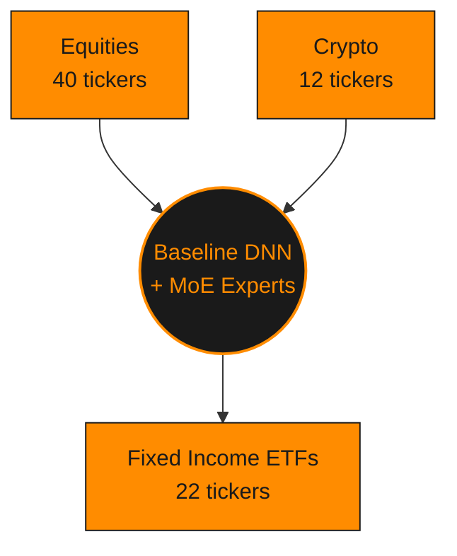

# Asset Universe

The trading universe currently spans **74 assets**: 40 stocks/broad-market
ETFs, 22 fixed-income (bond) ETFs, and 12 crypto pairs. It is defined in
`config.json`'s `phase1.universe.assets` and shared across training,
validation, and backtesting (`phase1.universe.common_window`: `2014-12-01`
to `2021-03-31`).

It was expanded from an original 30-asset universe (Phase 3 of the rank-pivot
roadmap, `Problems.md` #52) specifically to strengthen the cross-sectional
`rank_20d` signal, which scales with names-per-date, and deliberately
rebalanced toward bonds/crypto (54% equity / 30% bond / 12% crypto by count)
rather than staying equity-heavy.

The bond ETF sleeve (Phase 1 of the 5/10 to 9/10 roadmap, see
[`Changelog.md`](Changelog.md)) spans the duration curve
(short/intermediate/long/aggregate) and credit spectrum
(Treasury/investment-grade/high-yield/municipal/emerging-market/international)
so the yield-curve-slope and credit-spread macro proxies computed from it
(`features/macro_features.py`) are meaningful. Bond ETFs are registered with
`security_type: "equity"` (they trade through Lean's ordinary equity
subscription path, like every other ETF already in the universe, e.g.
SPY/QQQ/IWM/EEM, not a new Lean security type).

## Full ticker list

| Ticker | Type | Role |
|---|---|---|
| AAPL | Equity | Trading |
| SPY | Equity | Trading |
| QQQ | Equity | Trading |
| IWM | Equity | Trading |
| EEM | Equity | Trading |
| BAC | Equity | Trading |
| IBM | Equity | Trading |
| AIG | Equity | Trading |
| BNO | Equity | Trading |
| FB | Equity | Trading |
| GOOG | Equity | Trading |
| GOOGL | Equity | Trading |
| USO | Equity | Trading |
| WM | Equity | Trading |
| AAA | Equity | Observation-only (thin history) |
| MSFT | Equity | Trading |
| NVDA | Equity | Trading |
| AMZN | Equity | Trading |
| JPM | Equity | Trading |
| XOM | Equity | Trading |
| JNJ | Equity | Trading |
| PG | Equity | Trading |
| KO | Equity | Trading |
| DIS | Equity | Trading |
| HD | Equity | Trading |
| WMT | Equity | Trading |
| V | Equity | Trading |
| MA | Equity | Trading |
| UNH | Equity | Trading |
| CVX | Equity | Trading |
| PFE | Equity | Trading |
| VZ | Equity | Trading |
| CSCO | Equity | Trading |
| INTC | Equity | Trading |
| MCD | Equity | Trading |
| ABBV | Equity | Trading |
| CRM | Equity | Trading |
| COST | Equity | Trading |
| PEP | Equity | Trading |
| TMO | Equity | Trading |
| SHY | Equity (Fixed Income ETF) | Trading - short-duration Treasury (1-3y) |
| IEF | Equity (Fixed Income ETF) | Trading - intermediate-duration Treasury (7-10y) |
| TLT | Equity (Fixed Income ETF) | Trading - long-duration Treasury (20y+) |
| AGG | Equity (Fixed Income ETF) | Trading - broad aggregate bond benchmark |
| LQD | Equity (Fixed Income ETF) | Trading - investment-grade corporate |
| HYG | Equity (Fixed Income ETF) | Trading - high-yield corporate |
| TIP | Equity (Fixed Income ETF) | Trading - inflation-protected (TIPS) |
| MBB | Equity (Fixed Income ETF) | Trading - mortgage-backed |
| EMB | Equity (Fixed Income ETF) | Trading - emerging-market sovereign debt |
| MUB | Equity (Fixed Income ETF) | Trading - municipal |
| BND | Equity (Fixed Income ETF) | Trading - broad aggregate bond benchmark |
| GOVT | Equity (Fixed Income ETF) | Trading - broad Treasury benchmark |
| SHV | Equity (Fixed Income ETF) | Trading - ultra-short Treasury |
| IGIB | Equity (Fixed Income ETF) | Trading - intermediate investment-grade corporate |
| VCIT | Equity (Fixed Income ETF) | Trading - intermediate investment-grade corporate |
| VCSH | Equity (Fixed Income ETF) | Trading - short investment-grade corporate |
| BIV | Equity (Fixed Income ETF) | Trading - intermediate aggregate |
| BSV | Equity (Fixed Income ETF) | Trading - short aggregate |
| TLH | Equity (Fixed Income ETF) | Trading - long-duration Treasury (10-20y) |
| IGSB | Equity (Fixed Income ETF) | Trading - short investment-grade corporate |
| JNK | Equity (Fixed Income ETF) | Trading - high-yield corporate |
| BWX | Equity (Fixed Income ETF) | Trading - international Treasury |
| BTCUSD | Crypto | Trading |
| ETHUSD | Crypto | Observation-only (thin history) |
| LTCUSD | Crypto | Trading |
| XRPUSD | Crypto | Observation-only (thin history) |
| ADAUSD | Crypto | Observation-only (thin history) |
| BCHUSD | Crypto | Observation-only (thin history) |
| LINKUSD | Crypto | Observation-only (thin history) |
| DOGEUSD | Crypto | Observation-only (thin history) |
| XLMUSD | Crypto | Observation-only (thin history) |
| EOSUSD | Crypto | Observation-only (thin history) |
| ETCUSD | Crypto | Observation-only (thin history) |
| ZECUSD | Crypto | Observation-only (thin history) |

## Trading vs observation-only

"Observation-only" assets (Phase 9's `asset_quality` gate) are still fed
through the full model/expert/topology pipeline every bar and visible on the
dashboard, but are never sized into real positions: their real history is too
short relative to the training window to be trusted for trading decisions (see
[`Changelog.md`](Changelog.md) for the exact row-count thresholds). This is
re-evaluated automatically every time `train.py` rebuilds the dataset, so an
asset can move between these two roles as more history accumulates.

All 7 newly-added crypto pairs land observation-only today. Their Yahoo history
only starts 2017-11-09, giving them almost no rows inside the fixed 2014-2017
train-split window (the same reason ETHUSD/XRPUSD/ADAUSD are observation-only),
so tradeable crypto stays at 2 names (BTCUSD, LTCUSD). The new crypto tickers
add cross-sectional/observation diversity, not new tradeable positions, until
the training window itself moves forward. (Two of the original 7 picks,
BNBUSD/TRXUSD, were swapped for ETCUSD/ZECUSD after a real `aq backtest` run
found Coinbase never actually listed Binance Coin or TRON pairs. Lean's local
symbol-properties database confirmed it, so those two could never subscribe.
ETCUSD/ZECUSD are real Coinbase-listed pairs with the same 2017-11-09 Yahoo
history start as the rest of this batch.)

## Group-level view

Asset classes sit on opposite sides of the hub (equities/crypto feed in from
above, fixed income from below) rather than a single top row. Ticker detail is
in the table above; this is the group-level view:

