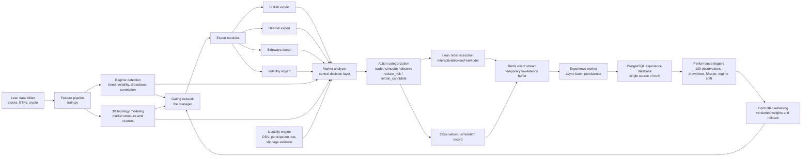

# Aether Quant V2 Architecture

Status: In development
Version: V2
Completed phases: V2-1 through V2-19.5
Focus: Adaptive MoE systems, Lean-data backtesting, observation-first deployment

## Objective

Aether Quant V2 builds on the existing Lean, PyTorch, dashboard and risk-control foundation. Training and backtesting continue to use the local Lean `data/` folder. Live and paper trading remain optional later stages; V2 first becomes stronger in offline training, backtesting, observation mode and controlled retraining.

## System Flow



## Runtime Decision Priority

The market analyzer enforces a strict priority ordering per asset per bar:

1. `reduce_risk` — portfolio-wide trade lock active
2. `reduce_risk` — risk-off regime + directional signal
3. `reduce_risk` — topology risk elevated + directional signal
4. `retrain_candidate` — baseline fallback + low regime confidence
5. `simulate` — liquidity blocked (zero volume or below DDV floor)
6. `simulate` — liquidity thin (participation rate above thin threshold)
7. `trade` — all guards passed, confidence above threshold, asset not isolated
8. `simulate` / `observe` — fallthrough

## Tech Stack

```mermaid
flowchart TB
    A["Infrastructure"] --> A1["Docker Compose<br/>(Redis, Postgres, aether-quant app)"]
    A --> A2["Lean CLI<br/>(backtest + paper trading)"]
    A --> A3["30-day observation phase before live mode"]
    B["Development"] --> B1["VS Code + Claude Code"]
    B --> B2["GitHub"]
    C["Data and storage"] --> C1["Lean data folder for training/backtesting"]
    C --> C2["Redis temporary event stream"]
    C --> C3["PostgreSQL permanent experience database"]
    D["AI and modeling"] --> D1["PyTorch"]
    D --> D2["scikit-learn"]
    D --> D3["NumPy / Pandas"]
    D --> D4["MoE experts and gating network"]
    E["Monitoring and UI"] --> E1["React/Vite webui — Tracing dashboard (port 3002 dev / 8001 Docker)"]
    E --> E2["FastAPI JSON API (port 8000)"]
    E --> E3["Telegram alerts (V2-19)<br/>notifications/telegram_worker.py"]
```



## Module Map

- `data_pipeline/`: V2 Lean-data manifest and stable dataset contract for downstream modules; since V2-19.5 also `yfinance_backfill.py`, a manual offline script that backfills thin series (never invoked from train.py/main.py/any worker).
- `moe/`: Gating network, expert routing and final MoE signal composition.
- `experts/`: Bullish, bearish, sideways and volatility expert model interfaces.
- `regime/`: Quantitative market-regime detection and later LLM regime-vector adapters.
- `topology/`: 3D market topology state, pairwise correlation, asset clustering and topology export.
- `analyzer/`: Central deterministic decision layer combining all module outputs into a single action per bar.
- `liquidity/`: Per-asset liquidity and market-impact engine — DDV proxy, participation rate, slippage estimate, spread proxy.
- `experience/`: Redis-buffered observation and trade events with PostgreSQL persistence.
- `retraining/`: Controlled retraining — planner, candidate training gate, validation/backtest gates, Aether-Vault commit, promotion and rollback.
- `risk/`: Dynamic position sizing, leverage limits, drawdown controls and exposure caps.
- `monitoring/`: FastAPI JSON API serving `visualization/state.json`, scene, topology and the historical `visualization/grafana/*` exports (equity curves, asset performance, observation/metrics snapshots).
- `notifications/`: Telegram alerting (V2-19) — polls `performance_triggers` (every trigger type, not just drawdown) and `experience_events` (`event_type="session_summary"`) directly from Postgres via its own `telegram-worker` Docker service; never imported by `main.py`/Lean.
- `webui/`: React/Vite single-page app — Overview (3D scene, heatmap, signals), Risk (sizing, liquidity panel), Topology (3D cluster view), Tracing (V2-18 — equity curves, asset performance, observation equity curve, runtime metrics snapshot).

## V2 Build Order

1. [x] V2-1: Fork and architecture foundation
2. [x] V2-2: Lean-data pipeline extension
3. [x] V2-3: Dynamic risk and position sizing
4. [x] V2-4: HTML live volatility dashboard (superseded by React webui)
5. [x] V2-5: Docker Compose infrastructure for Lean, Grafana, Redis and PostgreSQL (Grafana later removed, see V2-18)
6. [x] V2-6: Regime detection
7. [x] V2-7: Expert datasets
8. [x] V2-8: Expert modules
9. [x] V2-8.5: Expert model stabilization and quality gates
10. [x] V2-9: Gating network
11. [x] V2-10: Central market analyzer
12. [x] V2-11: 3D topology market modeling
13. [x] V2-12: Market impact and liquidity engine + Docker app service
14. [x] V2-13: Redis experience queue/stream
15. [x] V2-14: PostgreSQL persistence worker
16. [x] V2-15: Observation mode
17. [x] V2-16: Performance triggers
18. [x] V2-17: Controlled retraining
19. [x] V2-17.5: Non-deterministic topology and retrain-trigger upgrade
20. [x] V2-18: Remove Grafana, React Tracing dashboard
21. [x] V2-19: Telegram alerts
22. [x] V2-19.5: Yahoo Finance historical data backfill — supplemental, not in the original numbered plan
23. [ ] V2-20: Lean backtesting integration
24. [ ] V2-21: Paper trading preparation
25. [ ] V2-22: Live deployment structure
26. [x] V2-23.1: Data-driven liquidity threshold calibration — closed via a real high-low spread estimator, not fill-data calibration (see Liquidity Engine Contract)
27. [x] V2-23.2: Static-config wiring + dead average_correlation input fixed — supplemental, found during a static-vs-dynamic architecture audit
28. [x] V2-23.3: Real topology embedding (SMACOF, replacing cosmetic index-based layout) — supplemental, same audit
29. [ ] V2-24: Final V2 review

## Redis Experience Queue (V2-13)

After each asset decision, `experience/redis_queue.py::ExperienceQueue.push()` writes a JSON event
to the `aether:experience` Redis Stream via `XADD` with `MAXLEN ~ 100000`.

Event schema (key fields):

```json
{
  "event_id": "<uuid4>",
  "event_type": "market_decision",
  "created_at": "2026-07-01T12:00:00Z",
  "mode": "backtest|observation|paper|live",
  "symbol": "AAPL R735QTJ8XC9X",
  "ticker": "AAPL",
  "signal": "buy|sell|hold",
  "action": "trade|simulate|observe|reduce_risk|retrain_candidate",
  "execution_note": "entered_long",
  "probability_up": 0.61,
  "confidence": 0.22,
  "target_weight": 0.12,
  "regime": {},
  "moe_gating": {},
  "topology": {},
  "liquidity": {},
  "market_analysis": {},
  "portfolio": {"total_value": 105000.0, "cash": 50000.0, "current_drawdown": -0.01}
}
```

**Failure policy:** Redis unavailable = WARNING log, push returns `False`, trading continues.
The queue is configured via `config.json phase_v2.experience` and overridden by the
`AETHER_REDIS_URL` environment variable (set to `redis://redis:6379/0` in Docker).

## PostgreSQL Persistence Worker (V2-14)

`experience/postgres_worker.py` is a standalone synchronous Python worker that reads
batches from the `aether:experience` Redis Stream via `XREADGROUP` and batch-inserts
events into the `experience_events` PostgreSQL table.

### Table schema

```sql
CREATE TABLE IF NOT EXISTS experience_events (
    id            BIGSERIAL PRIMARY KEY,
    event_id      UUID        UNIQUE NOT NULL,
    created_at    TIMESTAMPTZ NOT NULL,
    ingested_at   TIMESTAMPTZ NOT NULL DEFAULT NOW(),
    mode          VARCHAR(20) NOT NULL,
    ticker        VARCHAR(20) NOT NULL,
    symbol        VARCHAR(100) NOT NULL,
    signal        VARCHAR(10) NOT NULL,
    action        VARCHAR(30) NOT NULL,
    confidence    DOUBLE PRECISION,
    target_weight DOUBLE PRECISION,
    payload       JSONB NOT NULL
);
```

Indexes: `created_at`, `ticker`, `mode`, `action` (B-tree) and GIN on `payload`.
DDL is embedded in `postgres_worker.py` — no Alembic, no migration files.

### Failure policy

| Failure | Behaviour |
|---|---|
| Malformed JSON | XADD to `aether:experience:deadletter`, XACK original, log WARNING |
| PG INSERT fails | rollback, do NOT ack, raise — messages stay pending |
| Duplicate `event_id` | `ON CONFLICT (event_id) DO NOTHING` — idempotent |
| PG down at startup | raise immediately |
| PG down mid-run | `run()` catches, exponential backoff (1→2→4→…→60 s), reconnect |

### Container

`Dockerfile.worker` builds a minimal `python:3.11-slim` image with only
`redis>=5.0.0` and `psycopg[binary]>=3.1`. The `experience-worker` service in
`docker-compose.yml` depends on `redis:healthy` and `postgres:healthy` and runs
`restart: unless-stopped`. Since V2-15, the image also copies `execution/`
(not just `experience/`) — `experience/__init__.py` imports
`simulated_portfolio.py`, which imports `execution.order_gate`, so the worker
image would fail to start without it.

## Redis To PostgreSQL Experience Flow

V2 uses Redis as the fast temporary buffer; PostgreSQL is the permanent source for analytics and retraining. V2-14 built the persistence worker.

1. The live, backtest or observation loop creates a signal and writes it to the `aether:experience` stream via `XADD` immediately (`ExperienceQueue.push()`).
2. A separate worker (V2-14) reads events with `XREAD` and persists them to PostgreSQL with batch inserts.
3. Controlled retraining reads from PostgreSQL only, so model updates are based on stable historical records.

## Observation Mode Contract (V2-15)

`phase_v2.runtime.mode` (`backtest` | `observation` | `paper` | `live`, committed
default `backtest`) plus `phase_v2.runtime.allow_live_orders` (default `false`)
gate every real broker order without touching any signal/risk/regime/topology/
liquidity/MoE logic — those all stay fully active in every mode.

`execution/order_gate.py` (Lean-free, pure functions) owns the decision table:

| `mode` | Real order allowed? |
|---|---|
| `backtest` | always (today's Lean-backtest behaviour, unchanged) |
| `observation` | **never**, regardless of `allow_live_orders` |
| `paper` | only if `allow_live_orders` AND a broker config is present |
| `live` | only if `allow_live_orders` AND broker config present AND risk locks are healthy |
| unknown/missing | falls back to `observation` (fail-safe) |

`main.py`'s `_order_permission()` calls this table once and is the single
gate used by `_apply_signal` (buy/sell/hold order placement) and
`_refresh_risk_state` (portfolio-wide drawdown-breach liquidation) — replacing
what used to be direct `SetHoldings`/`Liquidate` calls. When a real order is
blocked, the decision is instead applied to `experience/simulated_portfolio.py`'s
`SimulatedPortfolioState`: an in-memory cash/holdings/equity book that never
references `self.Portfolio` or any broker call. Its `snapshot()` is a
superset of the `portfolio={...}` dict already accepted by
`build_experience_event`, so no event schema, `event_to_row`, or Postgres DDL
changes were needed — `mode VARCHAR(20)` already covered all four values.

Because the real Lean portfolio never invests in `observation` mode,
position-limit counts, exposure-cap checks, the drawdown/risk-lock
calculation, and the dashboard's positions/portfolio-value snapshots are all
mode-aware: they read from `SimulatedPortfolioState` instead of `self.Portfolio`
whenever real orders are blocked, so risk controls stay meaningful and the
dashboard reflects what's actually happening.

`experience/observation_metrics.py` computes count/signal-distribution/
action-distribution/rejected-by-reason/win-loss/Sharpe/max-drawdown from a
plain `list[dict]` of experience events — the same shape whether the list
comes from an in-memory run log or a Postgres `payload` column query.
`rejected_by_reason` reads the `reasons` list `analyzer/market_analyzer.py`
already produces, so no new schema field was needed there either.

Dashboard exports: `visualization/grafana/observation_summary.json` and
`observation_equity_curve.csv`, plus `state["observation"]` embedded directly
in `visualization/state.json`. Two FastAPI routes
(`/api/grafana/observation-summary`, `/api/grafana/observation-equity-curve`)
and one webui panel (`ObservationPanel.tsx`, with an explicit
"SIMULATED - NOT REAL TRADES" banner) expose it.

**Verified end-to-end** via a real local `lean backtest .` run in
`observation` mode (2014-2018, BTCUSD/ETHUSD/LTCUSD): Lean's own statistics
reported `"Total Orders": "0"` and `"End Equity"` unchanged from the starting
cash for the entire run, while the simulated portfolio recorded genuine
activity (drawdown breach, turnover) — proving the real broker/portfolio is
never touched while the simulation behaves independently.

## Performance Trigger Contract (V2-16)

Phase 16 only detects, scores and logs — it never retrains anything.
`retrain_candidate` is a flag consumed by Phase 17; no automatic model
weight changes happen here.

`performance/triggers.py` (Lean-free, pure) evaluates 8 trigger types over a
`list[dict]` of experience-event dicts — the same source-agnostic shape
`experience/observation_metrics.py` established in V2-15 (reused directly
for Sharpe/drawdown math, not reimplemented):

| Trigger | Fires when |
|---|---|
| `observation_count_trigger` | event count is an exact multiple of `observation_interval` (default 100) |
| `drawdown_trigger` | simulated max drawdown or the latest event's real `portfolio.current_drawdown` breaches `max_drawdown_threshold` |
| `sharpe_degradation_trigger` | rolling Sharpe over `rolling_window` events drops below `min_sharpe` |
| `win_rate_trigger` | rolling win rate (min. 5 realized trades) drops below `min_win_rate` |
| `confidence_decay_trigger` | mean model confidence roughly halves vs. the prior window, or its stdev spikes (instability) |
| `regime_shift_trigger` | the dominant regime label changes between adjacent windows by more than `regime_shift_sensitivity` |
| `liquidity_warning_trigger` | the `block`/`reduce_size` rejection rate over a window exceeds `max_liquidity_rejection_rate` (`simulate_instead` is explicitly excluded — that's observation-mode routing, not a liquidity problem) |
| `risk_lock_trigger` | the portfolio risk lock just activated, or has stayed active for `max_consecutive_locked_events` in a row |

Each fired trigger is a structured dict: `trigger_id`, `created_at`,
`trigger_type`, `severity` (`info`/`warning`/`critical`), `mode`, `scope`
(`"portfolio"` or a ticker), `metric_value`, `threshold`, `message`,
`recommended_action`, `retrain_candidate`. Severity is a breach-ratio rule
(≥1.5x past threshold → `critical`); `retrain_candidate` is `True` whenever
severity is `critical`, whenever one of the five model-quality triggers
fires at `warning`, or whenever `risk_lock_trigger` fires at all (a
capital-preservation event always warrants a Phase 17 look).

Configured under `phase_v2.performance_triggers` (`enabled`,
`observation_interval`, `max_drawdown_threshold`, `min_sharpe`,
`min_win_rate`, `max_liquidity_rejection_rate`, `regime_shift_sensitivity`,
`confidence_decay_ratio_threshold`, `confidence_instability_std_threshold`,
`max_consecutive_locked_events`, `rolling_window`, `suppression_minutes`).

**Trigger Evaluation Flow** — deliberately split into two paths, mirroring
the existing Redis→async-worker→Postgres decoupling rather than querying
Postgres synchronously from inside the Lean process (by the time `main.py`
could query it mid-backtest, the async `experience-worker` may not have
caught up yet — querying anyway would mean reading stale data or blocking
the trading loop on worker liveness, a regression against V2-13/14's
fire-and-forget design):

1. **In-memory (main.py, every bar):** `_build_performance_triggers_view()`
   calls the same pure `evaluate_all_triggers()` over the in-memory
   `_observation_event_log` deque, writes `state["performance_triggers"]`
   and `visualization/grafana/performance_triggers.json`. This is a fast,
   approximate, **current-run-only** view — never written to Postgres, and
   explicitly documented as not the system of record.
2. **Postgres-backed (standalone worker, system of record):**
   `performance/trigger_worker.py` (`python -m performance.trigger_worker`,
   `--once` flag identical to `postgres_worker.py`'s convention) polls
   `experience_events` for rows newer than a durable watermark
   (`performance_trigger_watermark` table), evaluates them, and inserts
   fired triggers into the dedicated `performance_triggers` table —
   deliberately a separate table rather than reusing `experience_events`
   with a new `event_type`, so Grafana and Phase 17 can query it cleanly.
   `ON CONFLICT (trigger_id) DO NOTHING` plus an explicit suppression-window
   check (skip inserting if the same `trigger_type`+`scope` fired within
   `suppression_minutes`) keeps a sustained breach from spamming one row per
   poll cycle. Runs as its own `docker-compose.yml` service
   (`performance-trigger-worker`), depending only on `postgres` (not
   `redis` — it never touches the Redis stream) and mounting `config.json`
   read-only, since the 11 threshold keys are strategy config it reads
   directly rather than via CLI flags.

Dashboard/API: `visualization/grafana/performance_triggers.json`, one
FastAPI route (`/api/grafana/performance-triggers`), and one webui panel
(`PerformanceTriggersPanel.tsx`) showing the retrain-candidate banner,
severity distribution, latest trigger and trigger-type breakdown — placed
at the top of the dashboard's right column (above the signal/position
panels) so it stays visible regardless of universe size.

## Controlled Retraining Contract (V2-17)

Phase 17 closes the loop Phase 16 deliberately left open:
`retraining/` reads `retrain_candidate = true` rows out of the durable
`performance_triggers` Postgres table, trains a candidate model in
isolation, validates and backtests it against the currently active model,
commits it to Aether-Vault, and only then may promote it — or roll back to
a previous version. "No uncontrolled live learning" is the hard constraint:
every stage is a Postgres-audited row, and full autonomy (auto-promotion)
is an opt-in config flag, off by default.

Package split (mirrors the pure/IO/worker convention already established by
`performance/` in V2-16):

- `retraining/planning.py` (pure) — `evaluate_retraining_plan()` selects the
  newest eligible trigger, then checks minimum observations, cooldown and a
  daily retraining cap, in that order, short-circuiting with an explanatory
  reason on the first failing check.
- `retraining/postgres_registry.py` (IO) — embedded DDL for two tables:
  `model_versions` (`status`: `active`/`candidate`/`rejected`/`promoted`/
  `rolled_back`/`archived`, artifact paths/hashes, training/validation/
  backtest windows, metrics — a partial unique index enforces exactly one
  `active` row at the DB level) and `retraining_events` (`status`:
  `planned`/`running`/`validated`/`rejected`/`promoted`/`failed`, source
  trigger, candidate version, reason, metrics, notes — the full audit trail
  per retraining attempt).
- `train.py` gained a fourth, mutually-exclusive CLI mode:
  `python train.py --candidate --version-id <uuid>`. `train_model()`,
  `write_model_export()` and the newly-extracted `write_scaler_artifacts()`
  now accept optional output-path keyword arguments (default = the existing
  active `ml/`/`backtests/` constants, so every pre-V2-17 call site is
  unaffected) — the candidate branch passes `ml/versions/<version_id>/...`
  paths instead and never references an active-path constant.
- `retraining/validation_gate.py` (pure) — mirrors `train.py`'s
  `assess_expert_quality()` failures/near_misses/status shape, but compares
  candidate vs. **active** metrics (relative), not fixed thresholds: max
  drawdown not worse than active, Sharpe above a minimum, validation loss
  not much worse than active's, a self-computed overfitting gap
  (`train.balanced_accuracy - backtest.balanced_accuracy`, not pre-computed
  anywhere for the baseline model), and minimum trade count/exposure rate.
- `retraining/backtest_gate.py` + `retraining/lean_backtest.py` (pure +
  best-effort IO) — a 3-way active/candidate/buy-and-hold comparison reused
  directly from `compute_strategy_metrics()`'s existing output shape, plus
  an optional Lean CLI backtest that only runs `subprocess.run` if
  `shutil.which("lean")` actually finds a binary — "if Lean is available" is
  a real gate, not a try/except.
- `retraining/vault_commands.py` (pure) + `retraining/vault_client.py` (IO)
  — a pure `av add`/`av commit`/`av push` argv builder, and a subprocess
  wrapper that never raises: a missing `av` binary, a timeout, or a non-zero
  exit all resolve to `retraining_events.status = "failed"` without ever
  crashing the orchestrator/worker. Aether-Vault
  (`C:\Users\Blackhead\Desktop\aether-vault`, a separate sibling project) is
  invoked purely as this external CLI subprocess — its internals are out of
  scope and never read/imported.
- Promotion (`retraining/orchestrator.py`'s `promote()`) hard-requires
  `model_versions.status == "candidate"` and a non-null
  `aether_vault_commit` (`phase_v2.retraining.promotion.require_vault_commit`)
  before copying anything — "promotion requires a Vault commit" is enforced
  in code, not just documented. The copied file set is intentionally wider
  than the user-facing spec's 3 files (`model_weights.json`, `scaler.pkl`,
  `training_metrics.json`): `feature_schema.json` and `scaler_stats.json`
  are added because `main.py`'s `_validate_runtime_artifacts()` actually
  requires those two as well — omitting them would let a promotion silently
  break the Lean runtime.
- Rollback (`orchestrator.py`'s `rollback()`) verifies SHA-256 hashes from
  `model_versions.artifact_hashes` **before** activating anything; if the
  local `ml/versions/<old_id>/` directory is missing, it falls back to
  `av checkout <commit>` before retrying the restore.
- `retraining/worker.py`'s `RetrainingWorker` runs the full
  plan→train→validate→backtest→commit pipeline continuously (same shape as
  `experience-worker`/`performance-trigger-worker`), gated by
  `phase_v2.retraining.enabled` (checked every cycle — flip it in
  `config.json` without touching the container) and
  `phase_v2.retraining.worker.auto_promote` (default `false`: the worker
  stops at `status="validated"` after a successful Vault commit and leaves
  the actual model swap to a manual
  `python -m retraining.orchestrator promote --version-id <id>` call).
  `retraining/orchestrator.py` exposes every stage (`plan`, `train`,
  `validate`, `backtest`, `commit`, `promote`, `rollback`, `status`) as an
  independent CLI subcommand for manual/staged use regardless of whether the
  worker is running.
- Unlike `experience-worker`/`performance-trigger-worker`'s minimal images,
  `Dockerfile.retraining_worker` needs the full training stack (`torch`,
  `pandas`, `scikit-learn`, `joblib`) plus `experts/`, `regime/` and
  `train.py` itself, because `orchestrator.py`'s `train()` stage
  subprocess-invokes `train.py --candidate` directly rather than importing
  it — training is CPU/GPU-heavy and must not share the worker's own
  Postgres connection lifetime or block its event loop.

Dashboard/API: `visualization/grafana/retraining_status.json` (written by
`retraining/status_export.py`, the sole writer — `main.py` never connects to
Postgres, so unlike `performance_triggers` it cannot approximate this
in-memory), one FastAPI route (`/api/grafana/retraining-status`), a
server-side merge into `/api/state` (`monitoring/api_server.py`'s
`get_state()`), and one webui panel (`RetrainingStatusPanel.tsx`) showing
active/candidate version, validation status, Vault commit short-hash, last
trigger and rollback availability — placed directly under
`PerformanceTriggersPanel`.

## API Key Status

No broker API key is required for V2 foundation, training, backtesting, observation mode, dashboard work, Grafana exports, MoE experiments or controlled retraining. API keys are only required for real paper/live trading.

## Lean Data Contract

Training and backtesting remain tied to the local Lean `data/` folder. V2 modules should consume the dataset manifest generated from that source instead of inventing independent data loaders. This keeps the following layers aligned:

- baseline model training
- Lean backtesting
- MoE expert slices
- regime features
- topology snapshots
- dynamic risk and volatility-dashboard inputs

## Dynamic Risk Contract

V2 position sizing is driven by signal confidence and rolling volatility. The first implementation emits dashboard-ready telemetry:

- base target weight from the model signal
- volatility-adjusted target weight
- rolling and annualized volatility
- volatility regime
- leverage factor
- sizing reason

High volatility reduces position size. Low volatility can expand the target weight, but only up to the configured max position cap.

## Regime Detection Contract

V2 regime detection is quantitative first. It uses the Lean-derived feature set before any LLM regime-vector adapter is introduced.

It emits:

- `trend_regime`: `bullish`, `bearish` or `sideways`
- `volatility_regime`: `low_volatility`, `normal_volatility` or `high_volatility`
- `risk_regime`: `risk_on`, `risk_neutral` or `risk_off`
- `primary_regime`: compact routing label for future expert datasets and the MoE gating network
- confidence, trend score, drawdown and risk score for monitoring and later training filters

## Expert Dataset Contract

V2 expert datasets are derived from the same Lean-data feature dataset as the baseline model. They do not introduce a second data source.

The first expert slices are:

- `bullish`: rows where `trend_regime` is bullish
- `bearish`: rows where `trend_regime` is bearish
- `sideways`: rows where `trend_regime` is sideways
- `volatility`: rows where `volatility_regime` is high volatility

Only training-eligible assets are used for expert training slices. Observation-only assets stay visible in runtime monitoring, but they are not used to train experts until their history quality improves.

## Expert Model Contract

V2 expert models reuse the same PyTorch architecture family as the baseline model, but train separately on regime-specific slices.

The expert artifacts are:

- `ml/expert_models/bullish/model_weights.json`
- `ml/expert_models/bearish/model_weights.json`
- `ml/expert_models/sideways/model_weights.json`
- `ml/expert_models/volatility/model_weights.json`
- `ml/expert_training_metrics.json`

These artifacts stay local. The later gating network reads their metrics and exported JSON weights, then decides how strongly each expert should influence the final signal.

## Expert Stabilization Contract

Before the gating network is allowed to combine experts, each expert receives a quality status.

The stabilization layer:

- defaults expert models to a smaller network than the baseline model
- increases regularization with stronger dropout and weight decay
- uses stricter early stopping for expert training
- checks validation balanced accuracy, backtest balanced accuracy, backtest MCC and train/backtest generalization gap
- emits `stable`, `watchlist` or `disabled_for_gating`

The gating network should only use `stable` and `watchlist` experts at first. `disabled_for_gating` experts stay stored for diagnosis, but should not drive live or simulated decisions.

## Gating Network Contract

The first V2 gating network is deterministic and explainable. It does not yet train another neural model; it acts as a conservative manager over the expert exports.

It combines:

- expert quality status from `ml/expert_training_metrics.json`
- regime alignment from the current runtime regime vector
- validation and backtest performance
- per-expert probability outputs from local JSON expert exports
- the baseline model probability as a stabilizing anchor

The output is a final `moe_probability_up`, stored as runtime `probability_up`, plus a `moe_gating` payload showing active experts, disabled experts, weights and decision source.

## Market Analyzer Contract

`analyzer/market_analyzer.py` is the single deterministic decision layer. It receives the outputs of all upstream modules (MoE gating, regime, topology, liquidity, risk) and emits exactly one action category per asset per bar.

Categories: `trade`, `simulate`, `observe`, `reduce_risk`, `retrain_candidate`.

Priority ordering is strict and documented in the Runtime Decision Priority section above. The analyzer also emits a `reasons` list explaining which rule fired, making every decision fully auditable in `visualization/state.json`.

## 3D Topology Contract

`topology/market_topology.py` computes cross-asset structural relationships each bar from the previous bar's returns window (no lookahead).

It emits:

- pairwise Pearson correlation matrix from return series
- Union-Find clusters above a correlation threshold
- 3D coordinates: correlated assets cluster together, high-volatility assets separate on the z-axis
- per-asset `topology_risk`: `normal`, `elevated` or `isolated`
- cluster membership and correlation strength for each asset

Topology risk feeds directly into the market analyzer: `elevated` forces `reduce_risk`, `isolated` blocks the `trade` path.

**x/y placement is a real distance-preserving embedding (post-V2-18 architecture audit), not the original cosmetic layout.** The original 3D-coordinate implementation placed cluster centroids and within-cluster members by `index -> angle` on a fixed ellipse — cluster membership was real, but position within/between clusters was arbitrary (two highly-correlated clusters could land on opposite sides of the circle). This was replaced with `_stress_majorize_2d(...)`: SMACOF (Scaling by MAjorizing a COmplicated Function), an iterative stress-majorization algorithm run over the full pairwise correlation-distance matrix across all eligible symbols (not just within-cluster pairs), seeded from the old cosmetic layout for determinism and fast convergence — no randomness anywhere, so `build_market_topology(...)` stays fully deterministic given the same inputs (the existing `test_stable_coordinates_are_deterministic` test still passes unchanged). Pure Python, no numpy/scipy, matching this module's existing zero-heavy-runtime-deps convention. The result is rescaled to fit the existing `NEUTRAL_DIMENSIONS` `[0,100]x[0,100]` bounds via a single isometric scale factor (not independent per-axis stretching, which would distort the very distances the embedding exists to preserve) — the webui's `TopologyScene3D.tsx` needed no changes, since it already normalizes off `topology.dimensions`. The z-axis (volatility encoding) is untouched. `phase_v2.topology.embedding_iterations` (default 100) controls the iteration count.

A dedicated `/api/topology` endpoint and `/topology` React page expose the live cluster view.

## Non-Deterministic Topology & Retrain-Trigger Contract (V2-17.5)

**Safety rule (non-negotiable):** non-deterministic does not mean random
trading. The new model exposes probabilistic scoring — confidence and
uncertainty — never a random or sampled decision. Every trading action
still passes through Risk Engine, Liquidity Engine, Order Gate, Observation
Mode and the V2-17 validation/promotion gates exactly as before.
`analyzer/market_analyzer.py` is **unchanged** by this phase — it still
reads only `topology_risk`/`state` from the deterministic layer; the new
fields this phase adds are never read by the priority-tier decision logic.

**Learned topology overlay** (`topology/learned_topology.py`, pure Python,
no numpy/sklearn at runtime — matches `market_topology.py`'s own
convention): sits on top of, never in place of, the deterministic layer.
`apply_learned_topology(deterministic_topology, symbol_features,
previous_neighbors_by_symbol, model, feature_schema, ...)` scores each
node against a set of trained "prototypes" (feature-space centroids) via
softmax-over-distance, producing per node: `cluster_probs`,
`topology_confidence` (max probability), `topology_uncertainty`
(normalized entropy), `stress_score` (novelty vs. the nearest prototype),
`neighbor_shift_score` (Jaccard drift of the learned nearest-neighbor set
vs. the previous bar), `topology_disagreement` (learned regime read vs.
the deterministic cluster's own dominant regime), and a small, **bounded**
x/y/z offset on top of the deterministic coordinates (never a full
replacement embedding — `max_offset_xy`/`max_offset_z` cap the shift).
Every node also gets `topology_source` ∈ `deterministic | learned | hybrid
| fallback`: `fallback` when the model is missing or that node's
confidence is below `min_confidence_for_learned` (position left untouched
in that case), `learned` only when every node in the bar was scored with
sufficient confidence, `hybrid` otherwise. Never raises — a missing or
malformed model degrades to `fallback` node-by-node, mirroring
`market_topology.py`'s own `insufficient_data` philosophy.

**Training source and offline trainer:** `train_topology.py` (repo root,
sibling of `train.py`, free to use numpy/scikit-learn unlike the runtime
module) reads recent `experience_events` via
`performance.postgres_triggers.fetch_recent_events()` (reused, not
duplicated), derives a `win`/`loss`/`neutral` outcome label per event by
back-filling each ticker's open→realize trade span with its eventual
`portfolio.last_realized_pnl` sign, builds a
`topology.learned_topology.FEATURE_KEYS`-shaped feature vector per event
(`volatility`, `momentum` — proxied from `probability_up - 0.5` since no
literal momentum field is persisted, `correlation_strength`,
`liquidity_score` — via the shared `liquidity_score_from_decision()`
helper both this script and `main.py` call, and `regime_risk_score`), and
fits `sklearn.cluster.KMeans` prototypes over z-scored features. Writes
`topology_model.json`, `topology_training_metrics.json` and
`topology_feature_schema.json` into `ml/versions/<version_id>/` — never
active `ml/` paths directly, following V2-17's candidate-isolation
pattern. Exits 0 (not an error) when there isn't enough training data yet;
"skipped" must never look like "failed" to the caller.

**Retraining pipeline integration:** `retraining/orchestrator.py::train_topology()`
runs the script above as a second, **independently-failable** subprocess
between the existing `train` and `validate` stages — a topology-training
failure is logged as a note on the `retraining_events` row and never
rejects the primary candidate. `retraining/artifacts.py` adds
`OPTIONAL_TOPOLOGY_FILES` (the three filenames above), deliberately **not**
part of `REQUIRED_CANDIDATE_FILES` (so `validate()`'s gate can never reject
a candidate purely for missing topology artifacts), but included in
`ACTIVE_ARTIFACT_FILES` (copied on promotion when present) and
`ALL_TRACKED_FILES` (hashed by `commit()` and swept into the Aether-Vault
`av add <version_dir>` call automatically, since the whole candidate
directory is already added). `retraining/worker.py`'s `RetrainingWorker`
calls `train_topology()` in this same spot — no new automatic surface area
beyond what V2-17 already established; `auto_promote` still defaults
`False`.

**Retrain triggers** — `performance/triggers.py` adds 5 new types:

| Trigger | Fires when |
|---|---|
| `topology_uncertainty_trigger` | rolling average `topology_uncertainty` stays above threshold **and** a minimum fraction of individual bars breach it (persistence-guarded — one noisy bar never fires) |
| `topology_regime_mismatch_trigger` | the rate of `regime_label != cluster_dominant_regime_label` over the window exceeds threshold |
| `cluster_drift_trigger` | rolling average `neighbor_shift_score` stays elevated, persistence-guarded like uncertainty |
| `model_topology_disagreement_trigger` | rolling average `topology_disagreement` stays elevated, persistence-guarded |
| `trigger_frequency_spike` | a meta-trigger over trigger *rows* (not events): recent trigger rate spikes vs. its own baseline rate, gated by both a rate multiplier and a minimum absolute count |

The first four are added to `_MODEL_QUALITY_TRIGGERS` (so `warning` +
model-quality-type ⇒ `retrain_candidate=True`, same rule V2-16 already
uses); `trigger_frequency_spike` is deliberately excluded from that set.
`evaluate_all_triggers()` gained an optional `recent_triggers=None` kwarg
— backward compatible with `main.py`'s existing in-memory call site.

**Rolling-window trigger evaluation (the V2-16 limitation this phase
fixes):** `performance/trigger_worker.py`'s `run_once()` still advances its
watermark off the incremental new-events batch (cheap idle polls), but now
evaluates over `performance.postgres_triggers.fetch_recent_events()` —
the last `rolling_window_events` observations, bounded to the last
`rolling_window_days` days **or** since the last promoted/validated
retrain (`fetch_last_retraining_at()`), whichever is more recent — plus
`fetch_triggers_since()` for the frequency-spike baseline. This makes
Sharpe/win-rate/confidence-decay/topology-drift meaningful over real
history instead of reacting only to whatever arrived since the last poll.

**Planner weighting** (`retraining/planning.py`): `select_candidate_trigger()`
now picks by `(_trigger_priority_score, created_at)` instead of timestamp
alone. The score combines severity + a per-trigger-type base weight (a
critical drawdown outranks a topology warning), a "regime shift and a
topology trigger co-occurring" bonus (applied only to those specific
trigger types, not to unrelated candidates merely eligible at the same
time), and a capped "this trigger type/scope repeated" bonus. A lone weak
topology event never reaches this scoring in the first place — the
persistence guards above already keep `retrain_candidate=False` for
one-off noise, so `evaluate_retraining_plan()`'s own behavior/signature is
unchanged.

**Config:** new `phase_v2.topology_learning` block (`enabled`,
`temperature`, `top_n_neighbors`, `min_confidence_for_learned`,
`max_offset_xy`, `max_offset_z`, `training.*`); new topology-trigger
threshold/persistence keys and `rolling_window_events`/`rolling_window_days`
under `phase_v2.performance_triggers`; new `phase_v2.retraining.topology_training`
(`enabled`, `timeout_seconds`); `phase_v2.retraining.promotion.active_artifact_files`
extended with the three topology filenames (load-bearing — `promote()`
reads this config value in preference to the Python default).

**Dashboard/API:** `state.json`'s `topology` block gains `topology_source`,
`model_loaded`, `model_version_id`, `learned_neighbors_by_symbol` at the
top level, and `topology_source`, `cluster_probs`, `topology_confidence`,
`topology_uncertainty`, `stress_score`, `neighbor_shift_score`,
`topology_disagreement`, `learned_neighbors`, `cluster_dominant_regime_label`
per node — no new API route needed, `/api/state` and `/api/topology` are
generic passthroughs of the same file. `webui/src/pages/TopologyPage.tsx`
gained a `TopologyLearningPanel.tsx` (deterministic/learned/hybrid/fallback
badge, aggregate confidence/uncertainty/stress/mismatch stats) and
`TopologyScene3D.tsx`'s node tooltip now shows `topology_source` and
`topology_confidence`, with fallback nodes rendered slightly dimmer —
positions still move smoothly, but which layer produced them stays
visible.

**Docker:** `Dockerfile.retraining_worker` now also copies `topology/` and
`train_topology.py` (its `requirements-retraining-worker.txt` already had
numpy/scikit-learn/psycopg from V2-17, so no dependency changes were
needed).

## Liquidity Engine Contract

`liquidity/market_liquidity.py` estimates per-asset execution feasibility each bar using only daily OHLCV data. No order book, VWAP or real bid-ask data is required.

It computes:

- `daily_dollar_volume`: `close × volume` as a DDV proxy
- `order_value`: `portfolio_value × abs(target_weight)`
- `participation_rate`: `order_value / daily_dollar_volume`
- `estimated_slippage`: `participation_rate × daily_vol × slippage_factor`
- `spread_proxy`: dynamic per-asset per-bar estimate via `estimate_high_low_spread()` — the Corwin & Schultz (2012) high-low bid-ask spread estimator, computed from each asset's own recent daily high/low ranges (already collected every bar in `main.py::self.symbol_windows`). Falls back to the static lookup (equity: 5 bps, crypto: 20 bps) only for the first bar or two of a run (`phase_v2.liquidity.spread_estimation.min_bars`, default 2) or a degenerate estimate.
- `estimated_round_trip_cost`: `slippage + spread_proxy`

Risk labels and recommended actions:

| `liquidity_risk` | `recommended_action` | Trigger |
|---|---|---|
| `normal` | `allow` | participation rate below thin threshold |
| `thin` | `simulate_instead` | participation rate above thin threshold |
| `high_impact` | `reduce_size` | participation rate above high-impact threshold |
| `blocked` | `block` | zero volume or DDV below floor |

When `reduce_size` is recommended, `adjusted_target_weight` is applied before the market analyzer call so the analyzer sees the already-reduced weight.

All thresholds are configurable in `config.json` under `phase_v2.liquidity`.

**V2-23.1, closed** (post-V2-18 architecture audit) — see `liquidity/README.md` for the full story: the original "calibrate from real fill data" premise turned out to have no underlying telemetry to calibrate from (no `SlippageModel` was ever set for Lean backtests, and observation-mode's simulated fills always used `slippage_bps=0.0`), so this shipped instead as a real, published high-low spread estimator requiring no new instrumentation.

## Webui and API Contract

The React/Vite webui (`webui/`) replaces the old `dashboard.html` and `volatility_dashboard.html`. It is served either via `npm run dev` on port 3000 (local development) or from the Docker app container on port 8000 via FastAPI `StaticFiles`.

Pages:

- `/` Overview: scorecards, 3D market scene (real topology coordinates), asset heatmap, signal/position board
- `/risk` Risk: risk core panel, asset sizing table, liquidity and execution impact panel
- `/topology` Topology: 3D cluster view with regime/risk colouring, readable cluster list
- `/tracing` Tracing (V2-18): runtime metrics snapshot, asset performance (diverging Sharpe bars), backtest equity curve (per-ticker strategy vs buy-and-hold), observation-mode equity curve and drawdown — the native replacement for the removed Grafana instance

The FastAPI server (`monitoring/api_server.py`) exposes:

- `GET /api/state` — full runtime state including signals, topology, positions, risk and liquidity per asset
- `GET /api/scene` — 3D scene payload
- `GET /api/topology` — topology state with nodes, links and cluster summary
- `GET /api/grafana/*` — JSON and CSV feeds read from `visualization/grafana/*`; the path is unchanged from when Grafana consumed it, now consumed by the webui's Tracing page instead (see V2-18)
- `GET /` — serves the built React app (only when `webui/dist/` exists)

Liquidity data flows through `state.signals[symbol].liquidity` — no dedicated endpoint needed.

## Docker App Container

The `Dockerfile` is a two-stage build:

1. Node 20 Alpine builds the React webui (`npm ci && npm run build`).
2. Python 3.11 slim installs only the runtime requirements (`fastapi`, `uvicorn`, `aiofiles`) and serves the API plus the built webui on container port 8000 (host port 8001, see below).

`docker-compose.yml` port layout:

| Service | Host port | Container port |
|---|---|---|
| aether-quant (FastAPI + webui) | 8001 | 8000 |
| Redis | 6380 | 6379 |
| PostgreSQL | 5433 | 5432 |
| Lean (profile) | — | — |

Ports were remapped in V2-17 so a local Aether-Quant stack never collides with the separate
Aether-Vault sibling tool's own `docker-compose.yml` (which independently binds host 8000,
3000, 5432 and 6379). Port 3002 is kept free for `npm run dev` during local development
(moved from 3000, since Aether-Vault's webui container claims 3000); local, non-Docker
`uvicorn monitoring.api_server:app --port 8001` also moved off 8000 for the same reason.

The `data/`, `ml/` and `storage/` directories are excluded from the Docker build context via `.dockerignore` because the FastAPI server does not use them; they are only needed by `train.py` and the Lean algorithm.

## Remove Grafana, React Tracing Dashboard (V2-18)

Grafana was a separate service (`docker-compose.yml`'s `grafana`, port 3001) whose only
job was to chart the `visualization/grafana/*` exports (equity curves, asset performance,
observation equity curve, runtime metrics snapshot) that `monitoring/api_server.py` already
served as JSON. V2-18 removes that service and renders the same feeds natively in the
webui instead, so the whole stack is Docker Compose + Redis + PostgreSQL + the
`aether-quant` app/workers — one less container to run and no separate dashboard login.

- `docker-compose.yml`: deleted the `grafana` service, its `grafana-data` volume and the
  `AETHER_GRAFANA_URL` env var on the `lean` service.
- `webui/src/pages/TracingPage.tsx` (new `/tracing` route): four panels reading the exact
  same `/api/grafana/*` endpoints Grafana used to poll — `MetricsSnapshotPanel` (stat
  tiles), `AssetPerformancePanel` (diverging Sharpe bars, blue/red by sign),
  `BacktestEquityPanel` (per-ticker selector, strategy vs buy-and-hold cumulative return
  line chart) and `ObservationEquityPanel` (simulated equity/cash line chart plus a
  drawdown chart, client-side downsampled to ~400 points for the thousands-of-bars
  observation-mode export).
- `webui/src/components/tracing/`: `LineChart.tsx` (dependency-free SVG line chart —
  crosshair + tooltip, legend for multi-series, hairline gridlines, one axis) and
  `DivergingBarChart.tsx`, both new and reused across the panels rather than pulling in a
  charting library.
- The `visualization/grafana/` export path, `retraining/status_export.py`,
  `performance/postgres_triggers.py` and the `/api/grafana/*` route names are unchanged —
  only the consumer changed from an external Grafana instance to the webui itself, so
  none of the export-writing code needed to move or rename.
- No backend changes: `monitoring/api_server.py`'s existing `/api/grafana/*` routes were
  already read-only JSON/CSV reshapes of the same files; the webui just started fetching
  them.

## Telegram Alerts Contract (V2-19)

New package `notifications/`, following the same pure/IO/worker split
`performance/` (V2-16) and `retraining/` (V2-17) established:

- `notifications/telegram_alerts.py` (pure) — `should_alert_trigger()`
  (severity gate: `info < warning < critical`), `format_trigger_alert()`,
  `format_session_summary_alert()`. Renders fields already computed by
  `performance/triggers.py` and `experience/observation_metrics.py`;
  recomputes nothing.
- `notifications/postgres_telegram.py` (IO) — embedded DDL for
  `telegram_alert_watermark` (one row per channel: `"triggers"`,
  `"session_summary"`). Does **not** reimplement trigger fetching —
  `telegram_worker.py` imports `fetch_triggers_since()` directly from
  `performance.postgres_triggers`, since that table is already the durable
  system of record. `fetch_session_summaries_since()` is a defensive,
  never-raising read of `experience_events` (owned by
  `experience/postgres_worker.py`), mirroring
  `performance/postgres_triggers.py::fetch_last_retraining_at()`'s
  cross-package-read pattern in the opposite direction.
- `notifications/telegram_client.py` (IO, injectable) — thin Telegram Bot
  API wrapper. `send_message()` never raises; deferred `import requests`
  inside the call (mirrors `experience/redis_queue.py`'s deferred `import
  redis`). Bot token/chat id come only from `AETHER_TELEGRAM_BOT_TOKEN`/
  `AETHER_TELEGRAM_CHAT_ID` env vars, never `config.json`.
- `notifications/telegram_worker.py` — standalone worker (`python -m
  notifications.telegram_worker [--once]`), polling two independent,
  watermark-gated channels every
  `phase_v2.telegram.worker.poll_interval_seconds`:
  - **Triggers**: every `performance_triggers` row at or above
    `phase_v2.telegram.min_severity_for_trigger_alert` becomes a message.
    Because this polls *all* trigger types (not just `drawdown_trigger`),
    risk-lock activation, regime shifts, liquidity rejections,
    Sharpe/win-rate/confidence degradation and all five topology triggers
    are alerted with zero additional instrumentation.
  - **Session summaries**: `main.py` pushes one `event_type="session_summary"`
    experience event per session rollover (see below); the worker turns
    each new one into a post-market-close performance digest.
  - An unreachable Telegram API never stalls a channel: sends are
    best-effort per row, and the watermark always advances to the newest
    row's `created_at` regardless of individual send failures.

**`main.py` additive changes** (session_summary event push): `_session_events:
list[dict]` accumulates the current session's experience events (appended
alongside the existing `_observation_event_log`). In
`_refresh_risk_state()`'s existing session-rollover branch (the date-change
check that already resets `session_start_equity`), *before* the reset and
guarded so it never fires on the first bar, a new
`experience.redis_queue.build_session_summary_event()` call builds one
`event_type="session_summary"` event (mode, session date, start/end equity,
session return, and a full `experience.observation_metrics.compute_observation_summary()`
block) and pushes it through the existing `ExperienceQueue` — the same
Redis→`experience-worker`→Postgres pipeline every other event already uses,
so no new transport was needed.

**Required non-additive fix:** `experience/postgres_worker.py::event_to_row()`
previously indexed `event["ticker"]`/`["symbol"]`/`["signal"]`/`["action"]`
directly. A `session_summary` event has none of these (it's portfolio-level,
not per-asset), so without this fix it would raise `KeyError`, get silently
dead-lettered, and `fetch_session_summaries_since()` would forever return
`[]` — the whole feature would look "working" (no crash) while never firing.
Fixed to `.get(key, "")` (backward compatible — `experience_events`' columns
are `VARCHAR NOT NULL`, not unique-constrained, so an empty default is safe),
with `action` falling back to `event_type` so a session_summary row stays
filterable.

**Docker:** `telegram-worker` service (`Dockerfile.telegram_worker`,
`requirements/requirements-telegram-worker.txt`), depends only on `postgres`
(no Redis — this worker never touches the experience stream directly). Its
image must copy `execution/` in addition to `experience/`/`performance/` —
importing `performance.postgres_triggers` initializes `performance/__init__.py`
→ `.triggers` → `experience.observation_metrics` → (via `experience/__init__.py`)
`.simulated_portfolio` → `execution.order_gate` — the same transitive-import
lesson already learned in `development/Problems.md` #1/#2 for the
experience/trigger workers, applied proactively here rather than discovered
after a broken build. `requirements-telegram-worker.txt` includes `numpy`
for the same reason.

**Config:** new `phase_v2.telegram` block (`enabled`,
`min_severity_for_trigger_alert`, `session_summary_enabled`,
`worker.{poll_interval_seconds,batch_size,backoff_max}`). New
`.env.compose.example` (the `.gitignore` exception for it already existed
but the file itself didn't) documents `AETHER_TELEGRAM_BOT_TOKEN`/
`AETHER_TELEGRAM_CHAT_ID`.

**Stop:** V2-19 does not add retry/backoff beyond the minimum for the
Telegram API call itself, and does not add a webui alert-history panel —
both deliberately out of scope.

## Yahoo Finance Historical Data Backfill (V2-19.5)

A supplemental, user-requested feature alongside V2-19 (not in the original
numbered roadmap) — `data_pipeline/yfinance_backfill.py`, a **manual, offline
script** (never invoked from `train.py`/`main.py`/any Docker worker, no
network calls during training or a backtest — mirrors `train_topology.py`'s
"never runs in the Lean container" status).

Fills gaps in thin local Lean zips — initially `ETHUSD`/`LTCUSD`, which only
have a few scattered days of real Coinbase minute data (see
`train.py::ensure_derived_crypto_daily_series()` and the Phase-9 Changelog
entry) and are therefore stuck `observation_only` per
`train.py::build_asset_quality()`'s row-count thresholds.

- Per-asset opt-in via a new, optional `"backfill"` sub-block in
  `config.json`'s `phase1.universe.assets[]` entries (`source`, `symbol`,
  `backfill_from`, `backfill_to`) — deliberately a new key, not a reuse of
  the existing `aggregation: "daily_from_minute_trade"` value, since that
  value already triggers `train.py`'s own Coinbase aggregation on every run
  and this path must stay entirely manual.
- Pure functions (`yahoo_symbol_for`, `detect_gap`, `scale_for_lean`,
  `rows_to_lean_csv`, `write_lean_zip`) mirror
  `train.py::ensure_derived_crypto_daily_series()`'s exact Lean zip
  write pattern (`ZipFile(path, "w")`, member name `f"{ticker.lower()}.csv"`,
  row format `f"{date:%Y%m%d} 00:00,{o},{h},{l},{c},{v}"`), with one addition:
  `scale_for_lean()` applies the ×10000 integer convention for equities
  (confirmed from a real `aapl.zip`) since Yahoo returns real dollar floats;
  crypto passes through unscaled.
- `fetch_yahoo_ohlcv()` is the only function that imports `yfinance`,
  deferred inside the function body (mirrors `experience/redis_queue.py`'s
  deferred `import redis`) — importing `data_pipeline` never hard-requires
  `yfinance`.
- **Two independent safety boundaries**, both requiring an explicit human
  step, consistent with this codebase's existing bias toward confirmation
  over automatic action (e.g. `retraining`'s manual `promote`):
  1. Writing/merging zip files is gated by `--apply` (default: dry run,
     report only).
  2. `config.json`'s `available_from`/`available_to` are **never** edited by
     this script, `--apply` or not — `train.py::build_asset_quality()` only
     counts rows inside those configured windows, so widening the zip alone
     changes nothing until a human widens the window too. The script only
     prints the suggested new values.
- `write_lean_zip()`'s merge always lets **existing real Lean rows win** on
  any overlapping date; Yahoo data only fills genuinely missing dates.
- `yfinance` is a dev-only dependency (`requirements/requirements-dev.txt`),
  never in `requirements.txt`/`requirements-runtime.txt`.

Usage: `python -m data_pipeline.yfinance_backfill [--tickers ETHUSD LTCUSD] [--apply]`.

**Stop:** no automatic widening of `available_from`/`available_to`, no
Docker worker — deliberately a manual offline script, same status as
`train_topology.py`.
