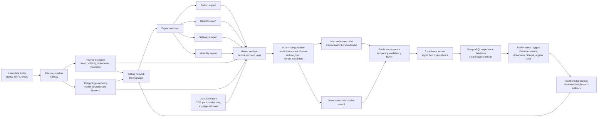

# Aether Quant V2 Architecture

Status: In development
Version: V2
Completed phases: V2-1 through V2-22 (V2-24 final review outstanding)
Focus: Adaptive MoE systems, Lean-data backtesting, observation-first deployment, paper/live deployment structure

## Objective

Aether Quant V2 builds on the existing Lean, PyTorch, dashboard and risk-control foundation. Training and backtesting continue to use the local Lean `data/` folder. Live and paper trading remain optional later stages; V2 first becomes stronger in offline training, backtesting, observation mode and controlled retraining.

## System Flow



## Runtime Decision Priority

The market analyzer enforces a strict priority ordering per asset per bar:

1. `reduce_risk` — portfolio-wide trade lock active
2. `reduce_risk` — risk-off regime + directional signal
3. `reduce_risk` — topology risk elevated + directional signal
4. `retrain_candidate` — baseline fallback + low regime confidence
5. `simulate` — liquidity blocked (zero volume or below DDV floor)
6. `simulate` — liquidity thin (participation rate above thin threshold)
7. `trade` — all guards passed, confidence above threshold, asset not isolated
8. `simulate` / `observe` — fallthrough

## Tech Stack

```mermaid
flowchart TB
    A["Infrastructure"] --> A1["Docker Compose<br/>(Redis, Postgres, aether-quant app)"]
    A --> A2["Lean CLI<br/>(backtest + paper trading)"]
    A --> A3["30-day observation phase before live mode"]
    B["Development"] --> B1["VS Code + Claude Code"]
    B --> B2["GitHub"]
    C["Data and storage"] --> C1["Lean data folder for training/backtesting"]
    C --> C2["Redis temporary event stream"]
    C --> C3["PostgreSQL permanent experience database"]
    D["AI and modeling"] --> D1["PyTorch"]
    D --> D2["scikit-learn"]
    D --> D3["NumPy / Pandas"]
    D --> D4["MoE experts and gating network"]
    E["Monitoring and UI"] --> E1["React/Vite webui — Tracing dashboard (port 3002 dev / 8001 Docker)"]
    E --> E2["FastAPI JSON API (port 8000)"]
    E --> E3["Telegram alerts (V2-19)<br/>notifications/telegram_worker.py"]
```



## Module Map

- `data_pipeline/`: V2 Lean-data manifest and stable dataset contract for downstream modules; since V2-19.5 also `yfinance_backfill.py`, a manual offline script that backfills thin series (never invoked from train.py/main.py/any worker).
- `moe/`: Gating network, expert routing and final MoE signal composition.
- `experts/`: Bullish, bearish, sideways and volatility expert model interfaces.
- `regime/`: Quantitative market-regime detection and later LLM regime-vector adapters.
- `topology/`: 3D market topology state, pairwise correlation, asset clustering and topology export.
- `analyzer/`: Central deterministic decision layer combining all module outputs into a single action per bar.
- `liquidity/`: Per-asset liquidity and market-impact engine — DDV proxy, participation rate, slippage estimate, spread proxy.
- `experience/`: Redis-buffered observation and trade events with PostgreSQL persistence.
- `retraining/`: Controlled retraining — planner, candidate training gate, validation/backtest gates, Aether-Vault commit, promotion and rollback.
- `risk/`: Dynamic position sizing, leverage limits, drawdown controls and exposure caps.
- `monitoring/`: FastAPI JSON API serving `visualization/state.json`, scene, topology and the historical `visualization/grafana/*` exports (equity curves, asset performance, observation/metrics snapshots).
- `notifications/`: Telegram alerting (V2-19) — polls `performance_triggers` (every trigger type, not just drawdown) and `experience_events` (`event_type="session_summary"`) directly from Postgres via its own `telegram-worker` Docker service; never imported by `main.py`/Lean.
- `webui/`: React/Vite single-page app — Overview (3D scene, heatmap, signals), Risk (sizing, liquidity panel), Topology (3D cluster view), Tracing (V2-18 — equity curves, asset performance, observation equity curve, runtime metrics snapshot).

## V2 Build Order

1. [x] V2-1: Fork and architecture foundation
2. [x] V2-2: Lean-data pipeline extension
3. [x] V2-3: Dynamic risk and position sizing
4. [x] V2-4: HTML live volatility dashboard (superseded by React webui)
5. [x] V2-5: Docker Compose infrastructure for Lean, Grafana, Redis and PostgreSQL (Grafana later removed, see V2-18)
6. [x] V2-6: Regime detection
7. [x] V2-7: Expert datasets
8. [x] V2-8: Expert modules
9. [x] V2-8.5: Expert model stabilization and quality gates
10. [x] V2-9: Gating network
11. [x] V2-10: Central market analyzer
12. [x] V2-11: 3D topology market modeling
13. [x] V2-12: Market impact and liquidity engine + Docker app service
14. [x] V2-13: Redis experience queue/stream
15. [x] V2-14: PostgreSQL persistence worker
16. [x] V2-15: Observation mode
17. [x] V2-16: Performance triggers
18. [x] V2-17: Controlled retraining
19. [x] V2-17.5: Non-deterministic topology and retrain-trigger upgrade
20. [x] V2-18: Remove Grafana, React Tracing dashboard
21. [x] V2-19: Telegram alerts
22. [x] V2-19.5: Yahoo Finance historical data backfill — supplemental, not in the original numbered plan
23. [x] V2-20: Lean backtesting integration — confirmed a standard backtest already exercises the full ML system (baseline model, all 4 experts, MoE gating, regime, topology); closed the proof gap with a new integration test rather than any runtime rewiring (see Lean Backtesting Integration Contract)
24. [x] V2-21: Paper trading preparation
25. [x] V2-22: Live deployment structure
26. [x] V2-23.1: Data-driven liquidity threshold calibration — closed via a real high-low spread estimator, not fill-data calibration (see Liquidity Engine Contract)
27. [x] V2-23.2: Static-config wiring + dead average_correlation input fixed — supplemental, found during a static-vs-dynamic architecture audit
28. [x] V2-23.3: Real topology embedding (SMACOF, replacing cosmetic index-based layout) — supplemental, same audit
29. [x] V2-24: Final V2 review

## Redis Experience Queue (V2-13)

After each asset decision, `experience/redis_queue.py::ExperienceQueue.push()` writes a JSON event
to the `aether:experience` Redis Stream via `XADD` with `MAXLEN ~ 100000`.

Event schema (key fields):

```json
{
  "event_id": "<uuid4>",
  "event_type": "market_decision",
  "created_at": "2026-07-01T12:00:00Z",
  "mode": "backtest|observation|paper|live",
  "symbol": "AAPL R735QTJ8XC9X",
  "ticker": "AAPL",
  "signal": "buy|sell|hold",
  "action": "trade|simulate|observe|reduce_risk|retrain_candidate",
  "execution_note": "entered_long",
  "probability_up": 0.61,
  "confidence": 0.22,
  "target_weight": 0.12,
  "regime": {},
  "moe_gating": {},
  "topology": {},
  "liquidity": {},
  "market_analysis": {},
  "portfolio": {"total_value": 105000.0, "cash": 50000.0, "current_drawdown": -0.01},
  "sequence_model": {"direction": 0.55, "magnitude": 0.012, "volatility": 0.021}
}
```

**Follow-up: `sequence_model` (multitask/sequence pass).** The optional
Phase 2 causal-TCN sequence-encoder prediction (see Phase 2 Sequence
Encoder Contract) — `null` when the model isn't loaded or failed for that
bar, same graceful-degrade contract as every other optional field here.
Informational only, same as everywhere else it's threaded — persisting it
just means it's available for offline analysis instead of only reaching
the live dashboard. `experience/postgres_worker.py` needs no migration:
the entire event dict is already serialized into the catch-all `payload
JSONB` column.

**Failure policy:** Redis unavailable = WARNING log, push returns `False`, trading continues.
The queue is configured via `config.json phase_v2.experience` and overridden by the
`AETHER_REDIS_URL` environment variable (set to `redis://redis:6379/0` in Docker).

## PostgreSQL Persistence Worker (V2-14)

`experience/postgres_worker.py` is a standalone synchronous Python worker that reads
batches from the `aether:experience` Redis Stream via `XREADGROUP` and batch-inserts
events into the `experience_events` PostgreSQL table.

### Table schema

```sql
CREATE TABLE IF NOT EXISTS experience_events (
    id            BIGSERIAL PRIMARY KEY,
    event_id      UUID        UNIQUE NOT NULL,
    created_at    TIMESTAMPTZ NOT NULL,
    ingested_at   TIMESTAMPTZ NOT NULL DEFAULT NOW(),
    mode          VARCHAR(20) NOT NULL,
    ticker        VARCHAR(20) NOT NULL,
    symbol        VARCHAR(100) NOT NULL,
    signal        VARCHAR(10) NOT NULL,
    action        VARCHAR(30) NOT NULL,
    confidence    DOUBLE PRECISION,
    target_weight DOUBLE PRECISION,
    payload       JSONB NOT NULL
);
```

Indexes: `created_at`, `ticker`, `mode`, `action` (B-tree) and GIN on `payload`.
DDL is embedded in `postgres_worker.py` — no Alembic, no migration files.

### Failure policy

| Failure | Behaviour |
|---|---|
| Malformed JSON | XADD to `aether:experience:deadletter`, XACK original, log WARNING |
| PG INSERT fails | rollback, do NOT ack, raise — messages stay pending |
| Duplicate `event_id` | `ON CONFLICT (event_id) DO NOTHING` — idempotent |
| PG down at startup | raise immediately |
| PG down mid-run | `run()` catches, exponential backoff (1→2→4→…→60 s), reconnect |

### Container

`Dockerfile.workers` (shared with `performance-trigger-worker` and
`telegram-worker` since the Docker image consolidation — see
`requirements/README.md`) builds a minimal `python:3.11-slim` image with
`redis>=5.0.0`, `psycopg[binary]>=3.1`, `numpy>=1.24.0`, and
`requests>=2.31.0`. The `experience-worker` service in `docker-compose.yml`
depends on `redis:healthy` and `postgres:healthy` and runs
`restart: unless-stopped`. Since V2-15, the image also copies `execution/`
(not just `experience/`) — `experience/__init__.py` imports
`simulated_portfolio.py`, which imports `execution.order_gate`, so the worker
image would fail to start without it.

## Redis To PostgreSQL Experience Flow

V2 uses Redis as the fast temporary buffer; PostgreSQL is the permanent source for analytics and retraining. V2-14 built the persistence worker.

1. The live, backtest or observation loop creates a signal and writes it to the `aether:experience` stream via `XADD` immediately (`ExperienceQueue.push()`).
2. A separate worker (V2-14) reads events with `XREAD` and persists them to PostgreSQL with batch inserts.
3. Controlled retraining reads from PostgreSQL only, so model updates are based on stable historical records.

## Observation Mode Contract (V2-15)

`phase_v2.runtime.mode` (`backtest` | `observation` | `paper` | `live`, committed
default `backtest`) plus `phase_v2.runtime.allow_live_orders` (default `false`)
gate every real broker order without touching any signal/risk/regime/topology/
liquidity/MoE logic — those all stay fully active in every mode.

`execution/order_gate.py` (Lean-free, pure functions) owns the decision table:

| `mode` | Real order allowed? |
|---|---|
| `backtest` | always (today's Lean-backtest behaviour, unchanged) |
| `observation` | **never**, regardless of `allow_live_orders` |
| `paper` | only if `allow_live_orders` AND a broker config is present |
| `live` | only if `allow_live_orders` AND broker config present AND risk locks are healthy |
| unknown/missing | falls back to `observation` (fail-safe) |

`main.py`'s `_order_permission()` calls this table once and is the single
gate used by `_apply_signal` (buy/sell/hold order placement) and
`_refresh_risk_state` (portfolio-wide drawdown-breach liquidation) — replacing
what used to be direct `SetHoldings`/`Liquidate` calls. When a real order is
blocked, the decision is instead applied to `experience/simulated_portfolio.py`'s
`SimulatedPortfolioState`: an in-memory cash/holdings/equity book that never
references `self.Portfolio` or any broker call. Its `snapshot()` is a
superset of the `portfolio={...}` dict already accepted by
`build_experience_event`, so no event schema, `event_to_row`, or Postgres DDL
changes were needed — `mode VARCHAR(20)` already covered all four values.

Because the real Lean portfolio never invests in `observation` mode,
position-limit counts, exposure-cap checks, the drawdown/risk-lock
calculation, and the dashboard's positions/portfolio-value snapshots are all
mode-aware: they read from `SimulatedPortfolioState` instead of `self.Portfolio`
whenever real orders are blocked, so risk controls stay meaningful and the
dashboard reflects what's actually happening.

`experience/observation_metrics.py` computes count/signal-distribution/
action-distribution/rejected-by-reason/win-loss/Sharpe/max-drawdown from a
plain `list[dict]` of experience events — the same shape whether the list
comes from an in-memory run log or a Postgres `payload` column query.
`rejected_by_reason` reads the `reasons` list `analyzer/market_analyzer.py`
already produces, so no new schema field was needed there either.

Dashboard exports: `visualization/grafana/observation_summary.json` and
`observation_equity_curve.csv`, plus `state["observation"]` embedded directly
in `visualization/state.json`. Two FastAPI routes
(`/api/grafana/observation-summary`, `/api/grafana/observation-equity-curve`)
and one webui panel (`ObservationPanel.tsx`, with an explicit
"SIMULATED - NOT REAL TRADES" banner) expose it.

**Verified end-to-end** via a real local `lean backtest .` run in
`observation` mode (2014-2018, BTCUSD/ETHUSD/LTCUSD): Lean's own statistics
reported `"Total Orders": "0"` and `"End Equity"` unchanged from the starting
cash for the entire run, while the simulated portfolio recorded genuine
activity (drawdown breach, turnover) — proving the real broker/portfolio is
never touched while the simulation behaves independently.

## Performance Trigger Contract (V2-16)

Phase 16 only detects, scores and logs — it never retrains anything.
`retrain_candidate` is a flag consumed by Phase 17; no automatic model
weight changes happen here.

`performance/triggers.py` (Lean-free, pure) evaluates 10 trigger types over a
`list[dict]` of experience-event dicts — the same source-agnostic shape
`experience/observation_metrics.py` established in V2-15 (reused directly
for Sharpe/drawdown math, not reimplemented):

| Trigger | Fires when |
|---|---|
| `observation_count_trigger` | event count is an exact multiple of `observation_interval` (default 100) |
| `executed_trade_count_trigger` | count of events where `action == "trade"` (not raw event count) is an exact multiple of `trade_count_interval` (default 100) — unlike `observation_count_trigger`, fires at `warning` so it can actually select a retraining run |
| `drawdown_trigger` | simulated max drawdown or the latest event's real `portfolio.current_drawdown` breaches `max_drawdown_threshold` |
| `sustained_drawdown_trigger` | real `portfolio.current_drawdown` breaches `max_drawdown_threshold` on `sustained_drawdown_days` (default 2) distinct *trailing* trading days in a row — a day-granularity companion to `drawdown_trigger`'s single-bar check, not a replacement |
| `sharpe_degradation_trigger` | rolling Sharpe over `rolling_window` events drops below `min_sharpe` |
| `win_rate_trigger` | rolling win rate (min. 5 realized trades) drops below `min_win_rate` |
| `confidence_decay_trigger` | mean model confidence roughly halves vs. the prior window, or its stdev spikes (instability) |
| `regime_shift_trigger` | the dominant regime label changes between adjacent windows by more than `regime_shift_sensitivity` |
| `liquidity_warning_trigger` | the `block`/`reduce_size` rejection rate over a window exceeds `max_liquidity_rejection_rate` (`simulate_instead` is explicitly excluded — that's observation-mode routing, not a liquidity problem) |
| `risk_lock_trigger` | the portfolio risk lock just activated, or has stayed active for `max_consecutive_locked_events` in a row |

Each fired trigger is a structured dict: `trigger_id`, `created_at`,
`trigger_type`, `severity` (`info`/`warning`/`critical`), `mode`, `scope`
(`"portfolio"` or a ticker), `metric_value`, `threshold`, `message`,
`recommended_action`, `retrain_candidate`. Severity is a breach-ratio rule
(≥1.5x past threshold → `critical`) for continuous-metric triggers;
`executed_trade_count_trigger` fires at a fixed `warning` (a count-reached
signal has no "how bad" axis to derive a ratio from). `retrain_candidate` is
`True` whenever severity is `critical`, whenever one of the six
model-quality triggers (now including `sustained_drawdown_trigger`) fires at
`warning`, or whenever a cadence trigger (`risk_lock_trigger`,
`executed_trade_count_trigger`) fires at all — a capital-preservation event
or a reached activity checkpoint always warrants a Phase 17 look. This is
the change that makes a periodic cadence retrain-capable at all:
`observation_count_trigger` fires at `info` only, which
`phase_v2.retraining.eligible_severities` excludes, so on its own it can
never select a retraining run.

Configured under `phase_v2.performance_triggers` (`enabled`,
`observation_interval`, `trade_count_interval`, `max_drawdown_threshold`,
`sustained_drawdown_days`, `min_sharpe`, `min_win_rate`,
`max_liquidity_rejection_rate`, `regime_shift_sensitivity`,
`confidence_decay_ratio_threshold`, `confidence_instability_std_threshold`,
`max_consecutive_locked_events`, `rolling_window`, `suppression_minutes`).

**Trigger Evaluation Flow** — deliberately split into two paths, mirroring
the existing Redis→async-worker→Postgres decoupling rather than querying
Postgres synchronously from inside the Lean process (by the time `main.py`
could query it mid-backtest, the async `experience-worker` may not have
caught up yet — querying anyway would mean reading stale data or blocking
the trading loop on worker liveness, a regression against V2-13/14's
fire-and-forget design):

1. **In-memory (main.py, every bar):** `_build_performance_triggers_view()`
   calls the same pure `evaluate_all_triggers()` over the in-memory
   `_observation_event_log` deque, writes `state["performance_triggers"]`
   and `visualization/grafana/performance_triggers.json`. This is a fast,
   approximate, **current-run-only** view — never written to Postgres, and
   explicitly documented as not the system of record.
2. **Postgres-backed (standalone worker, system of record):**
   `performance/trigger_worker.py` (`python -m performance.trigger_worker`,
   `--once` flag identical to `postgres_worker.py`'s convention) polls
   `experience_events` for rows newer than a durable watermark
   (`performance_trigger_watermark` table), evaluates them, and inserts
   fired triggers into the dedicated `performance_triggers` table —
   deliberately a separate table rather than reusing `experience_events`
   with a new `event_type`, so Grafana and Phase 17 can query it cleanly.
   `ON CONFLICT (trigger_id) DO NOTHING` plus an explicit suppression-window
   check (skip inserting if the same `trigger_type`+`scope` fired within
   `suppression_minutes`) keeps a sustained breach from spamming one row per
   poll cycle. Runs as its own `docker-compose.yml` service
   (`performance-trigger-worker`), depending only on `postgres` (not
   `redis` — it never touches the Redis stream) and mounting `config.json`
   read-only, since the 11 threshold keys are strategy config it reads
   directly rather than via CLI flags.

Dashboard/API: `visualization/grafana/performance_triggers.json`, one
FastAPI route (`/api/grafana/performance-triggers`), and one webui panel
(`PerformanceTriggersPanel.tsx`) showing the retrain-candidate banner,
severity distribution, latest trigger and trigger-type breakdown — placed
at the top of the dashboard's right column (above the signal/position
panels) so it stays visible regardless of universe size.

## Controlled Retraining Contract (V2-17)

Phase 17 closes the loop Phase 16 deliberately left open:
`retraining/` reads `retrain_candidate = true` rows out of the durable
`performance_triggers` Postgres table, trains a candidate model in
isolation, validates and backtests it against the currently active model,
commits it to Aether-Vault, and only then may promote it — or roll back to
a previous version. "No uncontrolled live learning" is the hard constraint:
every stage is a Postgres-audited row, and full autonomy (auto-promotion)
is an opt-in config flag, off by default.

Package split (mirrors the pure/IO/worker convention already established by
`performance/` in V2-16):

- `retraining/planning.py` (pure) — `evaluate_retraining_plan()` selects the
  newest eligible trigger, then checks minimum observations, cooldown and a
  daily retraining cap, in that order, short-circuiting with an explanatory
  reason on the first failing check.
- `retraining/postgres_registry.py` (IO) — embedded DDL for two tables:
  `model_versions` (`status`: `active`/`candidate`/`rejected`/`promoted`/
  `rolled_back`/`archived`, artifact paths/hashes, training/validation/
  backtest windows, metrics — a partial unique index enforces exactly one
  `active` row at the DB level) and `retraining_events` (`status`:
  `planned`/`running`/`validated`/`rejected`/`promoted`/`failed`, source
  trigger, candidate version, reason, metrics, notes — the full audit trail
  per retraining attempt).
- `train.py` gained a fourth, mutually-exclusive CLI mode:
  `python train.py --candidate --version-id <uuid>`. `train_model()`,
  `write_model_export()` and the newly-extracted `write_scaler_artifacts()`
  now accept optional output-path keyword arguments (default = the existing
  active `ml/`/`backtests/` constants, so every pre-V2-17 call site is
  unaffected) — the candidate branch passes `ml/versions/<version_id>/...`
  paths instead and never references an active-path constant.
- `retraining/validation_gate.py` (pure) — mirrors `train.py`'s
  `assess_expert_quality()` failures/near_misses/status shape, but compares
  candidate vs. **active** metrics (relative), not fixed thresholds: max
  drawdown not worse than active, Sharpe above a minimum, validation loss
  not much worse than active's, a self-computed overfitting gap
  (`train.balanced_accuracy - backtest.balanced_accuracy`, not pre-computed
  anywhere for the baseline model), and minimum trade count/exposure rate.
- `retraining/backtest_gate.py` + `retraining/lean_backtest.py` (pure +
  best-effort IO) — a 3-way active/candidate/buy-and-hold comparison reused
  directly from `compute_strategy_metrics()`'s existing output shape, plus
  an optional Lean CLI backtest that only runs `subprocess.run` if
  `shutil.which("lean")` actually finds a binary — "if Lean is available" is
  a real gate, not a try/except.
- `retraining/vault_commands.py` (pure) + `retraining/vault_client.py` (IO)
  — a pure `av add`/`av commit`/`av push` argv builder, and a subprocess
  wrapper that never raises: a missing `av` binary, a timeout, or a non-zero
  exit all resolve to `retraining_events.status = "failed"` without ever
  crashing the orchestrator/worker. Aether-Vault
  (`C:\Users\Blackhead\Desktop\aether-vault`, a separate sibling project) is
  invoked purely as this external CLI subprocess — its internals are out of
  scope and never read/imported.
- Promotion (`retraining/orchestrator.py`'s `promote()`) hard-requires
  `model_versions.status == "candidate"` and a non-null
  `aether_vault_commit` (`phase_v2.retraining.promotion.require_vault_commit`)
  before copying anything — "promotion requires a Vault commit" is enforced
  in code, not just documented. The copied file set is intentionally wider
  than the user-facing spec's 3 files (`model_weights.json`, `scaler.pkl`,
  `training_metrics.json`): `feature_schema.json` and `scaler_stats.json`
  are added because `main.py`'s `_validate_runtime_artifacts()` actually
  requires those two as well — omitting them would let a promotion silently
  break the Lean runtime.
- Rollback (`orchestrator.py`'s `rollback()`) verifies SHA-256 hashes from
  `model_versions.artifact_hashes` **before** activating anything; if the
  local `ml/versions/<old_id>/` directory is missing, it falls back to
  `av checkout <commit>` before retrying the restore.
- `retraining/worker.py`'s `RetrainingWorker` runs the full
  plan→train→validate→backtest→commit pipeline continuously (same shape as
  `experience-worker`/`performance-trigger-worker`), gated by
  `phase_v2.retraining.enabled` (checked every cycle — flip it in
  `config.json` without touching the container) and
  `phase_v2.retraining.worker.auto_promote` (default `true` as of V2-22: the
  worker calls `promote()` itself after a successful Vault commit, rather
  than stopping at `status="validated"` for a human to run
  `python -m retraining.orchestrator promote --version-id <id>`). Full
  autonomy is judged safe today specifically **because no live trading
  exists yet** (V2-22 is structural only, no real broker wired up) — the
  moment `phase_v2.runtime.mode` can genuinely equal `"live"`,
  `phase_v2.retraining.worker.auto_promote_blocked_in_live_mode` (default
  `true`, see the Live Deployment Contract below) forces manual promotion
  regardless of this flag. Revisit whether `auto_promote` itself should
  default back to `false` once V2-22's structural pieces are actually
  connected to a real live brokerage.
  `retraining/orchestrator.py` exposes every stage (`plan`, `train`,
  `validate`, `backtest`, `commit`, `promote`, `rollback`, `status`) as an
  independent CLI subcommand for manual/staged use regardless of whether the
  worker is running.
- Unlike `experience-worker`/`performance-trigger-worker`'s minimal images,
  `Dockerfile.retraining_worker` needs the full training stack (`torch`,
  `pandas`, `scikit-learn`, `joblib`) plus `experts/`, `regime/` and
  `train.py` itself, because `orchestrator.py`'s `train()` stage
  subprocess-invokes `train.py --candidate` directly rather than importing
  it — training is CPU/GPU-heavy and must not share the worker's own
  Postgres connection lifetime or block its event loop.

Dashboard/API: `visualization/grafana/retraining_status.json` (written by
`retraining/status_export.py`, the sole writer — `main.py` never connects to
Postgres, so unlike `performance_triggers` it cannot approximate this
in-memory), one FastAPI route (`/api/grafana/retraining-status`), a
server-side merge into `/api/state` (`monitoring/api_server.py`'s
`get_state()`), and one webui panel (`RetrainingStatusPanel.tsx`) showing
active/candidate version, validation status, Vault commit short-hash, last
trigger and rollback availability — placed directly under
`PerformanceTriggersPanel`.

## API Key Status

No broker API key is required for V2 foundation, training, backtesting, observation mode, dashboard work, Grafana exports, MoE experiments or controlled retraining. Real broker API keys are only required for **live** trading (V2-22, IBKR or another Lean-supported brokerage). Paper trading (V2-21) targets Lean's built-in `PaperBrokerage` instead, which needs no broker credentials at all — the one remaining external dependency is a live market **data** feed, either a QuantConnect cloud login (`lean login`) or a self-serve provider key (IEX/Polygon, already-present placeholder fields in `lean.json`). See the Paper Trading Readiness Contract (V2-21) and Live Deployment Contract (V2-22) below.

## Lean Data Contract

Training and backtesting remain tied to the local Lean `data/` folder. V2 modules should consume the dataset manifest generated from that source instead of inventing independent data loaders. This keeps the following layers aligned:

- baseline model training
- Lean backtesting
- MoE expert slices
- regime features
- topology snapshots
- dynamic risk and volatility-dashboard inputs

## Dynamic Risk Contract

V2 position sizing is driven by signal confidence and rolling volatility. The first implementation emits dashboard-ready telemetry:

- base target weight from the model signal
- volatility-adjusted target weight
- rolling and annualized volatility
- volatility regime
- leverage factor
- sizing reason

High volatility reduces position size. Low volatility can expand the target weight, but only up to the configured max position cap.

## Manual Trade-Lock Override Contract

`main.py::_refresh_risk_state()`'s sticky total-drawdown lock (a
`total_drawdown_limit_breached` trade lock never auto-clears on its own
within a run — see `development/Problems.md` #9 for how this was found) is a
deliberate capital-preservation circuit breaker, not a bug. `risk/manual_override.py`
adds the one deliberate, narrow way to override it:

- `phase_v2.risk.manual_trade_lock_override`: `true` (force-lock), `false`
  (force-clear, including an otherwise-sticky total-drawdown lock), or
  absent/`null` (today's automatic behavior, unchanged).
- Read once per session rollover by `_refresh_risk_state()` — not
  hot-reloaded every bar, keeping the spirit of "config is stable within a
  run," but re-read from disk at that one checkpoint (not from the
  `self.config` loaded once at `Initialize()`) so a long-running paper/live
  process picks up a change without a restart.
- It is a **standing switch, not one-shot**: it stays in effect until
  explicitly changed again. `main.py` itself never writes back to
  `config.json` — it only reads this one key.
- Two writers: the `aq trade-lock --on|--off|--auto` CLI command (a human
  decision), and `retraining/orchestrator.py::promote()` (auto-clears it to
  `false` on every successful promotion, gated by
  `phase_v2.retraining.promotion.auto_clear_trade_lock`, default `true`) —
  ties "trading resumes" to "a genuinely new model shipped."
- `risk/manual_override.py::write_manual_trade_lock_override()` is the
  **first place in this codebase where a Python process writes to
  `config.json`** (every other reader treats it as human-edited, read-only
  input) — a deliberate, narrow exception, not a new general pattern.

## Regime Detection Contract

V2 regime detection is quantitative first. It uses the Lean-derived feature set before any LLM regime-vector adapter is introduced.

It emits:

- `trend_regime`: `bullish`, `bearish` or `sideways`
- `volatility_regime`: `low_volatility`, `normal_volatility` or `high_volatility`
- `risk_regime`: `risk_on`, `risk_neutral` or `risk_off`
- `primary_regime`: compact routing label for future expert datasets and the MoE gating network
- confidence, trend score, drawdown and risk score for monitoring and later training filters

## Expert Dataset Contract

V2 expert datasets are derived from the same Lean-data feature dataset as the baseline model. They do not introduce a second data source.

The first expert slices are:

- `bullish`: rows where `trend_regime` is bullish
- `bearish`: rows where `trend_regime` is bearish
- `sideways`: rows where `trend_regime` is sideways
- `volatility`: rows where `volatility_regime` is high volatility

Only training-eligible assets are used for expert training slices. Observation-only assets stay visible in runtime monitoring, but they are not used to train experts until their history quality improves.

## Expert Model Contract

V2 expert models reuse the same PyTorch architecture family as the baseline model, but train separately on regime-specific slices.

The expert artifacts are:

- `ml/expert_models/bullish/model_weights.json`
- `ml/expert_models/bearish/model_weights.json`
- `ml/expert_models/sideways/model_weights.json`
- `ml/expert_models/volatility/model_weights.json`
- `ml/expert_training_metrics.json`

These artifacts stay local. The later gating network reads their metrics and exported JSON weights, then decides how strongly each expert should influence the final signal.

**Model input dimensionality is 59, not 30 (grew to 48 in the multitask/
sequence pass, then to 59 in the frontier-model edge investigation pass -
see `development/Changelog.md`).**
Regime (`regime_signal_confidence`/`regime_signal_trend_score`/
`regime_signal_risk_score` plus the existing one-hot trend/volatility/risk
flags), liquidity (`liquidity_log_dollar_volume`,
`liquidity_spread_proxy`) and topology (2 continuous
correlation-strength/topology-risk features) are genuine model **inputs**
now, not just downstream consumers of the baseline/expert models' output.
Computed identically offline (`train.py::add_regime_features()`/
`add_liquidity_features()`/`build_topology_features_by_date()`, folded
into `build_feature_dataset()`) and at runtime
(`main.py::_build_model_input()`, reordered so regime/topology are
computed *before* the model runs, not just consumed after) — see
`regime/README.md`, `liquidity/README.md` and `topology/README.md` for
each subsystem's own contract.

The later frontier-model pass added 11 more scaled features the same
way: 4 correlated-peer lagged-return features (`peer_rank1_return_1d`/
`peer_rank2_return_1d`/`peer_rank3_return_1d`/`peer_mean_return_1d` -
`topology/market_topology.py`'s `TopologyNode.top_peers`/`top_peer_returns`,
ranked by descending correlation across the whole eligible universe, a
genuine new information channel from correlation data the model
previously only saw as a compressed scalar) and 7 technical indicators
(`features/technical_indicators.py` - `rsi_14`, `atr_pct_14`,
`bollinger_pctb_20`, `volume_zscore_20`, `macd_histogram_norm`,
`dist_52w_high`, `cs_momentum_rank_20`), computed identically offline
(`train.py::build_topology_features_by_date()`/`engineer_features()`/
`build_cross_sectional_momentum_rank_features()`) and at runtime
(`main.py::_build_model_input()`/`_build_topology_payload()`) by
construction (shared pure functions for the indicators, the exact same
per-bar `build_market_topology()` call for the peer returns) rather than
hand-matched duplicated formulas. See
`tests/test_lean_backtest_ml_coverage.py::test_model_input_dimensionality_is_59`
for the real-backtest parity proof.

## Expert Stabilization Contract

Before the gating network is allowed to combine experts, each expert receives a quality status.

The stabilization layer:

- defaults expert models to a smaller network than the baseline model
- increases regularization with stronger dropout and weight decay
- uses stricter early stopping for expert training
- checks validation balanced accuracy, backtest balanced accuracy, backtest MCC and train/backtest generalization gap
- emits `stable`, `watchlist` or `disabled_for_gating`

The gating network should only use `stable` and `watchlist` experts at first. `disabled_for_gating` experts stay stored for diagnosis, but should not drive live or simulated decisions.

## Gating Network Contract

The first V2 gating network is deterministic and explainable. It does not yet train another neural model; it acts as a conservative manager over the expert exports.

It combines:

- expert quality status from `ml/expert_training_metrics.json`
- regime alignment from the current runtime regime vector
- validation and backtest performance
- per-expert probability outputs from local JSON expert exports
- the baseline model probability as a stabilizing anchor

The output is a final `moe_probability_up`, stored as runtime `probability_up`, plus a `moe_gating` payload showing active experts, disabled experts, weights and decision source.

**Follow-up: the gating network can now optionally use a learned model.**
The deterministic blend above is unchanged and always computed first — a
trained model (`ml/gating_model.json`, produced by `train_gating.py` /
`aq train --gating-only` / the retraining pipeline's best-effort
`train_gating()` stage) only *overrides* the final probability when
present, scored via the same `run_exported_model()` interpreter every
other exported model uses. Any failure (missing file, malformed export,
disabled config) silently falls back to the hardcoded blend above — see
`moe/README.md` for the full contract, `GATING_MODEL_FEATURE_KEYS`, and
the new `"learned_gating"` `decision_source` value.

**Follow-up: the gating network also blends predicted magnitude and
volatility.** Alongside `final_probability_up`, `build_gating_decision()`
now accepts optional `expert_magnitudes`/`expert_volatilities`/
`baseline_magnitude`/`baseline_volatility` and produces
`final_magnitude`/`final_volatility` via the same weighted-blend logic
(`moe/gating.py::_weighted_blend()`), fed by
`main.py::_run_multitask_model()`/`_run_expert_multitask_models()` — the
baseline-scale multitask model (`train.py::AetherNetMultiTask`,
`train_multitask.py`) and each expert's own optional multitask head
(`train.py::_train_expert_multitask()`, `ml/expert_models/<name>/multitask_model.json`).
The learned-gating override above stays direction-only — it never affects
`final_magnitude`/`final_volatility`. `analyzer/market_analyzer.py`
receives these as informational fields only (never changes routing);
`risk/position_sizing.py::build_dynamic_position_sizing()` can optionally
consume `final_volatility` in place of the backward-looking
`rolling_volatility_20d` average via
`phase_v2.dynamic_risk.use_predicted_volatility` (default `false`). See
`moe/README.md`'s "now routes through gating" section and
`risk/README.md`.

**Follow-up: the Phase 2 sequence encoder can also optionally blend in.**
`build_gating_decision(..., sequence_prediction=None, sequence_weight=0.0)`
applies a final anchor-blend (`sequence_weight × sequence_value + (1 −
sequence_weight) × existing_value`, same shape `baseline_weight` uses) to
`final_probability_up`/`final_magnitude`/`final_volatility` after
everything above — including the learned-gating override, unlike the
magnitude/volatility blend which the learned override never touches. Off
by default (`phase_v2.gating_network.sequence_weight: 0.0`); new
`GatingDecision.sequence_blended: bool` flags whether it actually fired
this bar. Chosen over a direct market-analyzer or position-sizing wire
specifically because gating is the one point every other prediction
source already funnels through — see `moe/README.md`'s "Phase 2 sequence
encoder now optionally blends into the gating decision" section for the
full reasoning, and the Phase 2 Sequence Encoder Contract above.

## Market Analyzer Contract

`analyzer/market_analyzer.py` is the single deterministic decision layer. It receives the outputs of all upstream modules (MoE gating, regime, topology, liquidity, risk) and emits exactly one action category per asset per bar.

Categories: `trade`, `simulate`, `observe`, `reduce_risk`, `retrain_candidate`.

Priority ordering is strict and documented in the Runtime Decision Priority section above. The analyzer also emits a `reasons` list explaining which rule fired, making every decision fully auditable in `visualization/state.json`.

## 3D Topology Contract

`topology/market_topology.py` computes cross-asset structural relationships each bar from the previous bar's returns window (no lookahead).

It emits:

- pairwise Pearson correlation matrix from return series
- Union-Find clusters above a correlation threshold
- 3D coordinates: correlated assets cluster together, high-volatility assets separate on the z-axis
- per-asset `topology_risk`: `normal`, `elevated` or `isolated`
- cluster membership and correlation strength for each asset

Topology risk feeds directly into the market analyzer: `elevated` forces `reduce_risk`, `isolated` blocks the `trade` path.

**x/y placement is a real distance-preserving embedding (post-V2-18 architecture audit), not the original cosmetic layout.** The original 3D-coordinate implementation placed cluster centroids and within-cluster members by `index -> angle` on a fixed ellipse — cluster membership was real, but position within/between clusters was arbitrary (two highly-correlated clusters could land on opposite sides of the circle). This was replaced with `_stress_majorize_2d(...)`: SMACOF (Scaling by MAjorizing a COmplicated Function), an iterative stress-majorization algorithm run over the full pairwise correlation-distance matrix across all eligible symbols (not just within-cluster pairs), seeded from the old cosmetic layout for determinism and fast convergence — no randomness anywhere, so `build_market_topology(...)` stays fully deterministic given the same inputs (the existing `test_stable_coordinates_are_deterministic` test still passes unchanged). The result is rescaled to fit the existing `NEUTRAL_DIMENSIONS` `[0,100]x[0,100]` bounds via a single isometric scale factor (not independent per-axis stretching, which would distort the very distances the embedding exists to preserve) — the webui's `TopologyScene3D.tsx` needed no changes, since it already normalizes off `topology.dimensions`. The z-axis (volatility encoding) is untouched. `phase_v2.topology.embedding_iterations` (default 100) controls the iteration count.

**Vectorized with numpy (latency-optimization pass, post-V2-23).** `_stress_majorize_2d` was pure Python (an O(N² × iterations) nested loop, the dominant per-bar cost in the whole topology layer) — this module's "no numpy/scipy" convention, referenced above and in the Non-Deterministic Topology section below, is retired for `market_topology.py` specifically now that a real measured bottleneck justifies it. Same inputs/outputs/iteration count/seeding as the pure-Python version; `tests/test_market_topology.py::test_stress_majorize_2d_matches_pure_python_reference` is the parity guard. The pairwise-correlation loop in `build_market_topology()` stays pure Python on purpose — it truncates each pair to the shorter of the two series' lengths (`_pearson_correlation`), and eligible symbols do not all share a common window length in this codebase (staggered asset onboarding, thin markets like ETHUSD/LTCUSD), so a single vectorized `np.corrcoef` call isn't a safe drop-in replacement. `topology/learned_topology.py`'s smaller `O(N² × 5)` pairwise-feature-distance cost was deliberately left pure Python too — at this project's universe size (10 assets), it's genuinely negligible next to SMACOF's cost, and vectorizing it would mean restructuring `apply_learned_topology()`'s per-node try/except (deliberate per-node fallback isolation on malformed data) for no measurable benefit.

**Warm-started seeding + early convergence exit (same pass, behavior-changing).** `build_market_topology()` accepts an optional `previous_positions` dict; for any eligible symbol present in it, SMACOF seeds from that value instead of the cosmetic angle-based layout (symbols absent — new to the universe, or isolated last bar — still fall back to the cosmetic seed). `main.py` stores every bar's final node `(x, y)` positions in `self._previous_topology_positions` and passes it in as `previous_positions` on the next bar, gated by `phase_v2.topology.warm_start_enabled` (default `true`). `_stress_majorize_2d` also accepts `convergence_tolerance` (`phase_v2.topology.convergence_tolerance`, default `0.01`): once every point's per-iteration movement drops below it, the loop exits before `embedding_iterations` — this is what actually turns a good warm start into fewer iterations, since a warm start alone doesn't save time if it always still runs the full fixed budget. **This changes bar-by-bar topology output values** — historical backtest results and any already-promoted models trained/validated against the old fixed-iteration, fresh-cosmetic-seed-every-bar behavior will not reproduce bit-for-bit after this shipped. Setting `warm_start_enabled: false` reproduces the exact pre-warm-start (vectorized-but-cold) behavior exactly (`tests/test_market_topology.py::test_warm_start_disabled_matches_omitting_previous_positions`), so it is a genuine, redeploy-free rollback switch, not just a default toggle.

**Correlation-stability embedding cache (development/Problems.md#36, off by default).** Warm-starting above still runs `_stress_majorize_2d` every bar, just from a better seed — profiling found the full SMACOF call itself costs ~500-600ms/bar at this project's real universe size (the single largest per-bar cost anywhere in the system, larger than the entire per-symbol inference total across the whole universe), so a good seed alone doesn't remove that cost, only reduces its iteration count. `build_market_topology()` now also accepts `previous_correlations`/`correlation_stability_tolerance`: when both are supplied and every pairwise correlation moved by no more than the tolerance since the prior bar (checked via `set(correlations.keys()) == set(previous_correlations.keys())`, which forces a full recompute whenever the eligible-symbol universe itself changed — a new/dropped symbol always invalidates the cache), SMACOF is skipped entirely and the prior bar's already-converged, already-rescaled `(x, y)` positions are reused directly; `reasons` gains `"topology_embedding_reused_stable_correlations"` so this is visible, not silent. `main.py` gates this via `phase_v2.topology.cache_enabled` (default `false`) and `phase_v2.topology.correlation_stability_tolerance` (default `0.02`), storing `self._previous_topology_correlations` unconditionally every bar (cheap — correlation computation itself was never the bottleneck) so flipping the flag on mid-run has a valid baseline from the very next bar. Only x/y ever comes from the cache — `correlation_strength`/`market_distance`/`volatility_pressure`/`topology_risk`/`regime_label`/`top_peers`/`top_peer_returns`/`cluster_id` are all still recomputed fresh from the current bar's inputs regardless, since none of them depend on the SMACOF embedding (the same property that already makes `embedding_iterations=1` safe at dataset-build time, see the Genuine Model Input Feature section in `topology/README.md`). `cache_enabled: false` (or omitting the two new parameters entirely) reproduces the exact pre-caching behavior byte-identical — same redeploy-free rollback contract `warm_start_enabled: false` already guarantees. Validate real speedup via `aq profile --topology-cached` (`scripts/profile_subsystems.py` gained a slowly-drifting-returns workload generator specifically for this — the existing `--topology` workload draws fully independent random returns every iteration by construction and can never demonstrate any benefit from a bar-to-bar staleness cache). **Implemented and unit-tested this pass, not yet validated against a real Lean backtest** — that validation is scoped to a later dedicated health-check session, matching the same posture `phase_v2.inference_parallelism.enabled` and the new `phase_v2.gc_tuning.freeze_after_load_enabled` (development/Problems.md#37) both already carry.

A dedicated `/api/topology` endpoint and `/topology` React page expose the live cluster view.

## Non-Deterministic Topology & Retrain-Trigger Contract (V2-17.5)

**Safety rule (non-negotiable):** non-deterministic does not mean random
trading. The new model exposes probabilistic scoring — confidence and
uncertainty — never a random or sampled decision. Every trading action
still passes through Risk Engine, Liquidity Engine, Order Gate, Observation
Mode and the V2-17 validation/promotion gates exactly as before.
`analyzer/market_analyzer.py` is **unchanged** by this phase — it still
reads only `topology_risk`/`state` from the deterministic layer; the new
fields this phase adds are never read by the priority-tier decision logic.

**Follow-up:** `topology_confidence`/`topology_disagreement` were later
wired into `risk/position_sizing.py::topology_sizing_multiplier()` — a
continuous, shrink-only sizing factor applied *after* the analyzer has
already decided to trade. This does not revise the safety rule above: the
analyzer's action categorization is still fully deterministic and still
reads only `topology_risk`/`state`; the learned fields only ever shrink
the size of an action the deterministic layers already approved, never
choose the action itself. See `risk/README.md` and `analyzer/README.md`.

**Learned topology overlay** (`topology/learned_topology.py`, pure Python,
no numpy/sklearn at runtime — deliberately left that way in the
latency-optimization pass; see the note above on why `market_topology.py`'s
numpy vectorization wasn't extended here): sits on top of, never in place
of, the deterministic layer.
`apply_learned_topology(deterministic_topology, symbol_features,
previous_neighbors_by_symbol, model, feature_schema, ...)` scores each
node against a set of trained "prototypes" (feature-space centroids) via
softmax-over-distance, producing per node: `cluster_probs`,
`topology_confidence` (max probability), `topology_uncertainty`
(normalized entropy), `stress_score` (novelty vs. the nearest prototype),
`neighbor_shift_score` (Jaccard drift of the learned nearest-neighbor set
vs. the previous bar), `topology_disagreement` (learned regime read vs.
the deterministic cluster's own dominant regime), and a small, **bounded**
x/y/z offset on top of the deterministic coordinates (never a full
replacement embedding — `max_offset_xy`/`max_offset_z` cap the shift).
Every node also gets `topology_source` ∈ `deterministic | learned | hybrid
| fallback`: `fallback` when the model is missing or that node's
confidence is below `min_confidence_for_learned` (position left untouched
in that case), `learned` only when every node in the bar was scored with
sufficient confidence, `hybrid` otherwise. Never raises — a missing or
malformed model degrades to `fallback` node-by-node, mirroring
`market_topology.py`'s own `insufficient_data` philosophy.

**Training source and offline trainer:** `train_topology.py` (repo root,
sibling of `train.py`, free to use numpy/scikit-learn unlike the runtime
module) reads recent `experience_events` via
`performance.postgres_triggers.fetch_recent_events()` (reused, not
duplicated), derives a `win`/`loss`/`neutral` outcome label per event by
back-filling each ticker's open→realize trade span with its eventual
`portfolio.last_realized_pnl` sign, builds a
`topology.learned_topology.FEATURE_KEYS`-shaped feature vector per event
(`volatility`, `momentum` — proxied from `probability_up - 0.5` since no
literal momentum field is persisted, `correlation_strength`,
`liquidity_score` — via the shared `liquidity_score_from_decision()`
helper both this script and `main.py` call, and `regime_risk_score`), and
fits `sklearn.cluster.KMeans` prototypes over z-scored features. Writes
`topology_model.json`, `topology_training_metrics.json` and
`topology_feature_schema.json` into `ml/versions/<version_id>/` — never
active `ml/` paths directly, following V2-17's candidate-isolation
pattern. Exits 0 (not an error) when there isn't enough training data yet;
"skipped" must never look like "failed" to the caller.

**Retraining pipeline integration:** `retraining/orchestrator.py::train_topology()`
runs the script above as a second, **independently-failable** subprocess
between the existing `train` and `validate` stages — a topology-training
failure is logged as a note on the `retraining_events` row and never
rejects the primary candidate. `retraining/artifacts.py` adds
`OPTIONAL_TOPOLOGY_FILES` (the three filenames above), deliberately **not**
part of `REQUIRED_CANDIDATE_FILES` (so `validate()`'s gate can never reject
a candidate purely for missing topology artifacts), but included in
`ACTIVE_ARTIFACT_FILES` (copied on promotion when present) and
`ALL_TRACKED_FILES` (hashed by `commit()` and swept into the Aether-Vault
`av add <version_dir>` call automatically, since the whole candidate
directory is already added). `retraining/worker.py`'s `RetrainingWorker`
calls `train_topology()` in this same spot — no new automatic surface area
beyond what V2-17 already established; `auto_promote` still defaults
`False`.

**Retrain triggers** — `performance/triggers.py` adds 5 new types:

| Trigger | Fires when |
|---|---|
| `topology_uncertainty_trigger` | rolling average `topology_uncertainty` stays above threshold **and** a minimum fraction of individual bars breach it (persistence-guarded — one noisy bar never fires) |
| `topology_regime_mismatch_trigger` | the rate of `regime_label != cluster_dominant_regime_label` over the window exceeds threshold |
| `cluster_drift_trigger` | rolling average `neighbor_shift_score` stays elevated, persistence-guarded like uncertainty |
| `model_topology_disagreement_trigger` | rolling average `topology_disagreement` stays elevated, persistence-guarded |
| `trigger_frequency_spike` | a meta-trigger over trigger *rows* (not events): recent trigger rate spikes vs. its own baseline rate, gated by both a rate multiplier and a minimum absolute count |

The first four are added to `_MODEL_QUALITY_TRIGGERS` (so `warning` +
model-quality-type ⇒ `retrain_candidate=True`, same rule V2-16 already
uses); `trigger_frequency_spike` is deliberately excluded from that set.
`evaluate_all_triggers()` gained an optional `recent_triggers=None` kwarg
— backward compatible with `main.py`'s existing in-memory call site.

**Rolling-window trigger evaluation (the V2-16 limitation this phase
fixes):** `performance/trigger_worker.py`'s `run_once()` still advances its
watermark off the incremental new-events batch (cheap idle polls), but now
evaluates over `performance.postgres_triggers.fetch_recent_events()` —
the last `rolling_window_events` observations, bounded to the last
`rolling_window_days` days **or** since the last promoted/validated
retrain (`fetch_last_retraining_at()`), whichever is more recent — plus
`fetch_triggers_since()` for the frequency-spike baseline. This makes
Sharpe/win-rate/confidence-decay/topology-drift meaningful over real
history instead of reacting only to whatever arrived since the last poll.

**Planner weighting** (`retraining/planning.py`): `select_candidate_trigger()`
now picks by `(_trigger_priority_score, created_at)` instead of timestamp
alone. The score combines severity + a per-trigger-type base weight (a
critical drawdown outranks a topology warning), a "regime shift and a
topology trigger co-occurring" bonus (applied only to those specific
trigger types, not to unrelated candidates merely eligible at the same
time), and a capped "this trigger type/scope repeated" bonus. A lone weak
topology event never reaches this scoring in the first place — the
persistence guards above already keep `retrain_candidate=False` for
one-off noise, so `evaluate_retraining_plan()`'s own behavior/signature is
unchanged.

**Config:** new `phase_v2.topology_learning` block (`enabled`,
`temperature`, `top_n_neighbors`, `min_confidence_for_learned`,
`max_offset_xy`, `max_offset_z`, `training.*`); new topology-trigger
threshold/persistence keys and `rolling_window_events`/`rolling_window_days`
under `phase_v2.performance_triggers`; new `phase_v2.retraining.topology_training`
(`enabled`, `timeout_seconds`); `phase_v2.retraining.promotion.active_artifact_files`
extended with the three topology filenames (load-bearing — `promote()`
reads this config value in preference to the Python default).

**Dashboard/API:** `state.json`'s `topology` block gains `topology_source`,
`model_loaded`, `model_version_id`, `learned_neighbors_by_symbol` at the
top level, and `topology_source`, `cluster_probs`, `topology_confidence`,
`topology_uncertainty`, `stress_score`, `neighbor_shift_score`,
`topology_disagreement`, `learned_neighbors`, `cluster_dominant_regime_label`
per node — no new API route needed, `/api/state` and `/api/topology` are
generic passthroughs of the same file. `webui/src/pages/TopologyPage.tsx`
gained a `TopologyLearningPanel.tsx` (deterministic/learned/hybrid/fallback
badge, aggregate confidence/uncertainty/stress/mismatch stats) and
`TopologyScene3D.tsx`'s node tooltip now shows `topology_source` and
`topology_confidence`, with fallback nodes rendered slightly dimmer —
positions still move smoothly, but which layer produced them stays
visible.

**Docker:** `Dockerfile.retraining_worker` now also copies `topology/` and
`train_topology.py` (its `requirements-retraining-worker.txt` already had
numpy/scikit-learn/psycopg from V2-17, so no dependency changes were
needed).

## Liquidity Engine Contract

`liquidity/market_liquidity.py` estimates per-asset execution feasibility each bar using only daily OHLCV data. No order book, VWAP or real bid-ask data is required.

It computes:

- `daily_dollar_volume`: `close × volume` as a DDV proxy
- `order_value`: `portfolio_value × abs(target_weight)`
- `participation_rate`: `order_value / daily_dollar_volume`
- `estimated_slippage`: `participation_rate × daily_vol × slippage_factor`
- `spread_proxy`: dynamic per-asset per-bar estimate via `estimate_high_low_spread()` — the Corwin & Schultz (2012) high-low bid-ask spread estimator, computed from each asset's own recent daily high/low ranges (already collected every bar in `main.py::self.symbol_windows`). Falls back to the static lookup (equity: 5 bps, crypto: 20 bps) only for the first bar or two of a run (`phase_v2.liquidity.spread_estimation.min_bars`, default 2) or a degenerate estimate.
- `estimated_round_trip_cost`: `slippage + spread_proxy`

Risk labels and recommended actions:

| `liquidity_risk` | `recommended_action` | Trigger |
|---|---|---|
| `normal` | `allow` | participation rate below thin threshold |
| `thin` | `simulate_instead` | participation rate above thin threshold |
| `high_impact` | `reduce_size` | participation rate above high-impact threshold |
| `blocked` | `block` | zero volume or DDV below floor |

When `reduce_size` is recommended, `adjusted_target_weight` is applied before the market analyzer call so the analyzer sees the already-reduced weight.

All thresholds are configurable in `config.json` under `phase_v2.liquidity`.

**V2-23.1, closed** (post-V2-18 architecture audit) — see `liquidity/README.md` for the full story: the original "calibrate from real fill data" premise turned out to have no underlying telemetry to calibrate from (no `SlippageModel` was ever set for Lean backtests, and observation-mode's simulated fills always used `slippage_bps=0.0`), so this shipped instead as a real, published high-low spread estimator requiring no new instrumentation.

**Follow-up (execution/risk realism pass): `estimated_round_trip_cost` now actually reaches a fill price.** Previously this whole contract fed only sizing/routing decisions (`reduce_size`/`block`/`simulate_instead`) and was discarded afterward — no `SlippageModel` was ever attached to a Lean security, and observation-mode's simulated fills hardcoded `slippage_bps=0.0` (the exact gap V2-23.1's note above describes). `main.py::_LiquidityAwareSlippageModel` now reads this module's `estimated_round_trip_cost` every bar and applies it to both real Lean fills and simulated observation-mode fills — see `execution/README.md`'s "Real fill slippage" section for the wiring and `MAX_LIQUIDITY_SLIPPAGE_BPS`'s clamp rationale.

## Webui and API Contract

The React/Vite webui (`webui/`) replaces the old `dashboard.html` and `volatility_dashboard.html`. It is served either via `npm run dev` on port 3000 (local development) or from the Docker app container on port 8000 via FastAPI `StaticFiles`.

Pages:

- `/` Overview: scorecards, 3D market scene (real topology coordinates), asset heatmap, signal/position board
- `/risk` Risk: risk core panel, asset sizing table, liquidity and execution impact panel
- `/topology` Topology: 3D cluster view with regime/risk colouring, readable cluster list
- `/neural-network` Neural Network (V2-20): interactive 3D view of every real neural network in the project (baseline model + all 4 experts, side by side, one camera/orbit) plus a live layer/node/edge stats box — see Neural Network Visualization Contract below
- `/tracing` Tracing (V2-18): runtime metrics snapshot, asset performance (diverging Sharpe bars), backtest equity curve (per-ticker strategy vs buy-and-hold), observation-mode equity curve and drawdown — the native replacement for the removed Grafana instance

The FastAPI server (`monitoring/api_server.py`) exposes:

- `GET /api/state` — full runtime state including signals, topology, positions, risk and liquidity per asset
- `GET /api/scene` — 3D scene payload
- `GET /api/topology` — topology state with nodes, links and cluster summary
- `GET /api/neural-network` — layer/node/edge breakdown of every trained network (V2-20, see below)
- `GET /api/grafana/*` — JSON and CSV feeds read from `visualization/grafana/*`; the path is unchanged from when Grafana consumed it, now consumed by the webui's Tracing page instead (see V2-18)
- `GET /` — serves the built React app (only when `webui/dist/` exists)

## Neural Network Visualization Contract (V2-20)

A webui page renders every real neural network in the project as an
interactive, orbitable 3D layer/node/edge diagram, alongside a live stats
box.

**Data source, no training changes needed:** the baseline model and all 4
experts share one flat export schema (`train.py`'s `AetherNet`,
`export_architecture()`/`export_state_dict()`): baseline is
`Linear(20→64)→LayerNorm→ReLU→Dropout→Linear(64→32)→LayerNorm→ReLU→Dropout→Linear(32→1)→Sigmoid`;
each expert is the same template at a smaller, more regularized width —
`Linear(20→24)→LayerNorm→ReLU→Dropout→Linear(24→1)→Sigmoid` (see Expert
Stabilization Contract). `monitoring/neural_network_state.py::build_neural_network_state()`
(pure function, mirrors `topology/market_topology.py`'s convention) reads
`ml/model_weights.json` and `ml/expert_models/{bullish,bearish,sideways,volatility}/model_weights.json`
directly — independent of any running backtest, so the page works immediately
off whatever is already on disk — plus `ml/expert_training_metrics.json` for
each expert's `quality_status`. A missing export file degrades that one
network to `status: "not_trained"`, never a crash. `weight_abs_mean`/
`weight_abs_max` per linear layer (plain Python over the small matrices, no
numpy needed) drive edge color/opacity by weight magnitude.

**Explicitly excluded, with a stated reason in the API payload's `excluded`
list:** only the learned-topology overlay (`topology/learned_topology.py`)
— it scores nodes against KMeans cluster prototype centroids, not a layered
network, so there is nothing to lay out as layers/nodes/edges. The MoE
gating network (`moe/gating.py`) is **not** excluded: its deterministic
hardcoded blend has no weight matrix of its own, but the optional learned
gating model (`ml/gating_model.json`, see Gating Network Contract's
Follow-up above) does, so `gating` is always rendered here — `not_trained`
until a learned gating model actually exists, `trained` once one does,
same graceful-degrade contract as every other network.

**Extended to 12 networks total (multitask/sequence pass).** In addition
to the original 6 (baseline, 4 experts, gating), `build_neural_network_state()`
now also reads `ml/multitask_model.json` (`baseline_multitask`),
`ml/expert_models/{bullish,bearish,sideways,volatility}/multitask_model.json`
(`{expert}_multitask`) and `ml/sequence_model.json` (`sequence`) — each a
`{"trunk": [...], "heads": {"direction": [...], "magnitude": [...],
"volatility": [...]}}` **branching** export (`train.py::export_multitask_architecture()`/
`export_sequence_multitask_architecture()`, the same `AetherNetMultiTask`/
`AetherNetSequenceMultiTask` models `inference/exported_model.py::run_exported_multitask_model()`/
`run_exported_sequence_multitask_model()` interpret at runtime) instead of
the original flat `architecture` list. `_parse_network_export()` dispatches
between the two shapes; `_parse_branching_network_export()` walks the
trunk then each head, tagging every resulting layer with its owning
`head` (`None` for trunk layers). `sequence`'s trunk uses `conv1d_causal`
layers — `in_channels`/`out_channels` instead of `linear`'s
`in_features`/`out_features`, and a 3D `(out_channels, in_channels,
kernel_size)` weight matrix — so `_weight_stats()`'s flatten was made
recursive (`_flatten()`; the original one-level-deep flatten only worked
for 2D `linear` weights and would `TypeError` on a 3D one).
`NetworkSummary` gains a `heads: dict[str, list[int]]` field (trunk stays
in the existing `node_layers`, kept separate since a head is a branch off
the trunk's output, not a continuation of it) — empty for every flat
network. The webui deliberately does **not** attempt a full 3D
branching-tree renderer: `NeuralNetworkScene3D.tsx`'s `headColumnsFor()`
expands each multitask/sequence network into one diagram column per head
(`network.node_layers` + that head's own tail), rendered via the exact
same `NetworkDiagram`/`layerNodePositions` primitives the flat networks
already use — the trunk is genuinely shown once per head, with zero new
3D layout code. `NETWORK_ORDER` was extended with the 6 new names (a
network absent from this list silently never renders, regardless of
backend data). `tests/test_neural_network_state.py` is the parity net for
the new branching-export parsing.

**Webui:** `webui/src/pages/NeuralNetworkPage.tsx` (same two-column
`grid lg:grid-cols-[1.6fr_1fr]` layout as `TopologyPage.tsx`) —
`NeuralNetworkScene3D.tsx` renders every present network simultaneously as
side-by-side layer-column diagrams (one per head for multitask/sequence
networks, per above) sharing one `Canvas`/`OrbitControls`, built on the
exact same skeleton as `TopologyScene3D.tsx` for visual coherence (ambient
+ point light, `Html` billboard labels, dark Panel-wrapped canvas);
`NeuralNetworkStatsPanel.tsx` is the live stats box — one row per network
(layers/nodes/edges/quality status/last modified) plus a totals row,
polled every 5s via `useNeuralNetwork()` (same `REFRESH_MS` cadence as
`useTopology()`), so a retraining promotion's new weights are picked up
automatically without a page reload. For baseline_multitask/sequence it
also renders a "20d promotion gate" row — the Phase 2 code-enforced
`quality_status`/bootstrap-CI/era-count verdict
(`train.py::assess_ranking_quality()`, surfaced via
`monitoring/neural_network_state.py`'s `ranking_quality` field) — a
distinct concept from the row's own `quality_status` badge (that one is
the older stable/watchlist/disabled_for_gating/learned direction-model
gate).

Liquidity data flows through `state.signals[symbol].liquidity` — no dedicated endpoint needed.

## Phase 2 Sequence Encoder Contract

`train.py::AetherNetSequenceMultiTask`, trained by `train_sequence.py`,
replaces the flat-MLP trunk with genuine temporal structure — a causal
TCN (dilated causal 1D convolutions) over a rolling 30-bar window of
already-computed model inputs, instead of one flat row. Chosen over a
Transformer/attention-based encoder specifically because it's simpler to
verify bit-for-bit end-to-end.

- Exported as `ml/sequence_model.json`, the same branching
  `{"trunk", "heads"}` shape every multitask export uses (see Neural
  Network Visualization Contract above), but trunk entries are
  `conv1d_causal`/`relu`/`dropout` instead of `linear`/`layernorm`.
- `inference/exported_model.py::run_exported_sequence_multitask_model()`
  is the interpreter, backed by 4 new primitives — `_softmax`,
  `_layernorm_axis`, `_conv1d_causal`, `_multihead_attention` — each
  independently cross-checked against real PyTorch modules to
  ~1e-7/1e-8 max abs diff (`tests/test_exported_model.py`).
  `_multihead_attention` is implemented and tested as interpreter
  infrastructure for a possible future attention-based sequence model but
  is **not wired to any trained export in this pass** — the shipped model
  uses the causal-TCN trunk only.
- `main.py::_run_sequence_model()` is the runtime call site: optional,
  additive, graceful-fallback (missing/malformed export → `None`), reading
  a per-symbol rolling `deque` (`self.symbol_feature_history`, independent
  of `self.symbol_windows`) of this bar's `model_inputs`. The prediction
  is always threaded into `signal_payload["sequence_model"]` (dashboard)
  and the experience event (`sequence_model` field, see the Redis
  Experience Queue section).
- **Follow-up: can optionally blend into the gating decision
  (multitask/sequence integration pass).** Evaluated as a candidate
  direct input to gating, the market analyzer, and position sizing —
  gating was chosen (see Gating Network Contract's Follow-up below and
  `moe/README.md`) since it is the one funnel every other prediction
  source already passes through before reaching the analyzer/sizing.
  **Off by default** (`phase_v2.gating_network.sequence_weight: 0.0`) —
  byte-identical to the original informational-only behavior until set
  above zero. The market analyzer and position sizing were deliberately
  **not** given a second, direct sequence-model input of their own — see
  `analyzer/README.md` and `risk/README.md` for why.
- **Follow-up: `AetherNetSequenceMultiTaskHorizons` (frontier-model edge
  investigation pass, see `development/Changelog.md`).** A new sibling
  class (not a modification of `AetherNetSequenceMultiTask` above) adding
  4 heads: `direction_5d`/`direction_20d` (longer-horizon direction) and
  `rank_5d`/`rank_20d` (per-date cross-sectional percentile rank of
  forward return, evaluated via rank-IC —
  `train.py::compute_rank_ic()` — not MCC). `forward()` returns a dict
  keyed by head name instead of the original's fixed 3-tuple, mapping 1:1
  onto the export's `"heads"` dict keys — `run_exported_sequence_multitask_model()`
  needed **no interpreter changes** at all, since it already iterates
  `export["heads"].items()` generically. Real backtest result: `rank_20d`
  mean IC `0.073`, t-stat `4.40` (statistically significant on the full
  series) — the most learnable signal this codebase has produced so far.
- **Follow-up: `rank_20d` wired into position sizing
  (`risk/position_sizing.py::rank_sizing_multiplier()`, see
  `risk/README.md`).** The first Phase 4 output to move beyond
  informational-only: a fourth, optional, bounded, direction-preserving
  factor in the sizing chain (`predicted rank → multiplier ∈
  [min_rank_multiplier, max_rank_multiplier]`, default `[0.75, 1.25]`),
  fed by the sequence model's `rank_20d` head (preferred) with fallback
  to the multitask model's own `rank_20d` head. Same "never flips
  direction, only scales magnitude" boundary as
  `topology_sizing_multiplier()`. **Off by default**
  (`phase_v2.dynamic_risk.rank_sizing_enabled: false`) — the signal's
  non-overlapping-date subsample was not yet independently significant
  (t-stat `1.20` on 28 independent windows, vs. `4.40` on the full
  autocorrelated series), so it ships wired end-to-end but not promoted
  to on-by-default until validated on more out-of-sample data, per Phase
  4's own documented promotion criterion.

See `inference/README.md`'s Phase 2 section for the fuller interpreter
writeup and `development/Changelog.md`'s "Phase 1 remainder + Phase 2"
entry.

## 5/10 → 9/10 Frontier-Readiness Roadmap Contract

Follow-up to the rank_20d position-sizing entry above (which shipped off
by default: the non-overlapping-date subsample wasn't yet independently
significant, t=1.20 vs. 4.40 on the full series, on the then-20-asset
universe). Seven phases; see `development/Changelog.md`'s full entry for
complete detail — this section is the contract-level summary.

- **Phase 1 — Bond ETF sleeve + macro features.** Universe 20 → 30 assets
  (`SHY`/`IEF`/`TLT`/`AGG`/`LQD`/`HYG`/`TIP`/`MBB`/`EMB`/`MUB`, registered
  as `security_type: "equity"` — bond ETFs trade through Lean's ordinary
  equity path). New `features/macro_features.py`: three deliberate
  cross-asset signals (yield-curve slope, credit spread, crypto risk
  appetite), computed once per bar/date and broadcast to every asset —
  additive to the existing generic correlation-based peer mechanism
  (`topology/market_topology.py`), which already lets any asset surface
  as any other's `top_peer` with zero code changes. Model input 59 → 62.
- **Phase 2 — Validation rigor.** The code-enforced version of the
  promotion criterion previously only prose: `purged_embargoed_folds()`,
  `split_into_non_overlapping_eras()`, `bootstrap_ic_confidence_interval()`,
  `assess_ranking_quality()` (fails on low non-overlapping t-stat,
  negative bootstrap CI lower bound, or ANY single era sign-flipping the
  aggregate). Wired into `train_multitask.py`/`train_sequence.py`'s
  backtest-split metrics only. A real bug was found and fixed here (see
  `development/Problems.md` #27): both new era/fold functions assumed
  datetime-typed input but the real dataset's `date` column is stringified
  — caught on the first real retrain, not by unit tests (which happened to
  use `datetime64`-typed fixtures).
- **Phase 5 — Sector-neutral ranking.** New `data/reference/sector_mapping.json`
  (GICS-like equity buckets, `"Fixed Income"`/`"Crypto"` pseudo-sectors for
  the ETF sleeves). New `target_sector_neutral_rank_5d/20d` targets and a
  new `sector_neutral_rank_20d` head (new sibling head, not a modification
  of `rank_20d`) — `HORIZON_HEAD_SPECS`'s existing full generality over
  loss/metrics/ranking-quality-assessment needed zero changes beyond the
  registry entry.
- **Phase 3 — Stage-2 long/short book.** New `portfolio/` package
  (`build_rank_based_book()`, see `portfolio/README.md` for full design
  rationale) — the one deliberate departure from every prior `rank_20d`
  integration's "never flips direction" rule; a book-selected role SETS
  direction. `main.py::on_data()` restructured into two passes (collect
  every symbol's rank before any symbol's role is decided), provably
  byte-identical when disabled. Real short-selling introduced for the
  first time (new `"short"` signal branch in `_apply_signal()`, new
  `max_short_exposure` cap) — a real gap was found and fixed:
  `analyzer/market_analyzer.py`'s six safety-tier checks all gated on
  `signal_name in {"buy", "sell"}`, which would have let a book-selected
  short silently bypass every one of them; now `{"buy", "sell", "short"}`.
  Off by default (`phase_v2.portfolio_book.enabled: false`).
- **Phase 4 — Walk-forward retraining.** New
  `generate_walk_forward_windows()`/`summarize_walk_forward_run()` (pure,
  tested) and a `python train.py --walk-forward` CLI, reusing the existing
  `--candidate` pipeline in a loop, never refactoring it. Infrastructure
  built and verified against the real `common_window`; a full multi-window
  run was not executed this pass (multi-hour cost per window × N windows).
- **Phase 6 — Production rank-IC decay monitoring.** New
  `performance/rank_ic_monitor.py` (self-joins experience events against
  realized 20-trading-day-later closes, positional within each ticker's
  own event sequence) and `rank_ic_decay_trigger()` — structurally
  different from every other trigger (rank-IC can't be scored until the
  future is known). `train.py::compute_rank_ic()` split into a torch-free
  core (`_rank_ic_from_arrays()`) shared by training-time and production
  callers. `experience/redis_queue.py::build_experience_event()` gained
  `resolved_predicted_rank_20d`/`close_price` (closes a real gap: the
  multitask-fallback rank prediction never reached the experience store
  before this).
- **Phase 7 — Live-loop groundwork.** Confirmed `execution/paper_readiness_report.py`'s
  dashboard wiring (`monitoring/api_server.py`'s `/api/state` merge) was
  already correct before this pass — the real gap was cadence (manual-only
  regeneration). New `execution/paper_readiness_scheduler.py` closes it,
  mirroring `performance/trigger_worker.py`'s shape. Hard boundary
  (user-specified): nothing here touches
  `phase_v2.paper_trading.live_data_provider_configured`/
  `manual_review_confirmed` — activating real fills stays a distinct
  manual step, documented in `execution/README.md`.

**Real retrain result**: on the expanded 30-asset/62-feature dataset,
`rank_20d` (multitask model) clears its own Phase 2 promotion gate for the
first time — non-overlapping t-stat `2.52` (vs. `2.0`), bootstrap 95% CI
`[0.035, 0.308]`, zero opposite-sign eras across 9 eras. See
`development/Changelog.md` for the full metrics.

## Docker App Container

The `Dockerfile` is a two-stage build:

1. Node 20 Alpine builds the React webui (`npm ci && npm run build`).
2. Python 3.11 slim installs only the runtime requirements (`fastapi`, `uvicorn`, `aiofiles`) and serves the API plus the built webui on container port 8000 (host port 8001, see below).

`docker-compose.yml` port layout:

| Service | Host port | Container port |
|---|---|---|
| aether-quant (FastAPI + webui) | 8001 | 8000 |
| Redis | 6380 | 6379 |
| PostgreSQL | 5433 | 5432 |
| Lean (profile) | — | — |

Ports were remapped in V2-17 so a local Aether-Quant stack never collides with the separate
Aether-Vault sibling tool's own `docker-compose.yml` (which independently binds host 8000,
3000, 5432 and 6379). Port 3002 is kept free for `npm run dev` during local development
(moved from 3000, since Aether-Vault's webui container claims 3000); local, non-Docker
`uvicorn monitoring.api_server:app --port 8001` also moved off 8000 for the same reason.

The `data/`, `ml/` and `storage/` directories are excluded from the Docker build context via `.dockerignore` because the FastAPI server does not use them; they are only needed by `train.py` and the Lean algorithm.

## Remove Grafana, React Tracing Dashboard (V2-18)

Grafana was a separate service (`docker-compose.yml`'s `grafana`, port 3001) whose only
job was to chart the `visualization/grafana/*` exports (equity curves, asset performance,
observation equity curve, runtime metrics snapshot) that `monitoring/api_server.py` already
served as JSON. V2-18 removes that service and renders the same feeds natively in the
webui instead, so the whole stack is Docker Compose + Redis + PostgreSQL + the
`aether-quant` app/workers — one less container to run and no separate dashboard login.

- `docker-compose.yml`: deleted the `grafana` service, its `grafana-data` volume and the
  `AETHER_GRAFANA_URL` env var on the `lean` service.
- `webui/src/pages/TracingPage.tsx` (new `/tracing` route): four panels reading the exact
  same `/api/grafana/*` endpoints Grafana used to poll — `MetricsSnapshotPanel` (stat
  tiles), `AssetPerformancePanel` (diverging Sharpe bars, blue/red by sign),
  `BacktestEquityPanel` (per-ticker selector, strategy vs buy-and-hold cumulative return
  line chart) and `ObservationEquityPanel` (simulated equity/cash line chart plus a
  drawdown chart, client-side downsampled to ~400 points for the thousands-of-bars
  observation-mode export).
- `webui/src/components/tracing/`: `LineChart.tsx` (dependency-free SVG line chart —
  crosshair + tooltip, legend for multi-series, hairline gridlines, one axis) and
  `DivergingBarChart.tsx`, both new and reused across the panels rather than pulling in a
  charting library.
- The `visualization/grafana/` export path, `retraining/status_export.py`,
  `performance/postgres_triggers.py` and the `/api/grafana/*` route names are unchanged —
  only the consumer changed from an external Grafana instance to the webui itself, so
  none of the export-writing code needed to move or rename.
- No backend changes: `monitoring/api_server.py`'s existing `/api/grafana/*` routes were
  already read-only JSON/CSV reshapes of the same files; the webui just started fetching
  them.

## Telegram Alerts Contract (V2-19)

New package `notifications/`, following the same pure/IO/worker split
`performance/` (V2-16) and `retraining/` (V2-17) established:

- `notifications/telegram_alerts.py` (pure) — `should_alert_trigger()`
  (severity gate: `info < warning < critical`), `format_trigger_alert()`,
  `format_session_summary_alert()`. Renders fields already computed by
  `performance/triggers.py` and `experience/observation_metrics.py`;
  recomputes nothing.
- `notifications/postgres_telegram.py` (IO) — embedded DDL for
  `telegram_alert_watermark` (one row per channel: `"triggers"`,
  `"session_summary"`). Does **not** reimplement trigger fetching —
  `telegram_worker.py` imports `fetch_triggers_since()` directly from
  `performance.postgres_triggers`, since that table is already the durable
  system of record. `fetch_session_summaries_since()` is a defensive,
  never-raising read of `experience_events` (owned by
  `experience/postgres_worker.py`), mirroring
  `performance/postgres_triggers.py::fetch_last_retraining_at()`'s
  cross-package-read pattern in the opposite direction.
- `notifications/telegram_client.py` (IO, injectable) — thin Telegram Bot
  API wrapper. `send_message()` never raises; deferred `import requests`
  inside the call (mirrors `experience/redis_queue.py`'s deferred `import
  redis`). Bot token/chat id come only from `AETHER_TELEGRAM_BOT_TOKEN`/
  `AETHER_TELEGRAM_CHAT_ID` env vars, never `config.json`.
- `notifications/telegram_worker.py` — standalone worker (`python -m
  notifications.telegram_worker [--once]`), polling two independent,
  watermark-gated channels every
  `phase_v2.telegram.worker.poll_interval_seconds`:
  - **Triggers**: every `performance_triggers` row at or above
    `phase_v2.telegram.min_severity_for_trigger_alert` becomes a message.
    Because this polls *all* trigger types (not just `drawdown_trigger`),
    risk-lock activation, regime shifts, liquidity rejections,
    Sharpe/win-rate/confidence degradation and all five topology triggers
    are alerted with zero additional instrumentation.
  - **Session summaries**: `main.py` pushes one `event_type="session_summary"`
    experience event per session rollover (see below); the worker turns
    each new one into a post-market-close performance digest.
  - An unreachable Telegram API never stalls a channel: sends are
    best-effort per row, and the watermark always advances to the newest
    row's `created_at` regardless of individual send failures.

**`main.py` additive changes** (session_summary event push): `_session_events:
list[dict]` accumulates the current session's experience events (appended
alongside the existing `_observation_event_log`). In
`_refresh_risk_state()`'s existing session-rollover branch (the date-change
check that already resets `session_start_equity`), *before* the reset and
guarded so it never fires on the first bar, a new
`experience.redis_queue.build_session_summary_event()` call builds one
`event_type="session_summary"` event (mode, session date, start/end equity,
session return, and a full `experience.observation_metrics.compute_observation_summary()`
block) and pushes it through the existing `ExperienceQueue` — the same
Redis→`experience-worker`→Postgres pipeline every other event already uses,
so no new transport was needed.

**Required non-additive fix:** `experience/postgres_worker.py::event_to_row()`
previously indexed `event["ticker"]`/`["symbol"]`/`["signal"]`/`["action"]`
directly. A `session_summary` event has none of these (it's portfolio-level,
not per-asset), so without this fix it would raise `KeyError`, get silently
dead-lettered, and `fetch_session_summaries_since()` would forever return
`[]` — the whole feature would look "working" (no crash) while never firing.
Fixed to `.get(key, "")` (backward compatible — `experience_events`' columns
are `VARCHAR NOT NULL`, not unique-constrained, so an empty default is safe),
with `action` falling back to `event_type` so a session_summary row stays
filterable.

**Docker:** `telegram-worker` service, built from the shared
`Dockerfile.workers`/`requirements/requirements-workers.txt` (also used by
`experience-worker`/`performance-trigger-worker` since the Docker image
consolidation), depends only on `postgres` (no Redis — this worker never
touches the experience stream directly). Its image must copy `execution/`
in addition to `experience/`/`performance/` — importing
`performance.postgres_triggers` initializes `performance/__init__.py`
→ `.triggers` → `experience.observation_metrics` → (via `experience/__init__.py`)
`.simulated_portfolio` → `execution.order_gate` — the same transitive-import
lesson already learned in `development/Problems.md` #1/#2 for the
experience/trigger workers, applied proactively here rather than discovered
after a broken build. `requirements-workers.txt` includes `numpy` for the
same reason.

**Config:** new `phase_v2.telegram` block (`enabled`,
`min_severity_for_trigger_alert`, `session_summary_enabled`,
`worker.{poll_interval_seconds,batch_size,backoff_max}`). New
`.env.compose.example` (the `.gitignore` exception for it already existed
but the file itself didn't) documents `AETHER_TELEGRAM_BOT_TOKEN`/
`AETHER_TELEGRAM_CHAT_ID`.

**Stop:** V2-19 does not add retry/backoff beyond the minimum for the
Telegram API call itself, and does not add a webui alert-history panel —
both deliberately out of scope.

## Yahoo Finance Historical Data Backfill (V2-19.5)

A supplemental, user-requested feature alongside V2-19 (not in the original
numbered roadmap) — `data_pipeline/yfinance_backfill.py`, a **manual, offline
script** (never invoked from `train.py`/`main.py`/any Docker worker, no
network calls during training or a backtest — mirrors `train_topology.py`'s
"never runs in the Lean container" status).

Fills gaps in thin local Lean zips — initially `ETHUSD`/`LTCUSD`, which only
have a few scattered days of real Coinbase minute data (see
`train.py::ensure_derived_crypto_daily_series()` and the Phase-9 Changelog
entry) and are therefore stuck `observation_only` per
`train.py::build_asset_quality()`'s row-count thresholds.

- Per-asset opt-in via a new, optional `"backfill"` sub-block in
  `config.json`'s `phase1.universe.assets[]` entries (`source`, `symbol`,
  `backfill_from`, `backfill_to`) — deliberately a new key, not a reuse of
  the existing `aggregation: "daily_from_minute_trade"` value, since that
  value already triggers `train.py`'s own Coinbase aggregation on every run
  and this path must stay entirely manual.
- Pure functions (`yahoo_symbol_for`, `detect_gap`, `scale_for_lean`,
  `rows_to_lean_csv`, `write_lean_zip`) mirror
  `train.py::ensure_derived_crypto_daily_series()`'s exact Lean zip
  write pattern (`ZipFile(path, "w")`, member name `f"{ticker.lower()}.csv"`,
  row format `f"{date:%Y%m%d} 00:00,{o},{h},{l},{c},{v}"`), with one addition:
  `scale_for_lean()` applies the ×10000 integer convention for equities
  (confirmed from a real `aapl.zip`) since Yahoo returns real dollar floats;
  crypto passes through unscaled.
- `fetch_yahoo_ohlcv()` is the only function that imports `yfinance`,
  deferred inside the function body (mirrors `experience/redis_queue.py`'s
  deferred `import redis`) — importing `data_pipeline` never hard-requires
  `yfinance`.
- **Two independent safety boundaries**, both requiring an explicit human
  step, consistent with this codebase's existing bias toward confirmation
  over automatic action (e.g. `retraining`'s manual `promote`):
  1. Writing/merging zip files is gated by `--apply` (default: dry run,
     report only).
  2. `config.json`'s `available_from`/`available_to` are **never** edited by
     this script, `--apply` or not — `train.py::build_asset_quality()` only
     counts rows inside those configured windows, so widening the zip alone
     changes nothing until a human widens the window too. The script only
     prints the suggested new values.
- `write_lean_zip()`'s merge always lets **existing real Lean rows win** on
  any overlapping date; Yahoo data only fills genuinely missing dates.
- `yfinance` is a dev-only dependency (`requirements/requirements-dev.txt`),
  never in `requirements.txt`/`requirements-runtime.txt`.

Usage: `python -m data_pipeline.yfinance_backfill [--tickers ETHUSD LTCUSD] [--apply]`.

**Stop:** no automatic widening of `available_from`/`available_to`, no
Docker worker — deliberately a manual offline script, same status as
`train_topology.py`.

## Lean Backtesting Integration Contract (V2-20)

**Finding: a standard `lean backtest .` run already exercises the entire ML
system on every bar, for every symbol — baseline model, all 4 experts, MoE
gating, regime detection, topology, liquidity/risk sizing.** This was true
before V2-20 started (built up incrementally across V2-9/V2-11/V2-12); V2-20's
actual scope is proving it with an automated regression test rather than only
manual code reading, since `main.py` has zero direct unit tests
(`development/Problems.md` #8 — it requires `AlgorithmImports`/Lean).

Traced call chain inside `main.py::on_data` (`main.py:225`), per bar:

| Subsystem | Call site | Reads |
|---|---|---|
| Topology (deterministic + learned) | `main.py:231 self._build_topology_payload()` — once per bar, before the symbol loop | `topology/market_topology.py`, `topology/learned_topology.py` |
| Baseline NN | `main.py self._run_model(...)` → `inference.run_exported_model` | `ml/model_weights.json` |
| Regime detection | `main.py self._build_regime_payload(...)` → `regime.build_market_regime_vector` | `regime/market_regime.py` |
| All 4 experts | `main.py self._run_expert_models(...)` — loops `moe.EXPERT_NAMES`, reuses the same `inference.run_exported_model` interpreter | `ml/expert_models/{bullish,bearish,sideways,volatility}/model_weights.json` |
| MoE gating | `main.py:277 build_gating_decision(...)` | `moe/gating.py:114` |
| Liquidity / dynamic sizing | `main.py:286-311` | `risk/position_sizing.py`, `liquidity/market_liquidity.py` |
| Final decision | `main.py:315 build_market_analysis_decision(...)` | `analyzer/` |

**Extracted and vectorized (latency-optimization pass, post-V2-23).** The
forward-pass interpreter (`_run_exported_model`/`_linear`/`_layernorm`/
`_sigmoid`) used to live as private `main.py` methods, run once per symbol
per bar, 5x (baseline + 4 experts) — plain Python nested loops, no numpy,
despite `numpy` already being a declared dependency of `requirements.txt`
that nothing in `main.py`'s import chain had ever actually imported.
Extracted verbatim first (behavior-preserving refactor) into
`inference/exported_model.py` as free functions (`run_exported_model` plus
private `_linear`/`_layernorm`/`_sigmoid` helpers — same pattern as
`risk/position_sizing.py`/`regime/market_regime.py`), then vectorized with
numpy inside that module only. `tests/test_exported_model.py` is the
parity net: hand-computed `_linear`/`_layernorm`/`_sigmoid` assertions plus
a full-stack forward-pass test against an independently hand-transcribed
reference. `main.py` now just calls `inference.run_exported_model(...)`.

Not exercised by a backtest, correctly: the offline artifact builders
(`train.py`, `train_topology.py`, `experts/expert_datasets.py`) that *produce*
the JSON weights consumed above — training-time concerns, not backtest-time
ones.

**New regression proof:** `tests/test_lean_backtest_ml_coverage.py` — an
integration test (not a unit test) that shells out to the real Lean CLI
(`lean backtest .`) against this repo's own data/config, then asserts, from
the resulting `visualization/state.json`, that at least one fully-evaluated
signal has: all 4 `EXPERT_NAMES` in `expert_probabilities`, 4 weighted entries
in `moe_gating.weights`, a non-empty `regime.trend_regime`, a non-empty
`liquidity.liquidity_risk`, and that `state["topology"]["nodes"]` is
non-empty. Mirrors `retraining/lean_backtest.py`'s optional-dependency
convention (skip, never fail, if the Lean CLI isn't available) — but note the
disambiguation this test adds: on machines with `elan` (Lean 4, the theorem
prover) installed, plain `lean` on `PATH` resolves to the *wrong* binary (same
name, unrelated tool). The test's `_find_quantconnect_lean_binary()` checks
`--version` output (Lean 4 prints `"Lean (version 4...."`; QuantConnect's CLI
does not) and prefers this repo's own `.venv/Scripts/lean.exe` before falling
back to `PATH`, so it skips cleanly instead of erroring on such machines.

## Paper Trading Readiness Contract (V2-21)

Before V2-21, `main.py`'s `broker_config_present` flag (feeding
`execution/order_gate.py::resolve_order_permission()`'s `paper`/`live` branches)
was `bool(self.paper_brokerage)` — a string from `phase6.paper_trading.brokerage`
that defaults non-empty, so the check was structurally always `True`. V2-21
replaces it with a real decision, and targets Lean's built-in `PaperBrokerage`
(`lean.json`'s existing `live-paper` environment) rather than a real IBKR
paper account — `PaperBrokerage` needs no broker credentials at all, only a
live market data feed.

- `execution/paper_readiness.py` (pure) — `evaluate_paper_broker_config(paper_trading_config)`
  requires three things, in order, short-circuiting with a distinguishing
  reason on the first failure: a non-empty `brokerage`, `live_data_provider_configured`
  (human attestation — a live data feed is a real dependency Lean's
  `LiveDataQueue`/IEX/Polygon data-queue-handler choice, and can't be
  verified from `lean.json` alone since a QuantConnect cloud login lives
  outside the repo), and `manual_review_confirmed` (human attestation,
  replaces the old, never-actually-checked `phase6.paper_trading.ready_for_live_paper`
  stub). `evaluate_observation_readiness(summary, thresholds)` turns 4 of the
  5 bullets in the (now superseded) "Ready for Paper Trading?" manual
  checklist below into code: minimum observation count, `simulated_sharpe`
  floor, `simulated_max_drawdown` floor, no single `rejected_by_reason`
  dominating. The 5th bullet (manual review of trade history for plausible
  entry/exit prices) is deliberately **not** automated — it stays a human
  judgment call, gated by `manual_review_confirmed` above. This mirrors the
  codebase's existing bias toward manual gates elsewhere (trade-lock
  override, retraining promote/rollback).
- `execution/paper_readiness_io.py` (IO) — `read_paper_trading_config(config_path)`
  is a fresh, uncached single-key read of `phase_v2.paper_trading` (same
  shape as `risk/manual_override.py::read_manual_trade_lock_override()`), so
  a long-running paper process picks up an attestation-flag change at the
  next session rollover without a restart. `fetch_observation_mode_events(conn)`
  is the first `mode='observation'`-filtered `experience_events` query — the
  existing `performance/postgres_triggers.py::fetch_recent_events()`/
  `fetch_events_since()` don't filter by mode.
- `execution/paper_readiness_report.py` — the offline report `main.py` cannot
  compute itself (it never opens its own Postgres connection, same invariant
  documented in the Controlled Retraining Contract above). `build_paper_readiness_view(conn, config)`
  merges `evaluate_observation_readiness()` (fed by `experience.observation_metrics.compute_observation_summary()`)
  with `evaluate_paper_broker_config()`, and writes
  `visualization/grafana/paper_readiness_report.json` — sole writer, same
  pattern as `retraining/status_export.py`. `aq paper-readiness` (`aq_cli.py`)
  runs this as a human-invoked, exit-code-1-if-not-ready gate before flipping
  `phase_v2.runtime.mode` to `"paper"`.
- `main.py`: `phase6.paper_trading` is removed entirely (it fed nothing but
  the old no-op check). New `self.phase_v2_paper_trading` (from `phase_v2.paper_trading`)
  and a single `_recompute_broker_config()` method, called once in
  `initialize()` and again every session rollover in `_refresh_risk_state()`
  (same "fresh from disk, no restart needed" rule as the manual
  trade-lock override) — `_order_permission()` now reads `self._broker_config_present`
  from this instead of the old string-truthiness check.
- Dashboard/API: merged into `/api/state` under `state["paper_readiness"]`
  (`monitoring/api_server.py::get_state()`, same pattern as `retraining_status`)
  plus a standalone `GET /api/grafana/paper-readiness` route. `PaperReadinessPanel.tsx`
  (same shape as `RetrainingStatusPanel.tsx`) shows a ready/not-ready banner,
  each threshold check with its value vs. threshold, and the broker-config
  reason — placed in `Overview.tsx` next to the retraining status panel.
- `docker-compose.yml` gains a `lean-live` service (profile `lean-live`,
  never part of `--all`/`--lean`) that runs `lean live deploy . --environment
  ${LEAN_LIVE_ENVIRONMENT:-live-paper}` continuously (`restart: unless-stopped`)
  — distinct from the existing `lean` service, which only runs `sleep
  infinity` for ad-hoc `lean backtest .` invocations. The same service,
  parameterized by `LEAN_LIVE_ENVIRONMENT`, is reused for live deployment in
  V2-22 (`live-interactive`) — the concrete demonstration that paper→live is
  a config change, not a rewrite.
- **Stop:** no real broker or live market data was configured or tested in
  this phase. `lean live deploy`'s exact CLI flags were not verified against
  an installed Lean CLI — run `lean live deploy --help` once before relying
  on the compose command above. `phase_v2.paper_trading` defaults to fully
  blocking (`live_data_provider_configured`/`manual_review_confirmed` both
  `false`) so flipping to `"paper"` mode requires an explicit, deliberate
  human action.

## Live Deployment Contract (V2-22)

Purely structural: makes a later flip from paper to real live trading a
config/credential change, not a code rewrite. No real broker credentials or
live trades were configured or tested in this phase.

- Credential handling: `.env.live.example` (tracked, placeholder-only —
  `.gitignore` gained a `!.env.live.example` exception mirroring
  `!.env.compose.example`) documents the `AETHER_IB_*` environment-variable
  path. `execution/live_credentials.py` (pure) — `credentials_present(credentials)`
  and `describe_missing_fields(credentials)` over `REQUIRED_FIELDS =
  ("ib_account", "ib_user_name", "ib_password")`. `execution/live_credentials_io.py`
  (IO) — `load_live_credentials()` tries importing `ib_config` (repo-root,
  gitignored, planned-but-absent per `.gitignore`) first, falls back to
  `AETHER_IB_*` env vars, never raises. This is **pre-flight validation
  only** — it does not wire Lean itself. Lean's `BrokerageSetupHandler`
  reads `ib-account`/`ib-user-name`/`ib-password`/`ib-trading-mode` directly
  out of `lean.json` (already gitignored, already has these exact fields as
  empty placeholders); populating those stays a manual step.
- `execution/paper_readiness.py` gains `evaluate_live_broker_config(paper_trading_config, live_credentials_present, risk_config, live_config)`
  — requires the paper check to *also* pass (you cannot go straight to live
  without a validated paper corridor) AND real credentials present AND (if
  risk/live config supplied) `evaluate_live_risk_posture(risk_config, live_config)`:
  a sanity ceiling, not a redesign of the drawdown circuit breaker — `main.py`'s
  `max_daily_drawdown_pct`/`max_total_drawdown_pct` must not exceed
  `phase_v2.live.max_allowed_{daily,total}_drawdown_pct` (defaults `0.05`/`0.15`),
  and `liquidate_on_risk_breach` must be `true`. `evaluate_broker_config()`
  is the single dispatch point `main.py` calls regardless of mode — the same
  decision table, just with additional conditions for `live`, is itself the
  concrete proof that paper→live is a config question, not an architecture
  question.
- `main.py`: `self._live_credentials` is loaded once in `initialize()`
  (environment variables/`ib_config.py` don't change mid-run the way
  `config.json` can) via `load_live_credentials()`; `_recompute_broker_config()`
  passes `credentials_present(self._live_credentials)` plus the live
  `risk_config`/`live_config` dicts into `evaluate_broker_config()` every
  session rollover.
- Auto-promote safety net: `execution/runtime_config_io.py::read_runtime_mode(config_path)`
  (same fresh-read shape as `risk/manual_override.py`). `retraining/worker.py::run_once()`
  forces `auto_promote` off for that cycle (with a warning log pointing at
  `aq retrain promote --version-id <id>`) whenever `auto_promote` is `True`
  **and** `phase_v2.retraining.worker.auto_promote_blocked_in_live_mode`
  (default `true`) **and** `read_runtime_mode(...) == "live"`. See the
  updated Controlled Retraining Contract above for why full autonomy is
  judged safe only while no live trading exists yet.
- Deployment-health alerting: `performance/triggers.py::live_order_permission_blocked_trigger(events, window)`
  fires `critical` when `mode == "live"` but recent `execution_note`s are
  still `simulated_*` — the order gate is silently blocking what should be a
  real order (misconfigured credentials/`allow_live_orders`/risk lock in a
  deployment that believes it's live). Added to `TRIGGER_TYPES` but
  deliberately excluded from `_is_retrain_candidate()` via a new
  `_NON_RETRAIN_TRIGGERS` set — a broker misconfiguration is an ops problem,
  not something a new model version fixes. No change needed in
  `notifications/telegram_alerts.py`, which already formats any trigger row
  generically and already alerts at `critical`.
- `docker-compose.yml`'s `lean-live` service (introduced in V2-21, see
  above) is reused unchanged for live deployment — set
  `LEAN_LIVE_ENVIRONMENT=live-interactive` (or another Lean-supported
  brokerage environment already present in `lean.json`'s `environments`
  block) instead of the default `live-paper`.
- **Stop:** no `ib_config.py` was created, no real IBKR (or other) broker
  credentials exist anywhere in this repo, and no live order was ever
  placed. This phase only built the scaffolding a real live-trading rollout
  would need.

## Audit Logging Contract

New package `audit/`, following the same Redis Stream → Postgres worker →
JSON snapshot pattern `experience/` (V2-14) already established — closes the
one deferred item from the pre-live security review (`development/Problems.md`
#42): order placement, credential loads, and live-mode transitions previously
only went through ordinary application logging, not a tamper-evident trail.

- `audit/hash_chain.py` (pure) — `compute_entry_hash(prev_hash, event_type,
  created_at, payload)` (sha256 over the canonical-JSON payload chained to
  the previous row's hash, git-commit-style) and `verify_chain(rows)` (walks
  the full table oldest-first, returns `(True, None)` or `(False,
  first_broken_index)`). Any row's content tampered with after the fact
  breaks its own hash *and* every hash after it — detectable, not just
  logged.
- `audit/redis_queue.py` (IO, injectable, mirrors `experience/redis_queue.py`
  exactly) — `AuditQueue.push()` never raises (fire-and-forget `XADD` on
  stream `aether:audit`), `build_audit_event()` validates
  `event_type ∈ {order_placement, credential_load, live_mode_transition}`.
- `audit/postgres_worker.py` (IO) — `PostgresWorker` consumes via
  `XREADGROUP` consumer-group semantics (same durable at-least-once,
  dead-letter-on-malformed-JSON contract as `experience/postgres_worker.py`),
  computes each row's chain hash against the current tail
  (`fetch_latest_hash()`) before insert, `ON CONFLICT (event_id) DO NOTHING`
  for idempotent re-delivery. **Note:** `xreadgroup(..., block=0)` means
  "block indefinitely" in Redis, not "don't block" — both this worker and
  `experience/postgres_worker.py` originally called it that way and it was a
  real, previously-invisible bug (perpetual socket-timeout errors on an idle
  stream); fixed by omitting `block` entirely. See `development/Problems.md`
  #46.
- `audit/postgres_audit.py` (IO, read-only) — `fetch_recent_events()`/
  `fetch_all_events_ordered()`, the same shape `performance/postgres_triggers.py`
  already established for its own read-side helpers.
- `audit/status_export.py` — `build_audit_status_view()`/`write_status_file()`
  writes `visualization/grafana/audit_log.json` (`chain_valid`,
  `chain_broken_at_event_id` if not, `recent_events`), mirroring
  `retraining/status_export.py`'s exact JSON-snapshot pattern so
  `monitoring/api_server.py` stays a pure read-and-reshape layer with no new
  computation.

**Call sites** (each a minimal, defensive, never-blocking hook, same
convention as `ExperienceQueue`): `main.py`'s runtime-mode init and
`_apply_signal()`'s real-order branches (gated through the new
`execution/order_gate.py::is_real_order_placement()` helper, which excludes
simulated fills and every no-op execution note so only genuine order
placements get logged), and `aq_cli.py`'s `render-lean-config` command
(credential loads).

**CLI:** `aq audit-log [--event-type X] [--since DATE] [--limit N]
[--verify]` — `--verify` walks the full chain and reports the first break,
if any, with a non-zero exit code.

**API/webui:** `GET /api/audit-log` (read-only, same convention as every
other `/api/*` route) → `useAuditLog()` (TanStack Query hook) →
`AuditLogPanel.tsx`, wired into `Overview.tsx`'s existing right-column
monitoring stack alongside `PerformanceTriggersPanel`/`RetrainingStatusPanel`.

**Docker:** new `audit-worker` service, same shape as `experience-worker`
(depends on `postgres`+`redis`, shares the consolidated `aether-quant-engine`
image).

**Config:** `phase_v2.audit_log` block (`enabled` default **true** — unlike
this codebase's usual off-by-default convention, this closes a documented
pre-live security gap rather than adding a speculative feature, matching the
precedent set for `phase_v2.exits.enabled`), `redis_stream`, `maxlen`,
`worker.{group,consumer,batch_size,deadletter_stream,backoff_max}`.

**Stop:** no retention/rotation policy on `audit_log` exists yet (grows
unbounded) — acceptable at current volume, flagged for a later pass once
real trading volume exists.

## Why This Is Not HFT, And What It Would Take (Advisory)

Analysis only — no code changed as a result of this section (explicit
project-owner decision during V2-21/V2-22 planning). Kept here as a standing
reference so the question doesn't get re-investigated from scratch later.

**Why the system is not HFT today**, in order of how fundamental each gap is:

1. **Daily bars everywhere.** Data storage (`data/equity/usa/daily/*.zip`),
   feature set (`close_to_close_return_{1,5,20}d`, `rolling_volatility_*`,
   etc.), the model's prediction target (`phase1.target`: "1 trading day
   ahead"), the backtest resolution (`self.resolution = Resolution.DAILY` in
   `main.py`), and warm-up all assume one bar per symbol per day. HFT needs
   tick or L1/L2 order-book data at micro/millisecond granularity — a
   different data source and storage layer entirely, not a config flag.
2. **Trading throttled to roughly one decision per symbol per few days.**
   `phase6.risk.trade_cooldown_bars` (default `3`) blocks a signal flip
   inside that window; combined with daily bars and ~10 symbols, a backtest
   produces on the order of single-digit orders per day across the whole
   book. HFT strategies place hundreds to thousands of orders per second.
3. **Orders now support real limit-order execution, config-gated and
   still default off.** Both halves of this gap are now closed: the
   slippage half (a real `SlippageModel` attached to every Lean security,
   `main.py::_LiquidityAwareSlippageModel`, see `execution/README.md`'s
   "Real fill slippage" section) and the order-type half
   (`phase_v2.limit_orders`, real `LimitOrder()` support for every asset
   class via `main.py::_try_submit_limit_order()`/`on_order_event()`, see
   `execution/README.md`'s "Real limit orders" section and
   `development/Problems.md` #34). What's still genuinely absent for HFT:
   partial-fill/queue-position modeling beyond Lean's own `OrderTicket`
   semantics, and explicit network/exchange latency simulation. The
   limit-order feature itself also carries a real, explicitly documented
   risk unresolved until a real backtest runs — several Lean API naming
   assumptions (see `execution/README.md`'s verification list) could not
   be confirmed against the actual running engine this pass.
4. **Retraining is an offline, gated batch process**, not online/continuous
   learning: `phase_v2.retraining.cooldown_minutes` (720 = 12h),
   `max_retrainings_per_day` (2), and a full
   plan→train→validate→backtest→commit pipeline per candidate. HFT models
   typically predict seconds-or-less ahead and either retrain far more
   frequently or adapt continuously.
5. **Infrastructure is batch/polling, not a low-latency event loop.** The
   background workers (`experience-worker`, `performance-trigger-worker`,
   `retraining-worker`, `telegram-worker`) all poll every 30s-5min; Redis is
   used only as a fire-and-forget experience-event log, never a low-latency
   market-data/order bus. The core trading loop is Lean's own daily-bar
   `on_data()` callback, not an async tick-driven engine.
6. **No real broker/exchange connectivity exists yet** (this is what
   V2-21/V2-22 above start to address) — HFT additionally needs colocated,
   low-latency exchange connectivity, which is a hosting/infrastructure
   commitment well beyond what V2-21/V2-22 scope to.

**What "nudging toward HFT" would concretely require**, roughly in the order
the gaps above would need closing: tick/L1-L2 data ingestion and storage
(replacing the daily Lean zip files — a new data pipeline, not an extension
of the current one); a model and feature set operating at sub-second/tick
granularity with a much shorter prediction horizon (a new model, not a
retrained version of the current daily classifier); removing or drastically
shrinking `trade_cooldown_bars` and every daily-bar-calibrated risk/liquidity
threshold; a real slippage/latency-aware execution simulator plus limit-order
support (currently entirely absent); a genuine low-latency event-driven
runtime replacing the `on_data()` bar callback and the 30s+ polling workers;
and real low-latency broker/exchange connectivity, likely requiring colocated
infrastructure for true live HFT. In practice this is closer to a second,
parallel trading system than an incremental change to the current one — the
daily-bar architecture's data model, risk calibration, and infrastructure
choices are all load-bearing assumptions the rest of V2 (MoE experts, regime
detection, topology, liquidity engine, controlled retraining) is built on top
of.
