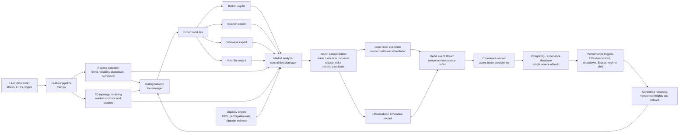

# Aether Quant V2 Architecture

Status: In development
Version: V2
Completed phases: V2-1 through V2-13
Focus: Adaptive MoE systems, Lean-data backtesting, observation-first deployment

## Objective

Aether Quant V2 builds on the existing Lean, PyTorch, dashboard, Grafana and risk-control foundation. Training and backtesting continue to use the local Lean `data/` folder. Live and paper trading remain optional later stages; V2 first becomes stronger in offline training, backtesting, observation mode and controlled retraining.

## System Flow



## Runtime Decision Priority

The market analyzer enforces a strict priority ordering per asset per bar:

1. `reduce_risk` — portfolio-wide trade lock active
2. `reduce_risk` — risk-off regime + directional signal
3. `reduce_risk` — topology risk elevated + directional signal
4. `retrain_candidate` — baseline fallback + low regime confidence
5. `simulate` — liquidity blocked (zero volume or below DDV floor)
6. `simulate` — liquidity thin (participation rate above thin threshold)
7. `trade` — all guards passed, confidence above threshold, asset not isolated
8. `simulate` / `observe` — fallthrough

## Tech Stack

```mermaid
flowchart TB
    A["Infrastructure"] --> A1["Docker Compose<br/>(Redis, Postgres, Grafana, aether-quant app)"]
    A --> A2["Lean CLI<br/>(backtest + paper trading)"]
    A --> A3["30-day observation phase before live mode"]
    B["Development"] --> B1["VS Code + Claude Code"]
    B --> B2["GitHub"]
    C["Data and storage"] --> C1["Lean data folder for training/backtesting"]
    C --> C2["Redis temporary event stream"]
    C --> C3["PostgreSQL permanent experience database"]
    D["AI and modeling"] --> D1["PyTorch"]
    D --> D2["scikit-learn"]
    D --> D3["NumPy / Pandas"]
    D --> D4["MoE experts and gating network"]
    E["Monitoring and UI"] --> E1["Grafana (port 3001)"]
    E --> E2["React/Vite webui (port 3000 dev / 8000 Docker)"]
    E --> E3["FastAPI JSON API (port 8000)"]
    E --> E4["Telegram alerts — future"]
```



## Module Map

- `data_pipeline/`: V2 Lean-data manifest and stable dataset contract for downstream modules.
- `moe/`: Gating network, expert routing and final MoE signal composition.
- `experts/`: Bullish, bearish, sideways and volatility expert model interfaces.
- `regime/`: Quantitative market-regime detection and later LLM regime-vector adapters.
- `topology/`: 3D market topology state, pairwise correlation, asset clustering and topology export.
- `analyzer/`: Central deterministic decision layer combining all module outputs into a single action per bar.
- `liquidity/`: Per-asset liquidity and market-impact engine — DDV proxy, participation rate, slippage estimate, spread proxy.
- `experience/`: Redis-buffered observation and trade events with PostgreSQL persistence.
- `risk/`: Dynamic position sizing, leverage limits, drawdown controls and exposure caps.
- `monitoring/`: FastAPI JSON API serving `visualization/state.json`, scene, topology and Grafana feeds.
- `webui/`: React/Vite single-page app — Overview (3D scene, heatmap, signals), Risk (sizing, liquidity panel), Topology (3D cluster view).

## V2 Build Order

1. [x] V2-1: Fork and architecture foundation
2. [x] V2-2: Lean-data pipeline extension
3. [x] V2-3: Dynamic risk and position sizing
4. [x] V2-4: HTML live volatility dashboard (superseded by React webui)
5. [x] V2-5: Docker Compose infrastructure for Lean, Grafana, Redis and PostgreSQL
6. [x] V2-6: Regime detection
7. [x] V2-7: Expert datasets
8. [x] V2-8: Expert modules
9. [x] V2-8.5: Expert model stabilization and quality gates
10. [x] V2-9: Gating network
11. [x] V2-10: Central market analyzer
12. [x] V2-11: 3D topology market modeling
13. [x] V2-12: Market impact and liquidity engine + Docker app service
14. [x] V2-13: Redis experience queue/stream
15. [x] V2-14: PostgreSQL persistence worker
16. [ ] V2-15: Observation mode
17. [ ] V2-16: Performance triggers
18. [ ] V2-17: Controlled retraining
19. [ ] V2-17.5: Non-deterministic topology and retrain-trigger upgrade
20. [ ] V2-18: Grafana monitoring expansion
21. [ ] V2-19: Telegram alerts
22. [ ] V2-20: Lean backtesting integration
23. [ ] V2-21: Paper trading preparation
24. [ ] V2-22: Live deployment structure
25. [ ] V2-23.1: Data-driven liquidity threshold calibration
26. [ ] V2-24: Final V2 review

## Redis Experience Queue (V2-13)

After each asset decision, `experience/redis_queue.py::ExperienceQueue.push()` writes a JSON event
to the `aether:experience` Redis Stream via `XADD` with `MAXLEN ~ 100000`.

Event schema (key fields):

```json
{
  "event_id": "<uuid4>",
  "event_type": "market_decision",
  "created_at": "2026-07-01T12:00:00Z",
  "mode": "backtest|observation|paper|live",
  "symbol": "AAPL R735QTJ8XC9X",
  "ticker": "AAPL",
  "signal": "buy|sell|hold",
  "action": "trade|simulate|observe|reduce_risk|retrain_candidate",
  "execution_note": "entered_long",
  "probability_up": 0.61,
  "confidence": 0.22,
  "target_weight": 0.12,
  "regime": {},
  "moe_gating": {},
  "topology": {},
  "liquidity": {},
  "market_analysis": {},
  "portfolio": {"total_value": 105000.0, "cash": 50000.0, "current_drawdown": -0.01}
}
```

**Failure policy:** Redis unavailable = WARNING log, push returns `False`, trading continues.
The queue is configured via `config.json phase_v2.experience` and overridden by the
`AETHER_REDIS_URL` environment variable (set to `redis://redis:6379/0` in Docker).

## PostgreSQL Persistence Worker (V2-14)

`experience/postgres_worker.py` is a standalone synchronous Python worker that reads
batches from the `aether:experience` Redis Stream via `XREADGROUP` and batch-inserts
events into the `experience_events` PostgreSQL table.

### Table schema

```sql
CREATE TABLE IF NOT EXISTS experience_events (
    id            BIGSERIAL PRIMARY KEY,
    event_id      UUID        UNIQUE NOT NULL,
    created_at    TIMESTAMPTZ NOT NULL,
    ingested_at   TIMESTAMPTZ NOT NULL DEFAULT NOW(),
    mode          VARCHAR(20) NOT NULL,
    ticker        VARCHAR(20) NOT NULL,
    symbol        VARCHAR(100) NOT NULL,
    signal        VARCHAR(10) NOT NULL,
    action        VARCHAR(30) NOT NULL,
    confidence    DOUBLE PRECISION,
    target_weight DOUBLE PRECISION,
    payload       JSONB NOT NULL
);
```

Indexes: `created_at`, `ticker`, `mode`, `action` (B-tree) and GIN on `payload`.
DDL is embedded in `postgres_worker.py` — no Alembic, no migration files.

### Failure policy

| Failure | Behaviour |
|---|---|
| Malformed JSON | XADD to `aether:experience:deadletter`, XACK original, log WARNING |
| PG INSERT fails | rollback, do NOT ack, raise — messages stay pending |
| Duplicate `event_id` | `ON CONFLICT (event_id) DO NOTHING` — idempotent |
| PG down at startup | raise immediately |
| PG down mid-run | `run()` catches, exponential backoff (1→2→4→…→60 s), reconnect |

### Container

`Dockerfile.worker` builds a minimal `python:3.11-slim` image with only
`redis>=5.0.0` and `psycopg[binary]>=3.1`. The `experience-worker` service in
`docker-compose.yml` depends on `redis:healthy` and `postgres:healthy` and runs
`restart: unless-stopped`.

## Redis To PostgreSQL Experience Flow

V2 uses Redis as the fast temporary buffer; PostgreSQL is the permanent source for analytics and retraining. V2-14 built the persistence worker.

1. The live, backtest or observation loop creates a signal and writes it to the `aether:experience` stream via `XADD` immediately (`ExperienceQueue.push()`).
2. A separate worker (V2-14) reads events with `XREAD` and persists them to PostgreSQL with batch inserts.
3. Controlled retraining reads from PostgreSQL only, so model updates are based on stable historical records.

## API Key Status

No broker API key is required for V2 foundation, training, backtesting, observation mode, dashboard work, Grafana exports, MoE experiments or controlled retraining. API keys are only required for real paper/live trading.

## Lean Data Contract

Training and backtesting remain tied to the local Lean `data/` folder. V2 modules should consume the dataset manifest generated from that source instead of inventing independent data loaders. This keeps the following layers aligned:

- baseline model training
- Lean backtesting
- MoE expert slices
- regime features
- topology snapshots
- dynamic risk and volatility-dashboard inputs

## Dynamic Risk Contract

V2 position sizing is driven by signal confidence and rolling volatility. The first implementation emits dashboard-ready telemetry:

- base target weight from the model signal
- volatility-adjusted target weight
- rolling and annualized volatility
- volatility regime
- leverage factor
- sizing reason

High volatility reduces position size. Low volatility can expand the target weight, but only up to the configured max position cap.

## Regime Detection Contract

V2 regime detection is quantitative first. It uses the Lean-derived feature set before any LLM regime-vector adapter is introduced.

It emits:

- `trend_regime`: `bullish`, `bearish` or `sideways`
- `volatility_regime`: `low_volatility`, `normal_volatility` or `high_volatility`
- `risk_regime`: `risk_on`, `risk_neutral` or `risk_off`
- `primary_regime`: compact routing label for future expert datasets and the MoE gating network
- confidence, trend score, drawdown and risk score for monitoring and later training filters

## Expert Dataset Contract

V2 expert datasets are derived from the same Lean-data feature dataset as the baseline model. They do not introduce a second data source.

The first expert slices are:

- `bullish`: rows where `trend_regime` is bullish
- `bearish`: rows where `trend_regime` is bearish
- `sideways`: rows where `trend_regime` is sideways
- `volatility`: rows where `volatility_regime` is high volatility

Only training-eligible assets are used for expert training slices. Observation-only assets stay visible in runtime monitoring, but they are not used to train experts until their history quality improves.

## Expert Model Contract

V2 expert models reuse the same PyTorch architecture family as the baseline model, but train separately on regime-specific slices.

The expert artifacts are:

- `ml/expert_models/bullish/model_weights.json`
- `ml/expert_models/bearish/model_weights.json`
- `ml/expert_models/sideways/model_weights.json`
- `ml/expert_models/volatility/model_weights.json`
- `ml/expert_training_metrics.json`

These artifacts stay local. The later gating network reads their metrics and exported JSON weights, then decides how strongly each expert should influence the final signal.

## Expert Stabilization Contract

Before the gating network is allowed to combine experts, each expert receives a quality status.

The stabilization layer:

- defaults expert models to a smaller network than the baseline model
- increases regularization with stronger dropout and weight decay
- uses stricter early stopping for expert training
- checks validation balanced accuracy, backtest balanced accuracy, backtest MCC and train/backtest generalization gap
- emits `stable`, `watchlist` or `disabled_for_gating`

The gating network should only use `stable` and `watchlist` experts at first. `disabled_for_gating` experts stay stored for diagnosis, but should not drive live or simulated decisions.

## Gating Network Contract

The first V2 gating network is deterministic and explainable. It does not yet train another neural model; it acts as a conservative manager over the expert exports.

It combines:

- expert quality status from `ml/expert_training_metrics.json`
- regime alignment from the current runtime regime vector
- validation and backtest performance
- per-expert probability outputs from local JSON expert exports
- the baseline model probability as a stabilizing anchor

The output is a final `moe_probability_up`, stored as runtime `probability_up`, plus a `moe_gating` payload showing active experts, disabled experts, weights and decision source.

## Market Analyzer Contract

`analyzer/market_analyzer.py` is the single deterministic decision layer. It receives the outputs of all upstream modules (MoE gating, regime, topology, liquidity, risk) and emits exactly one action category per asset per bar.

Categories: `trade`, `simulate`, `observe`, `reduce_risk`, `retrain_candidate`.

Priority ordering is strict and documented in the Runtime Decision Priority section above. The analyzer also emits a `reasons` list explaining which rule fired, making every decision fully auditable in `visualization/state.json`.

## 3D Topology Contract

`topology/market_topology.py` computes cross-asset structural relationships each bar from the previous bar's returns window (no lookahead).

It emits:

- pairwise Pearson correlation matrix from return series
- Union-Find clusters above a correlation threshold
- 3D coordinates: correlated assets cluster together, high-volatility assets separate on the z-axis
- per-asset `topology_risk`: `normal`, `elevated` or `isolated`
- cluster membership and correlation strength for each asset

Topology risk feeds directly into the market analyzer: `elevated` forces `reduce_risk`, `isolated` blocks the `trade` path. The 3D coordinates replace the previous orbit-based scene placement in the React webui.

A dedicated `/api/topology` endpoint and `/topology` React page expose the live cluster view.

## Liquidity Engine Contract

`liquidity/market_liquidity.py` estimates per-asset execution feasibility each bar using only daily OHLCV data. No order book, VWAP or real bid-ask data is required.

It computes:

- `daily_dollar_volume`: `close × volume` as a DDV proxy
- `order_value`: `portfolio_value × abs(target_weight)`
- `participation_rate`: `order_value / daily_dollar_volume`
- `estimated_slippage`: `participation_rate × daily_vol × slippage_factor`
- `spread_proxy`: static lookup by security type (equity: 5 bps, crypto: 20 bps)
- `estimated_round_trip_cost`: `slippage + spread_proxy`

Risk labels and recommended actions:

| `liquidity_risk` | `recommended_action` | Trigger |
|---|---|---|
| `normal` | `allow` | participation rate below thin threshold |
| `thin` | `simulate_instead` | participation rate above thin threshold |
| `high_impact` | `reduce_size` | participation rate above high-impact threshold |
| `blocked` | `block` | zero volume or DDV below floor |

When `reduce_size` is recommended, `adjusted_target_weight` is applied before the market analyzer call so the analyzer sees the already-reduced weight.

All thresholds are configurable in `config.json` under `phase_v2.liquidity`. Future V2-23.1 will replace static thresholds with data-driven values calibrated from real fill data accumulated by the experience pipeline.

## Webui and API Contract

The React/Vite webui (`webui/`) replaces the old `dashboard.html` and `volatility_dashboard.html`. It is served either via `npm run dev` on port 3000 (local development) or from the Docker app container on port 8000 via FastAPI `StaticFiles`.

Pages:

- `/` Overview: scorecards, 3D market scene (real topology coordinates), asset heatmap, signal/position board
- `/risk` Risk: risk core panel, asset sizing table, liquidity and execution impact panel
- `/topology` Topology: 3D cluster view with regime/risk colouring, readable cluster list

The FastAPI server (`monitoring/api_server.py`) exposes:

- `GET /api/state` — full runtime state including signals, topology, positions, risk and liquidity per asset
- `GET /api/scene` — 3D scene payload
- `GET /api/topology` — topology state with nodes, links and cluster summary
- `GET /api/grafana/*` — Grafana-friendly JSON and CSV feeds
- `GET /` — serves the built React app (only when `webui/dist/` exists)

Liquidity data flows through `state.signals[symbol].liquidity` — no dedicated endpoint needed.

## Docker App Container

The `Dockerfile` is a two-stage build:

1. Node 20 Alpine builds the React webui (`npm ci && npm run build`).
2. Python 3.11 slim installs only the runtime requirements (`fastapi`, `uvicorn`, `aiofiles`) and serves the API plus the built webui on port 8000.

`docker-compose.yml` port layout:

| Service | Host port | Container port |
|---|---|---|
| aether-quant (FastAPI + webui) | 8000 | 8000 |
| Grafana | 3001 | 3000 |
| Redis | 6379 | 6379 |
| PostgreSQL | 5432 | 5432 |
| Lean (profile) | — | — |

Port 3000 is kept free for `npm run dev` during local development.

The `data/`, `ml/` and `storage/` directories are excluded from the Docker build context via `.dockerignore` because the FastAPI server does not use them; they are only needed by `train.py` and the Lean algorithm.
