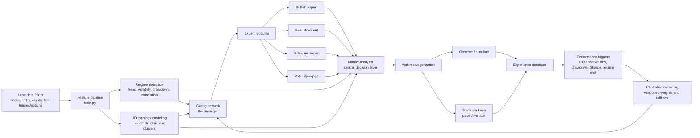

# Aether Quant V2 Architecture

Status: In development
Version: V2
Focus: Adaptive MoE systems, Lean-data backtesting, observation-first deployment

## Objective

Aether Quant V2 builds on the existing Lean, PyTorch, dashboard, Grafana and risk-control foundation. Training and backtesting continue to use the local Lean `data/` folder. Live and paper trading remain optional later stages; V2 first becomes stronger in offline training, backtesting, observation mode and controlled retraining.

## System Flow

## Tech Stack

```mermaid
flowchart TB
    A["Infrastructure"] --> A1["Docker"]
    A --> A2["Lean"]
    A --> A3["30 day observation phase before live mode"]
    B["Development"] --> B1["VS Code + Codex"]
    B --> B2["GitHub"]
    C["Data and storage"] --> C1["Lean data folder for training/backtesting"]
    C --> C2["PostgreSQL experience database later"]
    C --> C3["JSONL fallback during early V2"]
    D["AI and modeling"] --> D1["PyTorch"]
    D --> D2["scikit-learn"]
    D --> D3["NumPy / Pandas"]
    D --> D4["MoE experts and gating network"]
    E["Monitoring"] --> E1["Grafana"]
    E --> E2["HTML volatility dashboard"]
    E --> E3["Telegram alerts later"]
```

## Module Map

- `data_pipeline/`: V2 Lean-data manifest and stable dataset contract for downstream modules.
- `moe/`: Gating network, expert routing and final MoE signal composition.
- `experts/`: Bullish, bearish, sideways and volatility expert model interfaces.
- `regime/`: Quantitative market-regime detection and later LLM regime-vector adapters.
- `topology/`: 3D market topology state, asset clustering and topology export.
- `experience/`: Observation records, simulated trade records and later PostgreSQL persistence.
- `risk/`: Dynamic position sizing, leverage limits, liquidity and market-impact controls.
- `monitoring/`: HTML dashboard feeds, Grafana exports and later Telegram alert adapters.

## V2 Build Order

1. V2 architecture foundation.
2. Lean-data pipeline extension.
3. Dynamic risk and position sizing.
4. HTML live volatility dashboard.
5. Regime detection.
6. Expert modules.
7. Gating network.
8. Experience database.
9. Performance triggers.
10. Controlled retraining.
11. Observation mode.
12. Paper/live deployment.

## API Key Status

No broker API key is required for V2 foundation, training, backtesting, observation mode, dashboard work, Grafana exports, MoE experiments or controlled retraining. API keys are only required for real paper/live trading.

## Lean Data Contract

Training and backtesting remain tied to the local Lean `data/` folder. V2 modules should consume the dataset manifest generated from that source instead of inventing independent data loaders. This keeps the following layers aligned:

- baseline model training
- Lean backtesting
- MoE expert slices
- regime features
- topology snapshots
- dynamic risk and volatility-dashboard inputs

## Dynamic Risk Contract

V2 position sizing is driven by signal confidence and rolling volatility. The first implementation emits dashboard-ready telemetry:

- base target weight from the model signal
- volatility-adjusted target weight
- rolling and annualized volatility
- volatility regime
- leverage factor
- sizing reason

High volatility reduces position size. Low volatility can expand the target weight, but only up to the configured max position cap.
