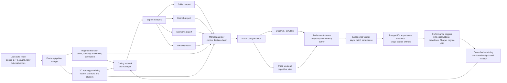

# Aether Quant V2 Architecture

Status: In development
Version: V2
Focus: Adaptive MoE systems, Lean-data backtesting, observation-first deployment

## Objective

Aether Quant V2 builds on the existing Lean, PyTorch, dashboard, Grafana and risk-control foundation. Training and backtesting continue to use the local Lean `data/` folder. Live and paper trading remain optional later stages; V2 first becomes stronger in offline training, backtesting, observation mode and controlled retraining.

## System Flow

## Tech Stack

```mermaid
flowchart TB
    A["Infrastructure"] --> A1["Docker"]
    A --> A2["Lean"]
    A --> A3["30 day observation phase before live mode"]
    B["Development"] --> B1["VS Code + Codex"]
    B --> B2["GitHub"]
    C["Data and storage"] --> C1["Lean data folder for training/backtesting"]
    C --> C2["Redis temporary event stream"]
    C --> C3["PostgreSQL permanent experience database"]
    D["AI and modeling"] --> D1["PyTorch"]
    D --> D2["scikit-learn"]
    D --> D3["NumPy / Pandas"]
    D --> D4["MoE experts and gating network"]
    E["Monitoring"] --> E1["Grafana"]
    E --> E2["HTML volatility dashboard"]
    E --> E3["Telegram alerts later"]
```

## Module Map

- `data_pipeline/`: V2 Lean-data manifest and stable dataset contract for downstream modules.
- `moe/`: Gating network, expert routing and final MoE signal composition.
- `experts/`: Bullish, bearish, sideways and volatility expert model interfaces.
- `regime/`: Quantitative market-regime detection and later LLM regime-vector adapters.
- `topology/`: 3D market topology state, asset clustering and topology export.
- `experience/`: Redis-buffered observation and trade events with PostgreSQL persistence.
- `risk/`: Dynamic position sizing, leverage limits, liquidity and market-impact controls.
- `monitoring/`: HTML dashboard feeds, Grafana exports and later Telegram alert adapters.

## V2 Build Order

1. V2 architecture foundation.
2. Lean-data pipeline extension.
3. Dynamic risk and position sizing.
4. HTML live volatility dashboard.
5. Docker Compose infrastructure for Lean, Grafana, Redis and PostgreSQL.
6. Regime detection.
7. Expert datasets.
8. Expert modules.
9. Gating network.
10. Central market analyzer.
11. 3D topology market modeling.
12. Market impact and liquidity engine.
13. Redis experience queue/stream.
14. PostgreSQL persistence worker.
15. Observation mode.
16. Performance triggers.
17. Controlled retraining.
18. Grafana monitoring expansion.
19. Telegram alerts.
20. Lean backtesting integration.
21. Paper trading preparation.
22. Live deployment structure.
23. Final V2 review.

## Redis To PostgreSQL Experience Flow

V2 uses Redis instead of a JSONL fallback. Redis is only the temporary fast buffer; PostgreSQL is the permanent source for analytics and retraining.

1. The live, backtest or observation loop creates a signal and writes raw metrics into Redis immediately.
2. Redis accepts events through a stream or queue, for example `XADD` or `LPUSH`.
3. A separate worker reads the events asynchronously with `XREAD` or `BLPOP`.
4. The worker persists events into PostgreSQL with batch inserts.
5. Controlled retraining reads from PostgreSQL only, so model updates are based on stable historical records.

## API Key Status

No broker API key is required for V2 foundation, training, backtesting, observation mode, dashboard work, Grafana exports, MoE experiments or controlled retraining. API keys are only required for real paper/live trading.

## Lean Data Contract

Training and backtesting remain tied to the local Lean `data/` folder. V2 modules should consume the dataset manifest generated from that source instead of inventing independent data loaders. This keeps the following layers aligned:

- baseline model training
- Lean backtesting
- MoE expert slices
- regime features
- topology snapshots
- dynamic risk and volatility-dashboard inputs

## Dynamic Risk Contract

V2 position sizing is driven by signal confidence and rolling volatility. The first implementation emits dashboard-ready telemetry:

- base target weight from the model signal
- volatility-adjusted target weight
- rolling and annualized volatility
- volatility regime
- leverage factor
- sizing reason

High volatility reduces position size. Low volatility can expand the target weight, but only up to the configured max position cap.

## Regime Detection Contract

V2 regime detection is quantitative first. It uses the Lean-derived feature set before any LLM regime-vector adapter is introduced.

It emits:

- `trend_regime`: `bullish`, `bearish` or `sideways`
- `volatility_regime`: `low_volatility`, `normal_volatility` or `high_volatility`
- `risk_regime`: `risk_on`, `risk_neutral` or `risk_off`
- `primary_regime`: compact routing label for future expert datasets and the MoE gating network
- confidence, trend score, drawdown and risk score for monitoring and later training filters

## Expert Dataset Contract

V2 expert datasets are derived from the same Lean-data feature dataset as the baseline model. They do not introduce a second data source.

The first expert slices are:

- `bullish`: rows where `trend_regime` is bullish
- `bearish`: rows where `trend_regime` is bearish
- `sideways`: rows where `trend_regime` is sideways
- `volatility`: rows where `volatility_regime` is high volatility

Only training-eligible assets are used for expert training slices. Observation-only assets stay visible in runtime monitoring, but they are not used to train experts until their history quality improves.

## Live Volatility Dashboard

`volatility_dashboard.html` is the first V2 live risk dashboard. It reads `visualization/state.json` and refreshes every 5 seconds. The dashboard is intended for backtest and observation mode before broker API keys are available.

It displays:

- current portfolio and risk lock state
- daily and total drawdown
- target daily volatility
- per-asset volatility regime
- base and dynamic target weights
- leverage factor
- model confidence
- sizing reason
